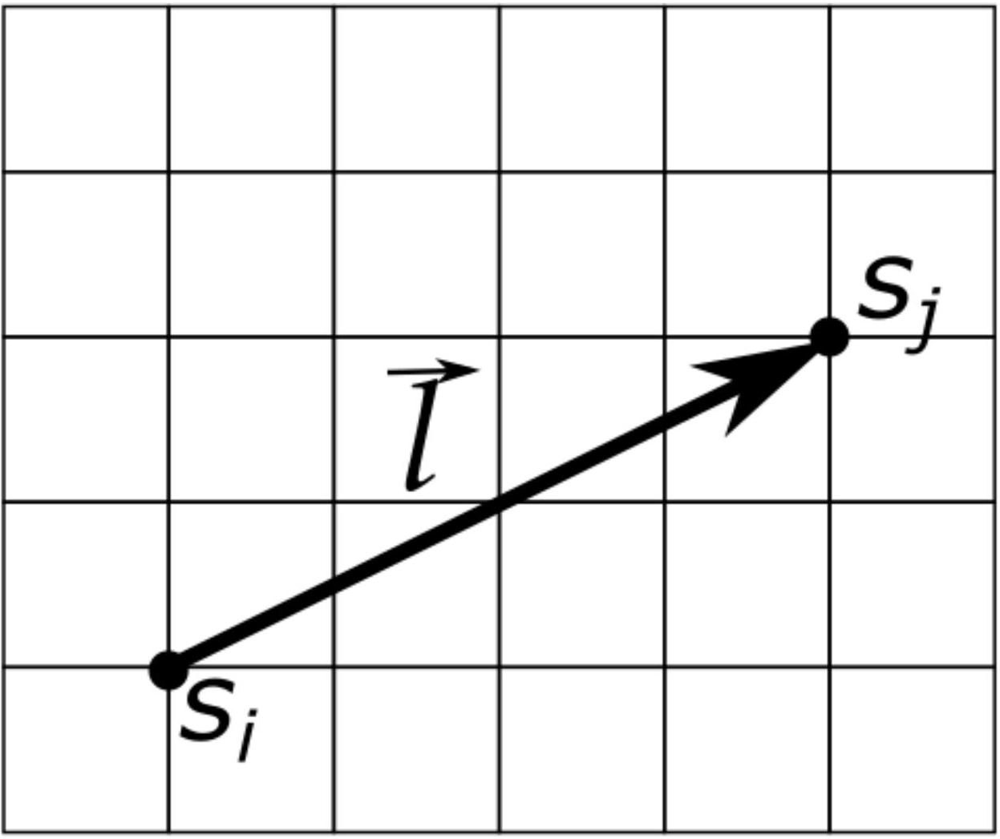
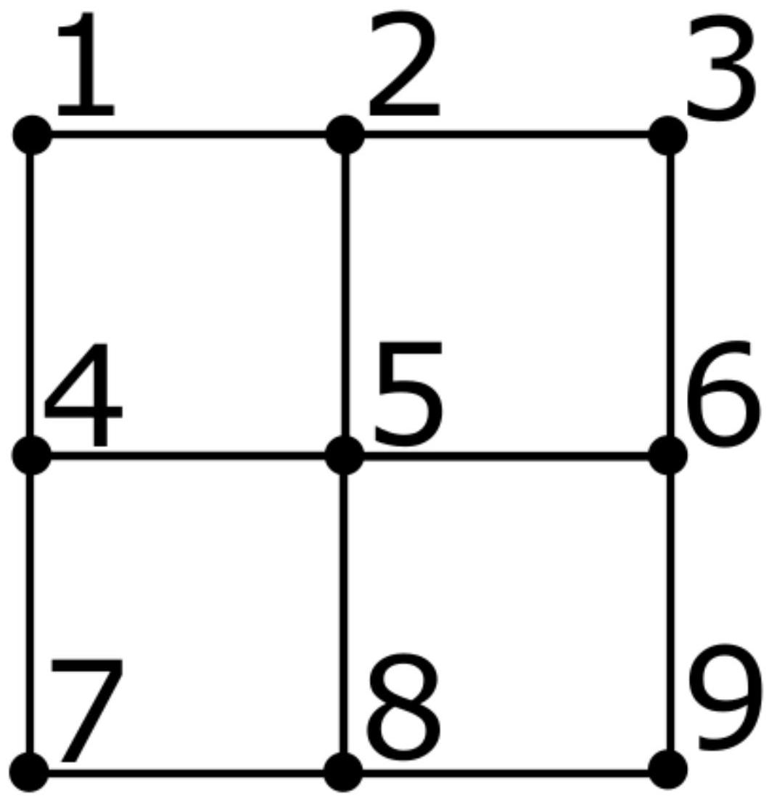

Подсказка: Время работы программы для этой задачи может быть довольно большим для некоторых значений параметров. Поэтому вам следует выбирать параметры и время работы так, чтобы с одной стороны достичь разумной точности, а с другой стороны успеть проделать необходимые измерения. Для ускорения вычислений можно запускать параллельно несколько копий одной программы с разными параметрами. Погрешности нужно оценивать только в пунктах, в которых об этом явно просят.

Двумерная модель Изинга - одна из простейших моделей фазового перехода парамагнетик-ферромагнетик. Модель представляет собой квадратную решетку, в узлах которой расположены магнитные моменты. Каждый из этих магнитных моментов может быть направлен в одном из двух направлений - вверх или вниз.
Состояние магнитного момента задается переменной $s_{i}$, где индекс $i$ обозначает узел решетки. $s_{i}=1$ отвечает магнитному моменту, направленному вверх, а $s_{i}=-1$ - вниз.
Энергия такой системы определяется взаимодействием ближайших магнитных моментов. Если два магнитных момента сонаправлены, вклад этой пары в энергию $-J$, если направлены противоположно, то $+J$. Здесь $J$ - некоторая константа с размерностью энергии, характеризующая силу взаимодействия магнитных моментов.
Если систему поместить во внешнее магнитное поле, каждый магнитный момент будет обладать дополнительной энергией $h$, если он направлен против поля, и энергией $-h$, если он направлен по полю. Величина $h=\mu B$, где $B$ - магнитное поле, $\mu$ - величина магнитного момента. В дальнейшем будем считать, что $\mu=1$ и называть $h$ магнитным полем.

Намагниченностью системы $m$ будем называть среднее значение магнитного момента (в единицах $\mu$ ):

$$
m=\frac{1}{N} \sum_{i} s_{i}=\left\langle s_{i}\right\rangle .
$$

Суммирование по всем узлам решетки, $N=L^{2}$ - число узлов.
Магнитной восприимчивостью называется величина

$$
\chi=\left.\frac{\partial m}{\partial h}\right|_{h=0} .
$$

Корреляционной функцией магнитных моментов называется среднее значение произведения двух магнитных моментов $s_{i}$ и $s_{j}$, смещенных на вектор $\vec{l}$ друг относительно друга (с учетом того, что узлы на противоположных краях решетки отождествляются).

$$
\mathrm{C}(\vec{l})=\frac{1}{N} \sum_{i} s_{i} s_{j} .
$$

Эта величина зависит от вектора смещения и от параметров системы (размер, температура, магнитное поле).

Будем работать с решеткой размера $L \times L$. Полная энергия системы

$$
E=-J \sum_{\langle i j\rangle} s_{i} s_{j}-h \sum_{i} s_{i}
$$

суммирование ведется по всем парам соседних магнитных моментов, причем считается, что магнитные моменты, расположенные на противоположных краях решетки, взаимодействуют друг с другом (периодические граничные условия). Благодаря этому узлы на границе ничем не выделены. Например для решетки, изображенной на рисунке, для узла 5, расположенного по центру, соседними являются узлы 2, 4, 6, 8. Для узла 2 соседними считаются 1, 3, 5, 8. Наконец для узла 3 соседними являются 2, 6, 1, 9. Второе слагаемое учитывает внешнее магнитное поле $h$, суммирование идет по всем узлам решетки.

Энергия системы минимальна, когда все магнитные моменты ориентированы одинаково - либо все вверх, либо все вниз. Однако если температура системы ненулевая, она может находиться в состоянии с большей энергией. Вероятность того, что система находится в некотором состоянии, пропорциональна

$$
P \sim e^{-E / k_{B} T} .
$$

В дальнейшем мы будем считать $k_{B}=1$. Также будем считать $J=1$, а температура будет безразмерной величиной.
Несмотря на то, что вероятность находиться в состояниях с большей энергией мала, таких состояний очень много. Поэтому при достаточно больших температурах система почти наверняка будет находиться в состоянии, в котором средняя намагниченность равна нулю. При некоторой температуре $T_{c}$ произойдет фазовый переход ферромагнетик- парамагнетик.

Из-за огромного числа состояний ( $2^{N}$ !) определить средние значения с помощью суммы по всем распределениям практически невозможно. Поэтому мы будем использовать приближенный метод - алгоритм Метрополиса. Суть алгоритма следующая. Начинаем со случайного распределения магнитных моментов. Далее движемся по решетке и для каждого магнитного момента определяем изменение энергии $\Delta U$, если поменять направление на противоположное. Если $\Delta U<0$, переворачиваем магнитный момент, иначе переворачиваем его с вероятностью $p=\exp (-\Delta U / T)$. Можно показать, что после большого числа итераций мы будем получать все конфигурации магнитных моментов с правильными вероятностями. Результаты моделирования можно использовать для вычисления различных термодинамических величин.

## Работа с программой

exe Исполняемый файл под Windows опубликован на гитхабе.
Предоставленная вам программа инициализирует случайное распределение магнитных моментов на квадратной решетке заданного размера $L \times L$ и реализовывать заданное число шагов алгоритма Метрополиса для заданной температуры и магнитного поля. На каждом шаге алгоритм пытается перевернуть $L^{2}$ случайно выбранных магнитных моментов.

После окончания моделирования программа выдает среднее значение намагниченности $m$, а также $m^{2}$ и $m^{4}$. Эти средние вычисляются следующим образом. После каждого шага алгоритма вычисляется значение намагниченности $m_{a}$ ( $a$ - номер шага).
После чего выводятся значения

$$
\begin{aligned}
& m: \frac{1}{I} \sum_{a=1}^{I} m_{a} ; \\
& m^{2}: \frac{1}{I} \sum_{a=1}^{I} m_{a}^{2} ; \\
& m^{4}: \frac{1}{I} \sum_{a=1}^{I} m_{a}^{4} .
\end{aligned}
$$

Также программа позволяет посмотреть на график зависимости намагниченности $m_{a}$ от номера шага алгоритма и распределение магнитных моментов в конце симуляции.

После запуска программа предложит вам выбрать необходимое действие. Это можно сделать, введя нужную цифру и нажав ENTER. Значения цифр:
1 - Задать размер решетки $L$ и инициализировать все магнитные моменты (с вероятностью $1 / 2$ каждый магнитный момент будет направлен вверх или вниз). При этом значения температуры и магнитного поля не меняются! Программа попросит вас ввести размер решетки - натуральное число.

2 - Провести моделирование. Программа попросит вас ввести число шагов алгоритма и выполнит его для заданных ранее параметров. После окончания моделирования программа выдаст его результаты.
Если не проводилась инициализация решетки (1), в качестве начальных значений магнитных моментов используются результаты предыдущего моделирования.

3 - Вывести графики, полученные при последнем моделировании. Сначала будет выведено распределение магнитных моментов, а затем (если закрыть

соответствующую картинку) - график зависимости намагниченности от номера шага.
4 - Вычислить корреляционную функцию $C(\vec{l})$, используя результат последнего моделирования (конечное распределение магнитных моментов). Программа попросит вас по очереди задать компоненты $x$ и $y$ вектора смещения $\vec{l}$ - целые числа.

5 - Задать величину магнитного поля. После этого программа попросит вас ввести новое значение магнитного поля - вещественное число.
6 - Задать температуру. После этого программа попросит вас ввести новое значение температуры - вещественное положительное число.
7 - Показать текущие параметры системы.
В тех случаях, когда программа просит вас ввести определенный параметр, это можно сделать, набрав соответствующее число и нажав ENTER. Если число дробное, отделяйте целую часть от дробной с помощью точки (например 10.5).

После выполнения текущей операции программа предложит вам ввести номер следующего действия.
Часть А. Наблюдения (2 балла)
А0 ${ }^{0.20}$ Определите размер решетки $L$, температуру $T$ и магнитное поле $h$, заданные в программе в качестве параметров по умолчанию.
А1 ${ }^{0.40}$ Как время исполнения программы $\tau$ зависит от размера сетки $L$ и от числа повторений алгоритма $I$ ? Сколько исполнялось $I=500$ шагов алгоритма на решетке размера $L=1000$ ?

A2 ${ }^{\mathbf{0 . 5 0}}$ Пронаблюдайте, как распределение магнитных моментов меняется в зависимости от температуры. Оцените температуру $T_{c}$, при которой происходит фазовый переход.

А3 ${ }^{0.20}$ Какое число шагов алгоритма $I$ требуется, чтобы от начального случайного распределения получить равновесное распределение при $T=1.5$, $h=0.1$ ? Размер решетки по умолчанию.

A4 ${ }^{0.70}$ В этой задаче придется много работать со случайными величинами. Чтобы получить разумные ответы, важно правильно оценивать случайные погрешности. В качестве примера рассмотрим сетку размера $L=5$ при температуре $T=3.66$. Как погрешность определения $m^{2}$ зависит от числа шагов алгоритма $I$ ? Определите $m^{2}$ с погрешностью не выше 0.01 .

Часть В. Измерения (8.5 баллов)
Из-за небольшого размера системы все измеряемые величины сильно флуктуируют, особенно вблизи точки фазового перехода. Для того, чтобы получать интересующие нас параметры с разумной точностью, требуется внести поправку на конечный размер системы. Не используйте в этом разделе сетки размером больше $L=20$ ! Работа с ними займет слишком много времени.

Для всех измерений указывайте значение размера решетки, при которых они проводились!
Параметр Биндера - величина

$$
U=1-\frac{\left\langle m^{4}\right\rangle}{3\left\langle m^{2}\right\rangle^{2}}
$$

Коэффициенты выбраны таким образом, чтобы для гауссовых флуктуаций параметр был бы равен нулю. Можно показать, что если построить графики зависимости $U$ от температуры при различных размерах системы, то они пересекутся в одной точке как раз при температуре фазового перехода.

В1 ${ }^{0.50}$ Найдите значение $U_{0}$ параметра Биндера при $T \rightarrow 0$ и значение $U_{\infty}$ при $T \rightarrow \infty$.
В2 ${ }^{1.00}$ Как средний квадрат намагниченности $m^{2}$ намагниченности зависит от температуры при $L=10$ ? Постройте график в зависимости от температуры. Диапазон температур выберите так, чтобы график содержал все характерные особенности функции.

В3 ${ }^{4.00}$ Используя параметр Биндера, как можно точнее определите температуру $T_{c}$, при которой происходит фазовый переход. Оцените погрешность найденного значения $T_{c}$.

В4 ${ }^{3.00}$ Пусть система находится в парамагнитной фазе (температура больше температуры фазового перехода $T_{c}$ ). Исследуйте, как магнитная восприимчивость $\chi$ зависит от температуры. Предложите вид зависимости и определите ее параметры.

Часть С. Корреляционные функции (2.5 балла)
Когда расстояние между магнитными моментами достаточно велико, их корреляционная функция ведет себя как

$$
C(\vec{l}) \sim \frac{1}{r^{a}} e^{-|\vec{l}| / \xi} .
$$

Здесь $\xi$ - корреляционная длина. В принципе она может зависеть от температуры. Экспонента меняется намного быстрее степенной функции, поэтому зависимость можно с хорошей точностью считать чисто экспоненциальной.
Выберем температуру как можно более близкой к температуре фазового перехода $T=T_{c}$. Если вам не удалось определить температуру фазового перехода в части B , выберите в качестве температуры наиболее хорошую оценку, которую вам удалось получить. Явно напишите используемое значение температуры.

С1 ${ }^{2,50}$ Определите значение корреляционной длины для направления вдоль стороны квадратной решетки. В каком диапазоне расстояний применима экспоненциальная зависимость?
