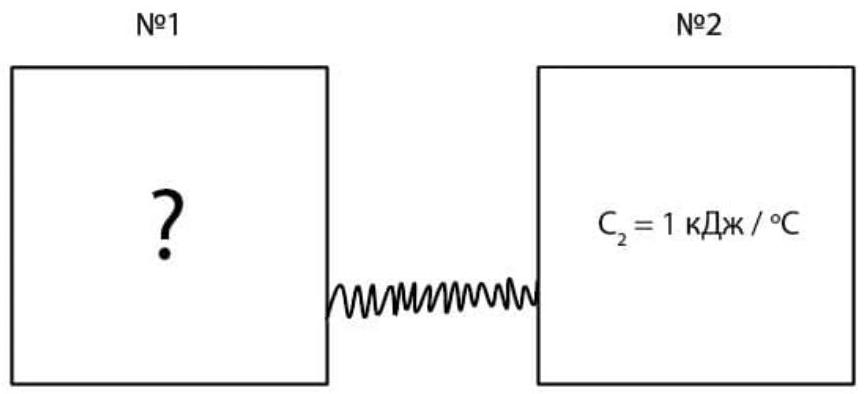

Теплоизолированная система состоит из двух сосудов, соединенных тонкой теплопроводящей трубкой. Собственной теплоемкостью трубки можно пренебречь, тепловое равновесие в каждом сосуде и вдоль трубки устанавливается гораздо быстрее, чем тепловое равновесие между сосудами.

Входные данные: $\mathrm{T}_{2}(0), \mathrm{t}$
Выходные данные: $\mathrm{T}_{2}$ (t)

Теплоемкость тела в сосуде №2 известна: $C_{2}=1$ кДж/°C. Вы можете задавать начальную температуру сосуда №2 ( $T_{20}$, между $0^{\circ} \mathrm{C}$ и $100^{\circ} \mathrm{C}$.) и время $t$ после соединения сосудов трубкой. Предложенная вам программа показывает температуру в сосуде №2 в момент времени $t$ (задается в минутах) после соединения сосудов трубкой ( $t=0$ ).

A1 ${ }^{0.40}$ Определите начальную температуру сосуда №1 $\left(T_{10}\right)$.
А2 ${ }^{3.60}$ Постройте график зависимости теплоемкости сосуда №1 от его температуры.
А3 ${ }^{3.00}$ За какое время температура сосуда №1 увеличится от $T_{10}$ до $T_{10}+20^{\circ} \mathrm{C}$, если вместо сосуда №2 присоединить трубку к сосуду с постоянной температурой 100°C?

Программа
exe Исполняемый файл под Windows опубликован на $\_\_\_\_$ гитхабе.
