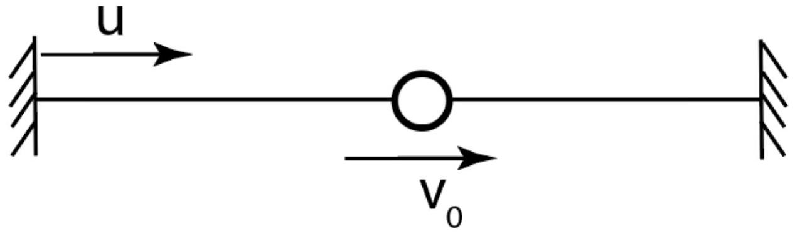
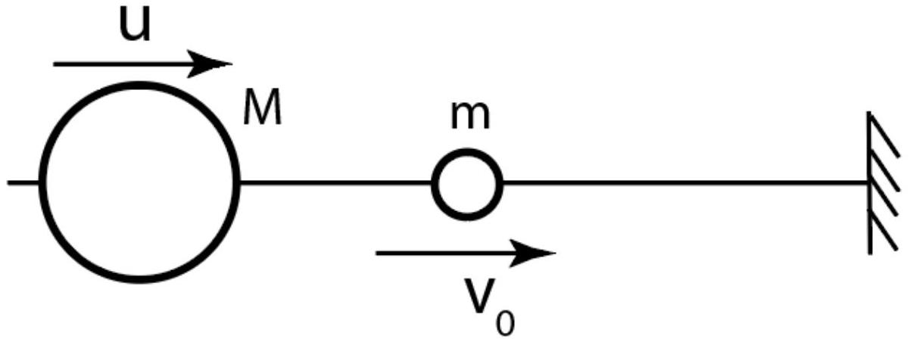
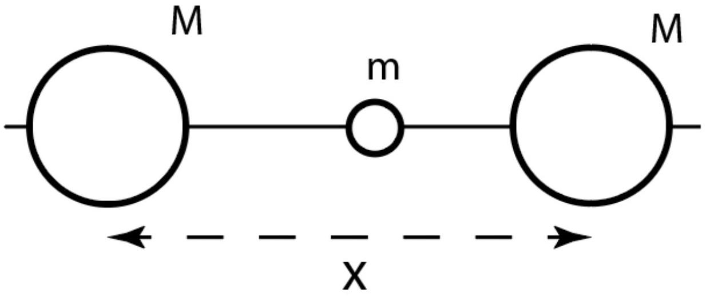
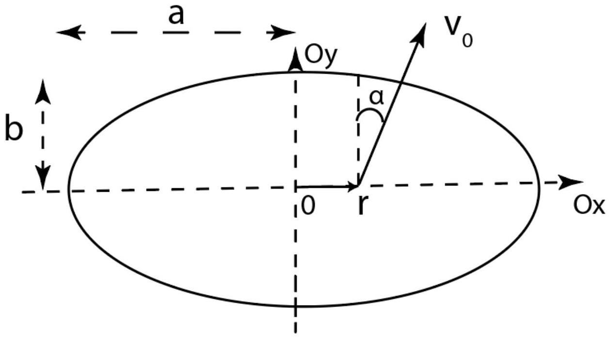
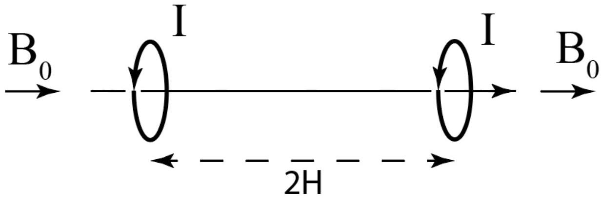

Рассмотрим классическую механическую систему с некоторым параметром $\lambda$, который может медленно меняться с течением времени. Если движение системы периодическое с периодом $T$, изменение параметра можно считать медленным при условии

$$
T \frac{d \lambda}{d t} \ll \lambda .
$$

В общем случае по временем $T$ можно понимать характерное время процессов, протекающих в системе.
Адиабатический инвариант - физическая величина, которая не меняется при плавном изменении параметров системы. Можно доказать, что адиабатическим инвариантом является величина

$$
I=\frac{1}{2 \pi} \oint p d q .
$$

Здесь $p$ - одна из проекций импульса системы, $q$ - соответствующая координата.
Если изобразить периодическое движение частицы в координатах $p, q$, при периодическом движении получим замкнутую кривую. Тогда интеграл в определении $I$ равен площади, ограниченной этой кривой.

Часть А. Движение между двумя стенками (0.8 балла)

По гладкой горизонтальной спице между двумя вертикальными стенками может скользить бусинка массы $m$. Все удары бусинки со стенками абсолютно упругие. Одна стенка неподвижна, а вторая стенка движется по направлению к первой со скоростью $u$, удовлетворяющей соотношению $u \ll v$, где $v$ скорость бусинки. Начальное расстояние между стенками равняется $L_{0}$, начальная скорость бусинки $v_{0}$.

А1 ${ }^{0.20}$ Найдите скорость бусинки сразу после соударения с подвижной стенкой.
А2 ${ }^{0,20}$ Найдите изменение расстояния между стенками за время между двумя последовательными соударениями бусинки с подвижной стенкой. Необходимо получить точную формулу.

А3 ${ }^{0.40}$ Найдите выражение для адиабатического инварианта $I$ для рассмотренной системы и определите скорость бусинки в момент, когда расстояние между стенками уменьшилось до значения $L$.

Часть В. Движение между стенкой и тяжёлой частицей (1.2 балла)

Данная часть задачи является фактическим продолжением предыдущей. Отличие состоит в том, что теперь на лёгкую частицу массы $m$, движущуюся со скоростью $v_{0}$ налетает со скоростью $u \ll v_{0}$ частица массы $M \gg m$. С другой стороны по-прежнему неподвижная стенка. Начальное расстояние между частицами равнялось $L_{0}$. Известно, что в процессе движения максимальная скорость легкой частицы равнялась $k v_{0}$. Массы частиц не даны!

В1 ${ }^{\text {0.40 }}$ Выразите отношение масс $M / m$ через $u, v_{0} и k$.
В2 ${ }^{\mathbf{0 . 8 0}}$ Через какое время тяжёлая частица остановится? Ответ выразите через $L_{0}, v_{0}, u n k$.
Часть С. Модель иона (1.5 балла)

В данной части рассматривается упрощённая модель иона $H_{2}{ }^{+}$. Две частицы массы $M$ и находящаяся между ними частица массы $m \ll M$ могут двигаться по гладкой горизонтальной спице. Лёгкая частица притягивается к тяжёлым с постоянными силами $F$. В момент, когда расстояние между тяжёлыми частицами равнялось $L_{0}$, скорость лёгкой частицы в системе отсчета центра масс двух тяжелых частиц равняется $v_{0}$. Вам предлагается исследовать положение равновесия данной системы, а также найти частоту её малых колебаний вблизи него. Обозначим расстояние между тяжелыми частицами за $x$.

С1 ${ }^{0.40}$ Получите выражение для кинетической энергии системы. Ответ выразите через $M, m, x, \dot{x}, v_{0}$ и $L_{0}$.
С2 ${ }^{0.20}$ Получите выражение для потенциальной энергии системы. Ответ выразите через $F$ и $x$.
с3 ${ }^{0.50}$ При каком значении $x$ система находится в положении равновесия? Ответ выразите через $M, m, v_{0}, L_{0}$ и $F$.
С4 ${ }^{0.40}$ Найдите циклическую частоту малых колебаний системы вблизи положения равновесия. Ответ выразите через $M, m, v_{0}, L_{0}$ и $F$.
Часть D. Движение внутри эллипса (2.2 балла)

По гладкой горизонтальной поверхности ограниченной вертикальными стенками может свободно двигаться маленькая шайба. Стенки ограничивают часть поверхности в форме эллипса с большой и малой полуосями $a$ и $b$ соответственно. В положении с координатами $(r ; 0)$ шайбе сообщили скорость, проекции которой равны $v_{x}=v_{0} \sin \alpha ; v_{y}=v_{0} \cos \alpha$, причём $r \ll a, b, \alpha \ll 1$. От вас потребуется в первом приближении по этим малым параметрам описать движение шайбы.

D1 ${ }^{1.00}$ Можно показать, что в рассматриваемом приближении квадрат компоненты $v_{x}$ скорости шайбы зависит от координаты $x$ как $v_{x}^{2}=A+B x+C x^{2}$. Выразите $A, B$ и $C$ через $v_{0}, \alpha, a, b$ и $r$.

D2 ${ }^{0.60}$ Найдите максимальное значение координаты $x$ шайбы в процессе движения. Ответ выразите через $v_{0}, \alpha, a, b$ и $r$.
D3 ${ }^{0.60}$ Через какое время после запуска шайба впервые окажется в точке с координатой $x=0$ ? Какое условие на соотношение $a / b$ должно выполняться для применимости полученного результата?

Часть Е.Математический маятник на наклонной плоскости (1.3 балла)
К гладкой наклонной плоскости привязан математический маятник, совершающий малые колебания вблизи положения устойчивого равновесия. В этой части задачи вам предлагается исследовать, как изменяется амплитуда колебаний маятника с изменением угла наклона плоскости, а также длины маятника. В начальный момент амплитуда колебаний (измеряется угол отклонения маятника от положения равновесия) равна $\varphi_{0} \ll 1$, длина маятника равна $L_{0}$, а угол наклона плоскости равен $\alpha_{0}$.

E1 ${ }^{0.50}$ Найдите адиабатический инвариант $I$ для гармонического осциллятора с массой $m$, колеблющегося с циклической частотой $\omega_{0}$ и амплитудой $A$.
E2 ${ }^{0.40}$ Пусть при неизменном угле наклона длину маятника адиабатически медленно увеличили до $L$. Найдите новую амплитуду колебаний маятника $\varphi$. Ответ выразите через $\varphi_{0}, \alpha_{0}, L_{0}$ и $L$.

E3 ${ }^{0.40}$ Пусть при неизменной длине маятника угол наклона адиабатически медленно увеличили до значения $\alpha$. Найдите новую амплитуду колебаний $\varphi$. Ответ выразите через $\varphi_{0}, \alpha_{0}, \alpha$ и $L_{0}$.

Часть F. Ларморовская прецессия в медленно изменяющемся магнитном поле (2.5 балла)
Рассмотрим кольцо массы $M$, равномерно заряженное по периметру зарядом $q$, помещённое в однородное магнитное поле с индукцией $\vec{B}_{0}$. Кольцо раскрутили вокруг его оси до угловой скорости $\vec{\omega}$ и отпустили. Угол между векторами магнитной индукции и угловой скорости вращения кольца в начальный момент равен $\alpha_{0}$.
Примечание: Магнитный момент системы зарядов можно вычислить по формуле

$$
\vec{m}=\int \frac{[\vec{r} \times \vec{v}]}{2} d q
$$

F1 ${ }^{0.20}$ Выразите вектор магнитного момента кольца $\vec{m}$ через $q, M$ и вектор его момента импульса относительно центра $\vec{L}$.
F2 ${ }^{0.20}$ Покажите, что модуль момента импульса $L$ остаётся постоянным.
F3 ${ }^{\mathbf{0 . 7 0}}$ Покажите, что ось кольца испытывает прецессию и найдите вектор угловой скорости $\vec{\Omega}$ этой прецессии. Ответ выразите через $q, M$ и $\vec{B}_{0}$. Считайте, что $\Omega \ll \omega$.

F4 ${ }^{0.70}$ Магнитное поле адиабатически медленно начинают уменьшать со скоростью $\dot{B}$. Найдите момент сил (модуль и направление), действующих на кольцо со стороны вихревого электрического поля. В этом и следующем пункте считйте, что $\alpha_{0}=\pi / 2$.

F5 ${ }^{0.70}$ Значение магнитного поля уменьшилось до $\vec{B}_{1}$. Найдите угол между осью вращения и направлением магнитного поля. Изменение угла можно считать малым.

Часть G. Движение в неоднородном магнитном поле (3.0 балла)

Одним из методов удержания частиц в магнитной ловушке в продольном (по полю) направлении состоит в использовании магнитных пробок, или магнитных зеркал, - областей, в которых напряжённость магнитного поля сильно (но плавно) возрастает. Такие области могут отражать налетающие на них вдоль силовых линий заряженные частицы. При движении заряженной частицы в "зеркальной" магнитной ловушке радиус траектории частицы уменьшается при продвижении в область сильного поля. В рамках двух последних частей мы изучим движение в таких полях.
Для магнитных зеркал определим коэффициент зеркальности $r_{m}$

$$
r_{m}=\frac{B_{\max }}{B_{\min }}
$$

Во всех пунктах считайте, что траектории частиц представляют собой медленно изменяющиеся спирали с малым углом наклона, ведущие центры которых совпадают с силовыми линиями магнитного поля. Введём также компоненты скорости $v_{\|}$и $v_{\perp}\left(v_{\|} \ll v_{\perp}\right)$, обозначающие компоненты скорости частицы, направленные вдоль и перпендикулярно направлению магнитного поля соответственно.

G1 ${ }^{0.20}$ Рассмотрим для начала плоское движение в однородном магнитном поле с индукцией $B_{0}$. Пусть его производная по времени равна $\dot{B}$ и изменение происходит адиабатически медленно. Начальная скорость частицы равна $v_{0}$, её масса $M$, а заряд $q$. Выразите тангенциальное ускорение частицы $v_{\perp}$ через $M, q, v_{0}, B_{0}$ и $\dot{B}$.

G2 ${ }^{0.50}$ Пусть магнитное поле медленно изменило величину до значения $B$. Выразите скорость частицы $v_{\perp}$ через $v_{0}, B_{0}$ и $B$.
Перейдём к неоднородному магнитному полю. Поскольку ведущий центр траектории электрона перемещается вдоль силовой линии. Будем считать, что магнитное поле изменяется только в данном направлении.

G3 ${ }^{1.00}$ Пусть угол наклона винтовой линии равен $\alpha$ и мал. Покажите, что усреднённая по времени сила, действующая в направлении магнитного поля на заряд эквивалентна взаимодействию магнитного диполя с неоднородным полем. Найдите величину силы $F_{\|}$. Ответ выразите через $m, v, q, B_{z}$ и $\frac{d B_{z}}{d z}$, где ось $z$ сонаправлена с магнитным полем.
Указание: Мы уже упоминали, что любые заряженные частицы обладают магнитным моментом. Поэтому вам достаточно рассмотреть контур с постоянным током, движущийся в неоднородном магнитном поле.

G4 ${ }^{0,70}$ Используя результаты предыдущих пунктов, определите зависимость угла $\alpha$ от величины магнитного поля $B$ Ответ выразите через $\alpha_{0}, B_{0}$ и $B$.
G5 ${ }^{0.60}$ Выразите максимально возможное значение угла $\alpha$ через $r_{m}$.
Часть Н. Установка для реализации магнитного зеркала (2.5 балла)

Мы изучили движение в неоднородных магнитных полях и готовы перейти к исследованию задачи о магнитных зеркалах. Схема, используемая для их реализации, представлена на рисунке. Она представляет собой два соосных витка одинакового радиуса $R$, центры которых находятся на расстоянии $2 H \gg R$ друг от друга. По виткам протекают токи одинаковой силы $I$ в одном направлении. витки помещены в область большого однородного магнитного поля с индукцией $B_{0}$, направленного вдоль их осей. Целью данной задачи является исследование силовых линий такой системы и, как следствие, описание траектории ведущего центра орбиты электронов.

Н1 ${ }^{0.40}$ Получите точную формулу зависимости индукции магнитного поля от координаты $x$. Начало координат находится по центру между витками, ось $x$ направлена вдоль магнитного поля. Найдите, учитывая малость некоторых параметров, также максимальное и минимальное значение суммарной индукции магнитного поля на оси витков.

Н2 ${ }^{0.60}$ Найдите коэффициент зеркальности $r_{m}$ для данной системы. Учтите здесь и в дальнейшем, что $H \gg R$.
Н3 ${ }^{1.00}$ Качественно нарисуйте силовую линию, проходящую через плоскость кольца на малом расстоянии $R_{0} \ll R$ от его оси в координатах $r^{\prime}(x)$, где $r^{\prime}$ - расстояние до оси симметрии системы. Найдите максимальное значение $r^{\prime}$ и выразите ответ в виде: $r^{\prime} \approx A+B(r-1)$.

H4 ${ }^{0.50}$ Найдите максимальное значение угла $\alpha$ в процессе движения, если отражения от магнитных зеркал происходит в плоскости колец. Считайте, что точки разворота частицы находятся достаточно близко к центрам колец. Учтите малость $r_{m}$.
