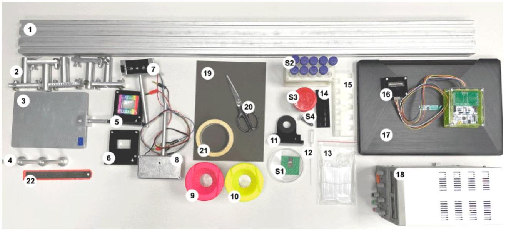
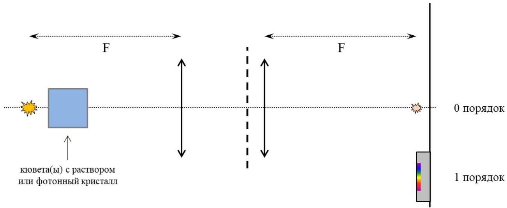
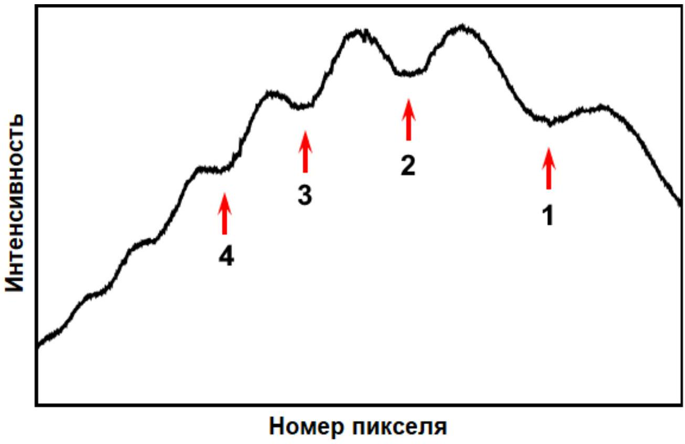
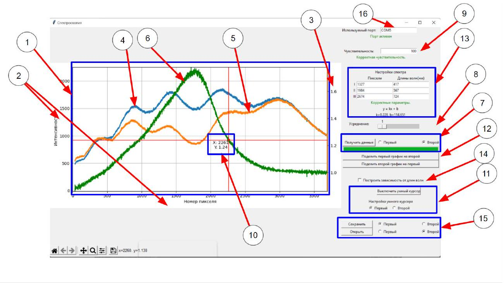
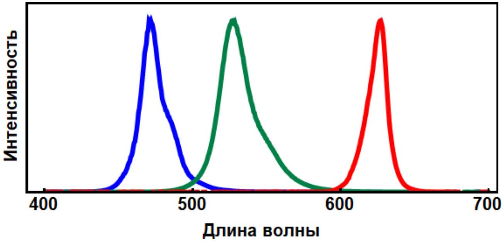
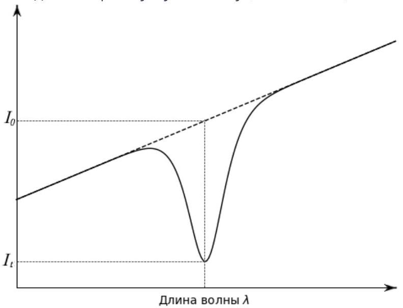
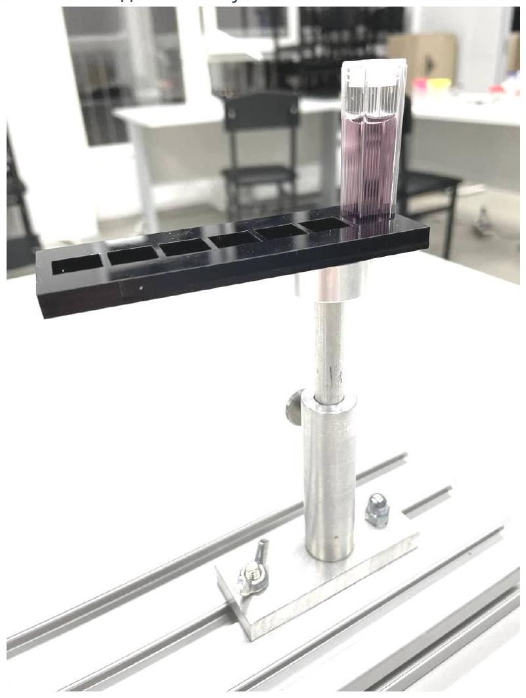

Спектроскопические измерения являются важным методом исследования, который находит применение в физике, химии, биологии, медицине и на стыке этих наук. Спектральную структуру излучения, переизлучения, поглощения и т.п. можно изучать в различных диапазонах длин волн. Например, с помощью инфракрасной (ИК) спектроскопии можно изучать колебательное движение молекул или их отдельных фрагментов, функциональных групп. Таким образом, можно говорить о химической структуре вещества, и, в частности, проверять результаты химического синтеза.

В этой задаче будет обсуждаться спектроскопия в видимом и ближнем ИК-диапазоне. Вам потребуется сконструировать спектрометр и использовать его для определения свойств различных объектов.

## Оборудование

1. Оптическая скамья
2. Подвижные стойки
3. Стальной экран
4. Магнитные держатели (для линз и держателей образцов)
5. Линза с дифракционной решеткой
6. Линза без дифракционной решетки
7. Светодиод RGB (три в одном корпусе). Не превышать 4.5 B!
8. Лампа накаливания. Не превышать 12 В!
9. Емкость для слива использованных растворов (можно попросить опорожнить)
10. Емкость с чистой водой (для промывки пипетки, кювет; можно попросить наполнить)
11. Магнитный держатель фотонного кристалла
12. Пипетка
13. Набор спектрометрических кювет с крышками (12 шт.), объем кюветы примерно 4 мл
14. Магнитный держатель спектрометрических кювет
15. Штатив для спектрометрических кювет (заполненные кюветы ставьте в него)
16. Спектроскопический датчик
17. Ноутбук
18. Блок питания
19. Картон для изготовления диафрагм
20. Ножницы
21. Малярный скотч (для меток, крепления самодельных объектов к установке)
22. Линейка

## Исследуемые образцы:

- S1. Фотонный кристалл в чашке Петри
- S2. В 15 мл пробирках: раствор анилин-оранжа, медного купороса, растворы с различными значениями рН. В 2 мл пробирке - раствор тимолового синего.
- S3. Разбавленный раствор бриллиантового зеленого.
- S4. Концентрированный раствор бриллиантового зеленого. Замотан пленкой. НЕ открывать!

## Оборудование для вашего удобства:

- Салфетки
- Настольная лампа
- Коробка для накрывания установки, если вашим измерениям мешает свет соседей

## Конструирование спектрометра

Спектрометр будет состоять из лампы накаливания (обеспечивает непрерывный спектр излучения), пары линз, дифракционной решетки и одномерного массива фотодиодов, данные с которого собираются в компьютер.

Внимание! Собирая и юстируя установку, следите за отсутствием вертикальных и горизонтальных сдвигов линз: обе линзы, источник света и его изображение (0-й максимум) должны находиться на одной оси.

Соберите установку (руководствуйтесь схемой на рис. 2):

- на источнике напряжения (18) выкрутите ручки регулировки тока и напряжения в 0;
- установите лампу накаливания (8) в штатив (2), подайте на лампу напряжение 12 B (это важно! спектр излучения зависит от температуры нити = напряжения);
- расположите линзу без дифракционной решетки (6) так, чтобы лампа оказалась в фокусе линзы (оптическая сила каждой из линз +6 дптр);
- убедитесь, что за линзой параллельный пучок света;
- между лампой и линзой поставьте одну дополнительную стойку (2) (она будет использоваться как держатель образцов);
- расположите вторую линзу с дифракционной решеткой (5) на небольшом расстоянии от первой линзы, дифракционная решетка должна быть обращена к первой линзе;
- штрихи дифракционной решетки должны быть расположены вертикально;

- установите экран (3) в фокусе второй линзы.

На экране в нулевом максимуме вы должны наблюдать изображение нити лампы. В первом максимуме вы должны наблюдать разложение излучения лампы в спектр. Размер спектра по вертикали не должен быть больше 3-4 мм. Если спектр не тонкий, проверьте сборку установки.

Прикрепите к экрану датчик (16). Датчик крепится к экрану магнитами. Расположите чувствительные элементы датчика (в середине чипа) так, чтобы на них падало всё разложенное в спектр излучение (первый порядок). Датчик крепится к экрану так, чтобы провода смотрели вниз. При такой конфигурации сделайте так, чтобы красный свет падал на правую часть датчика. Т.к. датчик имеет значительную толщину, измените немного положение экрана, чтобы в фокусе второй линзы находился уже датчик (а не плоскость экрана). В программе, запущенной на компьютере (17), нажмите кнопку «Получить данные». Вы должны получить график, похожий на представленный на рисунке ниже.

Работа с программой

Данная программа позволяет считывать интенсивность света, падающего на чувствительные элементы датчика (CCD матрицу), а также производить с полученными данными определённые действия.

- Основные элементы программы: график интенсивности, основные оси, вспомогательная ось для графика отношения, первый график, второй график, график отношения, виджет построения графика, полоса для усреднения, чувствительность датчика, «умный» курсор, виджет для настройки «умного» курсора, кнопки для построения графика отношения первого и второго графиков, блок настройки режима отображения длин волн, кнопка включения/выключения режима отображения длин волн, блок сохранения и загрузки, поле для определения используемого порта
- Алгоритм действий для начала работы с программой: подключите устройство для считывания к компьютеру через кабель. Выберите на панеле «Используемый порт» (16) - СОМЗ. Снизу под ней должна загореться зелёная надпись «Порт активен». Если этого не произошло, позовите наблюдателя и сообщите о проблеме.
- Считывание данных. Для считывания новых данных вам необходимо нажать на кнопку «Получить данные», которая находится в виджете получения данных (7). Существует два слота для хранения данных: первый и второй. В (7) вы можете выбрать в какой именно помещать новые измерения, при этом старые данные, которые хранились в этом слоте безвозвратно исчезнут (если вы их перед этим не сохранили, подробнее об этом в разделе ниже). У вас есть возможность выбрать степень усреднения (8). Число, которое вы выбираете в этом виджете показывает сколько будет сделано измерений перед их усреднением. Усреднение позволяет избежать появление артефактов, а также шумов. Для того, что бы считывать сигналы разной интенсивности вы можете изменять чувствительность (9). При этом вводимое число должно быть делителем числа 50000.
- Работа с графиком, График отношения, «Умный» курсор: На координатной сетке (1) одновременно могут отображаться от 0 до 3 графиков (4, 5, 6). 2 графика из слотов для данных $(4,5)$ и третий $(6)$ - график отношения, являющийся функцией от первых двух: каждая точка этого графика получается делением значения из первого набора данных на второй или наоборот. Так как характерные значения графика отношения на несколько порядков расходятся с основными, добавлена дополнительная ось ординат (3). Построить такой график вы можете с помощью кнопок «Поделить первый график на второй» и «Поделить второй график на первый» (12). При снятии новых данных график отношения пропадает. Для вашего удобства в данную программу был добавлен «умный» курсор (10).

Этот курсор «ползет» по выбранному графику и отображает координаты текущей точки. Настройка «умного» курсора производится в виджете (11). Там вы можете включить/выключить курсор с помощью одноименной кнопки, а так же выбрать, с первым или вторым графиком будет работать «умный» курсор. При активном графике отношения курсор автоматически наводится на него.

- Режим отображения длин волн. в основном режиме по оси X будут отображаться номера пикселей матрицы. Однако с помощью кнопки «Построить зависимость от длин волн» (14) вы можете перестроить ваши данные с учётом откалиброванных длин волн. Для перестройки оси $X$ вам необходимо ввести 3 пары «номер пикселя - длина волны» в соответствующий виджет (13). Построение происходит с помощью метода наименьших квадратов. Если вам нужно перестроить график только по двум опорным длинам волн, то вы можете вместо третьей точки указать значения одной из первых двух или любую их линейную комбинацию.
Данные полученной калибровочной зависимости отображаются внизу виджета.
- Сохранение и загрузка данных. Для того, что бы сохранить и загрузить, ранее сохранённые данные, вам необходимо использовать виджет (15). При этом с помощью кнопок «Первый» и «Второй» можно выбрать в какой слот вы будете загружать данные или в какой - сохранять. Сохранение происходит в файл с разрешением .dat. Сохранить график отношения нельзя.
- Артефакты: иногда на графиках можно увидеть вертикальные полосы. Так бывает когда ваш сигнал очень низкий. Это можно починить, увеличив чувствительность (9) и включив усреднение (8).

## Часть А. Калибровка по длинам волн

Для того, чтобы в дальнейшем можно было работать с количественными величинами длин волн, собранный спектрометр необходимо откалибровать. Т.е. каждому пикселю датчика нужно поставить в соответствие длину волны. В этой задаче известными, опорными значениями будут являться длины волн, на которых интенсивность излучения светодиодов максимальна.

Общий смысл процедуры калибровки следующий: установить лампу и датчик в рабочее положение, заменить лампу на светодиод и зафиксировать, где находится первый дифракционный порядок излучения светодиода. Таким образом, некоторому пикселю можно будет поставить в соответствие определенную длину волны.

Порядок действий при калибровке:

- установите и включите лампу (8), расположите датчик в первый дифракционный порядок;
- на экране (3) также должен быть виден нулевой максимум;
- наклейте малярный скотч (21) на нулевой максимум и отметьте его положение, это будет важно для дальнейшей процедуры калибровки;
- отключите и снимите лампу, установите вместо нее держатель со светодиодом (7) (светодиод относительно стойки расположен так же как и нить накаливания лампы);
- на источнике напряжения (18) выкрутите ручки регулировки тока и напряжения в 0 ;
- подключите светодиод (7) к блоку питания: красный штекер в «+», любой из черных - в «-» (в одном корпусе светодиода расположены три излучающих элемента);
- подайте на светодиод напряжение 3-4 B, он должен загореться (не превышайте напряжение на светодиоде в 4.5 В, сгоревшие светодиоды не заменяются);
- отрегулируйте положение светодиода по высоте и по углу поворота так, чтобы нулевой максимум совпал с отметкой на малярном скотче, соответствующей нулевому максимуму от лампы;
- на датчике (16) должно быть видно пятно первого дифракционного порядка;
- в программе, запущенной на компьютере (17), нажмите кнопку «Получить данные»;
- вы должны увидеть спектр излучения светодиода, похожий на тот, что приведен на рис. 5;
- если сигнал слишком слабый, увеличьте напряжение на светодиоде (не превышая 4.5 В) или увеличьте чувствительность в программе;
- если сигнал слишком сильный (зашкаливает), уменьшите напряжение на светодиоде или уменьшите чувствительность в программе;
- определите положение максимума (в пикселях) и запишите это число, рядом укажите длину волны соответствующего светодиода (рис. 5);
- не меняя положения оборудования, переключите светодиод на другой цвет (замените черный штекер на другой), определите положение максимума;
- излучение разных цветов в светодиоде генерируется немного в разных по высоте местах, и первый дифракционный порядок может немного смещаться, это нормально, можно не смещать датчик, если хотя бы часть каждого цветного пятна попадает на него;
- повторите процедуру для третьего светодиода;
- в соответствующих полях в программе можно ввести пары «номер пикселя-длина волны», и график автоматически будет перестроен в координатах «интенсивность (длина волны)»;
- можно вернуть на место лампу, проверив ее установку по нулевому максимуму.

Спектры светодиодов в соответствии с технической документацией. Максимумы излучения: синего --- $\lambda_{B}=470$ нМ, зеленого --- $\lambda_{G}=528$ нМ, красного --- $\lambda_{R}=627$ нм.

А1 ${ }^{2.00}$ Произведите калибровку спектрометра. Установите напряжение на лампе 12 В. Определите длины волн, соответствующие минимумам, указанным на рисунке 3.

При изменении положений ключевых параметров установки (лампы, линз, экрана, датчика) спектрометр, разумеется, нужно перекалибровывать.
Важно! Во всей дальнейшей работе исследуемые образцы следует располагать непосредственно за лампой (зазор между корпусом лампы и образцом - 5-7 мм). Важно, чтобы весь свет лампы, который в дальнейшем попадет на дифракционную решетку, шел через образец. В противном случае спектр на датчике будет суперпозицией спектра исследуемого объекта и непосредственно спектра лампы. Для еще более существенного ограничения хода ненужных лучей вы можете изготовить диафрагмы. Крепить свои диафрагмы разрешается только на корпуса линз. Их нельзя крепить к кюветам, держателям образцов, фотонному кристаллу и т.д.

## Исследование пропускания излучения

В дальнейших частях задачи будет исследоваться поглощение различных объектов/растворов/веществ при разных параметрах. Для этих объектов можно ввести понятие коэффициента пропускания $t$. Он является функцией длины волны $\lambda$. На анализе функции $t(\lambda)$ основывается исследование свойств и структуры веществ.

Если на некоторый образец падает излучение с длиной волны $\lambda$ и интенсивностью $I_{0}$, а интенсивность прошедшего излучения на той же длине волны равна $I_{t}$ (рис. 6.), то коэффициент пропускания $t$ :

$$
t(\lambda)=\frac{I_{t}}{I_{0}} .
$$

Технически для нахождения коэффициента пропускания $t(\lambda)$ вам необходимо в программе в «первый» график снять спектр исходного излучения $I_{0}(\lambda)$, затем на пути света расположить образец и во «второй» график снять спектр прошедшего излучения $I_{t}(\lambda)$. Для вашего удобства в программе сделаны кнопки «Поделить первый график на второй» и наоборот. При хорошо снятых данных вы напрямую рассчитаете и сможете поточечно снять зависимость коэффициента пропускания от номера пикселя (или длины волны, если проведена калибровка). Кнопки деления работают исключительно формально, т.е. делят попиксельно интенсивности и показывают результат (исключая только слишком большие, зашкаливающие значения). Учитывайте это, если ваши данные «шумные» или имеют значительный фон. В таких случаях рекомендуется обработать данные вручную.

Конечно, коэффициент пропускания $t$ зависит от ряда параметров: концентрации вещества $n$, толщины слоя вещества $b$, через который прошел свет, и некоторой характеристической величины - коэффициента экстинкции $\varepsilon(\lambda)$ (закон Бугера-Ламберта-Бера):

$$
t=\exp (-n \varepsilon b) .
$$

Помните, что спектр лампы - не плоский. Помните, что кювета тоже имеет оптические свойства. Поэтому, если вас интересует только поглощение раствора/ вещества, то исходным сигналом должен быть свет, прошедший через пустую кювету (или кюветы).

## Часть В. Фотонный кристалл (или APhO-17 за 20 минут)

В этой части задачи будем исследовать выданный вам фотонный кристалл. Фотонный кристалл - это структура, в которой показатель преломления материала периодически меняется на масштабах порядка длины волны света. Из-за такой структуры фотонные кристаллы при некоторых длинах волн практически перестают пропускать свет и только отражают его. Из волновой оптики известно, что если структура такого кристалла в направлении падения света (угол падения $\theta=0$ ) имеет пространственный период $D$, то заметное изменение пропускания может наблюдаться только на длинах волн $\lambda$, определяемых равенством:

$$
2 D n=m \lambda
$$

- так называемым законом Брэгга-Снелла, где $m$ - натуральное число, а $n$ - показатель преломления материала (дисперсией можно пренебречь).

Во ${ }^{-20.00}$ Выданный вам фотонный кристалл (см. оборудование (S1)) очень хрупкий. В стойку (2) вставьте магнитный держатель (4). На магнитный держатель (4) установите держатель фотонного кристалла (11). Достаньте фотонный кристалл (S1) из чашки Петри и установите его на держатель (11). Не роняйте и не тыкайте в кристалл. Порча кристалла приводит к дисквалификации этого тура.

Выданный вам фотонный кристалл изготовлен таким образом, что имеет в видимом диапазоне 4 глубоких минимума пропускания. (Kirill S. Napolskii, Alexey A. Noyan, Sergey E. Kushnir. Control of high-order photonic band gaps in one-dimensional anodic alumina photonic crystals // Optical Materials 109 (2020) 110317)

В $1^{1.60}$ Снимите спектр исходного излучения. Установите в ход лучей в системе (рис. 2) фотонный кристалл в держателе. Снимите спектр прошедшего излучения. Пронаблюдайте четыре глубоких минимума пропускания. Определите, на каких длинах волн $\lambda$ наблюдаются минимумы пропускания. Определите, каким значениям $m$ они соответствуют. Определите соответствующие значения $t$.

Из закона Брэгга-Снелла следует, что минимумы интенсивности должны существовать и при бо́льших значениях $m$.
В2 ${ }^{0.40}$ Найдите ещё один минимум пропускания фотонного кристалла. Какие $\lambda, m$ и $t$ ему соответствуют? Сохраните использованный при решении этого пункта график в папку Plots.«Фамилия» с названием «В2». На графике должен присутствовать найденный минимум и по меньшей мере еще один полученный ранее. При отсутствии файла пункт оцениваться не будет!

Аналогично, минимумы пропускания должны наблюдаться и при меньших $m$. Оказывается, что всего в области длин волн, испускаемых лампой, можно обнаружить 7 минимумов пропускания.

Вз ${ }^{0.50}$ Найдите шестой минимум. Опишите, как вы это делаете. Какие $\lambda, m$ и $t$ ему соответствуют? Сохраните использованный при решении этого пункта график в папку Plots_«Фамилия» с названием «ВЗ». На графике должен присутствовать найденный минимум и по меньшей мере еще один полученный ранее. При отсутствии файла пункт оцениваться не будет.

B4 ${ }^{1.00}$ Найдите седьмой минимум. Опишите, как вы это делаете. Найдите соответствующие ему $\lambda$ и $m$. Найдите коэффициент пропускания $t$. Сохраните использованный при решении этого пункта график в папку Plots_«Фамилия» с названием «В4». На графике должен присутствовать найденный минимум и по меньшей мере еще один полученный ранее. При отсутствии файла пункт оцениваться не будет.

B5 ${ }^{0.50}$ С помощью закона Брэгга-Снелла найдите величину $D n$ для выданного вам фотонного кристалла.

## Часть С. Полосовой оптический фильтр (или как сильно врет IPhO-05)

При исследовании различных образцов возникает необходимость создания излучения узкого спектра. Лазеры с перестраиваемой длиной волны очень дороги, и, когда нет необходимости в монохроматичности и когерентности излучения, можно обойтись комбинацией фильтров. Фильтры выделят из сплошного спектра узкий диапазон. В этой части задачи два вещества (растворы анилин-оранжа и медного купороса) будут выполнять роль коротковолнового и длинноволнового фильтра. А их смесь - полосового.

В этой части работы вам потребуются растворы анилин-оранжа и медного купороса (S2). Их нужно будет наливать в кюветы (13) с помощью пипетки (12). Если вам нужно набирать пипеткой другой раствор, промойте ее перед этим водой (10). Кюветы закрывайте крышками, чтобы жидкость не пролилась. Для спектроскопического исследования растворов, вставьте кювету(ы) в держатель (14) и прикрепите к магнитному держателю (4) в стойке (2) (рис. 7). Если в кювете мало раствора или исходный свет влияет на измерения, подумайте над созданием ограничивающих диафрагм из картона (19). Кюветы тоже можно промывать. Грязную воду сливайте в контейнер (9). Аналогичные действия нужно выполнять и в частях D и E.

С1 ${ }^{0.50}$ Наполните спектрометрическую кювету раствором анилин-оранжа (примерно 3 мл). Снимите зависимость коэффициента пропускания анилин-оранжа $t_{a}(\lambda)$. Постройте график на спектроскопическом шаблоне <> в листе ответов. Шкалы длин волн и коэффициента пропускания нанесены за вас. Укажите, каким фильтром является анилин-оранж: коротковолновым (пропускает короткие волны) или длинноволновым (пропускает длинные волны).

C2 ${ }^{0.50}$ Наполните спектрометрическую кювету раствором медного купороса (примерно 3 мл). Снимите зависимость коэффициента пропускания медного купороса $t_{C u}(\lambda)$. Постройте график на том же спектроскопическом шаблоне <> в листе ответов. Шкалы длин волн и коэффициента пропускания нанесены за вас. Укажите, каким фильтром является раствор медного купороса: коротковолновым (пропускает короткие волны) или длинноволновым (пропускает длинные волны).

С3 ${ }^{0.50}$ Наполните спектрометрическую кювету смесью растворов анилин-оранжа и медного купороса в соотношении 1:1 (т.е. по 1.5 мл каждого). Снимите зависимость коэффициента пропускания смеси $t_{f}(\lambda)$. Постройте график на спектроскопическом шаблоне «SpC3» в листе ответов. Шкалы длин волн и коэффициента пропускания нанесены за вас. Сохраните использованный при решении этого пункта график в папку Plots_«Фамилия» с названием «СЗ». При отсутствии файла пункт оцениваться не будет!

C4 ${ }^{1.00}$ Найдите теоретически, как связаны $t_{a}, t_{C u}$ и $t_{f}$.
С5 ${ }^{1.50}$ Вычислите значения $t_{f}^{\text {теор }}(\lambda)$ по предложенной вами формуле из пункта С4. Постройте график $t_{f}^{\text {теор }}(\lambda)$ на том же спектроскопическом шаблоне <> в листе ответов. Сделайте вывод о справедливости вашей формулы из пункта С4. Сделайте вывод: можно ли, используя коротковолновый и длинноволновый фильтры, получить полосовой фильтр.

Часть D. Какого цвета зеленка? (или баян из Кванта)
Прочитайте еще раз внимательно, как обращаться с растворами и кюветами, в начале части C.
D1 ${ }^{0.50}$ Возьмите пробирку $Z$ (см. оборудование S4, замотанная пленкой пробирка), содержащую раствор тетраэтил-4,4-диаминотрифенилметана оксалата. В зависимости от наклона можно создать слой жидкости разной толщины. Выньте лампу из штатива (аккуратно! лампа горячая!), положите ее на скамью горизонтально. Посмотрите на горящую лампу через слой жидкости максимальной толщины. Укажите наблюдаемый цвет. Посмотрите на горящую лампу через слой жидкости маленькой толщины. Укажите цвет. Как меняется цвет в зависимости от толщины?

D2 ${ }^{2.00}$ Используя разбавленный раствор зеленки (см. оборудование S3), снимите спектры пропускания зеленки в зависимости от толщины слоя жидкости. Концентрация разбавленного раствора равна 10 мг/л, что в 1000 раз меньше, чем в пробирке $Z$. Постройте эти спектры пропускания на одном графике. Сохраните использованные при решении этого пункта графики в папку Plots_«Фамилия» с названием «D3_N», где N - толщина слоя жидкости в миллиметрах. При отсутствии файлов пункт оцениваться не будет!

D3 ${ }^{2.00}$ Для двух длин волн ( $\lambda_{1}=480$ нм и $\lambda_{2}=790$ нм) запишите в таблицу зависимость коэффициента пропускания от пройденного светом пути. Определите коэффициенты экстинкции $\varepsilon_{1}$ и $\varepsilon_{2}$ для этих двух длин волн.

D4 ${ }^{0.50}$ Объясните эффект, который вы наблюдали в пункте D1.
Часть Е. рН индикатор (а это дадим потом IJSOшникам)
Водородный показатель (pH, минус логарифм концентрации протонов в растворе) является важнейшим параметром различных химических и биологических жидкостей. Для его определения используются специальные вещества-индикаторы, спектр пропускания которых чувствителен к концентрации протонов. Одним из таких индикаторов является тимоловый синий.

В этой части задачи необходимо снять зависимость спектров пропускания от рН растворов. Наберите в кювету 3 мл раствора с каким-то значением рН (см. оборудование S2). Пипеткой добавьте в кювету 2 (две) капли тимолового синего (S2). Излишки тимола вылейте обратно в пробирку или в сливной контейнер. Промойте пипетку водой (10). Погрузите пипетку в кювету со смесью раствора и тимола. Набирая жидкость в пипетку и выпуская ее, перемешайте раствор. Раствор готов к спектроскопическим измерениям. Переходя к другому раствору, постараитесь набирать такое же его количество и капать такие же капли тимола и в таком же объеме, т.е. старайтесь выдерживать постоянство концентрации тимола. В противном случае потребуется некоторая нормировка (если

потребуется, ее можно сделать, ориентируясь на данные в ИК-диапазоне).

Прочитайте еще раз внимательно, как обращаться с растворами и кюветами, в начале части C.

E1 ${ }^{1.60}$ Снимите спектры пропускания для 8 значений pH растворов. Постройте все эти спектры на одном спектроскопическом шаблоне <>.

E2 ${ }^{0.60}$ Укажите длину волны $\lambda_{c h}$ в видимом диапазоне, на которой тимоловый синий наиболее чувствителен к рН. Укажите длину волны $\lambda_{i s o}$ в видимом диапазоне, на которой тимоловый синий наименее чувствителен к рН.

E3 ${ }^{2.00}$ Для длины волны, на которой тимоловый синий наиболее чувствителен к pH, постройте график зависимости коэффициента экстинкции от рН. Коэффициент экстинкции выразите в условных единицах.

E4 ${ }^{0.80}$ Предложите способ спектрально определить значение pH раствора, в который добавили некоторое количество тимолового синего. Какой минимальный набор данных может понадобиться?

E Оптика Волновая оптика Дифракционная решетка Сборы XY Y 2022 Спектр Поглощение света

Website in English
2020 - Мы те, кого должны превзойти.
