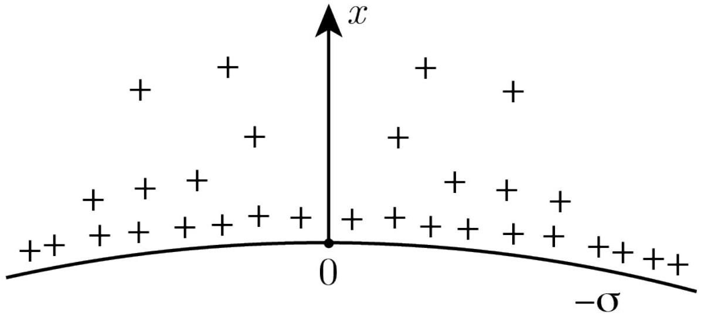
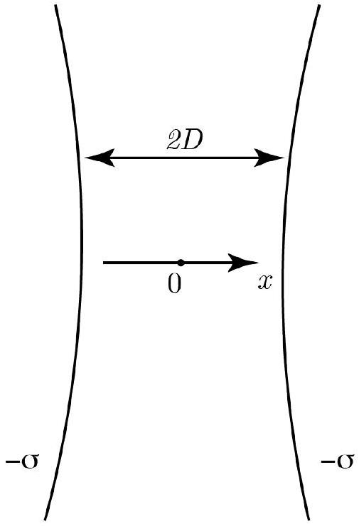

## Road to IPhO

## Клеточные мембраны

Электрические взаимодействия играют важную роль в живых организмах. Если поместить молекулу кислоты, к примеру, ДНК, в воду, то некоторые слабо связанные с ней атомы могут диссоциировать. Положительные ионы будут покидать молекулу, делая её тем самым отрицательно заряженной. Точно так же и клеточные мембраны в воде будут заряжаться отрицательно, а электростатическое отталкивание между ними предотвращает «слипание» макромолекул, мембран и клеток. Поскольку вещество в целом электрически нейтрально, то большое количество положительных ионов в растворе вызовет ослабление силы взаимодействия между мембранами с расстоянием. При решении задачи считайте, что температура всюду равна комнатной $T$.

Клеточную мембрану можно считать равномерно заряженной сферой с поверхностной плотностью заряда $(-\sigma)$. В мембрану заключено нейтральное содержимое клетки. Мембрана окружена раствором с диэлектрической проницаемостью $\varepsilon$. Положительные ионы плавают в тонком слое этого раствора вблизи внешней поверхности мембраны. Рассмотрим фрагмент мембраны и прилегающий к нему слой. В этой области считайте поле мембраны однородным. Ось $x$ с началом на мембране направим перпендикулярно ей (см. рис.).

Система находится в тепловом равновесии с окружающей средой. Из-за электростатического взаимодействия плотность положительных ионов в растворе неоднородна, но можно считать, что каждая часть локально находится в равновесии. Поведение положительных ионов при этом аналогично поведению молекул в атмосфере с тем лишь исключением, что на положительные ионы действует электрическое поле, а на молекулы атмосферы - гравитационное. Примем концентрацию положительных ионов $n_{0}$ у самой поверхности мембраны за неопределённую постоянную. Заряд электрона $-e$, заряд положительного иона $+e$, постоянная Больцмана $k$, электрическая постоянная $\varepsilon_{0}$.

Силу тяжести и вязкость воды не учитывайте.

A1 Запишите дифференциальное уравнение, которому должен удовлетворять потенциал электрического поля $\varphi$.

Подсказка: согласно распределению Больцмана, концентрация $n$ частиц с энергией $E$ пропорциональна $\exp \left(-\frac{E}{k T}\right)$, где $T$ - абсолютная температура среды.

Потенциал на поверхности клетчатой мембраны выбирается равным нулю.
А2 Запишите граничные условия, которым удовлетворяет потенциал $\varphi$ на поверхности мембраны, т.е. найдите $\varphi(0), \frac{\mathrm{d} \varphi}{\mathrm{d} x}(0)$.

При некоторых условиях решение дифференциального уравнения, полученного в пункте A1, удовлетворяющее граничным условиям, полученным в пункте A2, можно представить в виде логарифмической функции: $\varphi(x)=A_{1} \ln \left(1+B_{1} x\right)$.

A3 Определите $n_{0}, A_{1}$ и $B_{1}$. Выразите $\varphi(x)$ и $n(x)$ (концентрацию положительных ионов в точке $x$ ) через $\sigma, \varepsilon$, $\varepsilon_{0}, T, e$ и $k$.

## Road to IPhO

А4 Покажите, что полученное $n(x)$ гарантирует электрическую нейтральность системы. 0.4

А5 В расчете на единицу площади мембраны найдите энергию электрического поля $U_{f}$ и сумму потенциальных энергий положительных ионов $U_{e}$ в этом поле.

Рассмотрим теперь ситуацию, когда две клетки расположены близко друг к другу. Упрощенная модель выглядит следующим образом: две одинаковые большие сферические поверхности расположены так, что зазор между ними равен $2 D$, при этом величина зазора много меньше радиуса кривизны поверхностей. Обе мембраны равномерно заряжены зарядом с поверхностной плотностью $-\sigma$. В качестве начала координат выберем середину зазора, ось $x$ направим перпендикулярно мембранам, а потенциал в начале координат примем равным нулю. За неопределённую постоянную вновь примем концентрацию положительных ионов $n_{0}$ при $x=0$. Зависимость потенциала от координаты можно искать в виде $\varphi(x)=A_{2} \ln \left[\cos \left(B_{2} x\right)\right]$.

| B1 | Определите $A_{2}$ и $B_{2}$. Выразите ответ через $T, \varepsilon, \varepsilon_{0} e, k$ и $n_{0}$. | 0.8 |
| :--- | :--- | :--- |
| B2 | Введём величину $\theta=B_{2} D$.   Из граничных условий на поверхности мембраны получите уравнение, связывающее $\theta$ и $e, \sigma, D, \varepsilon, \varepsilon_{0}, k$ и $T$. | 0.5 |
| B3 | Выразите $n_{0}$ через $D, \sigma, \varepsilon, \varepsilon_{0}, T, e, k$ и $\theta$. | 0.4 |
| B4 | Найдите разность $\Delta n \equiv n( \pm D)-n_{0}$ между концентрациями положительных ионов у поверхности двух мембран и посередине между ними. Выразите ответ через $\sigma, \varepsilon, T$ и $k$. | 0.5 |
| B5 | Покажите, что полученное $n(x)$ гарантирует электрическую нейтральность системы. | 0.5 |
| B6 | Найдите полную силу $f$, действующую на единицу площади мембраны. Гидростатическим давлением можно пренебречь. Ответ выразите через $e, D, \theta, \varepsilon, \varepsilon_{0}, k$ и $T$.   Подсказка: положительные ионы в воде ведут себя как идеальный газ и локально находятся в тепловом равновесии. | 1.5 |

B7 Для сравнительно малых расстояний $D$ зависимость $f(D)$ имеет вид: $f=k_{1} D^{\alpha}$, а для больших: $f=k_{2} D^{\beta}$. 1.8 Найдите $\alpha$ и $\beta$.
