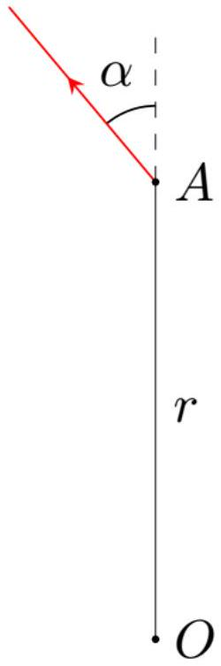
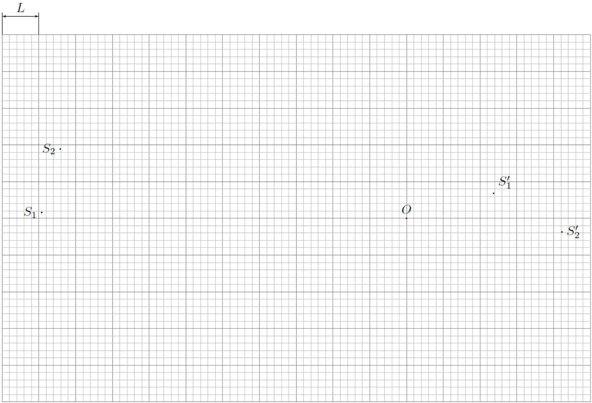
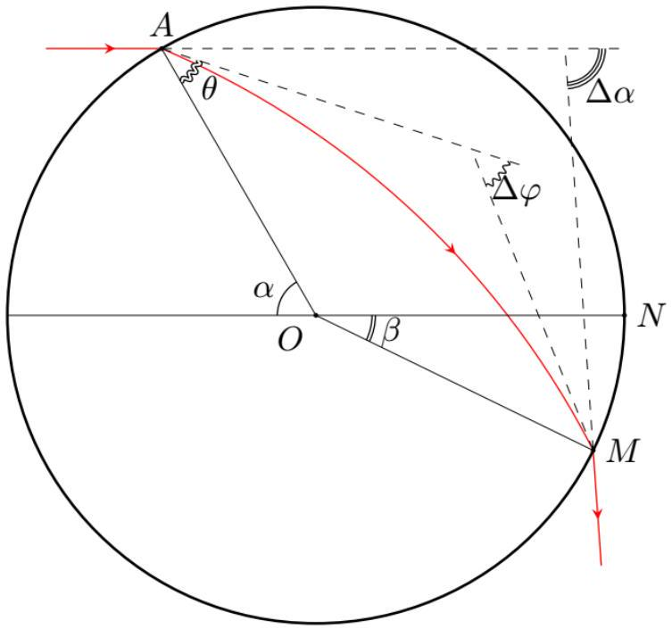
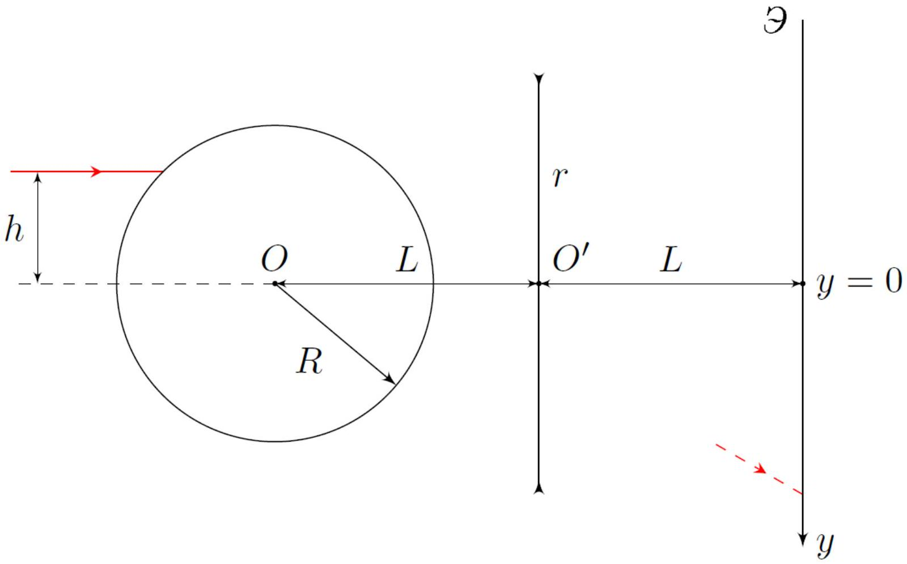
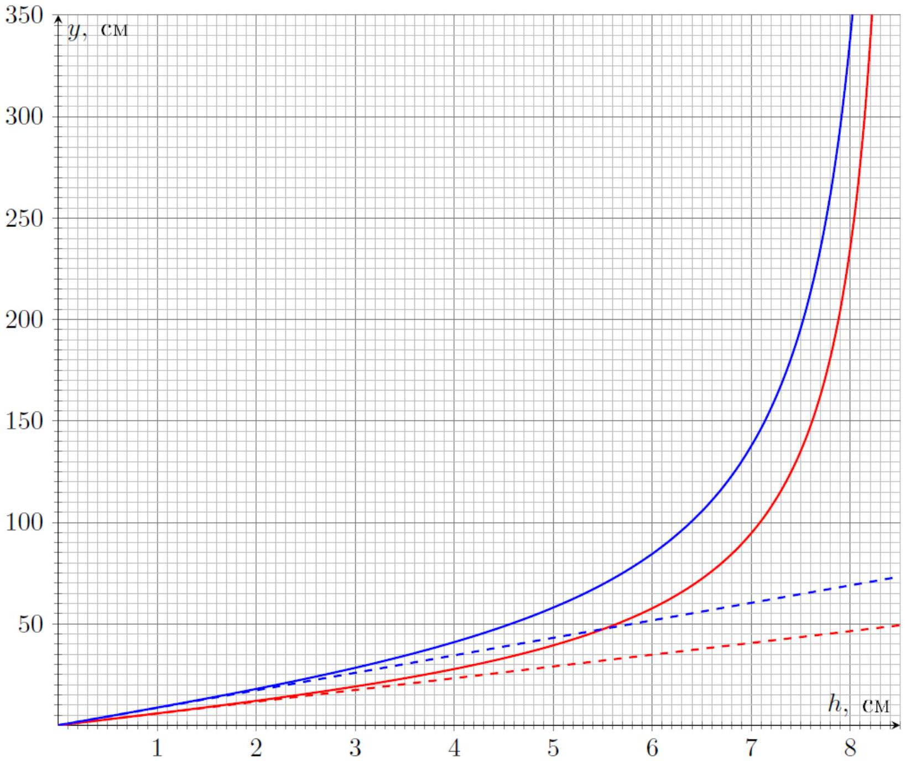

## Road to IPhO

«Рыбий глаз» Максвелла (12 баллов)
Стигматическое изображение - изображение, каждая точка которого соответствует ровно одной точке изображаемого объекта.

Оптическая система, формирующая стигматическое изображение трёхмерной области, называется абсолютной. Для формирования стигматического изображения необходимо, чтобы лучи, испущенные каждой точкой оптического объекта, после прохождения через оптическую систему пересекались строго в одной точке. Как следствие, в таких системах отсутствуют явления аберрации и дифракции света. Примером абсолютной оптической системы является «Рыбий глаз» Максвелла, представляющий собой неоднородную сферически-симметричную среду.

В рамках данной задачи вам сначала предстоит описать оптические параметры «Рыбьего глаза», а затем проанализировать изображения, получаемые при использовании данной системы.

Часть А. Показатель преломления «Рыбьего глаза» (3.5 балла)
Для начала рассмотрим среду с произвольной зависимостью $n(r)$.
Обозначим центр среды за точку $O$, а точку траектории луча - за $A$, при этом $O A=r$.

Также введём угол $\alpha$ между волновым вектором луча $\vec{k}$ и вектором $\overrightarrow{O A}$.
А1 Кривизной плоской кривой $\rho$ называется величина, обратная радиусу кривизны траектории. Она может 0.3 быть найдена следующим образом:

$$
\rho=\frac{\mathrm{d} \theta}{\mathrm{~d} l}
$$

где $\mathrm{d} l$ - элемент длины кривой, $\mathrm{a} \mathrm{d} \theta$ - угол поворота касательной к кривой.
Выразите кривизну траектории луча $\rho$ через $r, \alpha$ и $\frac{\mathrm{d} \alpha}{\mathrm{d} r}$.
A2 Рассмотрим произвольную траекторию луча. Пусть при $O A_{0}=r_{0}$ показатель преломления $n\left(r_{0}\right)=n_{0}$, а $\mathbf{1 . 0}$ угол $\alpha\left(r_{0}\right)=\alpha_{0}$.
Выразите кривизну траектории луча при $O A=r$ через $n_{0}, r_{0}, \alpha_{0}, r, n(r)$ и $\frac{\mathrm{d} n(r)}{\mathrm{d} r}$.
«Рыбий глаз» Максвелла обладает следующим свойством: любой луч, испущенный в некоторой его точке, движется по линии постоянной кривизны.

А3 Используя результат пункта А2, покажите, что кривизна траектории любого луча постоянна при условии: 0.4

$$
n(r)=\frac{n_{1}}{1+\left(\frac{r}{a}\right)^{2}}
$$

где $n_{1}$ и $a$ - некоторые положительные постоянные.
Во всех остальных пунктах части A эти постоянные считаются известными.
Выразите кривизну траектории луча $\rho$ через, $a, r_{0}$ и $\alpha_{0}$.

A4 Чему равна максимально возможная кривизна траектории луча $\rho_{\text {max }}$ при произвольных значениях $r_{0}$ и $\alpha_{0}$ ? 0.2 Ответ выразите через $a$.

А5 Покажите, что траектории всех лучей, испущенных из точки $A$, находящейся на расстоянии $r_{0}$ от точки $O, 0.8$ действительно проходят через одну общую точку $B$.

Найдите также величину расстояния $A B=L$. Ответ выразите через $r_{0}$ и $a$.

## Road to IPhO

А6 Из принципа Ферма следует, что время движения всех лучей от точки $A$ до точки $B$ одинаково.
Найдите время $T$ после вспышки лучей, через которое произойдёт их фокусировка.
Ответ выразите через $n_{1}, r_{0}, a$ и скорость света в вакууме $c$.
Примечание: Вам может понадобиться следующий интеграл:

$$
\int \frac{\mathrm{d} x}{1+k \cos x}=\frac{2}{\sqrt{1-k^{2}}} \operatorname{arctg}\left(\sqrt{\frac{1-k}{1+k}} \operatorname{tg} \frac{x}{2}\right)+\text { const при }-1<k<1
$$

## Часть В. Источники на поверхности «Рыбьего глаза» (2.5 балла)

В 1905 году Роберт Вуд реализовал идею «Рыбьего глаза», в качестве которого использовался шар радиуса $R$, показатель преломления $n$ вещества которого зависел от расстояния $r$ до центра шара по закону:

$$
n(r)=\frac{2}{1+\left(\frac{r}{R}\right)^{2}}
$$

В этой части задачи вам предлагается исследовать изображения точечных источников света на поверхности «Рыбьего глаза» в системе, состоящей из него и идеальной собирающей линзы.

На поверхности «Рыбьего глаза» расположены два точечных источника света. На рисунке, приведённом на миллиметровой бумаге, показаны положения точечных источников света $S_{1}$ и $S_{2}$, их изображений в системе, состоящей из «Рыбьего глаза» и идеальной собирающей линзы $S_{1}^{\prime}$ и $S_{2}^{\prime}$ (причём неизвестно, соответствуют ли источник и изображение с одинаковыми индексами друг другу), а также главного оптического центра линзы $O$.

Рисунок приведён в некотором масштабе, $L=10 \mathrm{~cm}$ - длина стороны квадратной клетки. «Рыбий глаз» целиком находится за фокальной плоскостью линзы.

## Road to IPhO

| B1 | Найдите радиус «Рыбьего глаза» $R$. | 1.2 |
| :--- | :--- | :--- |
| B2 | Соответствует ли изображение $S_{1}^{\prime}$ источнику $S_{1}$ ? Ответ обоснуйте. | 0.1 |
| B3 | Найдите фокусное расстояние линзы $F$. | 1.2 |

## Часть С. Фокусное расстояние «Рыбьего глаза» (2.0 балла)

В данной части задачи вам предстоит описать «Рыбий глаз» как линзу в оптической системе. Во всех пунктах этой части задачи работайте в параксиальном приближении.

Рассмотрим шар радиуса $R$, показатель преломления вещества $n$ которого зависит от расстояния $r$ до его центра по закону:

$$
n(r)=\frac{n_{1}}{1+\left(\frac{r}{a}\right)^{2}} \quad n_{1} \geq 1+\left(\frac{R}{a}\right)^{2}
$$

Напомним, что оптическим центром оптической системы (если он существует) называется такая точка $O$, что любой луч, проходящий через неё, не преломляется и не смещается. Для «Рыбьего глаза» такой точкой является его центр.

Фокусным расстоянием $F$ оптической системы называется расстояние между её оптическим центром $O$ и точкой фокусировки $F^{\prime}$ параллельного пучка лучей, проходящих вблизи оптического центра системы, т.е $F=O F^{\prime}$.

Рассмотрим луч, падающий на «Рыбий глаз» с углом падения $\alpha \ll 1$. Обозначим углы так, как показано на рисунке:

1. $\alpha$ - угол падения луча;
2. $\theta$ - угол преломления луча;
3. $\Delta \varphi$ - угол поворота вектора скорости луча при движении внутри «рыбьего глаза»;
4. $\Delta \alpha$ - полный угол поворота вектора скорости луча;
5. $\beta=\angle N O M$ - угол, характеризующий точку, в которой луч покидает «рыбий глаз».

## Road to IPhO

Далее, если точка фокусировки $F^{\prime}$ находится левее точки $O$, будем считать «Рыбий глаз» рассеивающей линзой, а если правее - собирающей.

| C1 | Найдите $\Delta \varphi$. Ответ выразите через $\alpha, n_{1}, a$ и $R$. | 0.5 |
| :--- | :--- | :--- |
| C2 | $\Delta \alpha$ можно представить как $\Delta \alpha=k \alpha$.   Найдите коэффициент пропорциональности $k$. Ответ выразите через $n_{1}, R$ и $a$. | 0.3 |
| C3 | Выразите фокусное расстояние $F$ «Рыбьего глаза» через $R$ и $k$. | 0.2 |
| C4 | При фиксированных значениях $n_{1}$ укажите, собирающей или рассеивающей является линза при разных значениях параметра $a$. Ответ обоснуйте.   Постройте графики зависимости фокусного расстояния $F(x)$ от параметра $x=\frac{R}{a}$ при всех его возможных значениях для $n_{1}=1.5 ; 2.0 ; 2.5 ; 3.0 ; 4.0$ и $R=5$ y.е. | 1.0 |

## Часть D. Определение параметров «Рыбьего глаза» (4.0 балла)

В данной части задачи анализируется следующая оптическая система:
На главной оптической оси идеальной тонкой линзы некоторого радиуса $r$ расположен центр $O$ «Рыбьего глаза» радиуса $R=15 \mathrm{~cm}$ на расстоянии $L=20$ см от центра линзы $O^{\prime}$. За линзой на том же расстоянии $L$ от неё расположен плоский экран. На рыбий глаз параллельно главной оптической оси линзы направляют очень узкий лазерный пучок света, расположенный на высоте $h$ над главной оптической осью линзы, который после прохождения оптической системы попадает на экран. Фокусные расстояния линзы и «Рыбьего глаза» обозначим за $F$ и $F_{0}$ соответственно.

Напомним, что фокусное расстояние $F$ - это алгебраическая величина, являющаяся положительной для собирающей линзы и отрицательной для рассеивающей.

На графике приведены две зависимости координаты $y$ лазерного пучка на экране от высоты $h$ лазера над главной оптической осью. Синяя (верхняя) зависимость получается при прохождения лазерного пучка

## Road to IPhO

через линзу, а красная (нижняя) зависимость получается, если лазерный пучок падает сразу на экран, минуя линзу. В эксперименте с линзой радиуса $r$ наблюдается скачок $y$ при $h_{1}=2.10$ см, а также стремление $y$ к бесконечности при $h_{2}=8.66 \mathrm{~cm}$.

Производная $\frac{\mathrm{d} y}{\mathrm{~d} h}$ в нуле в эксперименте с линзой оказалась равна $k_{1}=8.62$.
Линзу убрали, а эксперимент повторили, что целиком отображается нижней (красной) зависимостью.
Производная $\frac{\mathrm{d} y}{\mathrm{~d} h}$ в нуле в эксперименте без линзы оказалась равна $k_{2}=5.80$.
Во всех пунктах данной части задачи обозначение углов то же, что было введено в части $\mathbf{C}$, т.е $\Delta \alpha=k \alpha$.

## Road to IPhO

В пунктах D1-D5 работайте в параксиальном приближении.
D1 Найдите зависимость координаты $y$ пучка на экране от $h<h_{1}$ в эксперименте с линзой. Ответ выразите 0.6 через $h, L, F_{0}, F$ и $R$.

D2 Найдите зависимость координаты $y$ пучка на экране от $h<h_{1}$ в эксперименте без линзы. Ответ выразите 0.4 через $h, L, F_{0}, F$ и $R$.

D3 Найдите с точностью до третьей значащей цифры значения фокусного расстояния «Рыбьего глаза» $F_{0}$ и 0.2 коэффициента пропорциональности $k$.

D4 Определите численное значение радиуса линзы $r$. 0.3

D5 Найдите с точностью до третьей значащей цифры численное значение фокусного расстояния линзы $F$. 0.3 Собирающая или рассеивающая эта линза?

Коэффициента пропорциональности $k$ недостаточно для определения параметров $n_{1}$ и $a$ «Рыбьего глаза». Из асимптотического стремления $y$ к бесконечности при значении $h=h_{2}$ получим второе уравнение, связывающее $n_{1}$ и $a$. Для этого необходимо точно описать траекторию луча в «Рыбьем глазе».

Угол падения пучка при значении $h=h_{2}$ обозначим за $\alpha_{0}$.
D6 Получите точное выражение для $\Delta \varphi$. Ответ выразите через $\alpha, n_{1}, a, R$. 0.6

D7 Получите уравнение, определяющее $n_{1}$. Уравнение должно содержать только $n_{1}, \alpha_{0}$ и $k$. 0.6

Уравнение, полученное вами, не может быть решено на предоставленном вам калькуляторе, поскольку не может быть внесено в него целиком. Однако, углы $\theta$ и $\Delta \varphi$ могут быть найдены с помощью калькулятора.

D8 Внесите в таблицу в листе ответов значения углов $\theta\left(n_{1}\right)$ и $\Delta \varphi\left(n_{1}\right)$ с точностью до сотых градуса для указан- 1.0 ных значений $n_{1}$. Найдите с точностью до второй значащей цифры значения $n_{1}$ и $a$.
