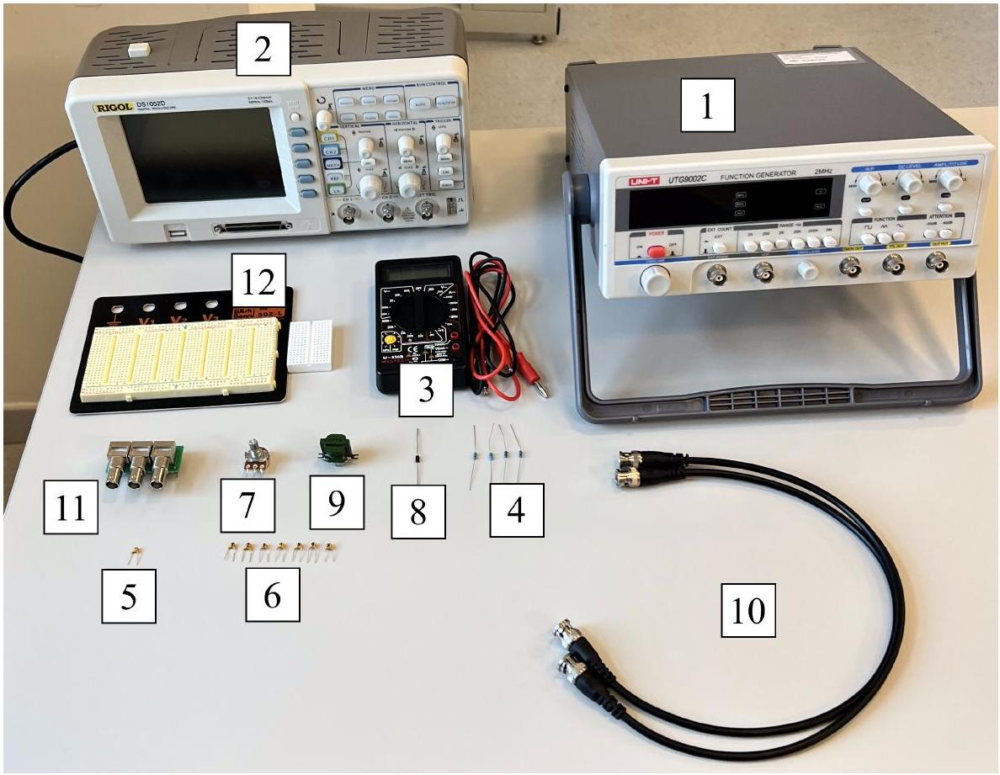
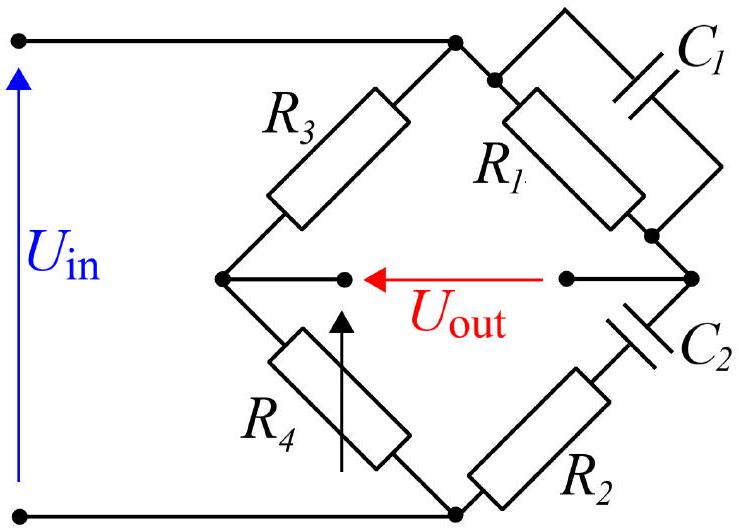

## Road to IPhO

## Мост Вина

## Оборудование

Рис. 1. Оборудование

1. Генератор
2. Осциллограф
3. Мультиметр в режиме омметра
4. Четыре резистора
5. Конденсатор известной ёмкости $C_{0}=100$ н $\Phi$
6. 7 конденсаторов неизвестной ёмкости, пронумерованные по её возрастанию
7. Переменный резистор 1 кОм
8. Диод
9. Трансформатор
10. Кабель BNC-BNC $\times 2$
11. Переходник BNC-плата
12. Макетная плата × 2

## Мост Вина

Мост Вина - это линейный элемент с четырьмя контактами, поведение которого существенно зависит от частоты $f$ входного сигнала. Схема моста Вина показана на рисунке ниже.

Два самых распространённых применения моста Вина - это измерение ёмкости конденсаторов и частотная фильтрация сигналов. Каждый из них будет рассмотрен в этой задаче.

## Часть А. Инь и Ян (6.0 балла)

Предположим, что известна ёмкость одного из конденсаторов (например, $C_{2}$ ) и сопротивления всех резисторов; также можно подстраивать сопротивление $R_{4}$ и частоту $f$ входного сигнала. Тогда при некоторых значениях $f$ и $R_{4}$ амплитуда выходного сигнала $U_{\text {out }}$ становится равной нулю (мост сбалансирован). Это можно использовать для определения ёмкости $C_{1}$.

## Road to IPhO

Рис. 2. Мост Вина

А1 Выразите условие балансировки моста как соотношение только между номиналами его элементов. При какой частоте $f_{\text {bal }}$ происходит балансировка?

А2 С помощью моста Вина как можно точнее найдите ёмкости выданных вам конденсаторов. Оцените погрешность полученных ответов.

Примечание: Поскольку «земля» генератора и осциллографа общие, то при подключении приборов в схему напрямую, один из компонентов моста Вина будет фактически исключен из цепи (два его вывода будут иметь одинаковый потенциал). Чтобы решить эту проблему необходимо использовать трансформатор. Одну его обмотку необходимо подключить к мосту Вина, а со второй обмотки снимать данные на осциллографе.

Примечание: Трансформатор втыкайте только в маленькую макетную плату, поскольку его ножки могут повредить контакты большой!

Часть В. Частотный фильтр (4.0 балла)
Далее будем рассматривать мост Вина, в котором $C_{1}=C_{2}, R_{1}=R_{2}$ и $R_{4}=2 R_{3}$. Исследуем для начала такую важную характеристику, как передаточную функцию моста $H(f) \equiv\left|\frac{U_{\text {out }}}{U_{\text {in }}}\right|$, где $U_{\text {out }}$ и $U_{\text {in }}$ - комплексные амплитуды входного и выходного сигналов, а $f$ - частота входного сигнала.

B1 Найдите передаточную функцию моста Вина $H(f)$. При какой частоте $f_{0}$ эта функция имеет особенность? На какую величину $H_{\infty}$ передаточная функция выходит в пределе больших и малых частот?

В2 Соберите частотный фильтр из имеющегося у вас оборудования. Подав на вход синусоидальный сигнал, найдите минимальную экспериментально достижимую величину передаточной функции $H_{\text {exp min }}$.

Если на произвольный нелинейный элемент подать синусоидальное напряжение частотой $f$, на выходе получается сигнал, представляющий собой сумму синусоидальных сигналов с частотой $n f, n \in \mathbb{N}$ (и, может быть, постоянной компоненты). Компонента с $n=1$ называется несущей, а компоненты с $n \geq 2$ называются высшими гармониками. Для учёта нелинейных эффектов может быть полезно знание суммарной амплитуды высших гармоник. Для её измерения можно использовать характерную особенность передаточной функции моста Вина. В качестве нелинейного элемента предлагается использовать последовательно подключенные диод и резистор с самым малым номиналом (напряжение предлагается подавать на оба элемента, а снимать с диода).

B3 Предложите метод, позволяющий отфильтровать постоянную компоненту и несущую гармонику сигнала диода и найдите относительную амплитуду $\frac{U_{\text {high }}}{U_{\text {in }}}$ высших гармоник. Оцените погрешность, используя результат предыдущего пункта.

Подсказка: Можете считать, что передаточная функция моста Вина выходит на константу достаточно быстро. Учтите, что передаточная функция трансформатора не обязательно равна 1 !
