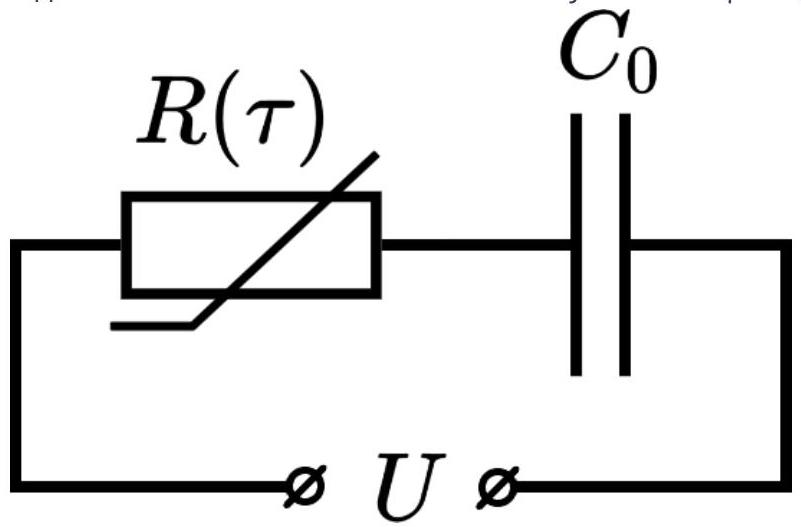
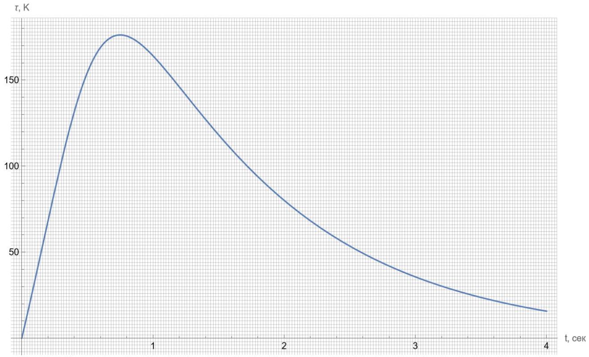

Введение
Терморезисторы - это резисторы, способные заметно менять своё сопротивление с температурой. Поскольку таким свойством обладают практически все резистивные материалы, терморезисторами обычно называют элементы, которые испытывают значительное или нетипичное изменение сопротивления в конкретном узком диапазоне температур. Два основных типа терморезисторов - это:

- Терморезисторы с положительным температурным коэффициентом сопротивления (ТКС) - т.н. позисторы. Они обычно используются в электрических цепях в качестве предохранителей, т.е. ограничивают полный ток. К примеру, как позистор ведёт себя обычная лампа накаливания.
- Терморезисторы с отрицательным ТКС - т.н. NTC-термисторы. Они также используются как ограничители, но уже пусковых токов, т.е. там, где большие токи на старте могут привести с перегоранию элементов цепи. Такое может происходить в мощных системах освещения или при зарядке мощных конденсаторов, что мы и рассмотрим в первой части задачи.

Часть А. Зарядка конденсатора (4.2 балла)
Для корректной работы большинства блоков питания необходим механизм, позволяющий регулярно заряжать конденсатор большой ёмкости без вреда для контактов и дорожек платы, поскольку в начальный момент времени ток через практически разряженный конденсатор настолько высок, что способен их расплавить. Для этого обычно применяют NTC-термисторы: в начале они имеют комнатную температуру и довольно большое сопротивление, тем самым ограничивая ток. При этом за характерное время зарядки конденсатора термистор нагревается, и поэтому к моменту, когда необходимость ограничения тока отпадает, его сопротивление падает в несколько раз, обеспечивая быструю дозарядку.

Термистор подключают последовательно с конденсатором некоторой ёмкости $C$ к источнику постоянного напряжения с некоторой ЭДС $U$. Предварительно сопротивление термистора было измерено при комнатной температуре $T_{0}=298$ К. Оно оказалось равно $R_{0}=37.3$ Ом. Для контроля работы схемы при тестовой зарядке конденсатора была снята зависимость от времени $t$ отклонения $\tau$ температуры термистора от комнатной. График $\tau(t)$ приведён в хорошем качестве на отдельной странице.

Для описания температурной эволюции термистора введём его теплоёмкость $c$ и контактную теплопроводность $\kappa$.

А1 ${ }^{0,20}$ Запишите уравнение на временну́ю производную $\dot{\tau}$ температуры термистора. Выразите ваш ответ через напряжение $U_{R}$ на термисторе, ёмкость конденсатора $C$ и введённые выше коэффициенты $с$ и $\kappa$. Перепишите это же уравнение в терминах $U_{R}, c, \kappa$ и сопротивления термистора $R(\tau)$.

А2 ${ }^{0.60}$ Пусть $c=a_{1} U^{2}$, а $\kappa=a_{2} U^{2}$. По асимптотикам кривой $\tau(t)$ при малых и больших $t$ найдите значения коэффициентов $a_{1}$ и $a_{2}$.
А3 ${ }^{0.60}$ Выразите через $\kappa$ и $\tau$ количество теплоты, которое выделится на термисторе за всё время, и свяжите его с изменением энергии конденсатора $W_{C}$. Найдите отсюда ёмкость конденсатора $C$ и её численное значение.

д4 ${ }^{0,20}$ Запишите выражение для мощности $P$, выделяющейся на термисторе. Выразите ответ через $U, R_{0}, \tau$ и введённые в А2 численные коэффициенты.
A5 ${ }^{0.20}$ Найдите отсюда выражение для напряжения $U_{R}$ на резисторе. Выразите ответ через $U, \tau$ и введённые в А2 численные коэффициенты.
А6 ${ }^{0.20}$ Получите выражение для сопротивления термистора $R$. Выразите ответ через $R_{0}, \tau$ и введённые в А2 численные коэффициенты.
A7 ${ }^{2.00}$ Как можно точнее найдите по графику зависимость $R(\tau)$.
А8 ${ }^{0.20}$ Найдите $с$ и $\kappa$, если полное приложенное напряжение равно $U=220$ В.
Часть В. Коэффициенты Стейнхарта-Харта (2.0 балла)
Поскольку в NTC-термисторах реализуется полупроводниковый механизм проводимости, зависимость сопротивления NTC-термистора $R$ от абсолютной температуры $T$ можно описать неявно с помощью уравнения Стейнхарта-Харта:

$$
\frac{1}{T}=A+B \ln R+C[\ln R]^{3} \quad(\text { СИ }),
$$

где $A, B$ и $C$ - т.н. коэффициенты Стейнхарта-Харта. Эти коэффициенты зависят от материала термистора. Определение этих коэффициентов для используемого термистора и является целью данной части задачи.

В1 ${ }^{0.60}$ Рассматривая значения $\frac{1}{T_{0}+\tau_{i}}$ как экспериментальные точки, а правую часть уравнения Стейнхарта-Харта как уравнение модельной кривой, запишите систему уравнений, позволяющую найти коэффициенты $A, B$ и $C$.

В2 ${ }^{1.40}$ Решите эту систему численно и получите коэффициенты Стейнхарта-Харта.
Часть С. BAX NTC-термистора (3.8 балла)
В части А мы рассмотрели, для чего могут применяться термисторы с отрицательным ТКС, а в части В нашли коэффициенты уравнения Стейнхарта-Харта. В этой части мы попробуем, основываясь на этих данных, исследовать работу термистора в стационарном режиме и построить его вольт-амперную характеристику.

С0 Внимание! Если вы не решали части А и В или не хотите использовать полученные значения коэффициентов уравнения Стейнхарта-Харта и контактную теплопроводность терморезистора, можете воспользоваться следующими значениями:

$$
A=7.3 \cdot 10^{-4} \quad B=1.30 \cdot 10^{-4} \quad C=5.7 \cdot 10^{-6} \quad \kappa=0.37 \frac{\mathrm{BT}}{\kappa}
$$

В случае выбора приведённых значений явно напишите об этом в листе ответов для этого пункта. В этом случае ваш максимальный балл за пункты С2 и С4 будет на 10\% меньше.

C1 ${ }^{0.20}$ Запишите уравнение для нахождения стационарного значения сопротивления NTC-термистора, к которому приложено постоянное напряжение $U$.

C2 ${ }^{1.50}$ Решая это уравнение, получите как можно точнее зависимость $R(U)$. Постройте на основе полученных точек ВАХ терморезистора при небольших токах и напряжениях.

C3 ${ }^{0.30}$ Найдите, при каком критическом напряжении $U_{\mathrm{cr}}$ и токе $I_{\mathrm{cr}}$ режим работы терморезистора меняется.

Как вы уже могли догадаться, за этой предельной точкой лежит неустойчивый участок ВАХ, который продолжается до точки плавления терморезистора, которая равняется $T_{\text {max }}=1380^{\circ} \mathrm{C}$.

C4 ${ }^{1.50}$ Как можно точнее найдите зависимость $R(U)$ на участке ВАХ от найденной в предыдущем пункте критической точки до точки плавления терморезистора и постройте её на графике.

C5 ${ }^{0.30}$ Найдите координаты $\left(U_{\mathrm{m}}, I_{\mathrm{m}}\right)$ точки плавления терморезистора на BAX.

Приложение

Оригинальный график в максимальном разрешении приведён в материалах к задаче
