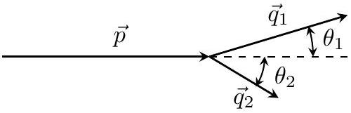

## Road to IPhO

## Динамика квазичастиц

Твердые тела (например металлы) представляют собой кристаллическую решетку из положительно заряженных ионов, между которыми движутся электроны. Электроны взаимодействуют с кристаллической решеткой и друг другом, поэтому для точного описания свойств твердого тела нужно решать крайне сложную многочастичную задачу. Однако в некоторых случаях оказывается, что все влияние взаимодействия сводится к тому, что вместо электронов в кристалле распространяются слабо взаимодействующие друг с другом частицы, уравнения движения которых существенно отличаются от уравнений для свободных электронов. Такие практически не взаимодействующие друг с другом частицы называют квазичастицами. Для простоты их обычно тоже называют электронами. Свойства квазичастиц определяются параметрами кристаллической решетки и величиной взаимодействия электронов и ионов.

Для электрона (квазичастицы) зависимость энергии от импульса $\varepsilon(\vec{p})$ может иметь очень сложный вид. Тогда связь скорости и импульса задается соотношениями

$$
v_{x}=\frac{\partial \varepsilon}{\partial p_{x}}, \quad v_{y}=\frac{\partial \varepsilon}{\partial p_{y}}, \quad v_{z}=\frac{\partial \varepsilon}{\partial p_{z}} .
$$

Скорость понимается в обычном смысле - как производная соответствующей координаты по времени.
Выражение для силы, действующей на электрон во внешних электрических и магнитных полях такое же, как и в случае движения в вакууме и уравнения движения имеют вид

$$
\frac{d \vec{p}}{d t}=\vec{F} .
$$

Заряд электрона равен $-q, q>0$.
В этой задаче вам предстоит рассмотреть некоторые случаи движения квазичастиц (электронов) с заданной зависимостью $\varepsilon(\vec{p})$. В части С вы сможете изучить еще один тип квазичастиц - фононы, представляющие собой колебания кристаллической решетки.

## Часть А. Блоховские осцилляции (2 балла)

А1 Пусть зависимость энергии электрона от импульса имеет вид

$$
\varepsilon(p)=\varepsilon_{0}\left(3-\cos \left(a p_{x}\right)-\cos \left(a p_{y}\right)-\cos \left(a p_{z}\right)\right) .
$$

Найдите его ускорение в момент времени, когда импульс равен $p_{x}=\frac{\pi}{2 a}, p_{y}=\frac{\pi}{3 a}, p_{z}=0$, а компоненты действующей на электрон силы $F_{x}, F_{y}, F_{z}$.

A2 Пусть электрон с $\varepsilon(\vec{p})$ из А1 движется в постоянном электрическом поле величины $E$, направленном вдоль оси $x$. Начальные координаты и проекции импульса равны нулю. Заряд электрона $-q$. Найдите его закон движения $x(t)$.

A3 Концентрация свободных электронов в некотором веществе равна $n$, зависимость $\varepsilon(p)$ как в А1. В начальный момент времени включается постоянное электрическое поле $E$, направленное вдоль оси $x$. Найдите зависимость плотности тока $j$ от времени.

## Часть В. Движение в магнитном поле (4 балла)

В этой части будем рассматривать движение электрона в постоянном магнитном поле $\vec{B}$.
В1 Пусть зависимость энергии от импульса $\varepsilon(\vec{p})$ произвольна. Докажите, что энергия $\varepsilon$ и проекция импульса на направление магнитного поля сохраняются.

Дальше будем считать, что магнитное поле величины $B$ направлено вдоль оси $z$, а движение электрона происходит в плоскости $x y$.

## Road to IPhO

B2 Пусть зависимость энергии от импульса имеет вид 1.1

$$
\varepsilon=\frac{p_{x}^{2}}{2 m_{x}}+\frac{p_{y}^{2}}{2 m_{y}} .
$$

Энергия электрона равна $\varepsilon$. Найдите частоту движения $\omega$. Изобразите траекторию движения частицы на плоскости $x y$, укажите характерные размеры и направление движения. Начало координат поместите в центре симметрии траектории.

Пусть теперь в дополнение к магнитному полю на электрон из В2 действует электрическое поле $E$, направленное вдоль оси $x$. Начальные значения координаты и импульса электрона равны нулю.

ВЗ Найдите годограф вектора импульса электрона (траекторию, по которой движется конец вектора импульса, если его откладывать от одной точки). Изобразите его на плоскости $p_{x}, p_{y}$. Укажите характерные размеры.

B4 Найдите закон движения $x(t), y(t)$. 0.4

Электрическое поле снова равно нулю. Зависимость энергии электрона от импульса имеет вид

$$
\varepsilon=\varepsilon_{0}\left(1-\cos \left(a p_{x}\right)\right)+\frac{p_{y}^{2}}{2 m_{y}}
$$

B5 Если энергия больше минимального значения, траектории на плоскости становятся незамкнутыми, и частица может неограниченно далеко некотором направлении. Найдите эту минимальную энергию $\varepsilon_{\text {min }}$. При энергии $\varepsilon>\varepsilon_{\text {min }}$ изобразите траекторию, укажите характерные геометрические размеры.

Наличие незамкнутых электронных орбит существенно меняет свойства материала. В частности, такие орбиты определяют поведение сопротивления в сильных магнитных полях.

## Часть С. Распад фонона (4 балла)

Другой тип квазичастиц, встречающихся в физике твердого тела - фононы, которые представляют собой колебания кристаллической решетки. По своим свойствам они похожи на фотоны, однако из-за особенностей решетки зависимость энергии от импульса нелинейна. Пусть зависимость энергии от импульса для фонона имеет вид

$$
\varepsilon(p)=u p+\alpha p^{3} .
$$

Здесь $u$ - скорость звука в кристалле, постоянная $\alpha$ задает величину дисперсии. В этой части будем считать, что второе слагаемое много меньше первого, $\alpha p^{3} \ll u p$.

В отличие от фотона, фонон при определенных условиях может распасться на два фонона. Исследуем этот процесс. Пусть импульс исходного фонона равен $p$, и он распадается на два фонона с импульсами $q_{1}$ и $q_{2}$, которые движутся под углами $\theta_{1}, \theta_{2}$ с направлением движения исходного фонона.

С1 Сначала пренебрежем дисперсией и рассмотрим случай $\alpha=0$. При каких углах $\theta_{1}, \theta_{2}$ возможен распад? 0.5

Далее будем рассматривать случай $\alpha \neq 0$. Оказывается, что в случае малого импульса исходного фонона $p$, углы $\theta_{1}, \theta_{2}$ также малы.

C2 Выразите модуль импульса второго фонона $q_{2}$ через $p, q_{1}, \theta_{1}$. Получите выражение выражение в пределе малых $\theta_{1}$ с точностью до второго порядка по $\theta_{1}$.

C3 Зависимость импульса излучаемого фонона от угла при малых углах имеет вид 1.2
$q_{1}\left(\theta_{1}\right)=A+B \theta_{1}$.
Определите постоянные $A, B$. Выразите их через $p, u, \alpha$.

## Road to IPhO

| C4 | При каком знаке постоянной $\alpha$ распад возможен? | 0.3 |
| :--- | :--- | :--- |
| C5 | Найдите максимальный угол $\theta_{\text {тах }}$, под которым может излучаться фонон. При каком условии на $p$ импульс фонона можно считать малым? | 0.5 |

C6 Выразите угол $\theta_{2}$, под которым излучается второй фонон, через $\theta_{1}, p, u, \alpha$. Считайте углы малыми, учиты- 1.0 вайте вклады первого порядка по $\theta_{1}, \theta_{2}$.
