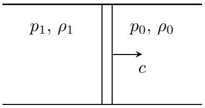
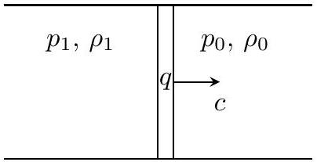
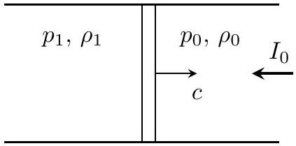

## Road to IPhO

## Распространение волн детонации

Горение - экзотермическая химическая реакция (горючее + окислитель), сопровождающаяся положительным удельным тепловыделением. При определенных условиях она может быть самоподдерживающейся, в отличие от эндотермических (сопровождающихся поглощением теплоты) реакций. Например, при возникновении очага воспламенения в предварительно перемешанной газовой смеси горючего и окислителя может сформироваться волна горения.

Детонацией называется режим горения, при котором по веществу распространяется ударная волна, инициирующая химические реакции горения, поддерживающих движение ударной волны.

Фронтом пламени называется узкая реакционная зона распространяющегося пламени, в которой происходит горение. В рамках этой задачи вам предлагается изучить распространение ударных волн детонации в газе.

Пусть газ движется по теплоизолированной прямолинейной трубе постоянного сечения. Газ можно разделить на две в области. В одной области газ неподвижен, его давление $p_{0}$, плотность $\rho_{0}$. В другой области все элементы газа движутся с одинаковой скоростью, давление газа $p_{1}$, плотность $\rho_{1}$. Скорость движения границы между этими областями $c$ назовем скоростью ударной волны. Ускорением свободного падения, а также теплопроводностью газа и его трением о стенки сосуда можно пренебречь. Примечание: решение задачи существенно упростится, если свести движение газа к стационарному. При стационарном движении параметры газа в каждой точке пространства остаются постоянными во времени.

## Часть А. Ударная волна в газе (3.0 балла)

Волна, при которой происходят резкие скачки давления и плотности вблизи волнового фронта, называется ударной. Рассмотрим одномерное течение идеального газа с показателем адиабаты $\gamma$. В данной части задачи вам предлагается проанализировать соотношения параметров $p_{0}, \rho_{0}, p_{1}$ и $\rho_{1}$ в ударной волне.

A1 Запишите систему законов сохранения массы и импульса для объема газа, переходящего через волновой фронт ударной волны. Определите из неё скорость перемещения волнового фронта $c$.

Поскольку в системе отсутствуют диссипации - энергия в ней также сохраняется.
А2 Запишите закон сохранения энергии для элемента объема газа, переходящего через волновой фронт. Получите из него дополнительное уравнение, связывающее параметры $p_{0}, \rho_{0}, p_{1}, \rho_{1}$, скорость перемещения волнового фронта $c$ и показатель адиабаты $\gamma$.

A3 Комбинируя результаты, полученные в пунктах A1 и A2, выразите отношение давлений $p_{1} / p_{0}$ через показатель адиабаты $\gamma$ и коэффициент уплотнения $k=\rho_{1} / \rho_{0}$. Это соотношение называется уравнением адиабаты для ударной волны.

А4 Определите максимально возможное значение коэффициента уплотнения $k_{\max }$. Ответ выразите через $\gamma$. Рассчитайте ответ для идеального двухатомного газа.

## Часть В. Распространение детонационной волны горения (4.0 балла)

При нагревании в некоторых газах начинается химическая реакция и они воспламеняются. Тогда через газ может распространяться ударная волна, и горение происходит в очень тонком слое вблизи волнового фронта. В этой части задачи будем рассматривать детонационную волну. Основное отличие данной части задачи от части А состоит в том, что при вступлении массы $\Delta m_{0}$ в движение системы (когда эта масса переходит через волновой фронт) происходит химическая реакция и выделяется тепло $\Delta Q=q \Delta m_{0}$, где $q$ - известная величина, называющаяся удельным тепловым эффектом химической реакции.

## Road to IPhO

Поскольку при химической реакции состав вещества изменяется - изменяется и показатель адиабаты $\gamma$. Обозначим за $\gamma_{0}$ и $\gamma_{1}$ показатели адиабаты неподвижного газа и газа после прохождения фронта волны соответственно.

B1 Запишите закон сохранения энергии для детонационной волны. Получите из него уравнение, связывающее параметры $p_{0}, \rho_{0}, p_{1}, \rho_{1}$, скорость перемещения волнового фронта $c$, удельный тепловой эффект реакции $q$, а также показатели адиабаты $\gamma_{0}$ и $\gamma_{1}$.

Введём величину удельного объёма $v=1 / \rho$ для каждого состояния:

$$
v_{0}=\frac{1}{\rho_{0}}, \quad v_{1}=\frac{1}{\rho_{1}} .
$$

Обозначим зависимость $p_{1}\left(\rho_{1}\right)$, полученную при фиксированном значении скорости перемещения волнового фронта с из комбинаций закона сохранения массы с законом сохранения импульса за $p_{1}\left(\rho_{1}\right)_{\text {имп }}$. Зависимость $p_{1}\left(\rho_{1}\right)$, полученную из комбинаций законов сохранения массы, импульса и энергии обозначим за $p_{1}\left(\rho_{1}\right)_{\text {дет }}$.

Далее работайте в приближении сильной детонационной волны, т.е волны, удовлетворяющей условиям:

$$
p_{0} \ll p_{1}, \quad \frac{p_{0}}{\rho_{0}} \ll q .
$$

B2 Явную зависимость $p_{1}\left(v_{1}\right)_{\text {дет }}$ для сильной детонационной волны можно представить в виде:

$$
p_{1}=\frac{q}{v_{0}} \cdot A
$$

Определите $A$. Ответ выразите через $\gamma_{1}$ и отношение $v_{1} / v_{0}$. Это соотношение называется уравнением детонационной адиабаты.

B3 На одном графике качественно изобразите зависимость $p_{1}\left(v_{1}\right)_{\text {дет }}$, а также зависимость $p_{1}\left(v_{1}\right)_{\text {имп }}$ при различных значениях скорости перемещения волнового фронта $c$.

При исследовании детонационных процессов Чепмен и Жуге выдвинули гипотезу, что детонационная волна горения распространяется с минимально возможной скоростью, при которой уравнение $p_{1}\left(v_{1}\right)_{\text {имп }}=p_{1}\left(v_{1}\right)_{\text {дет }}$ имеет единственное решение, называемое точкой Чепмена-Жуге. Данное утверждение позднее было доказано Зельдовичем и Дерингом.

B4 Определите параметры $p_{1}$ и $v_{1}$ точки Чепмена-Жуге. Выразите ответ через $v_{0}, \gamma_{1}, q$.

B5 Определите скорость перемещения волнового фронта с. Ответ выразите через $q$ и $\gamma_{1}$.

B6 Рассчитайте скорость перемещения волнового фронта при детонационной волне в смеси кислорода и водорода, если при его нагревании до высоких температур происходит следующая химическая реакция:

$$
2 \mathrm{H}_{2}+\mathrm{O}_{2}=\mathrm{H}_{2} \mathrm{O}+\mathrm{H}^{+}+\mathrm{HO}^{-} .
$$

Реальный процесс горения водорода представляет собой совокупность реакций, в которых взаимодействуют атомы кислорода и водорода, поэтому в числе продуктов реакции нужно учитывать ионы $\mathrm{H}^{+}$и $\mathrm{HO}^{-}$ (этот ион можно считать двухатомной молекулой). В смеси на 2 моля водорода приходится моль кислорода в соответствии с уравнением реакции. Для этой реакции считайте, что $q \approx 15$ МДж/кг на каждый килограмм израсходованного водорода.

## Road to IPhO

## Часть С. Световая детонация (3.0 балла)

Под действием сильного электрического поля воздух ионизируется и превращается в плазму. Достаточно сильное поле можно получить, сфокусировав лазерное излучение. Плазма в свою очередь содержит большое число свободных зарядов и хорошо поглощает электромагнитные волны, что приводит к дальнейшему нагреванию плазмы и распространению ударной волны. По одну сторону фронта волны находится плазма, по другую - воздух. На границе воздуха и плазмы происходит поглощение лазерного излучения, и его энергия передается плазме. Избыточное давление нагретого воздуха создает ударную волну, распространяющуюся навстречу лазерному излучению. Это явление называется светоденотационной волной. Рамсден и Савич предложили описывать такую волну как детонационную волну, в которой аналогом удельного теплового эффекта реакции $q$ служит величина

$$
q_{\mathrm{cB}}=\frac{I_{0}}{\rho_{0} c},
$$

где $I_{0}$ - интенсивность излучения. В одном из первых экспериментах, в которых наблюдалась светодетонационная волна, использовался лазер мощностью $P=30 \mathrm{MBt}$, излучение которого с помощью линзы фокусировалось в кружок радиуса $r \approx 10^{-2}$ см, создавая интесивность

$$
I \approx \frac{P}{\pi r^{2}} .
$$

Электрическое поле вблизи фокуса линзы значительно больше поля $E_{\text {проб }}=30 \mathrm{kB} / \mathrm{cm}$, вызывающего пробой воздуха, поэтому его достаточно для формирования светодетонационной волны.

Далее примите следующие данные:

1. $p_{0}=1.0 \cdot 10^{5}$ Па и $\rho_{0}=1.3 \mathrm{кг} / \mathrm{m}^{3}$ - давление и плотность воздуха при атмосферном давлении соответственно.
2. Уравнение состояния плазмы можно описывать уравнением состояния идеального газа с показателем адиабаты $\gamma_{1}=4 / 3$.
3. Работайте в приближении сильной волны, т.е считайте, что $p_{0} \ll p_{1}$ и $\rho_{0} c \ll I_{0}$.

C1 Получите уравнение светодетонационной адиабаты, аналогичное пункту B2, то есть найдите давление $p_{1}$ в плазме после прохождения волнового фронта. Выразите ответ через $v_{0}, v_{1}, \gamma_{1}, I_{0}$.

C2 Определите параметры ( $p_{1}$ и $v_{1}$ ) точки Чемпена-Жуге для светодетонационной адиабаты. Ответ выразите через $v_{0}, \gamma_{1}, I_{0}$.

C3 Определите скорость перемещения волнового фронта $c$ светодетонационной волны. Выразите ответ через $\gamma_{1}, I_{0}, \rho_{0}$. Рассчитайте ее численное значение.
