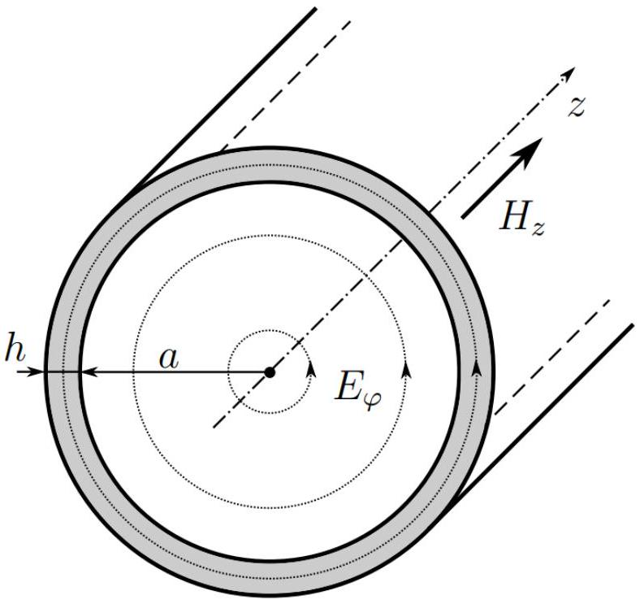
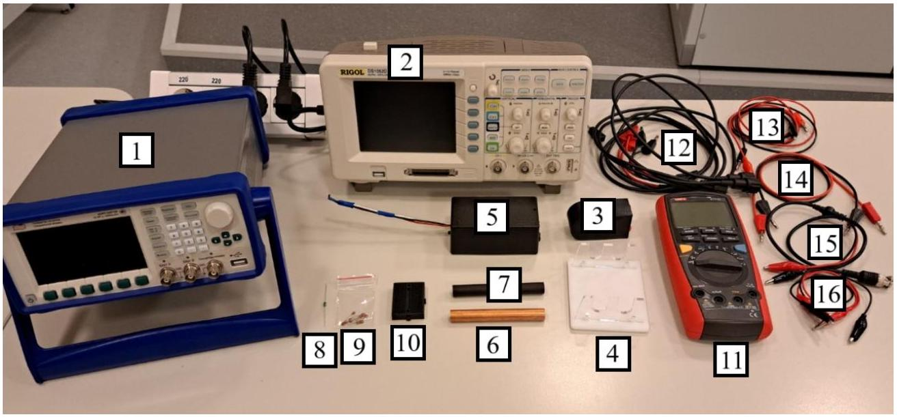
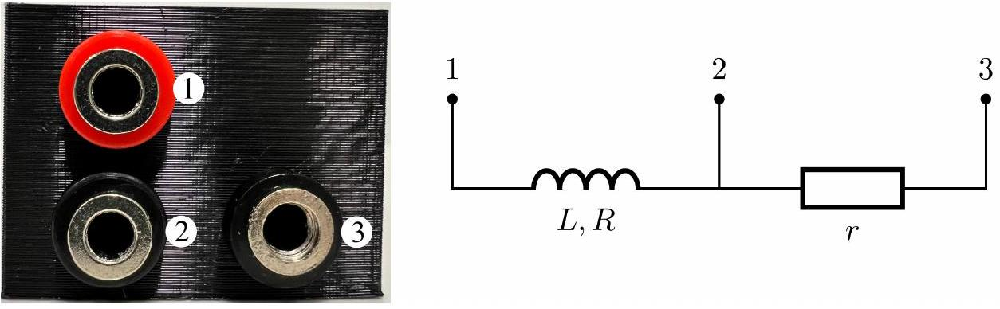
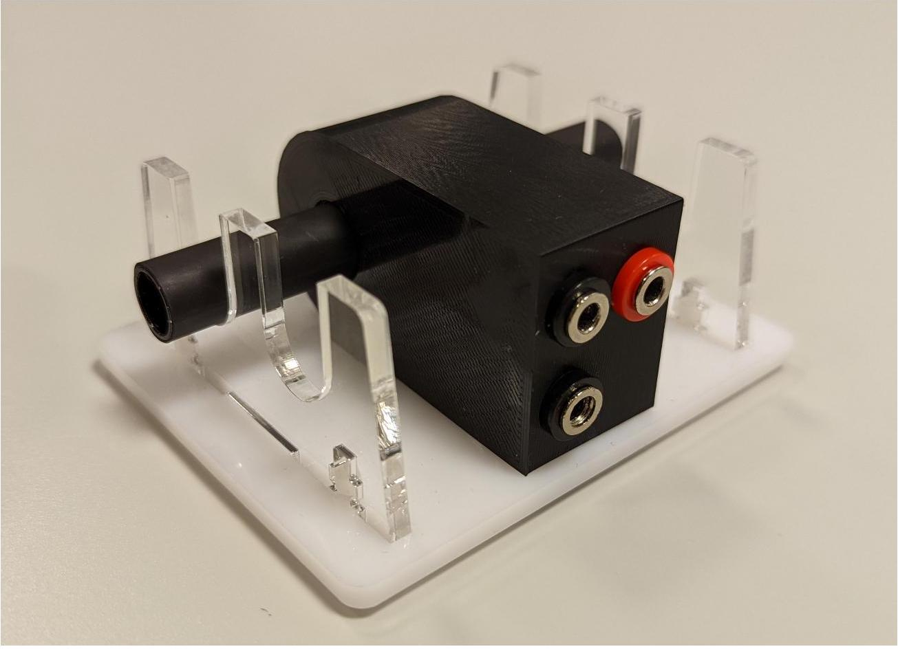
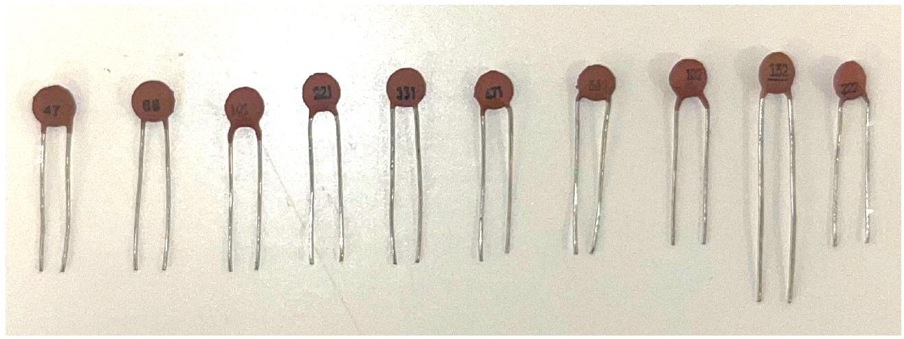
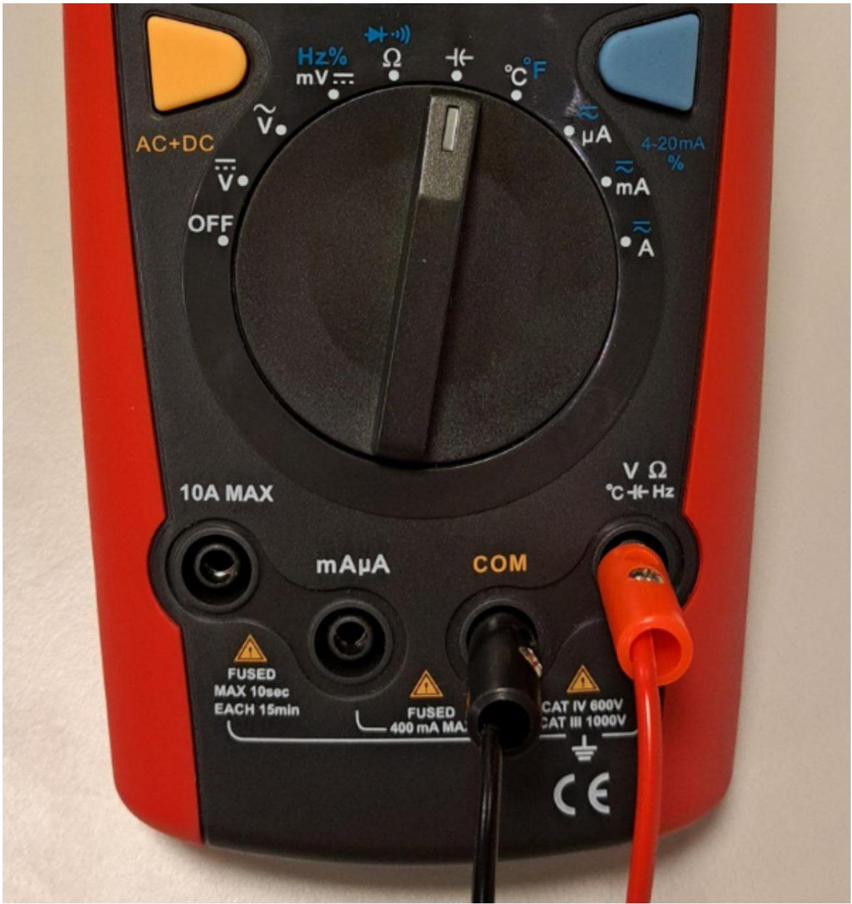
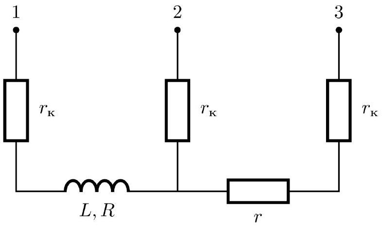

## Введение

Скин-эффект - эффект уменьшения амплитуды высокочастотных электромагнитных волн по мере их проникновения вглубь проводящей среды. Благодаря нему высокочастотный переменный ток течёт преимущественно по поверхности проводника.

Скин-эффект приводит к экранированию поля и тока, если толщина проводника оказывается заметно больше характерной толщины, на которой проявляется скин-эффект (иначе говоря, толщины скин-слоя). Это может быть полезно: к примеру, шар Теслы не бьёт током при прикосновении, потому что высокочастотный ток протекает лишь по тонкому слою кожи около поверхности.

Шар Теслы.

В электротехнике скин-эффект наоборот предстаёт препятствием, поскольку при больших частотах значительно увеличивает сопротивление контактов.

Эта задача посвящена исследованию скин-эффекта в металлах.

## Теоретическое введение

Как известно, изменяющееся электромагнитное поле описывается системой уравнений Максвелла. Если на проводник подать переменное напряжение, то в нем возникает переменный ток, что приводит появлению переменного магнитного поля.

Рассмотрим проводник, имеющий форму полого тонкостенного цилиндра с внутренним радиусом $a$ и толщиной стенок $h$. Пусть по цилиндру протекает гармонически зависящий от времени кольцевой ток с круговой частотой $\omega$ (иначе говоря в каждой точке цилиндра плотность тока перпендикулярна радиусу, проведенному в эту точку). В этом случае в установившемся режиме напряженности электрического и магнитного полей также гармонически зависят от времени.

Рассмотрим компоненту напряженности $\vec{H}$ магнитного поля, направленную вдоль оси цилиндра. Пусть её комплексная амплитуда вблизи проводника с его наружной стороны равна $H_{0}$, а с внутренней - $H_{1}$. Тогда решение уравнений Максвелла для этой системы даёт следующую связь между ними:

$$
H_{1}=\frac{H_{0}}{\operatorname{ch}(\alpha h)+\frac{1}{2} \alpha a \operatorname{sh}(\alpha h)},
$$

где $\alpha=\frac{1+i}{\delta}, \delta=\sqrt{\frac{2}{\omega \sigma \mu \mu_{0}}}, \sigma$ - проводимость материала проводника, $\mu$ - его магнитная проницаемость. Величина $\delta$ называется глубиной скин-слоя, так как при проникновении поля вглубь проводника оно заметно затухает уже при расстояниях от края порядка $\delta$.

Материалы, используемые в данной задаче имеют $\mu \approx 1$, поэтому далее можно использовать упрощённую формулу для глубины проникновения:

$$
\delta=\sqrt{\frac{2}{\omega \sigma \mu_{0}}} .
$$

Оборудование

1. Генератор.
2. Осциллограф.
3. Катушка для создания магнитного поля в образцах (внутри катушка + резистор сопротивлением $r \sim 1$ Ом).
4. Стойка.
5. Датчик Холла.
6. Кусочек медной трубки. Параметры трубки: длина $l=10$ см, диаметр $2 a=12.7$ мм, толщина $h=0.65$ мм.
7. «Чёрный ящик». Параметры: длина $l^{\prime}=10 \mathrm{~cm}$, диаметр $2 a^{\prime}=12$ мм.
8. Катушка индуктивностью 10 мкГн.
9. Набор конденсаторов ёмкостями 47, 68, 100, 220, 330, 470, 680, 1000, 1500, 2200 пФ.
10. Макетная плата.
11. Мультиметр.
12. Соединительные провода: BNC-банан $\times 3$;
13. банан-крокодил $\times 2$;
14. банан-банан × 2;
15. BNC-крокодил;
16. крокодил-крокодил $\times 2$.
17. Персональный набор перемычек (не показан на фотографии).

Катушка для создания магнитного поля в образцах: внутреннее устройство.

Правильная установка образца и катушки на стойке.

Конденсаторы.

Измерение ёмкости с помощью мультиметра.

Указания к оборудованию

- Стойка предназначена для центровки образца относительно оси катушки. Высота прорезей отличается на ~ 0.5 мМ, поскольку диаметры образцов немного отличаются. Стойки очень хрупкие, будьте осторожны при обращении с ними!
- Многие эффекты, исследуемые в задаче, достаточно тонкие. Используйте выданный мультиметр только для измерения сопротивлений и ёмкостей!
- При использовании осциллографа для измерения рекомендуется использовать курсоры. Показания осциллографа могут быть зашумлены, рекомендуется использовать усреднение по $\geq 16$ измерениям. Обращайте внимание на настройку триггера! В режиме усреднения возможны ситуации, когда сбитая настройка незаметна!
- Батарейка в датчике Холла разряжается довольно быстро! Выключайте его, если не проводите измерения!

-- В любой момент времени наблюдатель в аудитории может подойти к вам и проверить, включен ли датчик Холла. Если вы при этом не проводите измерения, наблюдатель вправе поставить специальную пометку в ваших листах ответов. За каждую пометку вы получаете штраф в 1 балл. Количество пометок не ограничено.

Часть А. Измерение проводимости по отношению полей (3.0 балла)
Один из возможных способов исследования скин-эффекта в трубке - это измерение отношения максимальных магнитных полей в катушке, когда в нём нет трубки и когда она есть.

A0 ${ }^{0.20}$ Зная, что проводимость материала трубки имеет порядок $\sigma \sim 5 \cdot 10^{7}$ См (Сименс, единица СИ), оцените частоту $f_{0}$, при которой характерная толщина скин-слоя будет равна $h \sim 1$ мм.

Если толщина скин-слоя заметно больше толщины стенки трубки, формула для отношения комплексных амплитуд заметно упрощается, что позволяет найти проводимость исследуемого материала.

A1 ${ }^{0.50}$ В случае большой толщины скин-слоя $\left(a h / \delta^{2} \ll 1\right)$ получите упрощённую формулу для квадрата модуля отношения полей внутри катушки без трубки и с ней. Предложите линеаризацию, позволяющую найти проводимость материала трубки по отношению полей, если известна её толщина.

А2 ${ }^{0.50}$ Предложите схему установки, позволяющую определить отношение амплитуд $H_{0} / H_{1}$ при известной частоте $f$ путём одновременного измерения не более двух величин с помощью осциллографа. Приведите расчётные формулы.

Примечание: В качестве ответа принимаются рисунки, схемы и формулы.

A4 ${ }^{\mathbf{0 . 8 0}}$ Линеаризуйте зависимость и постройте график. Отсюда определите проводимость $\sigma$ исследуемого материала. Оцените графически погрешность полученного результата.

А5 ${ }^{1.80}$ Найдите, при какой частоте $f_{c r, A}$ экспериментальное значение $\left[H_{0} / H_{1}\right]^{2}$ впервые окажется в 1.5 раза меньше теоретического. Найдите теоретически толщину скин-слоя $\delta_{c r, A}$ при этой частоте. Определите отношение $\delta_{c r, A} / h$. Оно является универсальной величиной и понадобится в части E.

Часть В. Измерение проводимости по разности фаз (3.0 балла)
Основная проблема измерения отношения полей состоит в большой чувствительности реального распределения поля и показаний датчика Холла к его положению в катушке.

Измерение разности фаз между током в катушке и полем внутри трубки лишено этих недостатков.
Определению параметров исследуемого материала по поведению фазы поля будет посвящена часть В этой задачи.
В1 ${ }^{0.50}$ Упростив выражение для отношения комплексных амплитуд поля внутри и вне трубки, получите выражение для тангенса разности фаз $\operatorname{tg} \psi$ полей внутри и снаружи трубки в случае $h \ll \delta \ll a$.

В2 ${ }^{0.50}$ Предложите схему установки, позволяющую определить тангенс разности фаз $\operatorname{tg} \psi$ между током в катушке и полем внутри трубки при известной частоте $f$ путём одновременного измерения не более двух величин с помощью осциллографа. Приведите расчётные формулы.

Примечание: В качестве ответа принимаются рисунки, схемы и формулы.
Вз ${ }^{1.00}$ Снимите зависимость тангенса сдвига фаз от частоты $\operatorname{tg} \psi(f)$.
В4 ${ }^{0.50}$ Постройте график этой зависимости для линейного участка. Отсюда определите проводимость материала трубки $\sigma$. Оцените графически погрешность вашего результата.

В5 ${ }^{0.50}$ Найдите, при какой частоте $f_{c r, B}$ экспериментальное значение $\operatorname{tg} \psi$ впервые окажется в 2 раза больше теоретического. Найдите теоретически толщину скин-слоя $\delta_{c r, B}$ при этой частоте. Определите отношение $\delta_{c r} / h$. Оно является универсальной величиной и понадобится в части E.

Часть С. Измерение проводимости по индуктивности катушки (4.0 балла)

Поскольку поле внутри трубки ослабляется за счёт скин-эффекта, суммарный поток через катушку при наличии трубки будет меньше, чем в её отсутствие. Таким образом, индуктивность катушки с трубкой внутри будет падать с частотой вследствие скин-эффекта. Теоретически несложно показать, что индуктивность $L$ связана с частотой $f$ формулой:

$$
\frac{L_{\max }-L}{L-L_{\min }}=\left[\pi a h \mu_{0} \sigma f\right]^{2},
$$

$L_{\text {max }}$ - наибольшая индуктивность катушки (достигается при $f \rightarrow 0$ ), а $L_{\text {min }}$ - наименьшая индуктивность катушки (достигается при $f \rightarrow \infty$ ).
Внимание! Вы можете пропустить пункты С1 и С2 или не учитывать их в дальнейшей работе, однако это может снизить точность ваших результатов.
Сопротивление резистора очень мало, но при этом может немного отличаться от табличного, поэтому для успешного решения этой части задачи нужно как можно точнее измерить это сопротивление.

С1 ${ }^{0.30}$ Измерьте как можно точнее сопротивления между контактами $r_{12}, r_{23}$ и $r_{13}$.

Скорее всего, вы получили $r_{12}+r_{23}>r_{13}$. Причина такого поведения - сопротивление контактов. Для простоты будем считать сопротивление всех контактов одинаковым и равным $r_{\text {к }}$ [см. рис.].

Внутреннее устройство катушки с учётом сопротивления контактов.

С2 ${ }^{0.50}$ Определите сопротивление контактов $r_{\mathrm{K}^{\prime}}$ а также реальные сопротивления катушки $R$ и резистора $r$.
с3 ${ }^{0.70}$ Предложите схему установки, позволяющую определить индуктивность катушки $L$ при известной частоте $f$ путём одновременного измерения не более двух величин с помощью осциллографа. Приведите расчётные формулы.

Примечание: В качестве ответа принимаются рисунки, схемы и формулы.
C4 ${ }^{2.50}$ Сняв необходимые экспериментальные точки, получите зависимость $L(f)$. Определите $L_{\min }$ и $L_{\max }$. Линеаризовав эту зависимость и построив график, найдите проводимость меди. Оцените графически погрешность полученного результата.

Часть D. Паразитные измерения (6.0 баллов)

Наконец, можно исследовать скин-эффект по его влиянию на сопротивление образца. Если частота колебаний настолько велика, что толщина скин-слоя оказывается заметно меньше толщины образца, ток будет течь только в узкой области толщиной $\delta$ около поверхности, и сопротивление образца выражается как:

$$
R=\frac{1}{\sigma} \frac{l}{P \delta},
$$

где $P$ - периметр образца, $l$ - его длина, а $\sigma$ - проводимость.

В этой части попробуем измерить сопротивление образцов с учётом скин-эффекта. Поскольку реально измеримое сопротивление возникает у образца лишь при довольно больших частотах, измерить его напрямую не представляется возможным. Возможное решение - использовать колебательный контур из катушки 10 мкГн, одного из конденсаторов и образца в качестве резистора. Сопротивление можно измерить по его добротности.

Но даже такой метод не лишён проблем, в частности:

- У генератора имеется собственное сопротивление (сильно больше измеряемых сопротивлений) - его нельзя подключать в контур последовательно!
- У осциллографа имеется собственная ёмкость (сравнимая с ёмкостями используемых конденсаторов). Её необходимо учесть там, где она может повлиять на импеданс в пределе большой добротности.

D1 ${ }^{0.50}$ Предложите схему установки, позволяющую измерить сопротивление с учётом указанных выше данных.
Указание: Поскольку сопротивление зависит от частоты, измерение ширины резонансного пика в общем случае может быть затруднительно.
Примечание: В качестве ответа принимаются рисунки, схемы и формулы.
D2 ${ }^{0.50}$ Реальные ёмкости конденсаторов немного отличаются от указанных на них значений. Измерьте их выданным мультиметром и запишите реальные значения $C_{\text {real }}$ ёмкости в таблицу в листе ответов.

D3 ${ }^{2.00}$ Найдите добротность $Q$ и резонансную частоту $f_{\text {res }}$ для всех номиналов используемых конденсаторов.
D4 ${ }^{1.00}$ По измеренной резонансной частоте рассчитайте эквивалентную ёмкость $C_{e q}$, включенную в цепь. Линеаризовав зависимость $C_{e q}\left(C_{\text {real }}\right)$ и построив график, найдите «паразитную ёмкость» осциллографа $C_{\text {osc }}$.

D5 ${ }^{1.50}$ Предложите линеаризацию, позволяющую найти проводимость. Постройте график и найдите значение $\sigma$. Графически оцените погрешность полученного результата.

При корректной постановке эксперимента в этой части линеаризованная зависимость действительно получается линейной, однако значение $\sigma$ оказывается заметно меньше результатов предыдущих частей.

D6 ${ }^{0.50}$ Укажите возможную причину такого результата. Обоснуйте свой ответ количественными оценками.
Часть Е. Чёрный трубка (4.0 балла)
Точно так же, как и вращающиеся магниты с 2Т, скин-эффект может использоваться для бесконтактного определения параметров проводящего материала, таких как проводимость и толщина. В качестве чёрного ящика вам предоставлена окрашенная трубка в термоусадке.

Эта часть задачи посвящена определению проводимости материала и толщины стенок трубки.
E1 ${ }^{1.80}$ Методом, описанным в части A, определите толщину трубки и её проводимость. Величину $\delta_{c r} / h$ возьмите из A. Графически оцените погрешность вашего результата.

E2 ${ }^{1.80}$ Методом, описанным в части B, определите толщину трубки и её проводимость. Величину $\delta_{c r} / h$ возьмите из В5. Графически оцените погрешность вашего результата.

Какой из методов, по вашему, точнее?
В таблице ниже приведён список материалов, из которых может быть сделана трубка:

| Материал | Серебро | Алюминий | Вольфрам | Цинк | Никель |
| :--- | :--- | :--- | :--- | :--- | :--- |
| $\sigma, 10^{7} \mathrm{Cm}$ | 6.30 | 3.50 | 1.79 | 1.69 | 1.43 |
