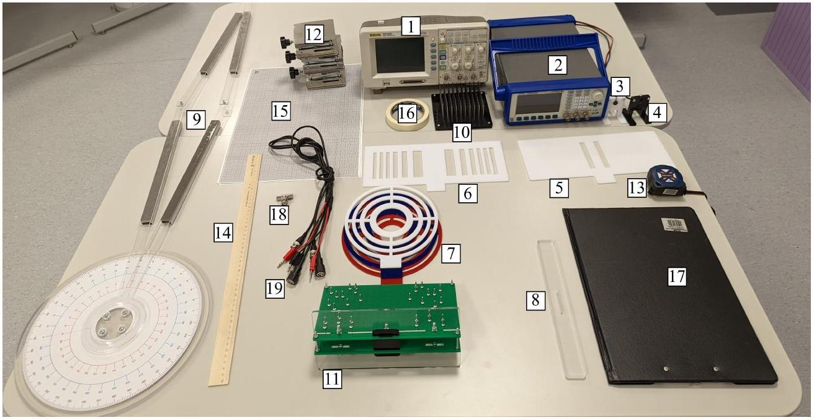
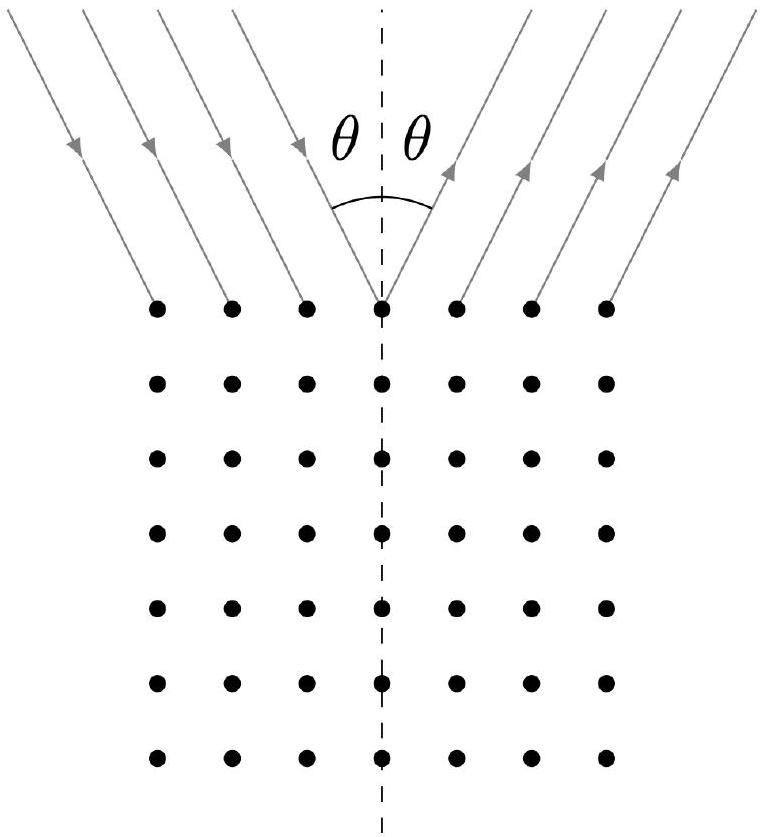
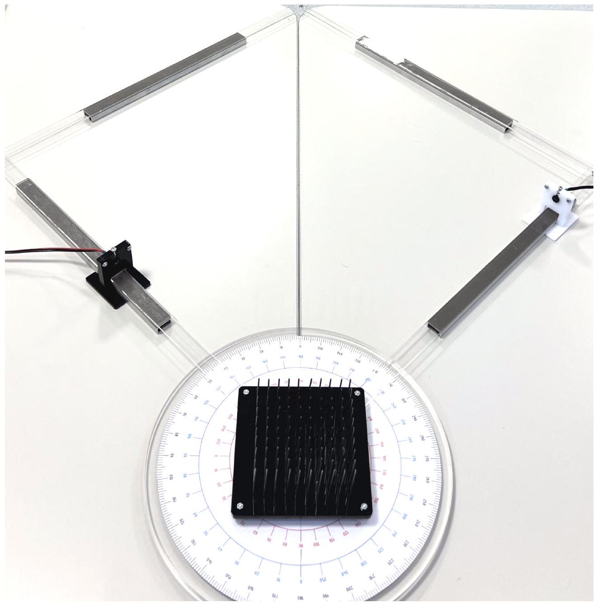
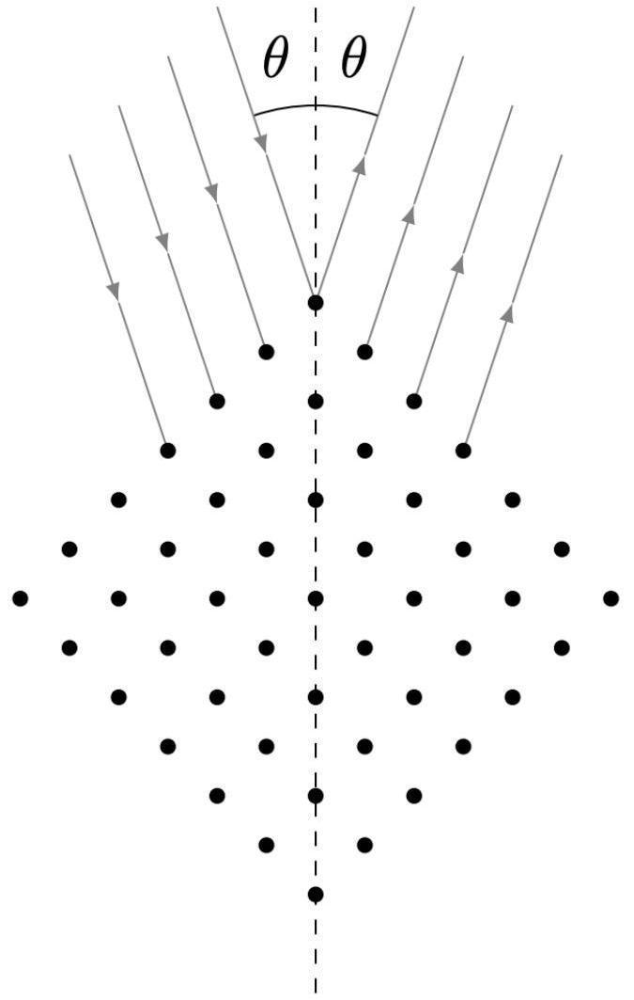
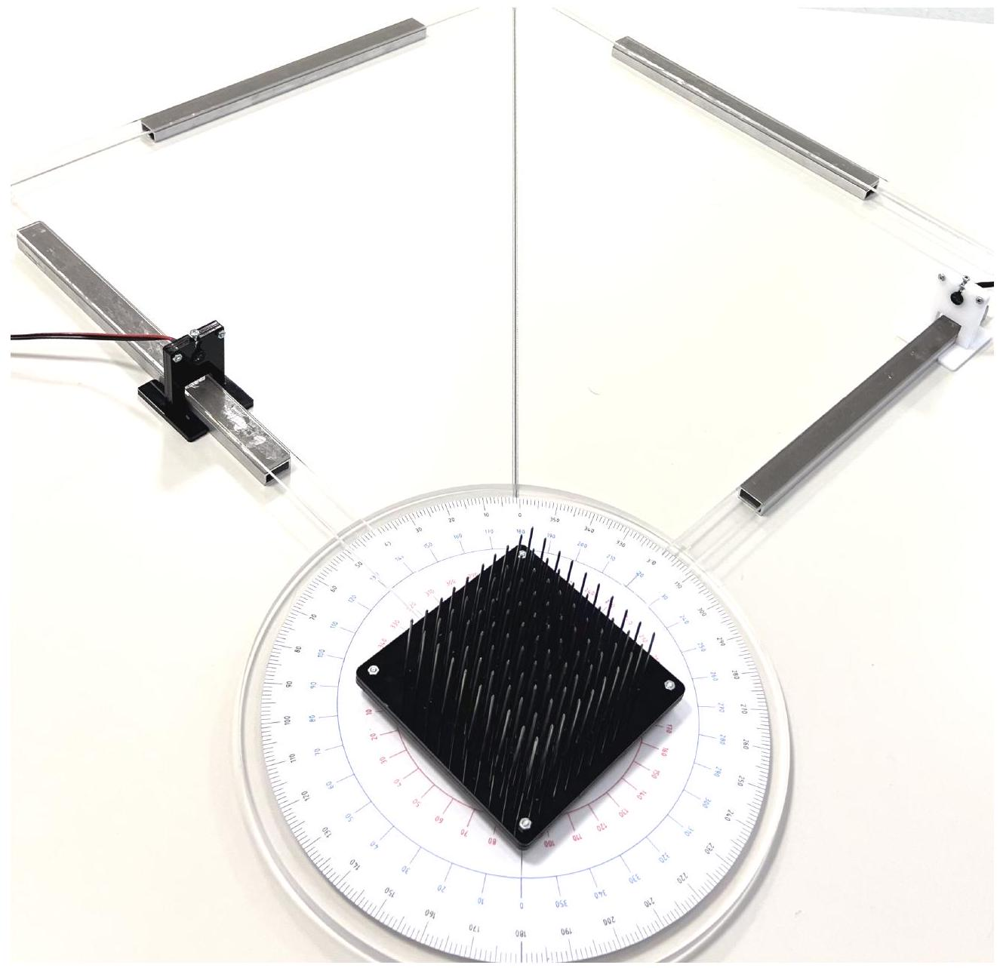
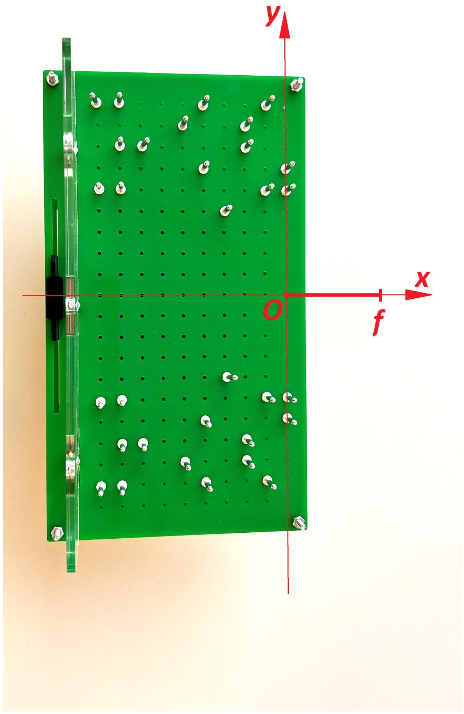
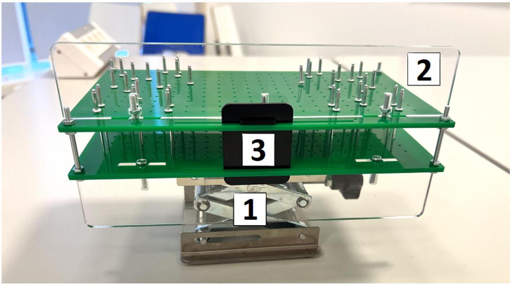

Введение
Как известно, звуком называется явление распространения упругих продольных волн в среде. В более узком смысле будем называть звуком сами эти волны. Звуковая волна, распространяющаяся в пространстве, как и любая другая может быть описана волновым уравнением:

$$
\frac{1}{c^{2}} \frac{\partial^{2} u}{\partial t^{2}}=\Delta u
$$

где $\Delta u=\frac{\partial^{2} u}{\partial x^{2}}+\frac{\partial^{2} u}{\partial y^{2}}+\frac{\partial^{2} u}{\partial z^{2}}, u=u(x, y, z, t)$ - смещение частиц среды от начального положения вдоль направления распространения, $x, y, z$ - пространственные координаты, $t$ - время.

Ультразвуком называется звук, имеющий частоту выше, чем воспринимаемый человеческим ухом. Обычно подразумевается, что частота ультразвука $\geq 20$ кГц.

Напомним, что волновым фронтом называется геометрическое место точек среды, в которых волна имеет одинаковую фазу. Согласно принципу Гюйгенса-Френеля каждый элемент волнового фронта можно рассматривать как центр вторичного возмущения, порождающего вторичные сферические волны, а результирующее колебание в каждой точке пространства будет определяться интерференцией этих волн.

Световые и звуковые волны имеют различную природу, однако описываются одинаковыми уравнениями, и для них могут быть применены одни и те же принципы распространения волн, поэтому мы можем говорить о дифракции и интерференции звука. Данная задача посвящена исследованию этих явлений.

Оборудование:

1. Осциллограф
2. Генератор
3. Приёмник в белой подставке
4. Передатчик в чёрной подставке
5. Двухщелевая пластина
6. Многощелевая пластина
7. Зонные пластины (3 шт.)
8. Подставка для пластин
9. Гониометр (все 4 плеча имеют одинаковую длину)
10. Пластина с гвоздями
11. Фокусирующая структура (выдается по требованию дежурным)
12. Подъёмные столики (3 шт.)
13. Рулетка
14. Линейка 50 см
15. Миллиметровая бумага (3 шт. с указанием соответствующей части в углу листа + 1 шт. запасная)
16. Малярный скотч
17. Защитный экран
18. Тройник BNC-BNC
19. Соединительные провода:
    ○ BNC-BNC - 1 шт.
    ○ BNC-банан - 2 шт.
20. Катушки индуктивности, соединённые последовательно (не указаны на фото)

Оборудование

Примечания:

1. Катушки индуктивности, выданные вам, нужны для снижения уровня низкочастотных помех. При снятии сигнала с приёмника их следует подключить параллельно соответствующему каналу осциллографа. Для уменьшения других шумов может быть полезным использование усреднения сигнала на осциллографе.
2. Не подавайте на передатчик напряжение с амплитудой больше 1 В, т. е. удвоенная амплитуда не должна превышать 2 В.
3. Будьте аккуратны при обращении с гониометром, не поднимайте его и не ставьте на него другое оборудование. Неосторожное обращение может привести к его поломке.
4. Не клейте малярный скотч на транспортир гониометра.
5. Будьте аккуратны при работе с фокусирующей структурой, используемой в части F. Hе переворачивайте и не трясите её, иначе установленные в ней рассеивающие центры могут выпасть из отверстий. Не вытаскивайте рассеивающие центры из пластин и не меняйте их конфигурацию.
6. После выполнения работы миллиметровую бумагу следует подписать, сложить вдвое и сдать вместе с решением. При отсутствии какого-либо из выданных листов пункты, в которых он используется, будут оценены в 0 баллов.
7. Если вы используете запасной лист миллиметровки, подпишите в углу листа часть задачи, в которой он используется.

Часть А. Определение длины волны и скорости звука (1.1 балла)

В этой части вам предстоит найти оптимальную для измерений частоту $f$ и определить соответствующие значения длины волны $\lambda$ и скорости звука $v_{3 в}$.
Расположите передатчик и приёмник на расстоянии примерно 10 см, ориентировав их друг на друга, и зафиксируйте их на одной прямой. Подайте на передатчик синусоидальное напряжение с амплитудой $A \approx 1 \mathrm{~B}$.

A1 ${ }^{0.15}$ Определите частоту $f$, при которой амплитуда напряжения на приёмнике $A_{\text {out }}$ максимальна.
В дальнейшем используйте найденную в пункте А1 частоту $f$ и не меняйте амплитуду напряжения на передатчике.
A2 ${ }^{0.70}$ Придумайте и опишите метод, позволяющий определить длину волны на найденной ранее частоте. Используя его, определите длину волны $\lambda$.
А3 ${ }^{0.25}$ По результатам предыдущих измерений определите скорость звука $v_{3 \mathrm{~B}}$ в воздухе. Сравните найденное значение с теоретическим.
Примечание. Считайте распространение звука адиабатическим процессом. Молярная масса воздуха $\mu=29$ г/моль.
Часть В. Двухщелевая интерференция Юнга (3.3 балла)
Опыт Юнга - это первый вариант двухщелевого опыта, проведённого Томасом Юнгом, который доказал справедливость волновой теории света. Данная часть задачи посвящена подобному опыту, однако исследоваться будет поведение не светового, а звукового фронта в двухщелевой конфигурации.

Закройте скотчем одну из прорезей двухщелевой пластины. Главной осью (ГО) системы назовём прямую, проходящую через центр прорези перпендикулярно её плоскости.

Зафиксируйте на столе миллиметровую бумагу, используемую в части В. Установите на ней пластину с прорезью. Расположите передатчик и приёмник на ГО по разные стороны прорези так, чтобы передатчик находился на расстоянии 20 см от неё, а приёмник - на расстоянии 4 см. При выполнении пунктов В1-В2 не двигайте передатчик, а приёмник перемещайте только в горизонтальной плоскости, не отдаляя от ГО более чем на 8 см.

Миллиметровую бумагу необходимо подписать и сдать вместе с работой.
В1 ${ }^{0.70}$ В горизонтальной плоскости, содержащей приёмник, экспериментально определите точки волнового фронта, содержащего начальное положение приёмника. Отметьте их на миллиметровке и проведите сглаживающую кривую.

В2 ${ }^{0.50}$ Повторите предыдущий пункт для начального расстояния между прорезью и приёмником 10 см.
Вз ${ }^{0.20}$ Сделайте вывод: на каком из использованных расстояний прорезь можно с лучшей точностью считать точечным источником волн?
Снимите скотч с щели. Сейчас главной осью (ГО) системы назовём прямую, проходящую через центр пластины перпендикулярно её плоскости.

Расположите передатчик и приёмник на ГО по разные стороны пластины так, чтобы передатчик находился на расстоянии 20 см от неё, расстояние до приёмника подберите самостоятельно так, чтобы щели можно было с хорошей точностью считать тонкими. Не двигайте передатчик, а приёмник перемещайте только в горизонтальной плоскости перпендикулярно ГО.

В4 ${ }^{1.30}$ Снимите зависимость $A(y)$ амплитуды сигнала на приёмнике от расстояния между приёмником и го (не менее 25 точек). Постройте её график.
Примечание. Вы должны обнаружить не менее одного минимума сигнала.
В5 ${ }^{0.60}$ Используя результаты пункта В4, рассчитайте длину волны $\lambda$. Приведите все теоретические выкладки, используемые в расчётах. Сравните полученное значение с найденным в части A.

Часть С. Многощелевая пластина (2.3 балла)
В этой части вам предстоит исследовать волновой фронт многощелевой пластины. Мы не будем описывать конструкцию пластины, а лишь исследуем её свойства. Главной осью (ГО) системы назовём прямую, проходящую через центр пластины перпендикулярно её плоскости. Известно, что если расположить на ГО точечный источник волн, то волны из-за особого расположения вырезов «сфокусируются» с другой от источника стороны пластины на ГО на расстоянии $b$ от неё, причём для $a$ и $b$ выполнено соотношение, эквивалентное формуле тонкой линзы:

$$
\frac{1}{a}+\frac{1}{b}=\frac{1}{f},
$$

где $f$ - параметр пластины, который назовём фокусным расстоянием.
С1 ${ }^{0.90}$ Снимите зависимость $b(a)$ не менее чем для 5 различных значений $a$. Постройте линеаризованный график зависимости и по нему определите $f$.
Формула (1) эквивалента формуле тонкой линзы, но из неё, однако, не следует, что пластина изменяет исходный волновой фронт так же, как линза. Далее мы исследуем волновой фронт звуковой волны после прохождения через многощелевую пластину, а также фронт, создаваемый самим источником.

Зафиксируйте на столе миллиметровую бумагу, используемую в части С. Установите на ней многощелевую пластину. Расположите передатчик и приёмник на ГО так, чтобы передатчик оказался в её фокусе, а приёмник находился с другой стороны пластины на расстоянии не менее 30 см. При выполнении пунктов С2-СЗ не двигайте передатчик, а приёмник перемещайте только в горизонтальной плоскости, не отдаляя от ГО более чем на 12 см.

Миллиметровую бумагу необходимо подписать и сдать вместе с работой.
С2 ${ }^{0.60}$ В горизонтальной плоскости, содержащей приёмник, экспериментально определите точки волнового фронта, содержащего начальное положение приёмника. Отметьте их на миллиметровке и проведите сглаживающую кривую.

Для сравнения исследуем волновой фронт без пластины.
Поставьте приёмник в его исходное положение, а затем уберите пластину.
С3 ${ }^{\mathbf{0 . 6 0}}$ В горизонтальной плоскости, содержащей приёмник, экспериментально определите точки волнового фронта, содержащего начальное положение приёмника. Отметьте их на миллиметровке и проведите сглаживающую кривую.

Будем считать волновой фронт плоским, если проекции расстояний между его точками на ГО не превышают длины волны $\lambda$.
C4 ${ }^{0,20}$ Сделайте вывод: можно ли считать звуковой фронт, прошедший через пластину, плоским, а источник точечным? Обоснуйте свой ответ.
Часть D. Зонные пластины (6.9 баллов)

Зонной пластиной называется приспособление для фокусировки света, звука или других волн. Её принцип действия основан на дифракции в ближней зоне: в пластине вырезаны несколько нечётных зон Френеля, начиная с первой. Рассмотрим подробнее теорию дифракции Френеля.

Пусть перед не пропускающим звук экраном расположен точечный источник звука на расстоянии $a$ от него. Длина волны, испускаемой источником, равна $\lambda$. Как известно, если в экране вырезать только нечётные зоны Френеля, то прошедшие через них волны будут интерферировать, образуя максимум интенсивности с противоположной от источника стороны экрана. Расстояние $b$ между этим максимумом и экраном определяется радиусами зон Френеля.

Главной осью (ГО) системы назовём прямую, проходящую через центр пластины перпендикулярно её плоскости.
D1 ${ }^{0,40}$ Для описанной ситуации получите выражение для внешнего радиуса $r(m) m$-ой зоны Френеля ( $m=1,2, \ldots$ ) в параксиальном приближении. Ответ выразите через $m, a, b$ и $\lambda$.

D2 ${ }^{0,20}$ Покажите, что для пластины выполнено следующее соотношение:

$$
\frac{1}{a}+\frac{1}{b}=\frac{1}{f}
$$

где $f$ - параметр пластины, называемый фокусным расстоянием. Выразите $f$ через $m, r(m), \lambda$.
Зафиксируйте на столе миллиметровую бумагу, используемую в части D.
Миллиметровую бумагу необходимо подписать и сдать вместе с работой.
D3 ${ }^{1.50}$ Для каждой из пластин снимите зависимость $b(a)$ не менее чем для 5 различных значений $a$. Постройте линеаризованные графики зависимости на одной миллиметровке и по ним определите $f$ для каждой пластины.

D4 ${ }^{0,80}$ Для каждой пластины напрямую измерьте $r(m)$ для всех $m$ и на их основе рассчитайте $f$, используя результаты пункта D2. Какой метод определения $f$ является более точным?

Примечание. Если вам потребуется строить в этом пункте несколько графиков, постройте их на одной миллиметровке.
В прошлой части задачи мы рассматривали поведение фронта волны при значительном удалении приёмника от многощелевой пластины ( $\geq 30$ см). Сейчас же мы исследуем фронт волны вблизи зонной пластины (< 30 см).

Расположите передатчик и приёмник на ГО зонной пластины с наименьшим фокусным расстоянием так, чтобы передатчик оказался в её фокусе, а приёмник находился с другой стороны пластины на расстоянии 5 см от неё. При выполнении пунктов D5-D6 не двигайте передатчик, а приёмник перемещайте только в горизонтальной плоскости, не отдаляя от ГО более чем на 8 см.

Введём $\varphi(y)$ - фазу сигнала приёмника в точке, отстоящей от ГО на $y$. Обозначим $\Delta \varphi(y)=\varphi(y)-\varphi(0)$.
D5 ${ }^{1.50}$ Снимите зависимость $\Delta \varphi(y)$ (не менее 20 точек). Затем уберите линзу и, не меняя положения передатчика, снимите аналогичную зависимость $\Delta \varphi_{0}(y)$ (не менее 20 точек). Постройте эти зависимости на одном графике.

D6 ${ }^{2,20}$ Повторите действия пункта D5 для расстояний между пластиной и приёмником 15 см и 25 см.
D7 ${ }^{0.30}$ На каком из исследованных расстояний фронт волны с наилучшей точностью можно считать плоским в области $|y|<5$ см?
Часть Е. Брэгговская дифракция (4.2 балла)

Рассмотрим рассеяние рентгеновского излучения на периодической структуре, например, кристаллической решётке. При определённых углах падения и отражения плоского фронта наблюдаются максимумы интенсивности рассеянной волны, что связано с интерференцией волн от разных рассеивающих центров. Описанное явление называется брэгговской дифракцией, названной в честь У. Брэгга, впервые обнаружившего данное явление. Аналогичные процессы можно наблюдать и для ультразвуковых волн. В задаче в роли кристалла выступает решётка из гвоздей с некоторым шагом $d$. Обозначим угол падения волны на решётку $\theta$, угол отражения примем равным углу падения.

Отражение лучей от кристаллической решётки

E1 ${ }^{0.60}$ Получите выражение, связывающее $\theta, \lambda$ и $d$, при углах $\theta$, соответствующих главным максимумам интенсивности рассеянной волны.
Примечание. Рассмотрите сдвиг фаз при отражении волны от разных рассеивающих центров.
Установите модель кристалла в центре диска гониометра, как показано на фото. Расположите передатчик и приёмник на разных плечах гониометра. Поставьте защитный экран между плечами гониометра так, чтобы предотвратить прямое попадание сигнала передатчика на приёмник. При сборке установки учтите, что ультразвук хорошо отражается от твёрдых поверхностей, в том числе от стен и защитного экрана.

Схема измерений (на фото отсутствует защитный экран)

E2 ${ }^{1.30}$ Измерьте зависимость амплитуды сигнала на приёмнике от угла $\theta$ в диапазоне от $20^{\circ}$ до $70^{\circ}$. Постройте её график. Укажите положение максимумов, обусловленных брэгговским отражением и объясните их количество.

E3 ${ }^{0.20}$ Используя выражение из пункта E1, вычислите шаг решётки $d$.

Рассмотрим теперь другое падение лучей на решётку. Пусть решётка повернута на $45^{\circ}$ относительно начального положения (см. рисунок).

Отражение лучей от кристаллической решётки

E4 ${ }^{0.60}$ Получите для этого случая выражение, связывающее $\theta, \lambda$ и $d$, при углах $\theta$, соответствующих главным максимумам интенсивности рассеянной волны.

Поверните модель кристалла на 45°, как показано на фото.

Схема измерений (на фото отсутствует защитный экран)

E5 ${ }^{1.30}$
Измерьте зависимость амплитуды сигнала на приёмнике от угла $\theta$ в диапазоне от $20^{\circ}$ до $70^{\circ}$. Постройте её график. Укажите положение максимумов, обусловленных брэгговским отражением и объясните их количество.

E6 ${ }^{0.20}$
Используя выражение из пункта E4 вычислите шаг решётки $d$.

Часть F. Непериодическая фокусирующая структура (2.2 балла)
В предыдущей части рассматривалась интерференция волн от периодических рассеивающих центров, приводящая к явлению брэгговской дифракции. В этой части задачи мы рассмотрим непериодическую структуру, позволяющую благодаря дифракции на центрах, расположенных особым образом, «сфокусировать» плоский волновой фронт на некотором расстоянии $f$ от её края (см. рис. 4), которое мы будем называть фокусным. Потребуем, чтобы волны, рассеиваемые на центрах предполагаемой структуры, приходили в фокус, отличаясь по фазе на $2 \pi m$, где $m \in \mathbb{Z}$.

Введём прямоугольную систему координат $O x y$ с центром в фокусе, как показано на фото. Обратите внимание, что ось $O x$ смещена относительно оси симметрии пластины. В обозначения рис. 5 будем называть 1 и 2 нижней и верхней шторкой соответственно, 3 - центральной шторкой.

Примечание. Следите за тем, чтобы нижние концы металлических стержней (рассеивающих центров) попадали в соответствующие отверстия в нижней пластине. Если вы нарушили исходную конфигурацию центров, вы можете восстановить её по рис. 4.

Рассеивающая структура (вид сверху)

Рассеивающая структура (вид сбоку)

Пусть в точку с координатами $(x, y)$ помещён рассеивающий центр так, что при рассеянии на нём волна приходит в фокус со сдвигом фаз $2 \pi m$ относительно нерассеянного волнового фронта.

F1 ${ }^{0.90}$ Получите уравнение кривой в координатах $O x y$, содержащей такие точки. В ответе используйте $m, f$ и $\lambda$.

Вам выдана структура, в которой рассеивающие центры расположены на кривых, задаваемых полученным выражением для нескольких значений $m$.

Для создания плоского волнового фронта будем использовать белую зонную пластину. Поместите передатчик в её фокус на расстоянии около 70 см от пластины на подъёмном столике расположите структуру так, чтобы центральная шторка была обращена к источнику. Приёмник расположите с другой стороны структуры. Отрегулируйте расположение всех элементов установки так, чтобы ось $O x$ структуры совпала с осью, проходящей через передатчик, центр зоннои пластины и приемник. на этои же оси должен находится центр центральнои шторки, чтобы уменьшить амплитуду сигнала, попадающего на приемник напрямую с передатчика.

Примечания:

1. Учтите, что вы можете наблюдать на приёмнике стоячую волну. Амплитуда сфокусированной волны может быть сравнима с амплитудой стоячей волны.
2. Считайте известным, что $f<20 \mathrm{см}$.

F2 ${ }^{1.30}$ Экспериментально определите фокусное расстояние структуры $f$. Опишите, как вы детектируете максимум сигнала. Качественно зарисуйте зависимость амплитуды сигнала от координаты $x$ вблизи фокуса ( $x \in[f-3 \mathrm{~cm}, f+3 \mathrm{~cm}]$ ).
