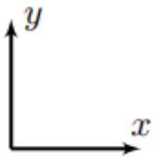
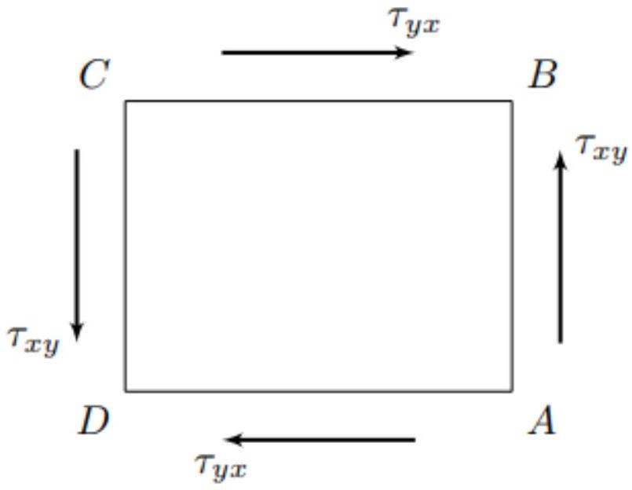
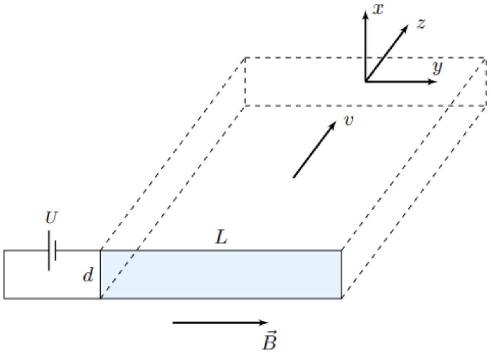
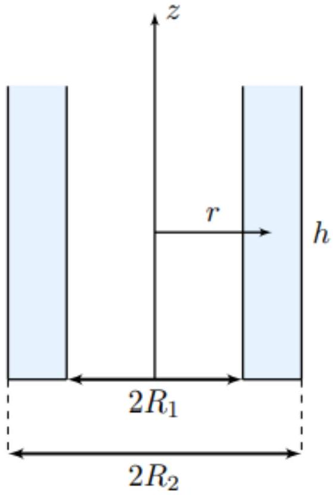
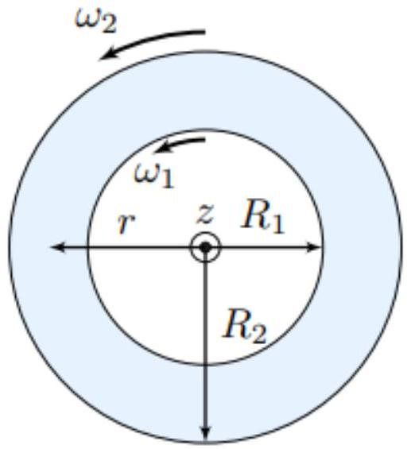
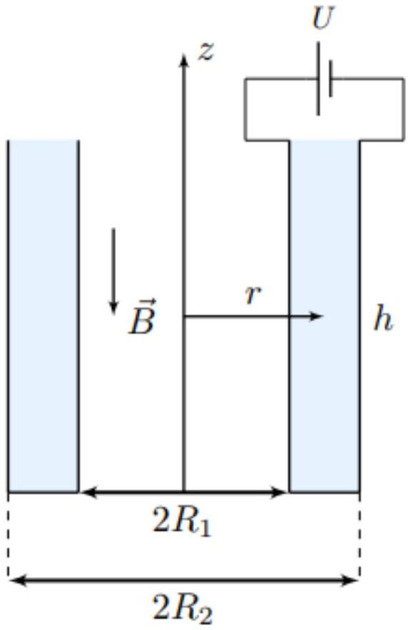

Взаимодействие электромагнитного поля с немагнитными жидкостями в случае высокой проводимости жидкости хорошо изучено в рамках магнитной гидродинамики (МГД). В данном случае можно пренебречь электрическими эффектами по сравнению с магнитными. Изученные в рамках МГД эффекты давно нашли широкое техническое применение и используются по сей день. Например, МГД устройства применяются в водных судах или для конструкций металлургического перемешивания.

Менее изученным является противоположный случай взаимодействия электромагнитного поля с немагнитными жидкостями в случае низкой проводимости жидкости. В этом случае можно пренебречь магнитными эффектами по сравнению с электрическими.
Данная область науки получила название электрогидродинамики (ЭГД) и активно развивается около 70 последних лет. Она нашла широкое техническое применение в современном мире. На её основе построены струйный принтеры, а также они используются в ионизаторах, для изготовления тонких полимерных нитей и капилляров.

Наиболее интересным для исследований с научной точки зрения является случай промежуточных значений удельной проводимости, когда необходимо учитывать как электрические, так и магнитные эффекты, возникающие при движении жидкости в электромагнитном поле. Данное направление науки называется электромагнитной гидродинамикой (ЭМГД).

В рамках данной задачи вам предлагается изучить динамику движения жидкости внутри плоского и цилиндрического конденсаторов, помещённых в однородное магнитное поле.

Точное решение задач ЭМГД является очень сложным. В рамках данной задачи примем следующую модель:

- Все внешние электромагнитные поля являются стационарными;
- Все рассматриваемые движения являются стационарными;
- Собственным магнитным полем, создаваемым токами, текущими в жидкости, можно пренебречь, т.е магнитное поле во всех точках пространства равно внешнему магнитному полю $\vec{B}(\vec{r})$;
- Внешнее магнитное поле $\vec{B}(\vec{r})$ создано токами, текущими вне жидкости;
- Во всех точках жидкости объёмная плотность свободного заряда равна нулю.

Считайте известными и постоянными все следующие величины:

- Плотность жидкости $\rho$;
- Удельная проводимость жидкости $\sigma$;
- Коэффициент динамической вязкости жидкости $\eta$;
- Магнитная проницаемость жидкости $\mu \approx 1$.

Для решения задачи вам понадобится корректная формулировка закона вязкости Ньютона.
Рассмотрим грань $A B$ бесконечно малого прямоугольного параллелепипеда жидкости, лежащую в плоскости $y z$ прямоугольной системы координат $x y z$. Касательным напряжением $\tau_{x y}$, действующим на рассматриваемую грань параллелепипеда, называется отношение силы, действующей на данное сечение параллелепипеда в направлении оси $y$, к площади поверхности рассматриваемой грани. Здесь первый индекс обозначает направление нормали к поверхности грани, а второй индекс - направление действия касательного напряжения.
Из закона сохранения момента импульса для вещества следует, что касательное напряжение $\tau_{y x}$, действующее на грань $B C$ данного параллелепипеда, лежащую в плоскости $x z$, в направлении оси $x$, равно величине $\tau_{x y}$ :

$$
\tau_{x y}=\tau_{y x} .
$$

Здесь направления координатных осей $x$ и $y$ определяются направлениями внешних нормалей к граням $A B$ и $B C$ параллелепипеда.
При этом соответствующие касательные напряжения, действующие на противоположные грани $C D$ и $A D$ параллелепипеда, должны быть направлены противоположно, поскольку для них направления нормали являются противоположными.

Закон вязкости Ньютона гласит, что касательное напряжение $\tau_{x y}=\tau_{y x}$ пропорционально скорости деформации сдвига, что выражается следующей формулой:

$$
\tau_{x y}=\tau_{y x}=\eta\left(\frac{\partial v_{x}}{\partial y}+\frac{\partial v_{y}}{\partial x}\right) .
$$

Здесь частные производные вычисляются в один и тот же момент времени.
Данное выражение применимо в любой системе отсчёта при условии, что проекции скорости $v_{x}$ и $v_{y}$ и координаты ( $x, y$ ) вычисляются относительно выбранной системы отсчёта.

Часть А. Уравнения ЭМГД (0.8 балла)
Ключевым соотношением в ЭМГД является связь плотности тока $\vec{j}(\vec{r})$ с величинами удельной проводимости $\sigma$, напряжённости электрического поля $\vec{E}(\vec{r})$, индукции магнитного поля $\vec{B}(\vec{r})$, а также скорости движения жидкости $\vec{v}(\vec{r})$.
Вам известен закон Ома в дифференциальной форме:

$$
\vec{j}=\sigma \vec{E} .
$$

Этот закон применим только для неподвижных проводников. Если же проводник движется в магнитном поле, то данное уравнение становится неприменимым, а уравнение, описывающее распределение токов в проводнике, требует учёта взаимодействия движущихся в проводнике зарядов с магнитным полем.
В общем случае величина плотности тока в проводнике определяется выражением:

$$
\vec{j}=\sigma\left\langle\frac{\vec{F}}{q}\right\rangle,
$$

где $\vec{F}$ - сила, действующая на заряд $q$ со стороны электромагнитного поля. Данная сила должна уравновешиваться силой, действующей на заряд $q$ со стороны вещества проводника. Здесь усреднение проводится по всем зарядам, участвующим в упорядоченном движении.
Считайте известным, что скорости зарядов относительно проводников являются крайне малыми.

А1 ${ }^{0.30}$ Пусть $\vec{v}$ - скорость жидкости в некоторой точке пространства. Чему равна плотность тока $\vec{j}$ в данной точке пространства? Ответ выразите через $\sigma, \vec{E}$, $\vec{B}_{n} \vec{v}$.

A2 ${ }^{0.20}$ Определите силу $\overrightarrow{f_{B}}$, действующих на единицу объёма жидкости со стороны магнитного поля. Ответ выразите через $\sigma, \vec{E}, \vec{B}$ и $\vec{v}$.
А3 ${ }^{0.30}$ Покажите, что если объёмная плотность свободного заряда в любой точке жидкости равна нулю, то и объёмная плотность полного заряда также равна нулю в любой точке жидкости.

Часть В. Течение жидкости в плоском конденсаторе (3.3 балла)
Рассмотрим плоский конденсатор с расстоянием $d$ между пластинами, подключенный к источнику постоянного напряжения $U$. Ширина пластин конденсатора равна $L \gg d$, а их длина также во много раз больше расстояния $d$ между обкладками.
Введём систему координат $x y z$ так, как показано на рисунке. Ось $x$ направлена перпендикулярно обкладкам, а её начало расположено посередине между обкладками. Ось $y$ направлена вдоль стороны $L$ обкладок конденсатора, а ось $z$ дополняет тройку $x y z$ до правой.
Система помещена в однородное магнитное поле с индукцией $\vec{B}=B \vec{e}_{y}$.
В пространстве между обкладками стационарно течёт проводящая жидкость плотностью $\rho$ с проводимостью $\sigma$ и коэффициентом динамической вязкости $\eta$.

При решении данной части задачи используйте следующую модель:

- Напряжённость $\vec{E}$ электростатического поля можно считать однородной во всей области между обкладками конденсатора;
- Скорость $v$ жидкости в каждой точке пространства между обкладками направлена вдоль оси $z$;
- В силу соотношения $L \gg d$ конденсатор можно считать бесконечно широким;
- Считайте давление жидкости одинаковым в каждой точке пространства между обкладками и равным давлению на входе и выходе из пространства между обкладками.

В1 ${ }^{0.30}$ Из общефизических соображений найдите, чему равна сила $\overrightarrow{f_{E}}$, действующая на единицу объёма жидкости со стороны электростатического поля? Ответ обоснуйте.

В2 ${ }^{1.00}$ Покажите, что зависимость скорости жидкости от координаты $x$ можно представить в виде:

$$
v(x)=A \cosh \omega x+B \sinh \omega x+C .
$$

Определите $A, B, C$ и $\omega$. Ответы выразите через $\sigma, \eta, U, B$ и $d$.
Вз ${ }^{0.20}$ Определите максимальную скорость течения жидкости $v_{\text {max }}$. Ответ выразите через $\sigma, \eta, U, B$ и $d$.
В4 ${ }^{0.40}$ Получите зависимость $v(x)$ для случая слабого магнитного поля $(B d \ll \sqrt{\sigma / \eta})$. Определите максимальное значение скорости $v_{\text {max }}$. Ответы выразите через $\sigma, \eta, U, B, d$ и $x$.
Постройте качественный график полученной зависимости $v(x)$. Отметьте на графике все важные точки.
В5 ${ }^{0.30}$ Определите максимальное значение скорости жидкости $v_{\text {max }}$ для случая сильного магнитного поля $(B d \gg \sqrt{\sigma / \eta})$. Ответ выразите через $\sigma, \eta, U, B$ и $d$.
Постройте качественный график зависимости $v(x)$ для случая сильного магнитного поля. Отметьте на графике все важные точки.
В6 ${ }^{0.30}$ Получите зависимость массового расхода жидкости $Q$ через поперечное сечение $x y$ конденсатора. Ответ выразите через $\rho, \sigma, \eta, U, B, d$ и $L$.
В7 ${ }^{0.40}$ Получите приближения для $Q(B)$ в случаях слабого и сильного магнитного полей ( $B d \ll \sqrt{\sigma / \eta}$ и $B d \gg \sqrt{\sigma / \eta}$ соответственно). Ответы выразите через $\rho, \sigma, \eta, U, B, d$ и $L$.

Во всех остальных частях задачи рассматривается конденсатор, состоящий из двух очень длинных коаксиальных цилиндрических обкладок. Радиус внутренней обкладки равен $R_{1}$, а радиус внешней - $R_{2}$. Высота цилиндров одинакова и равна $h \gg R_{1}, R_{2}$. Основания обкладок совпадают. Пространство между обкладками заполнено проводящей жидкостью плотностью $\rho$ с проводимостью $\sigma$ и коэффициентом динамической вязкости $\eta$. Расстояние от оси цилиндров до произвольной точки в жидкости обозначим за $r$. Также введём ось $z$, направленную вдоль оси цилиндров.

## Часть С. Жидкость в цилиндрическом конденсаторе в отсутствие электромагнитного поля (1.5 балла)

Для начала рассмотрим движение жидкости в отсутствие электромагнитного поля.
Пусть внутренняя и внешняя обкладки вращаются с постоянными угловыми скоростями, проекции которых на ось $z$ равны $\omega_{1}$ и $\omega_{2}$ соответственно.
В установившемся режиме траектории элементов жидкости представляют собой окружности, перпендикулярные оси $z$, центры которых расположены на последней.

С1 ${ }^{1.30}$ Определите проекции на ось $z$ моментов сил $M_{1}$ и $M_{2}$, прикладываемых к внутренней и внешней обкладкам соответственно сторонними силами для поддержания их стационарного движения. Ответ выразите через $\eta, \omega_{1}, \omega_{2}, R_{1}, R 2$ и $h$.

С2 ${ }^{0.20}$ Получите зависимость скорости движения жидкости $v(r)$ от расстояния $r$ до оси цилиндров. Ответ выразите через $\omega_{1}, \omega_{2}, R_{1}, R_{2}$ и $r$.

Часть D. Уравнения движения жидкости в цилиндрическом конденсаторе (0.9 балла)
Теперь рассмотрим движение жидкости в конденсаторе при наличии электромагнитного поля. Конденсатор подключен к источнику постоянного напряжения $U$, причём потенциал внутренней обкладки выше, чем потенциал внешней. Система помещена в однородное магнитное поле с индукцией $\vec{B}$, направленной противоположно оси $z$ (т.е. $\vec{B}=-\vec{e}_{z} B$ ). Обе обкладки конденсатора закреплены и не могут вращаться.
При решении задачи используйте цилиндрическую систему координат с единичными ортами $\vec{e}_{r}, \vec{e}_{\varphi}$ и $\vec{e}_{z}$, образующими правую тройку.
В установившемся режиме траектории элементов жидкости представляют собой окружности, перпендикулярные оси $z$, центры которых расположены на последней.
Описание данной части задачи также является описанием к частям E и F .

D2 ${ }^{0,20}$ Определите силу $\vec{f}_{B}$, действующую на единицу объёма жидкости со стороны магнитного поля. Ответ выразите через $\sigma, U, r, B$, скорость движения жидкости $v(r), \vec{e}_{r}$ и $\vec{e}_{\varphi}$.

D3 ${ }^{0.40}$ Из общефизических соображений укажите направление силы $\overrightarrow{f_{E}}$, действующей на единицу объёма жидкости со стороны электростатического поля. В качестве ответа укажите единичный вектор, коллинеарно которому направлена эта сила. Ответ обоснуйте.

Часть Е. Течение при малых скоростях (2.0 балла)
Для начала рассмотрим случай течения жидкости при малых скоростях $v$, удовлетворяющих сильному неравенству:

$$
v \ll \frac{E}{B} .
$$

Данный вид движения реализуется в слабых магнитных полях.
Е1 ${ }^{1.60}$ Получите зависимость скорости движения жидкости $v(r)$ от расстояния $r$ до оси цилиндров. Ответ выразите через $\sigma, \eta, U, B, R_{1}, R_{2}$ и $r$.
E2 ${ }^{0.40}$ Пусть радиус внутренней обкладки равен $R$, а радиус внешней обкладки в несколько (порядка единицы) раз больше. Оцените максимальную величину индукции магнитного поля $B_{\text {max }}$, при которой полученные вами результаты ещё можно считать применимыми. Ответ выразите через $\sigma, \eta, U$ и $R$.

Часть F. Течение в очень сильном магнитном поле (1.5 балла)
Пусть радиусы обкладок вновь равны $R_{1}$ и $R_{2}$, а соотношение между ними может быть произвольным. Индукция магнитного поля, в которое помещён конденсатор, принимает очень большие значения в данной части задачи.

F1 ${ }^{0.90}$ Получите зависимость $v(r)$ в случае сильного магнитного поля вдали от обкладок конденсатора. Ответ выразите через $\sigma, \eta, U, B, R_{1}, R_{2}$ и $r$.
F2 ${ }^{0.60}$ Постройте качественный график зависимости $v(r)$ для всех значений $r$ между обкладками конденсатора в случае сильного магнитного поля. Указывать характерные значения при построении графика не обязательно.

T Механика Вязкость Гидродинамика Сборы XY Y 2024 Электромагнитная гидродинамика

- Website in English

2020 - Мы те, кого должны превзойти.
