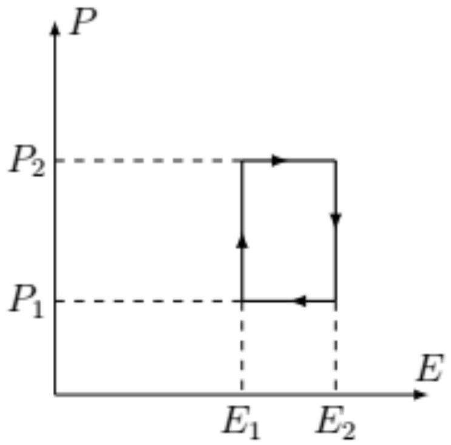
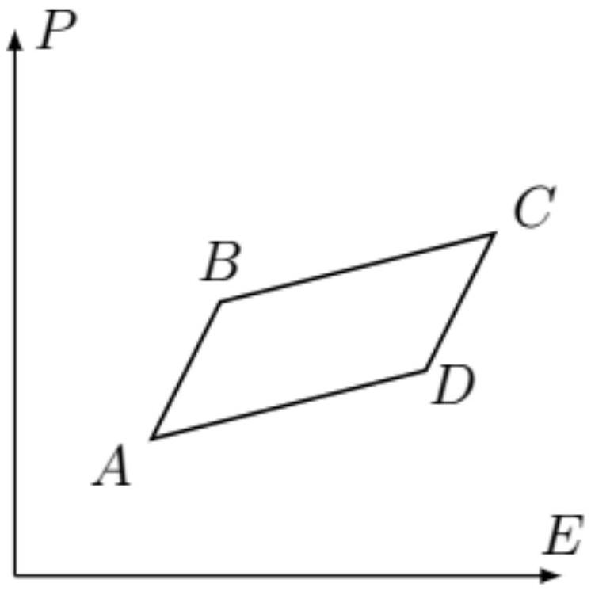

Сегнетоэлектриками называются вещества, при достаточно низкой температуре обладающие ненулевой электрической поляризацией при нулевом внешнем электрическом поле. В этом отношении сегнетоэлектрики аналогичны ферромагнетикам, у которых есть ненулевой магнитный момент без приложенного магнитного поля.

В этой задаче будут рассматриваться термодинамические свойства сегнетоэлектриков, в частности изменение температуры при изменении электрического поля (так называемый электрокалорический эффект). Этот эффект позволяет использовать сегнетоэлектрические пленки для охлаждения поверхности (см. рис.).

Состояние сегнетоэлектрика характеризуется поляризацией $\vec{P}$ (дипольным моментом единицы объема его вещества), а также вектором электрической индукции $\vec{D}$ и напряженностью электрического поля $\vec{E}$. Далее во всей задаче рассматривается плоский образец сегнетоэлектрика, поляризация которого однородна и все время направлена вдоль одной и той же оси, поэтому вместо векторов можно использовать скалярные величины $P, D, E$ - проекции на эту ось.

Считайте известным, что изменение объемной плотности электрической энергии (включающей в себя энергию электрического поля и энергию поляризованного вещества) имеет вид

$$
d w=E d D .
$$

Будем рассматривать сегнетоэлектрик постоянного объема $V$, так что он не совершает механической работы. Тогда изменение его внутренней энергии задается выражением

$$
d U=\delta Q+V E d D
$$

где $\delta Q$ - подведенное в процессе тепло.
Математическое дополнение

Рассмотрим функцию двух переменных $f(x, y)$. Частной производной функции называется производная этой функции по одному из ее аргументов при фиксированном втором аргументе. При вычислениях в термодинамике важно помнить не только по какой переменной производится дифференцирование, но и какая величина остается постоянной. Эту величину обозначают нижним индексом. Так частная производная функции $f$ по $x$ при фиксированном $y$ обозначается как

$$
\left(\frac{\partial f}{\partial x}\right)_{y} .
$$

Значение производной зависит от того, какая именно величина остается постоянной. В качестве примера рассмотрим некоторое количество идеального одноатомного газа, давление которого является функцией объема и давления. Тогда производные давления по объему при постоянной температуре и при постоянной энтропии $S$ (т.е. в адиабатическом процессе) будут различаться:

$$
\left(\frac{\partial p}{\partial V}\right)_{T} \neq\left(\frac{\partial p}{\partial V}\right)_{S} .
$$

Пусть некоторая величина $z=z(x, y)$ является функцией двух других. Из этого уравнения можно выразить величины $x=x(y, z)$ и $y=y(x, z)$. Будем считать, что такое выражение единственно. Тогда существует следующее соотношение между частными производными:

$$
\left(\frac{\partial x}{\partial y}\right)_{z}\left(\frac{\partial y}{\partial z}\right)_{x}\left(\frac{\partial z}{\partial x}\right)_{y}=-1 .
$$

Отметим также, что при дифференцировании при тех же зафиксированных переменных справедливо равенство

$$
\left(\frac{\partial x}{\partial y}\right)_{z}=\frac{1}{(\partial y / \partial x)_{z}} .
$$

Часть А. Электрокалорический эффект в сегнетоэлектриках (5.5 баллов)
В этой части эффект изменения температуры сегнетоэлектрика под действием электрического поля исследуется из чисто термодинамических соображений.
А1 ${ }^{0.50}$ Рассмотрим один моль идеального газа. Рассматривая в качестве трех величин $x, y, z$ его давление $p$, объем $V$ и температуру $T$, проверьте тождество (1).

Далее в этой части будем рассматривать образец сегнетоэлектрика, имеющий вид тонкой пластинки, помещенной между обкладками плоского конденсатора. Объем сегнетоэлектрика $V$ можно считать постоянным, поэтому его состояние характеризуется поляризацией $P$ и температурой $T$. На сегнетоэлектрик можно воздействовать, подводя или отводя от него тепло или прикладывая напряжение (создавая тем самым электрическое поле).

Пусть с сегнетоэлектриком производится цикл (см. рис.), в координатах $E, P$. Определите полное количество теплоты, полученное сегнетоэлектриком за цикл. Выразите ответ через $E_{1}, E_{2}, P_{1}, P_{2}, V$.

Теперь рассмотрим цикл ABCD (см. рис.), имеющий вид бесконечно малого параллелограмма. Укажите направление обхода цикла, при котором полученное сегнетоэлектриком за цикл количество теплоты будет положительным. Ответ обоснуйте.

Следующие части задачи посвящены доказательству тождества

$$
\left(\frac{\partial S}{\partial E}\right)_{T}=\left(\frac{\partial P}{\partial T}\right)_{E},
$$

где $S$ - энтропия единицы объема сегнетоэлектрика. Для этого рассмотрим цикл из пункта $A 3$, считая стороны параллелограмма бесконечно малыми участками изотерм и адиабат. При этом то, какие из участков являются изотермами, а какие - адиабатами, зависит от параметров вещества. Так как наклон участка $B C$ меньше наклона $A B, B C$ будет изотермой при условии

$$
\left(\frac{\partial P}{\partial E}\right)_{T}<\left(\frac{\partial P}{\partial E}\right)_{S} .
$$

Будем рассматривать различные случаи. Для определенности везде дальше считаем, что $(\partial P / \partial T)_{E}<0$.
А4 ${ }^{0.50}$ Пусть $B C$ и $A D$ - изотермы, причем на участке $B C$ температура сегнетоэлектрика равна $T_{1}$, а на участке $A D-T_{2},\left|T_{1}-T_{2}\right| \ll T_{1}$. Выразите полученное сегнетоэлектриком за весь цикл количество теплоты $Q$ через $V,(\partial P / \partial T)_{E}$ (производная поляризации при постоянном электрическом поле), $T_{1}$, $T_{2}$ и разность электрических полей в точках $D$ и $A: d E=E_{D}-E_{A} \approx E_{C}-E_{B}$.

А5 ${ }^{0.50}$ В условиях предыдущего пункта найдите тепло $Q_{+}$, которое подводится к сегнетоэлектрику за цикл. Укажите, на какой из изотерм тепло подводится, а на какой - отводится. Выразите ответ через $V, T_{1}, T_{2}, \Delta E,(\partial S / \partial E)_{T}$ (производная энтропии по электрическому полю при постоянной температуре).

А6 ${ }^{0.30}$ Используя формулу для коэффициента полезного действия для цикла Карно, а также результаты $A 4$, $A 5$, докажите соотношение (2). Считайте, что полное количество теплоты, полученное сегнетоэлектриком за цикл, совпадает с полезной работой.

Пусть теперь изотермами являются отрезки $A B$ (температура $T_{1}$ ) и $C D$ (температура $T_{2}$ ).
А7 ${ }^{0.60}$ Выразите полученное сегнетоэлектриком за весь цикл количество теплоты $Q$ через объем $V$, изменение электрического поля на изотерме $d E=E_{B}-E_{A} \approx E_{C}-E_{D}$, температуры $T_{1}, T_{2}$ и частные производные $(\partial E / \partial T)_{P},(\partial P / \partial E)_{T}$. Примечание: вам может потребоваться связать между собой изменение электрического поля на изотерме с изменением поляризации с помощью частной производной при постоянной температуре.

А8 ${ }^{0.50}$ Используя тождество (1) для тройки переменных $E, P, T$, выразите теплоту $Q$ из предыдущего пункта через $V, T_{1}, T_{2} d E$ и $(\partial P / \partial T)_{E}$.
А9 ${ }^{0.50}$ Запишите выражение для тепла $Q_{+}$, подведенного в цикле. Выразите ответ через $V, T_{1}, T_{2}, \Delta E,(\partial S / \partial E)_{T}$ (производная энтропии по электрическому полю при постоянной температуре).

А10 ${ }^{0.30}$ Используя результаты $A 8, A 9$ и формулу для коэффициента полезного действия цикла Карно, докажите для рассматриваемого случая формулу (2). Определение полезной работы такое же, как в $A 6$.

А11 ${ }^{0.70}$ Используя формулу (2) (ее можно применять без доказательства) и соотношение (1) для тройки переменных $S, T, E$, получите формулу

$$
\left(\frac{\partial T}{\partial E}\right)_{S}=-\frac{T}{C_{E}}\left(\frac{\partial P}{\partial T}\right)_{E} .
$$

Здесь $C_{E}$ - теплоемкость единицы объема сегнетоэлектрика при постоянном электрическом поле

$$
C_{E}=\left(\frac{\delta Q}{d T}\right)_{E} .
$$

Эта формула показывает, что можно изменить температуру сегнетоэлектрика, адиабатически изменяя электрическое поле.
Часть В. Микроскопическая модель сегнетоэлектрика (4.5 балла)
Для того, чтобы достичь наиболее сильного эффекта изменения температуры сегнетоэлектрика, нужно использовать вещество с большим значением производной $(\partial P / \partial T)_{E}$. Оказывается, что эта производная особенно велика вблизи точки фазового перехода. Пока температура сегнетоэлектрика выше температуры фазового перехода, его спонтанная поляризация равна нулю, а когда ниже - возникает спонтанная поляризация.

Рассмотрим следующую модель сегнетоэлектрика. Пусть сегнетоэлектрик содержит ионы кристаллической решетки, которые находятся в эффективном потенциале

$$
U(x)=U_{0}\left(\frac{a_{2}}{2}\left(\frac{x}{x_{0}}\right)^{2}-\frac{a_{4}}{4}\left(\frac{x}{x_{0}}\right)^{4}+\frac{a_{6}}{6}\left(\frac{x}{x_{0}}\right)^{6}\right)
$$

Для простоты рассматривается одномерная задача, поэтому потенциал зависит только от одной координаты иона, которая отсчитывается от его положения равновесия. Здесь $U_{0}$ - характерное значение энергии, $x_{0}$ - характерное смещение иона, $a_{4}>0, a_{6}>0$ - безразмерные постоянные, характеризующие форму потенциала, величина $a_{2}=\alpha\left(T-T_{\mathrm{c}}\right) / T_{c}$ ( $\alpha$ - некоторый коэффициент) характеризует изменение потенциала с температурой. В зависимости от температуры у потенциала могут появляться дополнительные положения равновесия. При этом фактически реализуется то из устойчивых положений равновесия, которому отвечает наименьшее значение потенциала. Если ион находится в положении равновесия с $x=0$, его вклад в электрический дипольный момент кристалла равен нулю. Если ион находится в положении равновесия с ненулевым $x$, у кристалла возникает спонтанная поляризация.

Концентрация ионов в кристалле $n$, заряд одного иона $q$. Для удобства вычислений вы можете использовать безразмерную переменную $y=x / x_{0}$.
В1 ${ }^{1.40}$ Найдите положения равновесия иона в потенциале. Выразите ответ через $x_{0}, a_{2}, a_{4}, a_{6}$. Найдите количество положений равновесия в зависимости от значения $a_{2}$ и укажите, какие из них устойчивы.

В2 ${ }^{0.70}$ Численно определите, начиная с какого значения $a_{2 c}$ минимально возможному значению потенциальной энергии отвечает ненулевое значение $x$. Опишите использованный метод. Используйте численные значения $a_{4}=1, a_{6}=1$.

Вз ${ }^{0.40}$ Найдите зависимость спонтанной поляризации сегнетоэлектрика $P$ от температуры. Выразите ответ через $n, q, x_{0}, a_{4}, a_{6}, \alpha$ и обезразмеренную температуру $t=\left(T-T_{c}\right) / T_{c}$ Считайте, что в результате взаимодействия все ионы при поляризации смещаются в одну и ту же сторону.

В4 ${ }^{0.70}$ Используя результаты предыдущих пунктов, вычислите производную поляризации по температуре при электрическом поле, равном нулю $(\partial P / \partial T)_{E=0}$. Выразите ответ через $n, q, x_{0}, a_{4}, a_{6}, \alpha, t$ и $T_{c}$. Постройте график зависимости этой производной от $t$, укажите характерные точки. При расчете координат точек используйте численные данные из $B 2$. Влиянием на ионы собственного электрического поля, создаваемого сегнетоэлектриком, можно пренебречь.

В5 ${ }^{1.30}$ Пусть теперь к сегнетоэлектрику приложили слабое внешнее электрическое поле $E$. Тогда изменение поляризации диэлектрика можно считать линейным по полю. Запишите уравнение, из которого можно найти положения равновесия при включенном электрическом поле. Найдите из этого уравнения поляризуемость

$$
\alpha=\left(\frac{\partial P}{\partial E}\right)_{T, E=0} .
$$

Выразите ответ через $n, q, x_{0}, U_{0}, a_{4}, a_{6}, \alpha, t$ и положение равновесия иона без учета электрического поля $x$. Постройте график зависимости поляризуемости от обезразмеренной температуры $t$, укажите характерные точки. При расчете координат точек используйте численные данные из $B 3$.
