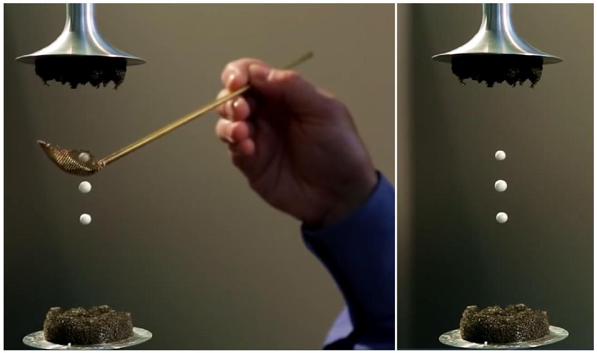
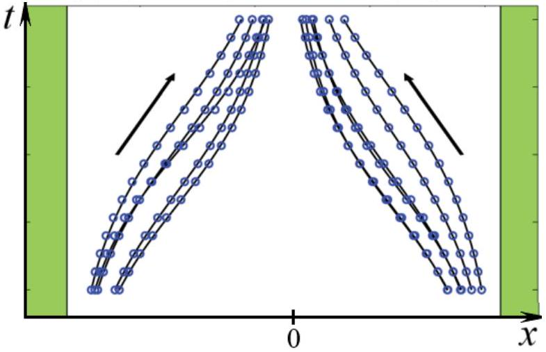

Теоретическое введение
Акустическая левитация - это явление, при котором небольшие тела могут левитировать в сильной стоячей звуковой волне. С помощью акустической левитации можно создать акустический пинцет, позволяющий бесконтактно и очень точно перемещать маленькие объекты. Из-за своих свойств акустический пинцет нашёл широкое применение, к примеру, в биомедицине для манипулирования структурами на масштабе клеток.

В этой задаче рассматривается физика акустической левитации и её возможные применения.
Часть А. Волновые соотношения (1.7 балла)
Рассмотрим плоскую монохроматическую продольную звуковую волну в идеальном газе, распространяющуюся вдоль оси $x$. Волна задаётся смещением $u(x, t)$ элементов газовой среды относительно положения равновесия:

$$
u(x, t)=\operatorname{Re}\left(u_{m} e^{i(\omega t-k x)}\right)
$$

где $u_{m}$ - комплексная амплитуда смещения, $\omega$ - угловая частота волны, $k$ - волновое число, а $x$ - равновесная координата элемента среды (координата, которую бы имел этот элемент газовой среды в положении равновесия). Пусть равновесное давление газа равно $p_{0}$, а плотность $\rho_{0}$. Показатель адиабаты газа равен $\gamma$. Тогда отклонение давления от равновесного значения задаётся выражением:

$$
\delta p(x, t)=p(x, t)-p_{0}=\operatorname{Re}\left(p_{m} e^{i(\omega t-k x)}\right)
$$

где $p_{m}$ - комплексная амплитуда колебаний давления.
А1 ${ }^{0.30}$ Выразите $p_{m}$ через $u_{m}, k, \gamma$ и $p_{0}$.
А2 ${ }^{0.30}$ Выразите скорость звука $с$ в газе через $\gamma, \rho_{0}$ и $p_{0}$.
А3 ${ }^{0.30}$ Выразите $p_{m}$ через $\omega, c, \rho_{0}$ и $u_{m}$.
A4 ${ }^{0.50}$ Получите выражение для средней плотности потока энергии $\mathcal{J}$ в такой волне. Выразите ответ через $\rho_{0}, c, \omega$ и $u_{m}$.
Перейдём теперь к рассмотрению монохроматической стоячей волны в газе. Аналогично будем описывать её через смещение как

$$
u(x, t)=2 u_{m} \cos (k x) \cos (\omega t) .
$$

A5 ${ }^{0.30}$ Запишите выражение для давления $\delta p(x, t)$ в такой стоячей волне. Выразите ответ через $\omega, c, \rho_{0}, u_{m}, x$ и $t$.
Часть В. Акустическая сила (2.0 балла)
Когда частица вещества находится во внешней стоячей звуковой волне, на неё действует дополнительная сила, называемая акустической силой. Вывод выражения для этой силы требует учёта поправок высшего порядка в волне.

При рассмотрении волн возможны два подхода: подход Эйлера и подход Лагранжа. В подходе Эйлера анализируется зависимость параметров волны в точке с фиксированной координатой в пространстве, а в подходе Лагранжа - в точке, где находится фиксированный элемент среды. В волнах с малой амплитудой разница между этими подходами отсутствует, однако иногда (например, в этой задаче) она играет роль. К примеру, если необходимо найти поправку к давлению волны в некоторой фиксированной точке пространства, необходимо учитывать смещение частиц вещества в данный момент времени.

Все уравнения в предыдущей части записывались с точки зрения подхода Лагранжа, однако среднее давление в фиксированной точке пространства получается из подхода Эйлера. Рассмотрим ту же стоячую волну, что и в части А. Зафиксируем в пространстве точку $x_{0}$.

В1 ${ }^{\text {0.80 }}$ Запишите приближенное выражение для давления $\delta p_{\text {Euler }}\left(x_{0}, t\right)$ в рассматриваемой стоячей волне в случае $\left|\frac{\partial u}{\partial x}\right| \ll 1$. Выразите ответ через $c, \omega, \rho_{0}$ , $u_{m}, t$ и $x_{0}$.

В2 ${ }^{0.40}$ Получите выражение для среднего давления $\overline{\delta p}\left(x_{0}\right)$ стоячей волны в фиксированной точке пространства. Выразите ответ через $\omega, c, \rho_{0}, u_{m}$ и $x_{0}$.
Пусть теперь в волну помещают сферическую частицу. Частица несжимаема, её плотность много больше плотности окружающего вещества (т.е. её можно считать неподвижной), а её радиус $a$ много меньше характерной длины волны. Будем пока что считать, что наличие частицы не влияет на волну.

Разница среднего давления в разных точках частицы приводит к возникновению средней силы, действующей на неё.
Вз ${ }^{\mathbf{0 . 8 0}}$ Запишите выражение для силы $F\left(x_{0}\right)$, которая действует на частицу. (Полученное выражение и есть акустическая сила.) Запишите выражение для потенциала этой силы. Выразите ответ через $\omega, c, \rho_{0}, u_{m}, x_{0}$ и $a$.

Часть С. Левитация в стоячей волне (2.0 балла)
Если акустическая сила, действующая на частицу в стоячей волне, окажется больше силы тяжести, то частица сможет левитировать. В этой части задачи попробуем оценить, при каких условиях может возникнуть акустическая левитация в демонстрационной установке.

Рассмотрим стоячую волну, представляющую собой суперпозицию двух бегущих плоских волн, распространяющихся по вертикали. Математически волна описывается точно так же, как в предыдущих частях.

С1 ${ }^{0.50}$ Найдите, при каком минимальном $\left|u_{m}\right|_{c r}$ возможна левитация частицы в волне. В ответ могут войти $a, \rho_{0}, \gamma, p_{0}$, частота звука $f_{0}$, плотность частицы $\rho$ и ускорение свободного падения $g$.

В самой популярной демонстрации акустического пинцета используются шарики пенопласта плотностью $\rho=50$ кг/ $\mathrm{M}^{3}$ диаметром $2 a=1$ см. Звук имеет частоту $f_{0}=10$ кГц. Воздух при нормальных условиях имеет плотность $\rho_{0}=1.29 \mathrm{к} / \mathrm{м}^{3}$ и давление $p_{0}=101$ кПа, его показатель адиабаты равен $\gamma=1.4$.

C2 ${ }^{0.50}$ Найдите численно $\left|u_{m}\right|_{c r}$ для параметров установки.
Хотя в задачах при описании волн используются амплитуда давления или смещения молекул газа, в повседневной жизни громкость звука задаётся децибелами. В монохроматической звуковой волне децибел определяется через логарифм интенсивности:

$$
D[\text { дБ }]=10 \log _{10} \frac{\mathcal{J}}{\mathcal{J}_{0}},
$$

где $J_{0}=10^{-12}$ Вт/ $\mathrm{m}^{2}$ - интенсивность звуковой волны громкостью 0 дБ.
с3 ${ }^{1.00}$ Какой громкости $D$ в децибелах соответствует ответ предыдущего пункта? Приведите численный ответ.
Часть D. A как же вязкость? (0.8 балла)
В выводе в части А полностью пренебрегается действие вязкости, хотя в общем случае ей нельзя пренебрегать.
Честный вывод вклада вязкости был бы слишком большим в рамках задачи, поэтому попробуем сделать оценку. Непосредственно у поверхности частицы макроскопическая скорость газа должна быть равна нулю. При этом вдали от частицы она зависит от времени как $v \cos \left(2 \pi f_{0} t\right)$. Можно показать, что основное изменение скорости происходит в тонкой области у поверхности, называемой вязким пограничным слоем.

D1 ${ }^{0.30}$ Из соображений размерности получите выражение для характерной толщины пограничного слоя $\delta$ с точностью до численного коэффициента, который в дальнейшем принимается равным единице. Выразите ответ через $\eta, \rho_{0}$ и $f_{0}$.

Фактически, поправка на вязкость должна учитывать, что вещество в пограничном слое практически не увлекается волной, что увеличивает эффективную массу частицы при движении в поле акустической потенциальной энергии.

D2 ${ }^{0.50}$ Для установки, описанной в предыдущей части, найдите отношение массы воздуха в пограничном слое $m_{\text {вяз }}$ к массе шарика $m_{0}$.
Вязкость воздуха $\eta=1.8 \cdot 10^{-5}$ Па с.
Часть Е. Акустическая сила и резонаторы. Теория (1.7 балла)

Описанные в этой задаче явления применимы не только для создания акустических пинцетов и интересных демонстраций. Действие акустической силы позволяет бесконтактно исследовать акустические резонаторы, что особенно актуально для резонаторов с очень большой добротностью - они слишком чувствительны к прямому вмешательству!

Резонатор представляет собой узкую заполненную водой кювету с малой толщиной $w=380$ мкм, высотой $h=160$ мкм и большой длиной $l=40$ мм. Введём ось $x$ вдоль стороны $w$ с началом отсчёта в середине резонатора. Стоячая волна в таком резонаторе возбуждается вдоль оси $x$. Будем считать, что возбуждается только основная мода колебаний.

Обычно исследователей интересует, какую среднюю плотность энергии в резонаторе они смогут получить при данной амплитуде напряжения на пьезоэлементах, возбуждающих стоячую волну. (Пьезоэлемент - специальный прибор, преобразующий поданное на него напряжение в механическое смещение.) Чтобы не вмешиваться в работу резонатора непосредственно, исследователи помещают в него стеклянные шарики маленького радиуса $a=10$ мкм и наблюдают за их смещением под действием акустической силы. Это позволяет им вычислить плотностью энергии звуковых волн внутри.

Характерная зависимость положения шариков от времени внутри резонатора показана на рисунке ниже.

Для простоты будем считать, что предположения о большой плотности и несжимаемости шариков всё ещё выполняются (это не совсем так, но качественно мало влияет на ответ).

Более того, учитывая маленький размер шариков, их можно считать практически безынерционными, т.е. можно считать, что акустическая сила в любой момент времени уравновешена силой вязкого трения, действующей на шарик. Эта сила задаётся формулой Стокса $F_{\text {сопр }}=6 \pi \eta d v$, где $v$ - скорость шарика, $\eta \approx 0.9$ мПа ⋅ с - вязкость воды. Таким образом, шарик, помещённый в точку с координатой $x_{0}$, со временем будет перемещаться в область наименьшей потенциальной энергии.

E2 ${ }^{1.00}$ Получите зависимость положения шарика от времени $x(t)$, если в начальный момент времени $x(t=0)=x_{0}$. Ответ выразите через $x_{0}, t, w, a, c, \mathcal{W}$, $\eta$ и частоту колебаний $f_{0}$.

Ез ${ }^{0.40}$ Выразите среднюю плотность энергии $\mathcal{W}$ звуковой волны в резонаторе через начальную $\left(x_{0}\right)$ и конечную $(x)$ координаты шарика, время его движения $t$ и известные величины ( $w, a, f_{0}, \eta, c$ ).

Часть F. Акустическая сила и резонаторы. Эксперимент (1.8 балла)
Средняя плотность энергии звуковой волны в резонаторе теоретически зависит от напряжения на пьезоэлементах степенным образом $\mathcal{W}=A U_{p p}^{2}$, где $U_{p p}$ - амплитуда напряжения на пьезоэлементах.

F1 ${ }^{0.30}$ Чему равна рабочая частота $f_{0}$ резонатора? Рабочая частота - это минимальная частота, при которой в резонаторе может возбуждаться стоячая волна.

Скорость звука в воде $c=1.5$ км/с.
В таблице ниже приведены положения шарика через $t_{0}=10$ мин после отпускания в точке $x_{0}=150$ мкм.

| $U_{p p}, \mathrm{~B}$ | 5 | 10 | 12 | 15 | 18 | 20 | 22 |
| :--- | :--- | :--- | :--- | :--- | :--- | :--- | :--- |
| $x$, МКМ | 144 | 124 | 110 | 74 | 54 | 34 | 18 |

F2 ${ }^{1.50}$ Найдите $A$. Рассчитайте добротность резонатора $Q$, если на рабочей частоте импеданс пьезоэлементов равен $Z=(4+3 i) \cdot 32$ кОм.

T Механика Волны Сборы XY Y 2024 Звук Стоячая волна Акустика

- Website in English

2020 - Мы те, кого должны превзойти.
