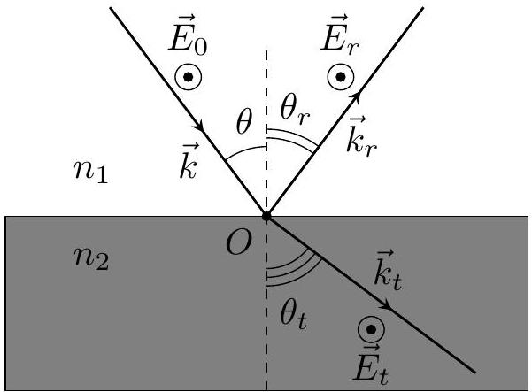
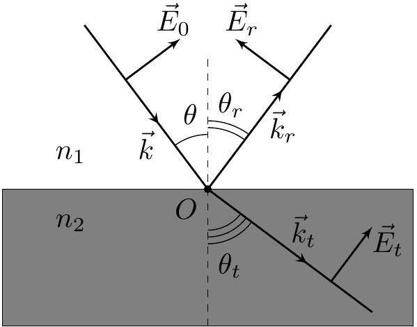
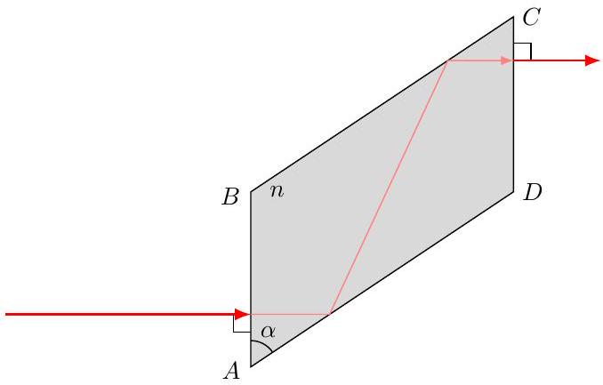
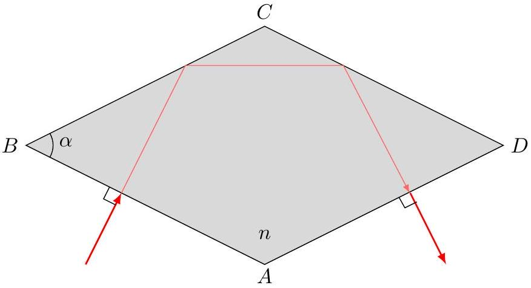
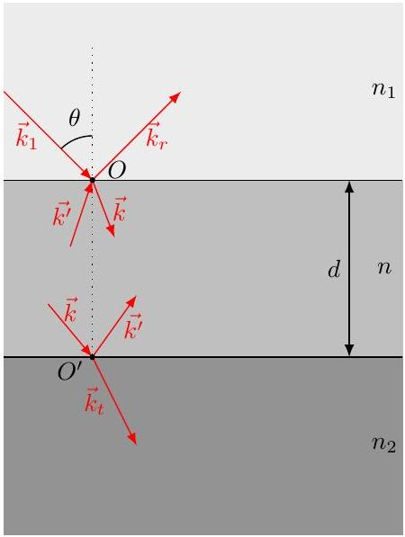
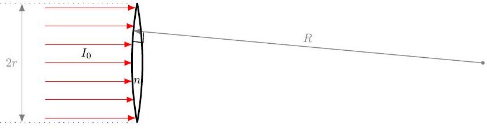

## Road to IPhO

## Просветление оптики

Просветление оптики - технология обработки поверхности линз, призм и других оптических деталей для снижения отражения света от оптических поверхностей, граничащих с воздухом. Это позволяет увеличить светопропускание оптической системы и повысить контрастность изображения за счёт снижения мешающих паразитных отражений в оптической системе.

Большинство применяемых оптических систем, например, объективы фотоаппаратов и видеокамер, состоят из многих линз, и отражение от каждой поверхности раздела стекла с воздухом уменьшает проходящий полезный световой поток. Без применения методов просветления падение интенсивности проходящего света в многолинзовой системе может достигать нескольких десятков процентов. Поэтому во всех современных объективах используется просветлённая оптика.

Данная задача посвящена теоретическим основам просветления оптики.

## Часть А. Формулы Френеля (3.2 балла)

Пусть из среды 1 на границу раздела сред 1 и 2 под углом $\theta$ в направлении к нормали падает плоская электромагнитная волна с волновым вектором $\vec{k}$ и напряжённостью электрического поля $\vec{E}_{0}$. Показатели преломления сред 1 и 2 равны $n_{1}$ и $n_{2}$ соответственно.

При попадании на границу раздела сред электромагнитная волна частично отражается от среды 2 и частично в неё проходит. Во всей задаче индекс $r$ соответствует отражённой волне, а индекс $t-$ волне, прошедшей в среду 2 , поэтому напряжённости электрического поля в отражённой и прошедшей волнах обозначены за $\vec{E}_{r}$ и $\vec{E}_{t}$ соответственно, волновые векторы отражённой и прошедшей волн обозначены за $\vec{k}_{r}$ и $\vec{k}_{t}$ соответственно, а углы отражения и преломления обозначены за $\theta_{r}$ и $\theta_{t}$ соответственно.

Электромагнитную волну можно представить в виде суперпозиции двух: $s$-поляризованной и $p$ поляризованной. В случае $s$-поляризованной волны направления векторов напряжённости электрического поля перпендикулярны плоскости, содержащей вектор нормали к поверхности и волновой вектор падающей волны. В случае же $p$-поляризованной волны направления векторов напряжённости электрического поля лежат в плоскости, содержащей вектор нормали к поверхности и волновой вектор падающей волны.

Положительные направления векторов $\vec{E}_{0}, \vec{E}_{r}$ и $\vec{E}_{t}$ в точке $O$, соответствующих падающей, отражённой и прошедшей волнам соответственно, показаны на рис.1. для $s$-поляризованной волны и на рис. 2. для $p$-поляризованной волны.

Рис.1. $s$ - поляризация

Рис.2. $p$ - поляризация

В рамках задачи все среды считайте немагнитными ( $\mu \approx 1$ ), а все волны - монохроматическими. Также считайте, что на границе раздела сред отсутствуют сторонние токи и свободные заряды.

Для описания напряжённостей электрических полей перейдём к комплексным амплитудам. Далее все направления напряжённостей электрических полей примите за те, что показаны на рисунке, и записывайте величины напряжённостей электрический полей в следующей форме:

$$
E_{\text {пад }}=\operatorname{Re}\left(E_{0} e^{i(\omega t-\vec{k} \vec{r})}\right) \quad E_{\text {отр }}=\operatorname{Re}\left(E_{r} e^{i\left(\omega t-\vec{k}_{r} \vec{r}\right)}\right) \quad E_{\text {прош }}=\operatorname{Re}\left(E_{t} e^{i\left(\omega t-\vec{k}_{t} \vec{r}\right)}\right) .
$$

Здесь $E_{0}, E_{r}$ и $E_{t}$ - комплексные амплитуды напряжённостей электрический полей падающей, отражённой и прошедшей волн соответственно в точке $O$, от которой отсчитывается радиус-вектор $\vec{r}$.

## Road to IPhO

Введём также комплексные коэффициенты отражения и прохождения по амплитуде $r$ и $t$ соответственно. Они определяются следующими выражениями:

$$
r=\frac{E_{r}}{E_{0}} \quad t=\frac{E_{t}}{E_{0}} .
$$

А1 Пусть в веществе с показателем преломления $n$ распространяется плоская электромагнитная волна с амплитудой колебаний $E$ напряжённости электрического поля. Выразите амплитуду колебаний напряжённости $H$ магнитного поля в этой волне через $E, n$, а также магнитную и электрическую постоянные $\mu_{0}$ и $\varepsilon_{0}$ соответственно.

Вернёмся к рассмотрению отражённых и прошедших через границу раздела сред 1 и 2 волн.
А2 Какие 4 граничных условия на электрическое и магнитное поля выполняются на границе раздела сред? Запишите их в листы ответов в удобной вам форме.

А3 Все граничные условия, выполняющиеся на границе раздела двух сред, должны быть выполнены в каждой её точке в произвольный момент времени. Исходя из этого докажите следующие равенства:

$$
\omega_{r}=\omega_{t}=\omega \quad \theta_{r}=\theta \quad n_{2} \sin \theta_{t}=n_{1} \sin \theta .
$$

А4 Получите выражение для комплексных коэффициентов отражения и прохождения $r_{s}$ и $t_{s}$ соответственно в случае $s$-поляризованной волны. Ответы выразите через $n_{1}, n_{2}, \theta$ и $\theta_{t}$. Выражения для $r_{s}$ и $t_{s}$ называются формулами Френеля для $s$-поляризованной волны.

А5 Получите выражение для коэффициентов $r_{p}$ и $t_{p}$ в случае $p$-поляризованной волны. Ответы выразите через $n_{1}, n_{2}, \theta$ и $\theta_{t}$. Выражения для $r_{p}$ и $t_{p}$ называются формулами Френеля для $p$-поляризованной волны.

Пусть величина $\theta$ превышает угол $\theta_{\text {crit }}$, соответствующий углу полного внутреннего отражения (далее ПВО). В этом случае величина угла $\theta_{t}$ является комплексной, при этом формулы Френеля сохраняют свою форму.

Существует два угла $\theta_{t}$, удовлетворяющих условию $n_{1} \sin \theta=n_{2} \sin \theta_{t}$, однако он может быть однозначно выбран с учётом того, что амплитуда прошедшей волны затухает с удалением от границы раздела сред.

A6 Определите величину $\cos \theta_{t}$. Ответ выразите через $n_{1}, n_{2}$ и $\theta$.

A7 Выражения для $r_{s}$ и $r_{p}$ можно представить в следующем виде: 0.4
$r_{s}=A_{s} e^{i \delta_{p}} \quad r_{p}=A_{p} e^{i \delta_{p}}$.
Определите $A_{s}, A_{p}, \delta_{s}$ и $\delta_{p}$. Ответы выразите через $n_{1}, n_{2}$ и $\theta$.
Пусть $\delta=\delta_{p}-\delta_{s}$.
A8 Определите $\delta$. Ответ выразите в виде одной обратной тригонометрической функции через $\theta$ и $n_{21}=n_{2} / n_{1}$. 0.4

## Часть В. Ромбы Френеля и Муни (1.5 балла)

Для получения из линейной поляризации круговой в поляризационных устройствах используются так называемые четверьтволновые пластинки. Как правило, данные пластинки выполнены из кварца и их действие основано на эффекте двулучепреломления. Однако такие пластинки могут быть использованы лишь в узком диапазоне длин волн.

Аналоги четвертьволновых пластинок могут быть устройства, основанные на эффекте ПВО. Данные устройства позволяют изучать куда более широкий спектр длин волн, и поэтому нашли широкое практическое применение. В данной части задачи вам предлагается ознакомиться с двумя видами таких устройств.

## Road to IPhO

Одним из устройств, основанных на эффекте ПВО, является ромб Френеля, сечение которого представляет собой параллелограмм (см. рис. 3).

На грань $A B$ ромба Френеля, перпендикулярную плоскости рисунка, падает линейно поляризованная электромагнитная волна, волновой вектор $\vec{k}$ которой перпендикулярен $A B$. Угол $\alpha=\angle B A D$ выбран таким образом, что волна испытывает два полных отражений от граней $A D$ и $B C$ ромба Френеля, за счёт чего между $p$ и $s$ поляризациями возникает сдвиг по фазе, равный $\pi / 2$.

Пусть ромб Френеля находится в воздухе с показателем преломления, равным единице, и выполнен из материала с показателем преломления $n=1.510$.

Рис. 3. Ромб Френеля

В1 При каких значениях острого угла $\alpha$ ромба Френеля электромагнитная волна будет испытывать полное отражение от граней ромба Френеля $B C$ и $A D$ ? Выразите ответ через $n$ и рассчитайте его в градусах с точностью до четырёх значащих цифр.

B2 При каких значениях угла $\alpha=\alpha^{\prime}$ с помощью ромба Френеля можно получить круговую поляризацию из линейной? Выразите ответы через $n$ и рассчитайте их в градусах с точностью до четырёх значащих цифр.

B3 Пусть пучок света падает на ромб Френеля по всей площади грани $A B$. Угол $\alpha=\alpha^{\prime}$. При каких значениях $B C / A B$ ромб Френеля обращает весь пучок лучей (все лучи, попавшие в ромб Френеля через грань $A B$, испытывают два полных отражения)? Рассчитайте ответ с точностью до трёх значащих цифр.

Другой разновидностью четвертьволновой пластинки является ромб Муни (см. рис. 4).

На грань $A B$ ромба Муни, перпендикулярную плоскости рисунка, падает линейно поляризованная электромагнитная волна, волновой вектор $\vec{k}$ которой перпендикулярен $A B$. Угол $\alpha=\angle A B C$ выбран таким образом, что волна испытывает два полных отражений от граней $B C$ и $C D$ ромба Муни, за счёт чего между $p$ и $s$ поляризациями возникает сдвиг по фазе, равный $\pi / 2$.

Пусть ромб Муни находится в воздухе с показателем преломления, равным единице, и выполнен из материала с показателем преломления $n=1.510$.

Рис. 4. Ромб Муни

B4 При каких значениях угла $\alpha$ ромба Муни электромагнитная волна будет испытывать полное отражение от граней ромба Френеля $B C$ и $C D$ ? Выразите ответ через $n$ и рассчитайте его в градусах с точностью до четырёх значащих цифр.

B5 При каких значениях угла $\alpha=\alpha^{\prime}$ с помощью ромба Муни можно получить круговую поляризацию из линейной? Выразите ответы через $n$ и рассчитайте их в градусах с точностью до четырёх значащих цифр.

B6 Пусть угол $\alpha=\alpha^{\prime}$. Определите максимально возможное значение $\gamma$ отношения площади поперечного сечения пучка, падающего на грань $A B$, к площади грани $A B$, если ромб Муни обращает весь пучок лучей (все лучи, попавшие в ромб Муни через грань $A B$, испытывают два полных отражения). Рассчитайте ответ с точностью до трёх значащих цифр.

Примечание: Во всех последующих пунктах считайте все углы падения такими, что электромагнитные волны не испытывают полного отражения на границе раздела сред.

## Road to IPhO

## Часть С. Просветляющее покрытие (3.6 балла)

Как вы могли убедиться в предыдущих частях задачи, амплитуда напряжённости электрического поля в отражённой волне является вполне сопоставимой с амплитудой напряжённости электрического поля в падающей волне. Это приводит к тому, что, например, стеклянные пластинки отбрасывают блики. Если стекло используется для изготовления очков, эффект бликов нежелателен, и оказывается, что его можно устранить, нанеся на поверхность линзы тонкий слой вещества из другого материала. Материал слоя и его толщина подбираются таким образом, чтобы суммарная амплитуда отражённой от поверхности линзы волны обращалась в ноль. Данная технология и называется просветлением оптики, а наносимый слой называют просветляющим покрытием. В данной части задачи вам предстоит определить возможные значения показателя преломления и толщины вещества, при которых суммарная амплитуда отражённой волны обращается в ноль.

Рассмотрим среды 1 и 2 с показателями преломления $n_{1}$ и $n_{2}$ соответственно, разделённые плоскопараллельной пластиной толщиной $d$ с показателем преломления $n$.

Пусть из среды 1 на пластину падает плоская электромагнитная волна под углом $\theta$ к нормали. В результате многократных отражений и преломлений образуется суперпозиция из 5 электромагнитных волн, показанных на рис.5, которым соответствуют 5 волновых векторов.

Волновой вектор $\vec{k}_{1}$ соответствует электромагнитной волне, падающей на границу раздела сред с показателями преломления $n_{1}$ и $n$ из среды 1 , волновые векторы $\vec{k}_{r}$ и $\vec{k}_{t}$ соответствуют отражённой от пластины и прошедшей через неё электромагнитным волнам, а волновые векторы $\vec{k}$ и $\vec{k}^{\prime}$ соответствуют электромагнитным волнам, распространяющимся в пластине.

Радиус-вектор $\vec{r}$ каждой из пяти рассматриваемых волн отсчитывается от точки $O$, принадлежащей границе раздела сред с показателями преломления $n_{1}$ и $n$ (см. форму представления напряжённостей электрических полей в части $A$ ). Обозначим соответствующие волновым векторам $\vec{k}_{1}, \vec{k}, \overrightarrow{k^{\prime}}, \overrightarrow{k_{r}}$ и $\vec{k}_{t}$ комплексные амплитуды напряжённостей электрических полей в точке $O$ за $E_{1}, E, E^{\prime}, E_{r}$ и $E_{t}$.

Рис. 5. Суперпозиция волн

Введём следующие обозначения:

- $r_{1}$ - коэффициент отражения волны с волновым вектором $\vec{k}_{1}$ от границы раздела сред с показателями преломления $n_{1}$ и $n$;
- $t_{1}$ - коэффициент прохождения волны с волновым вектором $\vec{k}_{1}$ через границу раздела сред с показателями преломления $n_{1}$ и $n$;
- $r_{2}$ - коэффициент отражения волны с волновым вектором $\vec{k}$ от границы раздела сред с показателями преломления $n_{2}$ и $n$;
- $t_{2}$ - коэффициент прохождения волны с волновым вектором $\vec{k}$ через границу раздела сред с показателями преломления $n_{2}$ и $n$;
- $r_{1}^{\prime}$ - коэффициент отражения волны с волновым вектором $\overrightarrow{k^{\prime}}$ от границы раздела сред с показателями преломления $n_{1}$ и $n$;
- $t_{1}^{\prime}$ - коэффициент прохождения волны с волновым вектором $\overrightarrow{k^{\prime}}$ через границу раздела сред с показателями преломления $n_{1}$ и $n$.

## Road to IPhO

C1 Покажите справедливость следующих соотношений: 0.3

$$
r_{1}^{\prime}=-r_{1} \quad 1-r_{1}^{2}=t_{1} t_{1}^{\prime}
$$

Рассмотрим точку $O$ границы раздела сред с показателями преломления $n$ и $n_{1}$. На ней сходятся электромагнитные волны с напряжённостями электрических полей $\vec{k}_{1}$ и $\overrightarrow{k^{\prime}}$, а расходятся электромагнитные волны с напряжённостями полей $\vec{k}_{r}$ и $\vec{k}$ (см. рис. 5).

При этом каждая из расходящихся волн может быть представлена в виде суперпозиции прошедшей и отражённой сходящихся волн.

C2 Выразите $E_{r}$ и $E$ через $E_{1}, E^{\prime}, r_{1}, r_{1}^{\prime}, t_{1}$ и $t_{1}^{\prime}$. 0.6

Теперь рассмотрим точку $O^{\prime}$ границы раздела сред с показателями преломлений $n_{2}$ и $n$. Отрезок $O O^{\prime}$ перпендикулярен обеим границам раздела сред.

К границе сходится волна с волновым вектором $\vec{k}$, а расходятся волны с волновыми векторами $\overrightarrow{k_{t}}$ и $\overrightarrow{k^{\prime}}$ (см. рис. 5).

C3 Рассуждая аналогично пункту C2, выразите $E^{\prime}$ и $E_{t}$ через $E, r_{2}$ и $t_{2}^{\prime}, n_{1}, n_{2}, n, k, d$ и $\theta$. Учтите, что комплексные амплитуды электрических полей в точке $O^{\prime}$ сдвинуты по фазе относительно соответствующих комплексных амплитуд в точке $O$.

C4 Используя результаты пунктов C1-C3, определите коэффициент отражения $r=E_{r} / E_{1}$. Ответ выразите через $r_{1}, r_{2}, n_{1}, n, k, d$ и $\theta$.

Далее рассмотрим случай только нормального падения, для которого $s$ и $p$ поляризации являются фактически эквивалентными друг другу. Как правило, показатель преломления $n$ и толщина $d$ просветляющего покрытия определяются для случая нормального падения.

Пусть длина волны света, падающего на границу раздела сред с показателями преломления $n_{1}$ и $n$ из среды 1 , равна $\lambda_{1}$.

C5 При каком значении толщины пластины $d$ возможно обращение коэффициента отражения в ноль? Ответ выразите через $\lambda_{1}, n_{1}$ и $n$.

C6 При каких значениях показателя преломления пластины $n$ возможно обращение коэффициента отражения в ноль? Ответ выразите через $n_{1}$ и $n_{2}$.

## Часть D. Оптический пинцет (1.7 балла)

Рассмотрим двояковыпуклую линзу, выполненную из вещества с показателем преломления $n$ и находящуюся в воздухе. Радиус кривизны каждой из поверхностей линзы равен $R$, а радиус линзы $r \ll R$. На линзу параллельно её главной оптической оси падает параллельный пучок света интенсивностью $I_{0}$. Скорость света в вакууме равна $c$.

Как правило, равенство амплитуд освещённости светового поля перед линзой и сразу за ней подразумевается как само собой разумеющееся, однако это совершенно не так. Для равенства нулю светового поля отражённой волны, отражённой от сферической поверхности, линза с обеих сторон покрывается просветляющим покрытием. Толщиной просветляющего покрытия можно пренебречь по сравнению с толщиной линзы.

D1 Чему равен показатель преломления $n^{\prime}$ просветляющего покрытия? Ответ выразите через $n$. 0.2

D2 Чему равно фокусное расстояние линзы $f$ ? Ответ выразите через $R$ и $n$ 0.5

D3 Определите силу $F$, действующую на линзу. Ответ выразите через $I_{0}, r, R, n$ и $c$. 1.0
