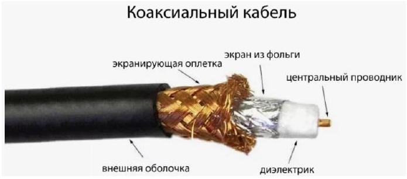
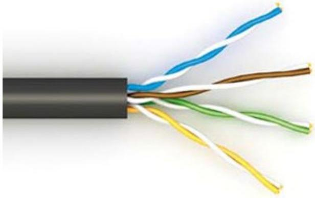
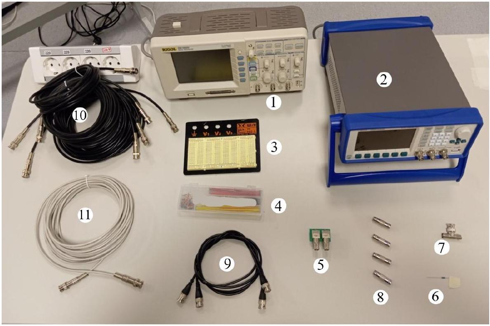
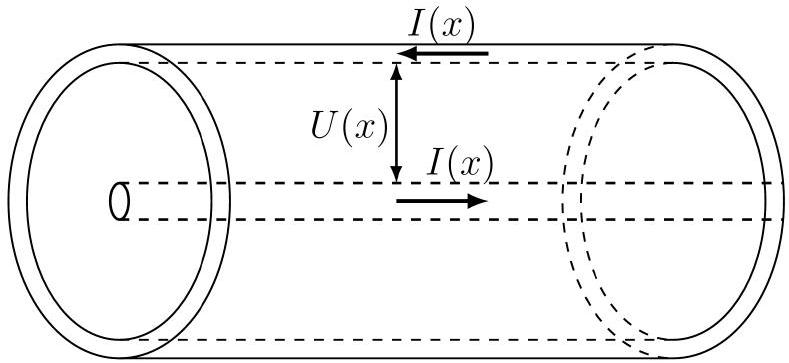
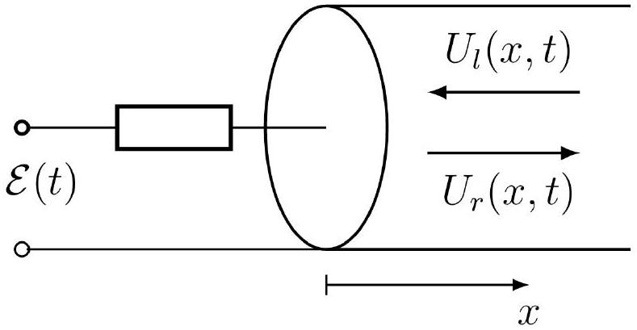
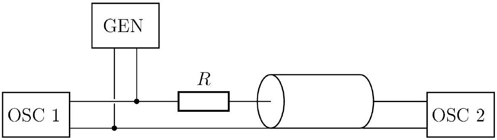
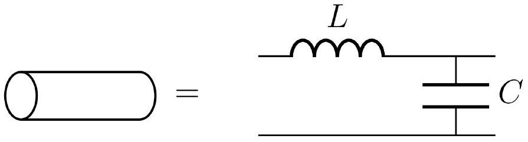

## Road to Paris   Y25-E2. Длинная линия 2.0

## Введение

Двухпроводная линия - это система из двух близко расположенных проводников, используемая для передачи электрических сигналов. По двухпроводной линии могут распространяться бегущие волны тока и напряжения. Двухпроводная линия в расчёте на единицу длины обладает ёмкостью $\mathcal{C}$ и индуктивностью $\mathcal{L}$. Характеристикой двухпроводной линии является волновое сопротивление $Z$ :

$$
Z=\sqrt{\frac{\mathcal{L}}{\mathcal{C}}},
$$

скорость распространения волны в линии:

$$
v=\frac{1}{\sqrt{\mathcal{L C}}} .
$$

Наиболее часто встречающаяся реализация двухпроводной линии - коаксиальный кабель, с помощью которого осуществляется подключение большого количества электронных приборов (например, генераторов и осциллографов). Строение коаксиального кабеля показано на рисунке ниже.

Другой часто встречающийся пример реализации двухпроводной линии - витая пара, на основе которой базируется большинство современных физических сетей связи (в частности, всемирная сеть Интернет). Строение витой пары показано на рисунке ниже:

Эта задача посвящена исследованию двухпроводных линий. В частях A и B исследуется стандартный коаксиальный кабель, в части С - витая пара.

## Road to Paris

## Оборудование

1. Осциллограф
2. Генератор
3. Макетная плата
4. Персональный набор перемычек
5. Адаптер BNC-плата
6. Резистор неизвестного сопротивления $R$
7. Тройник BNC
8. Коннектор BNC папа-папа (4 шт.)
9. Короткий провод BNC-BNC с волновым сопротивлением 50 Ом (2 шт.)
10. Провод BNC-BNC с волновым сопротивлением 50 Ом и длиной 5 м (5 шт.)
11. Провод BNC-BNC (витая пара) с неизвестным волновым сопротивлением длиной 10 м

## Примечания по работе с оборудованием

- Длинные кабели смотаны в бухту и закреплены стяжками специально для удобства работы с ними. Не снимайте стяжки и не разматывайте кабели!
- При неосторожном пользовании наконечники BNC длинных кабелей могут выйти из строя. Старайтесь не дёргать их и не гнуть на очень большие углы. Если вы подозреваете, что какой-то из кабелей неисправен, это можно проверить, подключив его непосредственно к генератору и осциллографу и убедившись, что он корректно передаёт сигнал. При обнаружении неисправности немедленно обратитесь к дежурному по аудитории.
- Некоторые из наконечников ВNC могут туго вставляться в коннектор для платы. Это не означает их неисправности.

## Road to Paris

## Часть А. Не баян с СN21. Характеристики коаксиального кабеля (6 баллов)

Рассмотрим коаксиальный кабель, расположенный вдоль оси $O x$. Рассмотрим сечение $x=$ const. Обозначим за $U(x, t)$ напряжение между внутренним и внешним проводом в точке с координатой $x$ в момент времени $t$. Через рассматриваемое сечение по внешнему проводу протекает ток $I(x, t)$, по внутреннему течёт тот же ток в противоположном направлении.

Самый простой способ исследовать коаксиальный кабель - возбудить в нём две волны напряжения, распространяющихся в противоположных направлениях. Для этого к кабелю через резистор сопротивлением $R$ подключен источник переменного напряжения $\mathcal{E}(t)$ (см. рис). Размером соединительных проводов по сравнению с длиной волны напряжения в кабеле можно пренебречь. Обозначим $U_{l}(x, t)$ - распределение напряжения в волне, распространяющейся в положительном направлении оси $O x, U_{r}(x, t)$ - то же для волны, распространяющейся в противоположном направлении. Токи в каждой из волн связаны с напряжениями через так называемое волновое сопротивление $Z$ :

$$
I_{l}(x, t)=-\frac{U_{l}(x, t)}{Z}, \quad I_{r}(x, t)=\frac{U_{r}(x, t)}{Z}
$$

Тогда

$$
\begin{aligned}
U(x, t) & =U_{l}(x, t)+U_{r}(x, t), \\
I(x, t) & =I_{l}(x, t)+I_{r}(x, t) .
\end{aligned}
$$

Начало кабеля расположено в точке $x=0$.

А1 Выразите напряжение на резисторе $U_{R}(t)$, и ток через него $I_{R}(t)$ через $U_{l}(x, t), U_{r}(x, t), I_{l}(x, t), I_{r}(x, t)$. По- 0.4 лучите выражение, связывающее $U_{l}(0, t)$ и $U_{r}(0, t)$. Выражение может содержать $R, Z$.

Пусть теперь коаксиальный кабель имеет длину $L$ и на конце подключен с осциллографу с очень большим внутренним сопротивлением. На резистор подают ступенчатое напряжение:

$$
\mathcal{E}(t)= \begin{cases}0, & t<0 \\ U_{0}, & t \geq 0\end{cases}
$$

Из-за того, что волна за конечное время пробегает путь от резистора до осциллографа и обратно, напряжение на кабеле (которое детектирует осциллограф) начинает ступенчато расти, постепенно выходя на плато.

## Road to Paris

Напряжение $U(x, t)$ является решением волнового уравнения

$$
\frac{\partial^{2}}{\partial x^{2}} U(x, t)-\frac{1}{v^{2}} \frac{\partial^{2}}{\partial t^{2}} U(x, t)=0
$$

что и позволяет представить $U(x, t)$ как сумму двух бегущих влево и вправо волн. При этом скорость распространения волн по кабелю равна $v$.

А2 Найдите зависимость напряжения $U_{\mathrm{OSC}}(t)$ на осциллографе от времени.
Примечание: если у вас не получилось выполнить пункты А1 и А2, воспользуйтесь следующим выражением:

$$
U_{\mathrm{OSC}}(t)=U_{0}\left[1-\left(\frac{R-Z}{R+Z}\right)^{\left\lfloor\frac{V t}{2 L}-\frac{1}{2}\right\rfloor}\right],
$$

где [...] - целая часть числа.
Соберите установку, показанную на рисунке:

A3 Подав с генератора прямоугольный сигнал, снимите зависимость напряжения от времени. Запишите моменты времени $t_{n}$, когда произошло $n$-ное скачкообразное увеличение напряжения, и значения напряжения $U_{n}$ сразу после этого.

А4 Повторите предыдущий пункт, подсоединяя большее количество участков кабеля (от 2 до 5 включительно).
В силу неидеальности автора задачи, участки кабеля не идеально совпадают по длине, поэтому для анализа нужно использовать все имеющиеся точки. Пусть поданное с генератора напряжение равно $U_{0}$, тогда снятые значения $U_{n}$ можно обезразмерить, введя для $m$ участков кабеля величину $u(n, m)=U_{n} / U_{0}$. Аналогично для $m$ участков кабеля введём время $t(n, m)=t_{n}$.

А5 Пренебрегая длиной кабелей, используемых для подключения генератора, линеаризуйте зависимости $u(n, m)$ и $t(n, m)$. Постройте график линеаризованной зависимости $u(n, m)$ и определите сопротивление $R$ выданного резистора, если волновое сопротивление кабеля равно 50 Ом. Постройте линеаризованный график зависимости $t(n, m)$ и определите скорость $v$ распространения волн в коаксиальном кабеле. Приведите погрешности результатов.

## Road to Paris

Часть В. Погонная ёмкость (1.5 балла)
Если подать на участок кабеля переменное напряжение низкой частоты (т.е. при котором длина волны много больше длины участка кабеля), он будет вести себя как последовательно подключенные конденсатор и катушка. Поскольку при малых частотах импедансом катушки можно пренебречь, можно с хорошей точностью измерить ёмкость кабеля на единицу длины.

В1 Пренебрегая собственной ёмкостью кабелей, используемых для подключения генератора и осциллографа, предложите схему, позволяющую определить ёмкость коаксиального кабеля на единицу длины. Проведите измерения для разного количества участков кабеля и определите его ёмкость $\mathcal{C}$ на единицу длины. Зная волновое сопротивление кабеля, найдите его индуктивность $\mathcal{L}$ на единицу длины. Оцените погрешность полученных результатов.

Часть С. Волновое сопротивление неизвестного кабеля (2.5 балла)
Чтобы найти волновое сопротивление выданной вам витой пары, можно собрать ту же схему, как в первой части (см. п. А3).

С1 Подав с генератора прямоугольный сигнал, снимите зависимость напряжения от времени, а именно найдите моменты времени $t_{n}$, когда произошло $n$-тое скачкообразное увеличение напряжения, и значения напряжения $U_{n}$ сразу после этого.

С2 Найдите скорость $v$ распространения сигнала в витой паре и её волновое сопротивление $Z$. Приведите погрешности полученных результатов.
