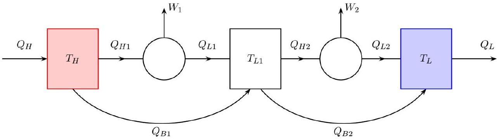

Хорошо известно, что максимальному коэффициенту полезного действия (КПД) теплового двигателя, работающего с двумя тепловыми резервуарами (нагревателем и холодильником), при фиксированных температурах нагревателя и холодильника отвечает цикл Карно. Однако в этом цикле передача тепла от нагревателя рабочему телу происходит при равных температурах, а значит бесконечно медленно. В любом реальном двигателе нужно поддерживать конечную разность температур при теплопередаче, что приводит к уменьшению КПД. В этой задаче мы рассмотрим разные аспекты поведения двигателей с учетом того, что процессы происходят не бесконечно медленно, а значит процессы в двигателе необратимы.

Часть А. Двигатель с трением (1.5 балла)
В этой части будем считать, что помимо совершения полезной работы поршень двигателя преодолевает силу трения. Будем считать, что поршень двигателя движется в цилиндре постоянного сечения вдоль направляющих этого цилиндра. Пусть за цикл поршень перемещается на расстояние $D$ и обратно, к нему подводится количество тепла $Q_{1}>0$, отводится количество тепла $Q_{2}>0$. Сила трения зависит от скорости поршня как $F=\gamma v$, где $v$ - скорость поршня. Продолжительность цикла $\tau$. Для простоты будем считать, что половину цикла поршень движется с постоянной скоростью в одну строну, а вторую половину -в другую сторону.

A1 ${ }^{0.70}$ Запишите выражение для полезной мощности двигателя. Выразите ответ через $Q_{1}, Q_{2}, \gamma, D, \tau$.
А2 ${ }^{0.30}$ Найдите оптимальную продолжительность цикла $\tau$, при которой мощность будет максимальной.
А3 ${ }^{0.30}$ Найдите выражение для КПД (отношения полезной работы к подведенному количеству теплоты) в случае работы двигателя при оптимальной продолжительности цикла.

А4 ${ }^{0,20}$ Пусть $Q_{1}, Q_{2}$ такие же, как если бы двигатель работал по идеальному циклу Карно. Выразите КПД рассматриваемого цикла через КПД такого цикла Карно $\eta_{c}$.

Часть В. Двигатель с учетом конечной теплопроводности (5.5 балла)
Пусть температуры нагревателя и холодильника тепловой машины $T_{1}, T_{2}$ соответственно. Рабочее тело представляет собой $\nu$ молей идеального одноатомного газа. По аналогии с циклом Карно процесс состоит из двух изотерм с температурами $T_{1}^{\prime}$ и $T_{2}^{\prime}$, причем $T_{1}>T_{1}^{\prime}>T_{2}^{\prime}>T_{2}$, соединенных двумя адиабатами. Во всей части В температуры $T_{1}$ и $T_{2}$ считаются постоянными. Мощность теплопередачи будем считать пропорциональной разности температур

$$
P_{1}=\alpha_{1} \Delta T_{1}=\alpha_{1}\left(T_{1}-T_{1}^{\prime}\right), \quad P_{2}=\alpha_{2} \Delta T_{2}=\alpha_{2}\left(T_{2}^{\prime}-T_{2}\right) .
$$

На изотерме с температурой $T_{1}^{\prime}$ к газу подводится количество тепла $Q_{1}$, а его объем увеличивается от $V_{1}$ до $V_{2}$, на изотерме с температурой $T_{2}^{\prime}$ отводится количество тепла $Q_{2}$.

В $1^{0.80}$ Определите количества теплоты $Q_{1}$ и $Q_{2}$, выразите ответ через $\nu, R, T_{1}^{\prime}, T_{2}^{\prime}, V_{1}, V_{2}$.
В2 ${ }^{0.40}$ Выразите время цикла $t_{c}$ через $Q_{1}, Q_{2}, \alpha_{1}, \alpha_{2}, \Delta T_{1}, \Delta T_{2}$. Временем, которое занимают адиабатические процессы, можно пренебречь.
В3 ${ }^{0.40}$ Выразите полезную мощность цикла $P$ через $T_{1}, T_{2}, \Delta T_{1}, \Delta T_{2}, \alpha_{1}, \alpha_{2}$.
В последующих пунктах мы определим значения разностей температур, при которых полезная мощность максимальна. Для этого мы будем изменять разности температур $\Delta T_{1}$ и $\Delta T_{2}$. В максимуме соответствующее изменение мощности должно быть равно нулю в первом порядке малости.

B4 ${ }^{0.40}$ Будем рассматривать только циклы, продолжающиеся фиксированное время $t_{c}$. Найдите следующее отсюда соотношение между приращениями $d \Delta T_{1}$ и $d \Delta T_{2}$. Выразите ответ через $T_{1}, T_{2}, \alpha_{1}, \alpha_{2}, \Delta T_{1}, \Delta T_{2}$.

В5 ${ }^{0.50}$ Пусть продолжительность цикла $t_{c}$ фиксирована. Найдите отношение $\Delta T_{1} / \Delta T_{2}$, при котором мощность $P$ максимальна.
В6 ${ }^{0.80}$ Продифференцируйте мощность по $\Delta T_{1}$. Покажите, что условие равенства нулю этой производной можно записать в виде

$$
\frac{\Delta T_{1}}{\Delta T_{2}}=h \frac{P}{\Delta T_{1} \Delta T_{2}},
$$

где $h$ - некоторая величина, не зависящая от $\Delta T_{1}$ и $\Delta T_{2}$. Получите выражение для $h$.
В7 ${ }^{1.20}$ Используя результаты предыдущих двух пунктов, определите значения $\Delta T_{1}, \Delta T_{2}$, при которых мощность максимально. То, что найденные значения соответствуют именно максимуму доказывать не требуется. Выразите ответ через $T_{1}, T_{2}, \alpha_{1}, \alpha_{2}$. Вы можете существенно упростить вычисления, если будете считать, что соотношения между $\Delta T_{1}$ и $\Delta T_{2}$, полученное в предыдущем пункте, выполняется.

В8 ${ }^{0.70}$ Найдите значение максимальной мощности $P$ и кпд $\eta$ цикла при оптимальных значениях $\Delta T_{1}, \Delta T_{2}$. Выразите ответ через $T_{1}, T_{2}, \alpha_{1}, \alpha_{2}$.
В9 ${ }^{0.30}$ Типичная температура нагревателя тепловой электростанции $560^{\circ} \mathrm{C}$, холодильника $25^{\circ} \mathrm{C}$. Вычислите для этих температур кпд цикла карно и кпд найденный в предыдущем пункте. Какое из этих значений лучше описывает измеренное значение $\eta=0.36$ ?

Часть С. Пара двигателей с утечкой (3 балла)

Из-за неидеальной термоизоляции тепловой машины может получиться так, что часть подведенного к ней тепла не передается рабочему телу, а непосредственно перетекает от нагревателю к холодильнику. Чтобы исследовать роль таких внутренних утечек тепла, рассмотрим тепловую машину, которая представляет собой цепочку из двух двигателей. При этом холодильник первого двигателя является нагревателем второго. Оба двигателя могут совершать полезную работу. Кроме того, часть тепла передается непосредственно от нагревателя двигателя к холодильнику.

Введем следующие обозначения

- $Q_{H i}$ - количество тепла, попавшее на рабочее тело і-й тепловой машины
- $Q_{L i}$ - количество тепла, которое рабочее тело і-й тепловой машины отдало ее холодильнику
- $\eta_{i}$ - КПД і-й машины
- $Q_{B i}$ - количество тепла, которое в і-й машине непосредственно перешло от нагревателя к холодильнику
- $T_{H}$ - температура первого нагревателя
- $T_{L 1}$ - температура первого холодильника (он же нагреватель второй машины)
- $T_{L}$ - температура второго холодильника

Первый двигатель получает от нагревателя некоторое количество теплоты $Q_{H}$, которое частично передается рабочему телу, а частично передается непосредственно холодильникам первой и второй тепловой машин за счет утечек. Будем считать, что величины утечек пропорциональны разностям температур соответствующих нагревателя и холодильника, а также подведенному к первому нагревателю теплу:

$$
Q_{B 1}=N_{1} Q_{H}=K_{1}\left(T_{H}-T_{L 1}\right) Q_{H}, \quad Q_{B 2}=N_{2} Q_{H}=K_{2}\left(T_{L 1}-T_{L}\right) Q_{H}
$$

С1 ${ }^{0.80}$ Выразите коэффициент полезного действия $\eta$ тепловой машины через коэффициенты полезного действия ее частей $\eta_{1}, \eta_{2}$ (они определяются как отношения полезных работ к количествам теплоты, поданных на рабочее тело соответствующей машины), а также через коэффициенты $N_{1}, N_{2}$.

С2 ${ }^{0,90}$ Выразите $\eta$ через температуры $T_{H}, T_{L}, T_{L 1}$ и коэффициенты $K_{1}, K_{2}$. Считайте, что отдельные циклы тепловых двигателей - это циклы Карно.
с3 ${ }^{0.40}$ При $T_{L} / T_{H}=0.5, K_{1} T_{H}=0.3, K_{2} T_{H}=0.2$ постройте график зависимости КПД от отношения $T_{L 1} / T_{H}$.
С4 ${ }^{0.90}$ Найдите температуру промежуточного холодильника $T_{L 1}$, при котором найденный КПД максимален. Для случая $K_{1}=K_{2}$ приведите выражение для максимального КПД.

- Website in English

2020 - Мы те, кого должны превзойти.
