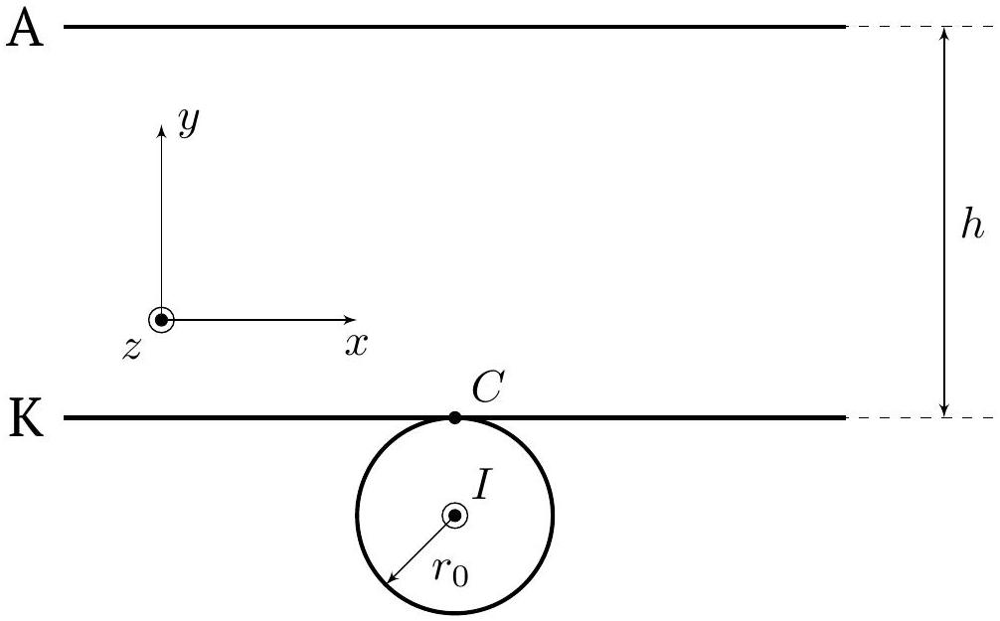
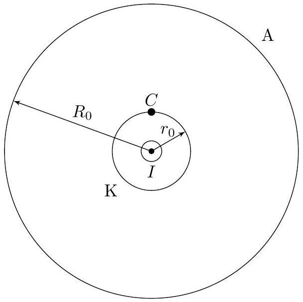
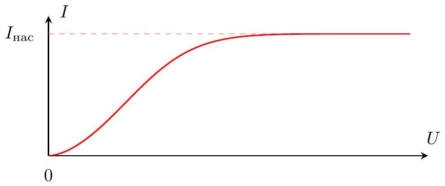
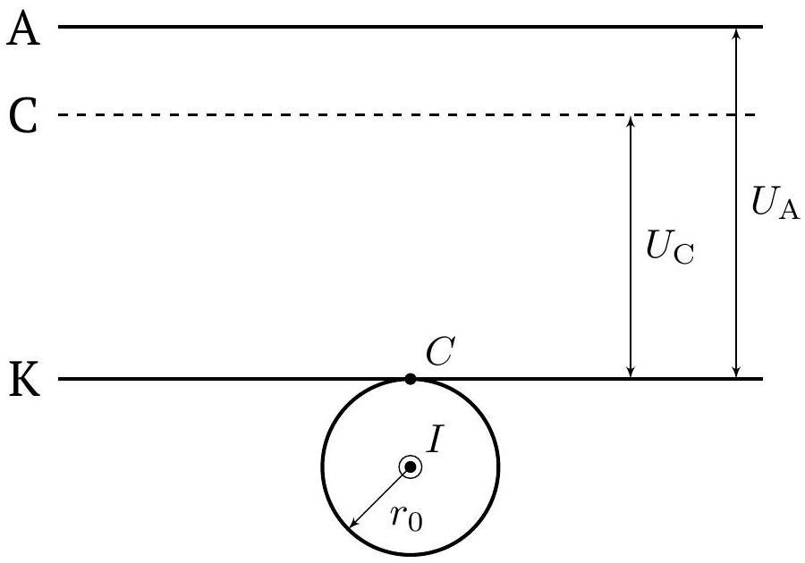
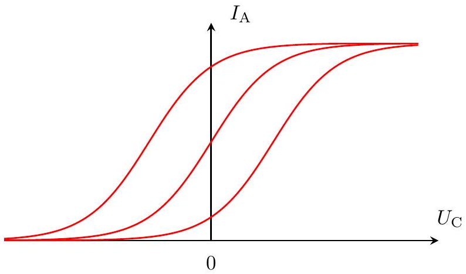
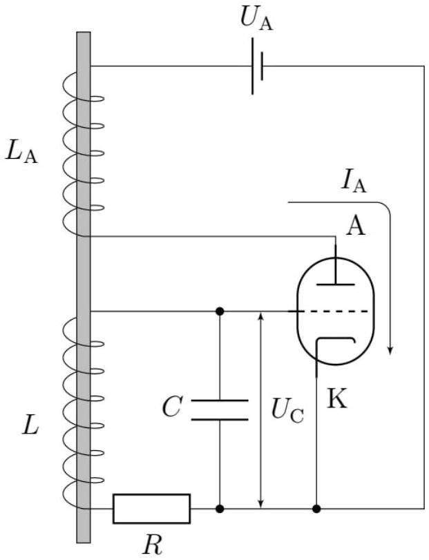

## Road to IPhO

## Электронная лампа

Данная задача посвящена устройству, называемому электронной лампой. Электронные лампы различны по своей форме и конструкции, однако принцип действия у всех одинаков: в вакуумированой колбе расположены два электрода: катод и анод. Катод нагревается засчёт протекания по нему (или по вблизи расположенному нагревателю) электрического тока, что приводит к термоэлектронной эмиссии - излучению электронов с его поверхности. Между катодом и анодом есть разность потенциалов, приводящая к дальнейшему движению электронов в вакууме.

Кроме катода и анода в объёме лампы могут находится другие элементы (например, так называемые сетки), влияющие на движение электронов в лампе.

Во всех ответах этой задачи кроме указанных в каждом пункте величин вы можете использовать:

- магнитную постоянную $\mu_{0}=4 \pi \cdot 10^{-7} \mathrm{H} / \mathrm{A}^{2}$;
- электрическую постоянную $\varepsilon_{0}=8.85 \cdot 10^{-12} \Phi / \mathrm{м}$;
- постоянную Больцмана $k=1.38 \cdot 10^{-23}$ Дж/K;
- массу электрона $m=9.1 \cdot 10^{-31}$ кг;
- модуль заряда электрона $e=1.6 \cdot 10^{-19}$ Кл.

Примечание. В задаче потребуется решать уравнение вида

$$
\psi^{\prime \prime}(z)=f(\psi(z)),
$$

которое после домножения обеих частей на $\psi^{\prime}(z)$ и интегрирования преобразуется к виду

$$
\int \psi^{\prime}(z) \psi^{\prime \prime}(z) d z=\int f(\psi(z)) \psi^{\prime}(z) d z
$$

Интегрирование даёт

$$
\frac{\psi^{\prime}(z)^{2}}{2}=\int f(\psi(z)) d \psi(z)+C
$$

где $C$ - константа, определяемая из начальных условий. После вычисления интеграла в правой части уравнения для заданной функции $f$ переменные разделяются.

## Часть А. Движение электрона в электромагнитном поле (3.8 балла)

Рассмотрим вакуумный диод - лампу, в объеме которой расположены катод и анод.
Пусть катод и анод являются тонкими параллельными пластинами площади $S$. Расстояние между пластинами $h$, причём $h \ll \sqrt{S}$. Нагрев катода осуществляется за счёт вплотную прижатого к нему прямого длинного провода радиуса $r_{0}$. По проводу течёт однородно распределённый по сечению ток $I$.

Направим ось $x$ на рисунке вправо, параллельно пластинам, ось $y$ вверх, перпендикулярно пластинам. За начало координат выберем точку $C$, расположенную над проводом. Ось $z$ направим перпендикулярно рисунку на нас.

## Road to IPhO

Для начала рассмотрим движение первого испускаемого электрона после включения тока, то есть пока в пространстве между электродами нет пространственного заряда. В этом случае электрон движется в электрическом поле катода и анода, а также в магнитном поле, создаваемое током нагревателя. Разность потенциалов катода и анода постоянна и равна $U=\varphi_{\mathrm{A}}-\varphi_{\mathrm{K}}>0$.

А1 Пусть электрон начинает движение с нулевой начальной скоростью из точки $C$. Покажите, что в этом случае $x(t)=0$.

А2 Для описанного случая запишите второй закон Ньютона в проекции на оси $y$, $z$, из них получите выражения для $\ddot{y}, \ddot{z}$. В выражениях могут присутствовать $\dot{y}, \dot{z}, y, z, U, I$, а также геометрические характеристики системы.

А3 Получите дифференциальное уравнение относительно $y$ вида

$$
\ddot{y}=\alpha-\beta \frac{\ln \left(1+\frac{y}{r_{0}}\right)}{1+\frac{y}{r_{0}}},
$$

где $\alpha, \beta$ - константы. Найдите $\alpha, \beta$. В ответе могут присутствовать все введённые ранее величины и константы.

А4 Найдите максимальное значение тока нагревателя $I_{\text {кр }}$, при котором рассматриваемый электрон достигает анода.

Рассмотрим другую также часто используемую конфигурацию анода и катода. Пусть катод является металлическим проводом радиуса $r_{0}$, длины $L$, по которому течёт однородно распределённый ток $I$, протекание тока нагревает провод, что приводит к эмиссии электронов. Анод является поверхностью цилиндра радиуса $R_{0}$, длины $L\left(L \gg R_{0}\right)$. Как и раньше, разность потенциала анода и катода составляет $U=\varphi_{\mathrm{A}}-\varphi_{\mathrm{K}}>0$.

А5 Пусть электрон начинает движение с нулевой начальной скоростью из точки $C$ в цилиндрической конфигурации лампы. Найдите в этом случае максимальное значение тока нагревателя $I_{\text {кр }}$, при котором электрон достигает анода.

## Часть В. ВАХ вакуумного диода (4.1 балла)

В установившемся режиме от катода к аноду движутся электроны, создавая ток, зависящий от напряжения $U$, подаваемого на лампу. Наличие электронов в междуэлектродном пространстве приводит к некоторому установившемуся распределению плотности заряда и потенциала в нём.

Данная часть посвящена нахождению ВАХ диода, пространственных распределений потенциала и зарядов.

В действительности в лампах всегда $I \ll I_{\text {кр }}$, поэтому в дальнейшем будем рассматривать движение только в электрическом поле. Также в дальнейшем будем пренебрегать начальной скоростью электронов. Это предположение хорошо работает при $k T \ll e U$, где $T$ - температура катода.

## Road to IPhO

Рассмотрим плоскую конфигурацию.
Будем считать, что каждый электрон двигается в среднем потенциале, создаваемом всеми остальными электронами. Пусть $\rho(y), \varphi(y)$ - зависимости плотности заряда и потенциала от координаты $y$. Для определённости будем считать потенциал катода равным нулю $(\varphi(0)=0)$.

| B1 | Получите дифференциальное уравнение, связывающее $\varphi(y)$ и $\rho(y)$. | 0.3 |
| :--- | :--- | :--- |
| B2 | Предположим, что $U>0$. Найдите скорость электрона $v(y)$, эмиттированного с катода, на расстоянии $y$ от катода. Ответ выразите через $\varphi(y)$. | 0.2 |

| B3 | Выразите полный ток $I$, протекающий через сечение $y=$ const. Ответ выразите через $\rho(y), v(y)$ и геометрические характеристики системы. Положительным считайте направление тока от анода к катоду. | 0.3 |
| :--- | :--- | :--- |

Будем считать, что электрическое поле непосредственно у катода отсутствует, что даёт ещё одно начальное условие: $\varphi^{\prime}(0)=0$.

| B4 | Получите дифференциальное уравнение на $\varphi(y)$, содержащее функцию $\varphi(y)$ и её производные, а также $I$ и геометрические характеристики системы. | 0.4 |
| :--- | :--- | :--- |
| B5 | Получите зависимость $\varphi(y)$. Ответ выразите через $I$ и геометрические характеристики системы. | 0.8 |
| B6 | ВАХ лампы при $U>0$ может быть выражен функцией $I(U)=G U^{\gamma} .$   Определите коэффициенты $G, \gamma$. Ответ выразите через геометрические характеристики системы. Величина $G$ называется первеансом лампы. | 0.8 |

| B7 | Получите зависимость $\rho(y)$. Ответ выразите через $I$ и геометрические характеристики системы. | 0.5 |
| :--- | :--- | :--- |
| B8 | Получите ВАХ лампы $I(U)$ при $U<0$. | 0.2 |

Рассмотрим цилиндрическую конфигурацию.
Обозначим $r$ - расстояние от оси провода до электрона. Распределение потенциала в такой системе является функцией только $r$.

В9 Получите дифференциальное уравнение на $\varphi(r)$, содержащее функцию $\varphi(r)$ и её производные, а также 0.6 полный ток в лампе $I$ и геометрические характеристики системы.

Полученное уравнение не решается аналитически, однако можно показать, что для цилиндрической конфигурации BAX имеет тот же вид с тем же показателем степени $\gamma$.

Степенной вид ВАХ предсказывает неограниченное возрастание $I$ с увеличением $U$. В действительности этого не происходит, так как ток $I$ ограничен скоростью эмиссии электронов с катода. При больших напряжениях ток равен току насыщения $I_{\text {нас }}$. Характерная эмпирическая зависимость тока лампы от напряжения представлена на графике.

## Road to IPhO

Часть С. Триод и генератор Ван-дер-Поля (2.1 балла)

Пусть теперь в пространство между пластин параллельно им внесена проводящая сетка, имеющая потенциал $\varphi_{C}$. Напряжение $U_{\mathrm{C}}=\varphi_{\mathrm{C}}-\varphi_{\mathrm{K}}$ называется сеточным, $U_{\mathrm{A}}=\varphi_{\mathrm{A}}-\varphi_{\mathrm{K}}$ анодным. Такая система называется триодом. Мы будем считать сетку достаточно крупной, так что все электроны, движущиеся в пространстве лампы, проходят сквозь неё, т. е. с сетки ток не стекает.

Наличие сетки изменяет распределение потенциала в пространстве и таким образом позволяет управлять током электронов. Ток, текущий между анодом и катодом $I_{\mathrm{A}}$, зависит как от $U_{C}$, так и от $U_{\mathrm{A}}$.

Зависимости $I_{\mathrm{A}}$ от $U_{\mathrm{C}}$ при $U_{\mathrm{A}}=$ const для разных значений $U_{\mathrm{A}}$ представлены на рисунке ниже.

Зависимости $I_{\mathrm{A}}\left(U_{\mathrm{C}}\right)$ при различных фиксированных $U_{A}$

Теперь рассмотрим электрическую схему с триодом, называемую генератором Ван-дер-Поля. Такой генератор позволяет возбуждать периодические колебания при наличии только источника постоянного тока. Рассмотрим подробнее механизм возбуждения колебаний.

Необходимые обозначения элементов, токов и напряжений обозначены на рисунке.

## Road to IPhO

В отсутствие напряжения на конденсаторе, которое, как видно на схеме, совпадает с сеточным напряжением $U_{\mathrm{C}}$, можно так подобрать анодное напряжение $U_{\mathrm{A}}$, чтобы зависимость $I_{\mathrm{A}}\left(U_{\mathrm{C}}\right)$ при $U_{\mathrm{A}}=$ const вблизи $U_{\mathrm{C}}=0$ была представима в виде

$$
I_{\mathrm{A}}\left(U_{\mathrm{C}}\right) \simeq I_{0}+\lambda U_{\mathrm{C}}-\mu U_{\mathrm{C}}^{3},
$$

где $\lambda, \mu$ - положительные константы. Сделаем следующие приближения:

1. Для рассматриваемых далее значений $U_{\mathrm{C}}$ формула (1) выполнена в точности.
2. Будем считать ЭДС, наводимую катушкой $L$ в катушке $L_{\mathrm{A}}$, пренебрежимо малой по сравнению с напряжением анода, поэтому анодное напряжение $U_{\mathrm{A}}$ остаётся константой, совпадающей с напряжением батарейки.
3. Катушка $L_{A}$, создает в катушке $L$ ЭДС индукции
$$
\mathcal{E}=M \frac{d I_{\mathrm{A}}}{d t},
$$
где $M$ - коэффициент взаимной индукции катушек. Знак $M$ зависит от взаимной ориентации катушек, а также от выбранного направления обхода RLC-контура. В связи с этим далее неважны знаки $\mathcal{E}$ и $M$, вы можете выбрать их произвольно.

C1 Закон Кирхгофа для RLC-контура приводит к дифференциальному уравнению вида

$$
\ddot{U}_{\mathrm{C}}+\zeta\left(1+\eta U_{\mathrm{C}}^{2}\right) \dot{U}_{\mathrm{C}}+\chi U_{\mathrm{C}}=0 .
$$

Выразите $\zeta, \eta, \chi$ через $R, L, C, M, \lambda, \mu$.
Пусть в начальный момент $U_{\mathrm{C}}=0$. Оказывается, при некотором соотношении параметров схемы возможна автоматическая раскачка колебаний (увеличение амплитуды со временем) с последующим выходом на периодический режим при сколь угодно малом отклонении $U_{\mathrm{C}}$ от нуля.

С2 Пусть $U_{\mathrm{C}}$ отклоняется от нуля на малую величину. Получите условие на параметры $\zeta, \eta, \chi$, при котором происходит раскачка колебаний. Выразите также полученное условие в терминах $R, L, C, M, \lambda, \mu$.
