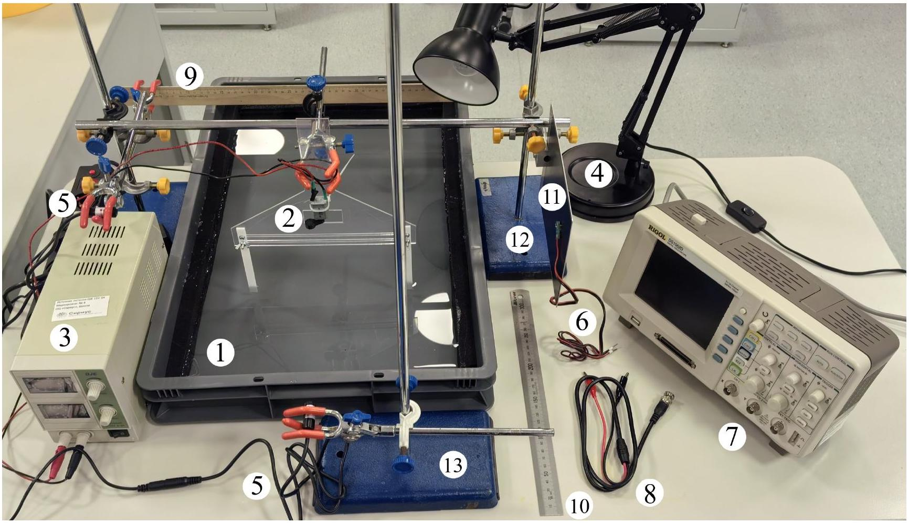
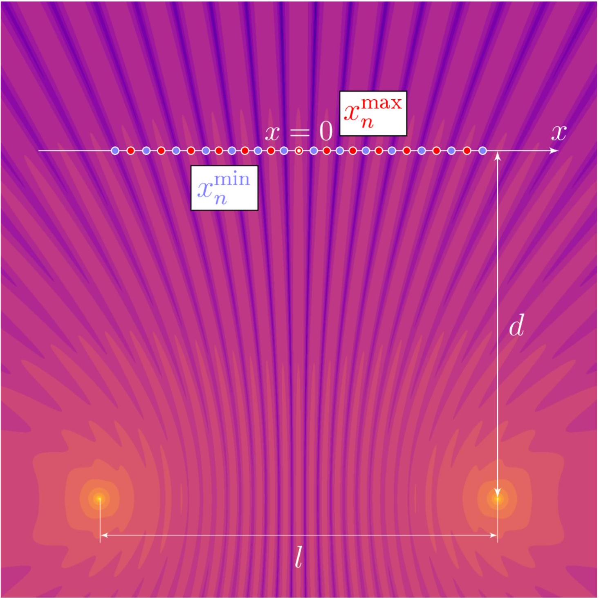
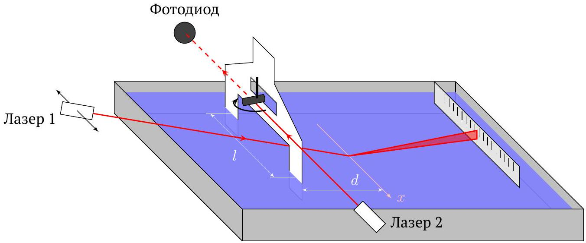

## Road to IPhO

## Волны на воде

Оборудование

1. Контейнер с водой (высота воды примерно равна 3.5 см)
2. Источник волн, подключенный к источнику питания (пластиковая пластина с моторчиком)
3. Лабораторный источник питания
4. Лампа для визуального наблюдения волн
5. Лазерный модуль с блоком питания (2 шт.)
6. Фотодиод с магнитом
7. Осциллограф
8. Соединительный провод BNC-крокодил
9. Линейка деревянная 50 см
10. Линейка металлическая 30 см
11. Экран алюминиевый с магнитным слоем
12. 2 штатива, соединенные перекладиной, посередине перекладины закреплена лапка
13. Штатив (1 шт.)
14. Муфта для крепления лапки штатива (4 шт.)
15. Лапка для штатива (3 шт.)

ВНИМАНИЕ! Не подавайте на двигатель напряжение больше 3 В! Это приведет к его перегоранию!

## Road to IPhO

В данной задаче исследуются волновые свойства колебаний поверхности $z(x, y, t)$ воды. В качестве синфазных монохроматических источников используются колеблющиеся на расстоянии $l$ друг от друга пластиковые полосы. Во всех частях задачи считайте, что:

- каждая из полос создаёт вокруг себя цилиндрические волны:
$$
z(r, t) \approx \operatorname{Re}\left[\frac{A_{0}}{\sqrt{r}} e^{i(\omega t-k r)}\right]
$$
где $r$ - расстояние до полосы
- частота колебаний полос и поверхности воды совпадает с частотой вращения моторчика и остается постоянной при фиксированном напряжении.

На расстоянии $d$ от источников располагается ось $x$. Обозначим координаты узлов $x_{n}^{\min }$, а координаты пучностей $x_{n}^{\text {max }}$.

Соберите следующую установку:

1. Поместите источник волн так, чтобы полосы погружались в воду на глубину около 2.5 см, а линия, соединяющая концы, была параллельна короткой стенке контейнера.
2. Включите источник напряжения и выставьте $U=2.0 \mathrm{~B}$.
3. Посмотрите на отражение лампы в воде и определите область, где волны от двух источников интерферируют.

## Road to IPhO

4. Выключите лампу и направьте луч первого лазера в эту область. Луч должен отражаться от поверхности воды на расстоянии $d \approx 12.5 \mathrm{~cm}$ от источников волн. Зафиксируйте $d$ и не изменяйте его до конца эксперимента!
5. Расположите линейку в лапке штатива так, чтобы на нее попадал отраженный от поверхности воды луч.
6. Направьте луч второго лазера так, чтобы он попадал на эксцентрик двигателя и периодично закрывался по ходу вращения.
7. Расположите фотодиод на экране так, чтобы на него попадал луч второго лазера.
8. Для параллельного смещения лазера 1 вы можете аккуратно прижать штатив с ним к краю контейнера.

Для изменения расстояния между полосами ослабляйте барашковые гайки, перемещайте их (нельзя доставать всю конструкцию из лапки) и затягивайте обратно, чтобы избежать разбалтывания в ходе работы.

## Часть А. Интерференционная схема Юнга (4.5 балла)

A1 Запишите формулу для разности координат $\Delta x=x_{n+1}^{\text {min }}-x_{n}^{\text {min }}=x_{n+1}^{\text {max }}-x_{n}^{\text {max }}$ узлов/пучностей, находящихся 1.0 на прямой $O X$, в приближении $x_{n} \ll l, d$. Ответ выразите через $l, d$ и $\lambda$.

Далее во всей задаче полученную формулу можно использовать в диапазоне $x \in[-l / 2, l / 2]$.

| A2 | Как можно точнее измерьте и запишите используемое значение $d$. | 0.1 |
| :--- | :--- | :--- |
| A3 | Запишите напряжение $U_{0}$ на моторчике, соответствующее частоте $f_{0}=(17.5 \pm 0.5)$ Гц. | 0.1 |
| A4 | Нарисуйте, как меняется амплитуда колебания луча лазера 1 на линейке при изменении координаты $x$. Опишите с помощью схем, рисунков и формул метод, позволяющий с хорошей точностью экспериментально определить $\Delta x$. Обведите в листе ответов, между чем вы будете измерять расстояние (узлами/пучностями). | 1.0 |
| A5 | Измерьте зависимость $\Delta x$ от $l$, при фиксированной частоте моторчика $f_{0}$ (не менее 5 точек). | 1.0 |
| A6 | Постройте линеаризованный график зависимости $\Delta x(l)$. | 0.8 |
| A7 | Определите длину волны волн на воде $\lambda\left(f_{0}\right)$ и оцените ее погрешность. | 0.5 |

## Road to IPhO

Часть В. Дисперсионное соотношение для волн на воде (5.5 балла)
Для волн на поверхности воды выполняется дисперсионное соотношение:

$$
f=\sqrt{\alpha / \lambda+\beta / \lambda^{3}},
$$

где $\alpha>0$ и $\beta>0$.

| B1 | Постройте качественный график зависимости $f$ от $\lambda$, описываемой формулой (1). | 0.3 |
| :--- | :--- | :--- |
|  | Изменяя напряжение на моторчике, можно определить длину волны $\lambda$ для различных частот $f$. В этой части также используйте $d \approx 12.5 \mathrm{~cm}$. Расстояние $l$ между источниками установите максимально возможным. |  |
| B2 | Измерьте и запишите значение $l$. | 0.1 |
| B3 | Измерьте зависимость $\Delta x$ от $f$ в диапазоне $f \in[6.0,24.0]$ Гц (не менее 13 точек). | 3.0 |
| B4 | Постройте линеаризованный график зависимости $\Delta x$ от $f$. | 1.3 |
| B5 | Определите коэффициенты $\alpha, \beta$ и оцените их погрешность. | 0.8 |
