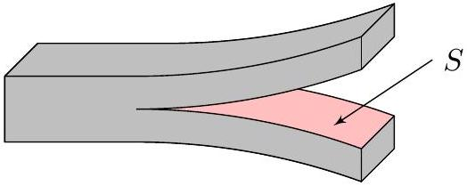
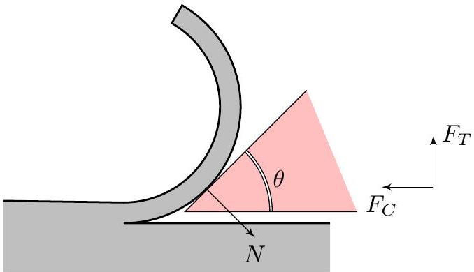
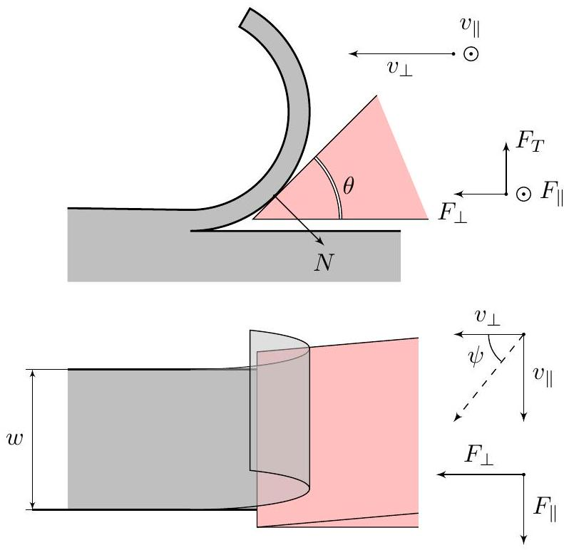
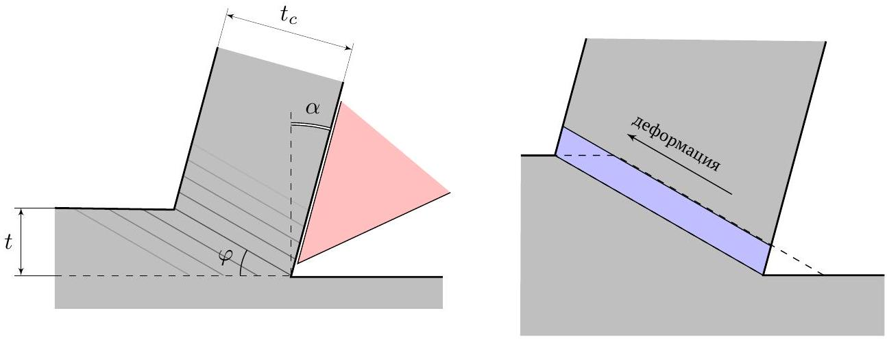
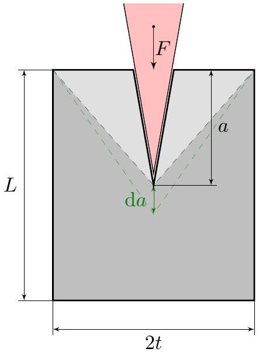

## Road to IPhO

## Физика резки

## Введение

В этой задаче рассматривается модель сил, действующих при резке, упрощенном двумерном процессе, при котором инструмент с прямым лезвием движется перпендикулярно к своему краю, удаляя слой материала постоянной толщины. На протяжении всей задачи считайте инструмент идеально острым. В задаче используются следующие физические величины:

- удельная работа отделения $R$ (в Дж/м²) - работа на отделение единичной площади отреза от материала, например, при разрезе листа с площадью поперечного сечения $S$ выделяется энергия $\Delta E=R S$ (см. рис.1).
- коэффициент трения $\mu$ между инструментом и материалом,

Эти характеристики материалов в процессе резки можно считать постоянными.

Рис.1. Разрез листа

## Часть А. Резка мягких материалов (2.8 балла)

Разрезаемый образец с плоской гранью имеет ширину $w$. Наклонный клин с углом $\theta$ представляет собой острый режущий инструмент. На рис. 2 нижняя грань клина параллельна плоскости разреза и не касается поверхности реза. Таким образом, отрез соприкасается и скользит только по верхней грани.

Введём следующие обозначения сил (см. рис.2) :

- $F_{C}$ - компонента силы, действующей на нож, уравновешивающая силу взаимодействия со стружкой, параллельная плоскости движения ножа и действующая в направлении движения режущей кромки,
- $F_{T}$ - компонента силы, действующей на нож, уравновешивающая силу взаимодействия со стружкой, перпендикулярная поверхности реза и направленная от неё,
- $N$ - нормальная сила реакции, действующая со стороны отреза на нож. Эта сила перпендикулярна верхней плоскости ножа

Рассмотрим резку очень гибкого, мягкого материала. В этой части предполагайте, что отрез не растягивается, а работа, затрачиваемая на изгиб отреза, пренебрежимо мала, то есть работа, выполняемая режущим инструментом, расходуется только на создание новых поверхностей и преодоление трения. Нож взаимодействует с материалом только верхней наклоненной гранью.

Рис. 2

## Road to IPhO

| A1 | Записав закон сохранения энергии для системы, получите уравнение связи между $\theta, R, \mu, w, F_{C}$ и $N$. | 0.8 |
| :--- | :--- | :--- |
| A2 | Определите $F_{C}$. Ответ выразите через $R, \mu, \theta, w$. | 0.8 |
| A3 | Постройте качественный график $F_{C}(\theta)$ при $\mu=0.3$ в диапазоне $\theta \in[0 ; \pi / 2]$. Укажите особые точки и их координаты. $F_{C}$ выражайте в единицах $w R$. | 1.0 |
| A4 | Определите $F_{C}$ и $F_{T}$, пренебрегая трением. Ответы выразите через $R, \theta, w$. | 0.2 |

## Часть В. Косая резка мягких материалов (1.7 балла)

Если одновременно тянуть нож на себя (совмещать «толкание» и «сдвиг»), резка может стать значительно легче. Этот эффект описывается углом $\psi$ между нормалью к лезвию и направлением движения. Нож движется со скоростью $v_{\perp}$ вдоль направления резки и со скоростью $v_{\|}$вдоль линии разреза. В остальном продолжайте работать в модели части A.

B1 Определите полную горизонтальную силу $F$, действующую на нож, пренебрегая трением. Ответ выразите 0.2 через $R, \theta, w, \psi$.

Рис. 3

B2 Определите полную горизонтальную силу $F$, действующую на нож со стороны стружки. Ответ выразите 1.5 через $R, w, \psi, \theta, \mu$.

## Road to IPhO

## Часть С. Образование стружки (3.9 балла)

При резке металлов в срезе происходят необратимые пластические деформации сдвига. В идеализированной модели деформация происходит в тонкой плоскости сдвига, наклоненной под углом $\varphi$ к горизонту (см. рис. 5). Изображенный на рисунке элемент объема металла пересекает эту плоскость, необратимо деформируется и накапливает энергию. Его грани сдвигаются параллельно плоскости сдвига. На рис. 5 справа пунктиром изображена форма элемента до деформации, а голубой прямоугольник - он же после деформации. В системе отсчета клина слой деформированного металла движется по его поверхности с постоянной скоростью.

Верхняя плоскость клина образует угол $\alpha$ с нормалью к поверхности металла. Взаимодействие клина с металлом происходит только на верхней поверхности клина. Пусть $t$ - толщина слоя, который деформируется в ходе разрезания, $t_{c}$ - толщина слоя деформированного металла, который образуется на верхней поверхности клина.

Рис. 5

C1 Из геометрии определите $t_{c}$. Ответ выразите через $t$, углы $\varphi$ и $\alpha$. 0.3

С2 Найдите, при каком угле $\varphi$ толщина стружки $t_{c}$ равна $t$. 0.3

Необходимо учесть энергию сдвига. Для этого рассчитаем относительное смещение слоев. Введем параметр $\gamma=\frac{\left|\vec{v}_{2}-\vec{v}_{1}\right|}{\left|\vec{v}_{1}\right| \sin \varphi}$, где $\vec{v}_{2}$ - скорость слоя после прохождения ножа в системе отсчета ножа, $\vec{v}_{1}$ - скорость слоя до прохождения ножа в системе отсчета ножа.

C3 Определите $\gamma$. Ответ выразите через $\varphi, \alpha$. 1.0

Энергия, необходимая для деформации сдвига, выражается как $\mathrm{d} \Gamma=k \gamma w t \mathrm{~d} r$, где $\mathrm{d} r$ - горизонтальное смещение ножа, $k$ - постоянная величина. Для удобства в следующем пункте можно ввести обозначение $\mu=\operatorname{tg} \beta$. Аналогично части А на нож действуют силы $F_{C}$ и $F_{T}$.

C4 Определите $F_{C}$. Ответ выразите $w, k, t, \varphi, \alpha, \beta, R, \gamma$. 1.2

Традиционно в теориях резки металлов значением удельной работой отделения $R$ пренебрегают.
C5 Запишите выражение $F_{C}$ для металлов. Ответ выразите $w, k, t, \varphi, \alpha$ и $\beta$. 0.1

Это соотношение было приведенно Эрнстом и Мерчантом в 1944 г. Чтобы предсказать силы резки с помощью этого уравнения, необходимо знать $\mu$, а также $\varphi$. Мерчант утверждал, что для заданного $\beta$ угол $\varphi$ будет саморегулироваться таким образом, чтобы минимизировать $F_{C}$.

C6 Вычислите значение угла $\varphi$, при котором сила $F_{C}$ минимальна. Ответ выразите через $\beta$ и $\alpha$. Также определите силу $F_{C}$ согласно теории Мерчанта. Ответ выразите через $w, k, t, \beta$ и $\alpha$.

Экспериментальные данные для металлов не до конца согласуются с теорией Мерчанта и различаются для разных металлов, хотя вид зависимость $\varphi$ от $\beta-\alpha$ совпадает. Эту теорию позднее стали применять для других материалов, в частности полимеров и дерева.

## Road to IPhO

Часть D. Разрезание напряжённого материала (1.6 балла)
Рассмотрим образец, растянутый перпендикулярно направлению разреза. При разрезании энергия деформации высвобождается и питает трещину, так что внешней работы, совершаемой лезвием, требуется меньше. Силы разрезания тем меньше, чем больше предварительное напряжение. Данный факт применяется, например, при резке резины. Лист длины $L$, толщины $w$ и ширины $2 t$, уже содержащий разрез длиной $a$, будет иметь треугольные недеформированные области вдоль разреза (рис. 6). При удлинении разреза на $\mathrm{d} a$ недеформированные области растут и высвобождают упругую энергию деформации $\mathrm{d} \Lambda$.

Рис. 6

D1 Определите силу $F$, действующую на лезвие, при медленной резке. Ответ выразите через $R, t, w, \mathrm{~d} \Lambda / \mathrm{d} a$. 0.8

Рассмотрим растянутый образец, упругое поведение которого при деформации подчиняется линейному соотношению $\sigma=E \varepsilon$, где $E$ - модуль Юнга материала. Резка установилась и происходит квазистатически. Считайте, что напряжение нулевое внутри указанных треугольных областей и равно $\sigma$ во всем остальном листе. Вершины треугольных областей всегда находятся в углах листа и в точке соприкосновения ножа и листа.

D2 При какой минимальной начальной деформации $\varepsilon$ разрез может распространяться самопроизвольно, без затрачивания внешней работы? Ответ выразите через $R, E$ и $t$.
