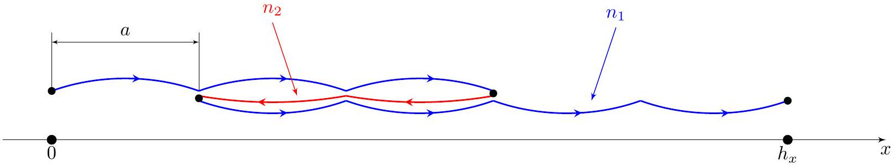
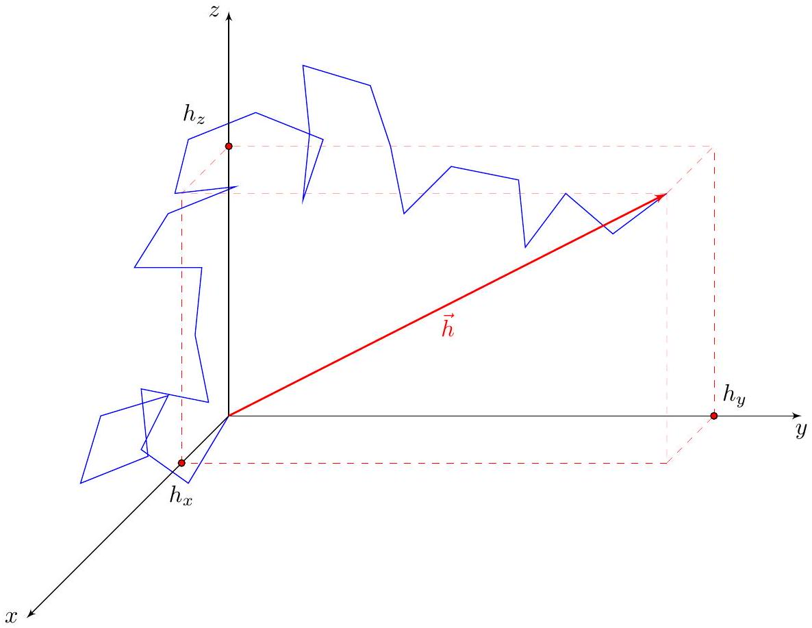
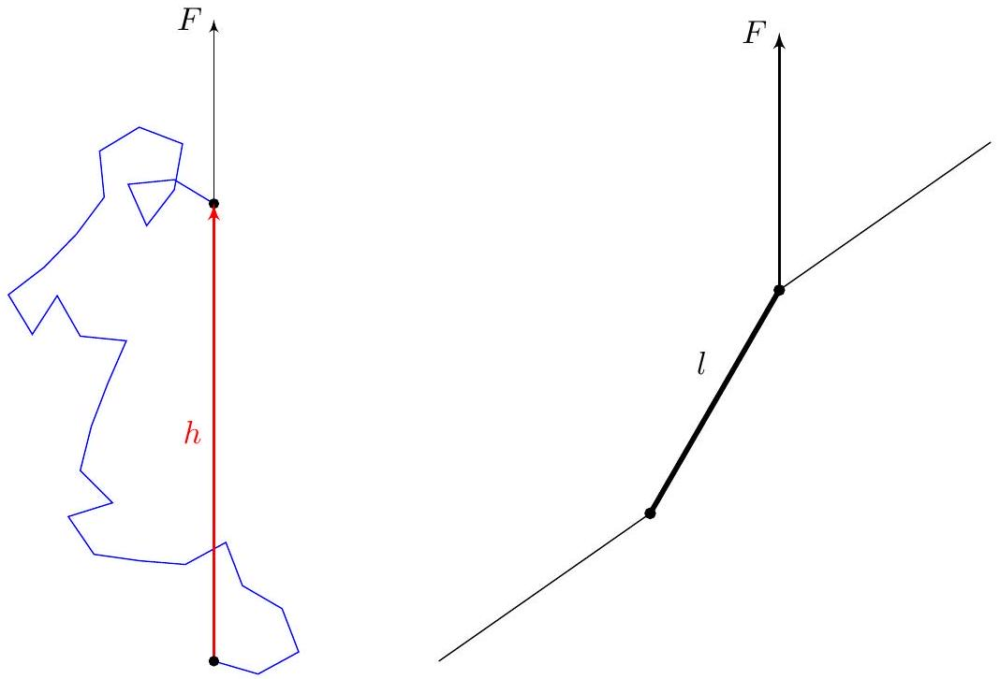
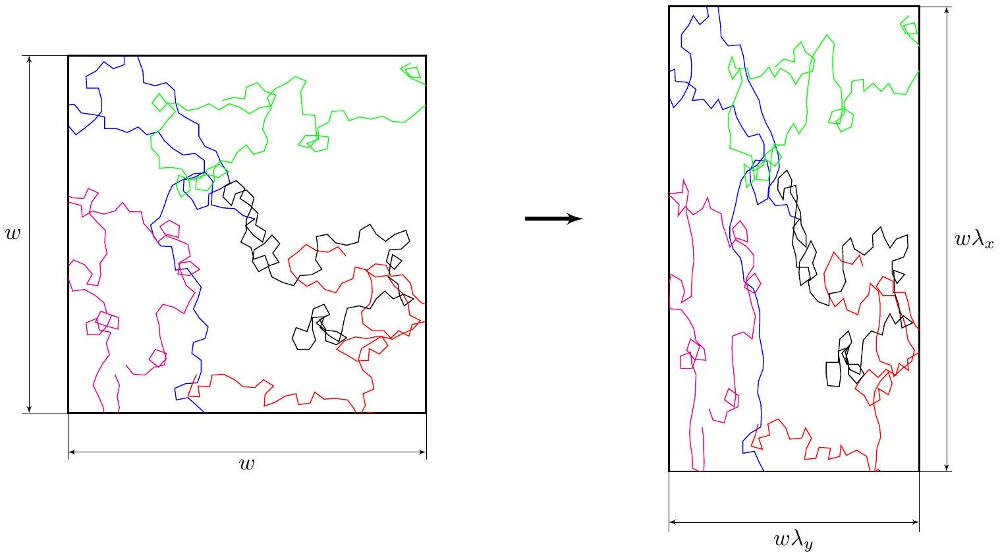

## Road to IPhO

## Физика резины (12 баллов)

Резина представляет собой полимерный материал с уникальной способностью упруго растягиваться без разрушения своей структуры. В процессе растяжения деформация материала происходит не по принципу увеличения межатомных расстояний, как в большинстве твёрдых веществ, а благодаря переориентации длинных молекулярных цепей, из которых он состоит. Именно это молекулярное строение и механизм деформации придают резине её характерные эластичные свойства.

Полимерные молекулы в составе резины представляют собой длинные цепочки атомов, свёрнутые в «клубки». В части А данной задачи Вам предлагается познакомиться с одномерной моделью такой цепочки. Часть В посвящена описанию трёхмерной цепочки, а часть C - описанию всего резинового образца, состоящего из множества полимерных молекул. В части D Вы получите выражение для внутренней энергии упругих тел, а в части E проанализируете необычный тепловой эффект, возникающий при адиабатическом растяжении резины. Все части задачи независимы.

В задаче Вам могут понадобиться следующие постоянные:

- $k=1.38 \cdot 10^{-23}$ Дж/К - постоянная Больцмана;
- $N_{A}=6.02 \cdot 10^{23}$ моль $^{-1}$ - число Авогадро.

## Часть А. Одномерная модель полимера (1.8 балла)

В этой части рассмотрим модель молекулы из $n \gg 1$ одинаковых звеньев длины $a$, расположенных вдоль некоторой оси $x$. Каждое звено может быть ориентировано либо вдоль оси, либо против, оба направления равновероятны. Один конец молекулы закреплен в начале координат, координата второго конца $h_{x}$. Во всех пунктах этой части считается, что $h_{x}$ принимает одно из допустимых значений, кратных $a$. Состояние молекулы с заданным $h_{x}$ можно реализовать большим числом способов, разворачивая различные звенья. Число звеньев, ориентированных в положительном направлении обозначим $n_{1}$, а в отрицательном $n_{2}=n-n_{1}$.

Энтропия определяется как $S=k \ln \Gamma$, где $\Gamma$ - число микроскопических состояний, соответствующих данному макроскопическому.

Математические факты:

1. Если из $n$ объектов нужно выбрать $n_{1}$ объект, это можно сделать
$$
C_{n}^{n_{1}}=\frac{n!}{n_{1}!\left(n-n_{1}\right)!}
$$
способами.
2. При $x \ll n$ с точностью до членов порядка $x^{2}$ в показателе экспоненты
$$
\frac{n!}{(n / 2-x)!(n / 2+x)!} \approx 2^{n} \sqrt{\frac{2}{\pi n}} \exp \left(-\frac{2 x^{2}}{n}\right) .
$$

## Road to IPhO

А2 Покажите, что при $h_{x} \ll n a$ энтропия молекулы имеет вид

$$
S=S_{0}-\gamma h_{x}^{2} .
$$

Выразите коэффициент $\gamma$ через $n$, $a$ и $k$.

A3 Вероятность того, что конец молекулы лежит в интервале $\left[h_{x}, h_{x}+d h_{x}\right]$ ширины $d h_{x} \gg a$, равна $f\left(h_{x}\right) d h_{x}$. $\mathbf{0 . 6}$ Покажите, что при $\left|h_{x}\right| \ll n a$ плотность вероятности $f\left(h_{x}\right)$ имеет вид

$$
f\left(h_{x}\right)=A \exp \left(-\alpha h_{x}^{2}\right)
$$

и выразите постоянные $A$ и $\alpha$ через $n$ и $a$. Считайте, что направления звеньев цепи независимы друг от друга и равновероятны. Примечание: при повороте одного звена $h_{x}$ меняется на $2 a$.

## Часть В. Модель трехмерного полимера (3.5 балла)

Теперь перейдём к трёхмерному случаю. Цепочка состоит из $n \gg 1$ сегментов длины $l$, ориентированных независимо друг от друга и равновероятно во всех направлениях. Пусть $\vec{h}=\left(h_{x}, h_{y}, h_{z}\right)$ - вектор, проведённый из начала молекулы в её конец.

Пусть $\overrightarrow{l_{i}}$ - вектор, направленный от начала $i$-го звена к его концу. Тогда из независимости направлений различных звеньев следует, что при $i \neq j$ среднее скалярное произведение этих векторов равно нулю: $\left\langle\vec{l}_{i} \vec{l}_{j}\right\rangle=0$.

B1 Чему равно $\left\langle h^{2}\right\rangle$ и $\left\langle h_{x}^{2}\right\rangle$ для трёхмерной цепочки? Ответы выразите через $n$ и $l$. Примечание: если Вы не 0.5 смогли выполнить этот пункт, далее во всей задаче можете считать $\left\langle h_{x}^{2}\right\rangle=n l^{2}$.

Можно показать, что плотность вероятности распределения координат конца молекулы также является гауссовой $f(\vec{h})=A \exp \left(-\beta \vec{h}^{2}\right)$, где коэффициент $\beta$ можно определить из того условия, что $f(\vec{h})$ воспроизводит правильное значение $\left\langle h^{2}\right\rangle$.

## Road to IPhO

Напомним, что вероятность того, что проекции вектора $\vec{h}$ лежат в промежутках $\left[h_{x}, h_{x}+d h_{x}\right]$, $\left[h_{y}, h_{y}+d h_{y}\right]$, $\left[h_{z}, h_{z}+d h_{z}\right.$ ] равна $f(\vec{h}) d h_{x} d h_{y} d h_{z}$.

В2 Чему равно среднее расстояние между концами цепочки $\langle h\rangle$ ? Ответ выразите через $n$ и $l$.

Пусть на один конец молекулы действует сила $F$, как показано на рисунке слева. Тогда потенциальная энергия каждого из звеньев будет зависеть от его направления, и у этого конца молекулы появится среднее смещение в направлении действия силы. Для каждого из звеньев распределение по направлениям можно найти, считая, что один его конец закреплен, а на другой действует постоянная по модулю и направлению сила $F$ (см. рис. справа). Тогда поведение звена описывается распределением Больцмана с потенциальной энергией, отвечающей такой силе. Распределения разных звеньев по-прежнему независимы.

B3 Найдите величину среднего смещения второго конца молекулы $h$. Ответ выразите через $F, T, n, l$ и $k$. 1.5 Получите точное выражение и приближённое при малых $F$.

B4 Постройте график зависимости длины молекулы $h$ от приложенной силы. Укажите характерные значения. 0.5

## Часть С. Уравнение состояния полимерной сетки (2.7 балла)

Переплетающиеся цепочки в составе резины связаны между собой случайно образованными химическими связями - «сшивками», образуемыми обычно атомами серы. Таким образом, резина представляет собой практически однородную полимерную сетку.

В данной части задачи мы будем пользоваться следующими предположениями:

- энтропия сетки $S$ равна сумме энтропий отдельных цепей;
- сетка несжимаема, т.е. её объём постоянен;
- цепи сетки деформируются подобно всему образцу;
- отдельные молекулы описываются моделью из части B.

Рассмотрим растяжение образца по трём осям с коэффициентами растяжения $\lambda_{x}, \lambda_{y}$ и $\lambda_{z}$. Из третьего предположения следует, что если до деформации относительное положение конца молекулы описывалось вектором $\vec{h}=\left(h_{x}, h_{y}, h_{z}\right)$, то после деформации положение конца задаётся векотором $\overrightarrow{h^{\prime}}=\left(\lambda_{x} h_{x}, \lambda_{y} h_{y}, \lambda_{z} h_{z}\right)$. Можно показать, что в трёхмерном случае энтропия одной молекулы из части В описывается формулой, аналогичной A1:

$$
S_{1}(\vec{h})=S_{0}-\frac{3 k}{2 n l^{2}}\left(h_{x}^{2}+h_{y}^{2}+h_{z}^{2}\right) .
$$

Оказывается, что энтропия одной цепи в растянутом состоянии $S_{1}^{\prime}$ может быть рассчитана по данной формуле, если в неё подставить расстояние между концами молекулы в растянутом состоянии: $S_{1}^{\prime}=S_{1}\left(\overrightarrow{h^{\prime}}\right)$. Для

## Road to IPhO

расчёта энтропии всей сетки можно умножить полное количество цепочек в сетке $N$ на среднее значение энтропии одной цепочки.

C1 Чему равно изменение энтропии $\Delta S$ всей сетки в результате растяжения? Ответ выразите через 0.7 $k, \lambda_{x}, \lambda_{y}, \lambda_{z}$ и $N$. Примечание: если Вы не смогли сделать B1, то используйте $\left\langle h_{x}^{2}\right\rangle=n l^{2}$.

С2 Рассмотрим растяжение в случае, когда силы прикладываются вдоль одной из осей и растягивают образец вдоль этой оси в $\lambda$ раз, а напряжения вдоль других осей отсутствуют. Чему равно изменение энтропии образца? Ответ выразите через $k, \lambda$ и $N$.

Оказывается, что для резины внутренняя энергия зависит только от температуры и не зависит от деформации образца.

C3 Пользуясь первым началом термодинамики для изотермического процесса и результатом пункта C2, покажите, что уравнение состояния резины (зависимость силы упругости от растяжения и температуры) имеет вид:

$$
F(\lambda, T)=\beta(T)\left(\lambda-\frac{1}{\lambda^{2}}\right) .
$$

Найдите $\beta$. Ответ выразите через $k, N, T$ и длину образца в нерастянутом состоянии $l_{0}$.

С4 Покажите, что при малых деформациях справедлив закон Гука. Найдите модуль Юнга $E$ резины. Ответ выразите через $k, T$ и концентрацию $\nu$ полимерных цепей в образце. Рассчитайте численное значение модуля Юнга, если плотность резины $\rho=1200 \mathrm{к} / \mathrm{m}^{3}$, молярная масса $\mu=10^{5}$ г/моль, температура $T=300 \mathrm{~K}$.

## Часть D. Термодинамика резины (1.8 балла)

Для начала найдём общее выражение для внутренней энергии твёрдых тел. В отличие от идеального газа, внутренняя энергия твёрдых тел может зависеть не только от температуры, но и от их деформации. Рассмотрим стержень объёмом $V$ с модулем Юнга $E(T)$, растянутый вдоль оси до относительного удлинения $\varepsilon$ при температуре $T$. Тогда внутреннюю энергию стержня можно представить в виде суммы двух слагаемых:

$$
U=U_{\text {мех }}+U_{\text {терм }} .
$$

Здесь $U_{\text {мех }}=U_{\text {мех }}(\varepsilon, T)$ - энергия упругой деформации, такая что при $\varepsilon=0$ выполняется $U_{\text {мех }}=0$, $U_{\text {терм }}=U_{\text {терм }}(T)$ - составляющая внутренней энергии, не связанная с деформацией, зависящая только от температуры.

## Road to IPhO

D1 Запишите выражение для $U_{\text {терм }}$. Ответ выразите через теплоёмкость при постоянной длине $C_{l}$ и $T$. Счи- $\mathbf{0 . 2}$ тайте, что $C_{l}$ не зависит от температуры.

Для нахождения $U_{\text {мех }}$ можно воспользоваться методом циклов. Рассмотрим следующий цикл Карно, рабочим телом которого является рассматриваемый стержень.

1. Изотермическое расширение при температуре $T$ от нулевой деформации до деформации $\varepsilon \ll 1$.
2. Адиабатическое увеличение температуры до $T+d T$, где $d T \ll T$. Изменением деформации в этом процессе можно пренебречь.
3. Изотермическое сжатие до малой деформации, такой что можно считать $\varepsilon \approx 0$.
4. Адиабатическое уменьшение температуры до $T$.

В рассматриваемом приближении работа в цикле равна разности работ на изотермах.
D2 Найдите выражение для $U_{\text {мех }}$. Ответ выразите через $V, \varepsilon, T, E(T)$ и $d E(T) / d T$. 1.2

Для резины внутренняя энергия практически не зависит от растяжения:

$$
U \approx U_{\text {терм }}=U(T) .
$$

Это называется моделью «идеальной резины».
D3 Пусть при температуре $T_{0}$ модуль Юнга резины равен $E_{0}$. Найдите модуль Юнга $E$ при температуре $T$ в $\mathbf{0 . 4}$ модели «идеальной резины». Ответ выразите через $E_{0}, T_{0}$ и $T$.

## Часть Е. Термические эффекты при деформации (2.2 балла)

В общем случае для описания поведения резины необходимо учитывать её тепловое расширение. Связь силы $F$, температуры $T$ и удлинения образца $\lambda=l / l_{0}$ в одной из моделей может быть описана эмпирической формулой:

$$
F=\frac{E_{0} S_{0} T}{3 T_{0}}\left(\lambda-\frac{1+3 \alpha\left(T-T_{0}\right)}{\lambda^{2}}\right) .
$$

Здесь $\alpha=2.3 \cdot 10^{-4} \mathrm{~K}^{-1}$ - линейный коэффициент теплового расширения резины, $S_{0}=1 \mathrm{~cm}^{2}$ - площадь поперечного сечения недеформированного образца, $E_{0}=1$ МПа - модуль Юнга при температуре $T_{0}=300 \mathrm{~K}$. Такая зависимость позволяет объяснить интересные термические эффекты. Пусть резиновый образец быстро растягивают так, что теплообменом можно пренебречь, но при этом процесс ещё можно считать обратимым. Можно показать, что в этом случае изменение температуры образца может быть выражено через частную производную силы по температуры при постоянной длине:

$$
\Delta T \approx \frac{T_{0}}{C_{l}} \int_{l_{0}}^{l}\left(\frac{\partial F}{\partial T}\right)_{l} d l
$$

E1 Получите выражение для $\Delta T$. Ответ выразите через $E_{0}, S_{0}, l_{0}, C_{l}, \alpha, T_{0}$ и $\lambda$. Считайте, что $\Delta T=T-T_{0} \ll T_{0}$. $\mathbf{0 . 8}$

E2 Постройте качественный график $\Delta T(\lambda)$. 0.5

E3 При каком растяжении $\lambda_{0}$ наблюдается смена знака $\Delta T$ ? В качестве ответа приведите численное значение. 0.5

E4 Чему равно изменение температуры $\Delta T_{1,2}$ образца при растяжении $\lambda_{1}=1.1$ и $\lambda_{2}=1.4$ ? Для расчётов $\mathbf{0 . 4}$ используйте $l_{0}=1 \mathrm{~m}$ и $C_{l}=150$ Дж/К.
