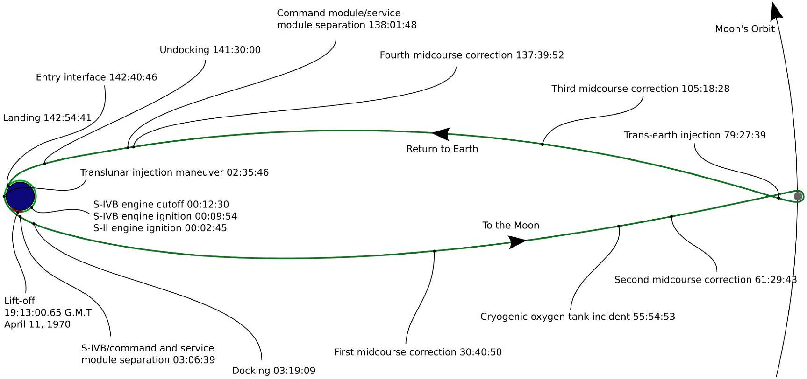
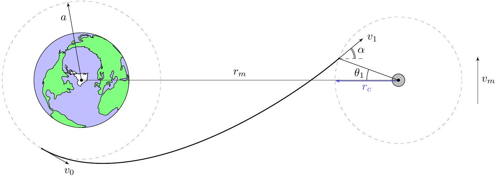
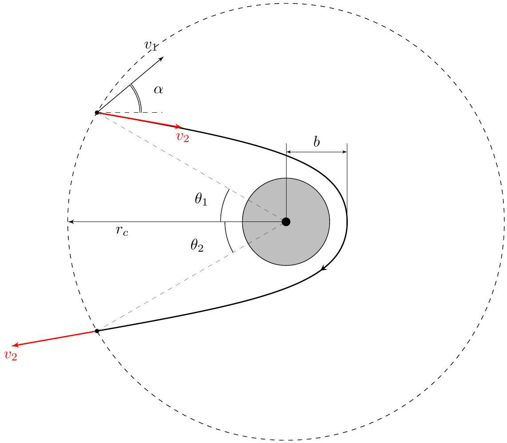

## Road to IPhO

## Полет на Луну

В данной задаче будут рассматриваться орбиты, по которым можно долететь до Луны и вернуться назад.

В простейших задачах, как правило, рассматривается полет на Луну по эллиптической орбите с большой осью, равной $r_{m}$, где $r_{m}$ - расстояние от Земли до Луны.

К сожалению, по ряду причин такая орбита не является самой оптимальной и безопасной. Основным недостатком эллиптической орбиты является захват корабля в поле тяжести Луны. В процессе этого захвата кораблю необходимо выйти на эллиптическую орбиту вокруг Луны с помощью маневровых двигателей, и отказ двигателей в такой ситуации может привести к падению на поверхность Луны.

Эту проблему безопасности решает траектория (орбита) свободного возврата (free-return trajectory). Луна выступает в роли гравитационной рогатки и траектория представляется из себя своего рода восьмерку. Такая орбита использовалась, например, при отправке на Луну советского аппарата Луна-3, а также поговаривают, что именно по ней возвращалась печально известная миссия Аполлон-13 (которая якобы летала к спутнику нашей прекрасной планеты) после аварии при подлете к Луне.

«Хронология» миссии Аполлон-13

В ходе всей задачи могут понадобиться следующие физические постоянные:

- гравитационная постоянная $G=6.67 \cdot 10^{-11} \frac{\mathrm{~m}^{3}}{\text { кг.с }{ }^{2}}$
- масса Земли $M_{e}=6 \cdot 10^{24}$ кг
- масса Луны $M_{m}=\frac{M_{e}}{81}$
- радиус Земли $R_{e}=6400$ км
- радиус Луны $R_{m}=1700$ км
- расстояние между Землей и Луной $r_{m}=3.85 \cdot 10^{8}$ м
- период обращения Луны вокруг Земли $T_{m}=27.4$ суток
- орбитальная скорость Луны $v_{m}=\frac{2 \pi r_{m}}{T_{m}}$

## Road to IPhO

Часть А. Взлет с Земли (3.0 балла)
Для начала рассмотрим процесс взлета с Земли. Довольно известным фактом является, что большую часть массы ракеты составляет топливо первой ступени необходимая для развития первой космической скорости и преодоления земной атмосферы. Точные расчеты таких взлетов предельно сложны. Именно сложность и необходимость учитывать бесконечное множество факторов объясняет немалый процент неудачных стартов ракет. Тем не менее некоторые оценочные значения можно получить из довольно простых соображений.

Рассмотрим вертикальный взлет ракеты с Земли вдоль оси $y$ (ось $y$ направлена вертикально вверх, начальные координата и скорость ракеты равны 0 ). Начальная масса ракеты равна $m_{0}$. На ракету действует сила тяжести и сила сопротивления $\vec{F}=-k v \vec{v}$. Ракета выбрасывает из двигателя продукты сгорания с постоянным массовым расходом $\mu$ и скоростью $u$ относительно ракеты. Считайте, что $g$ мало изменяется с высотой.

Численнные значения:

- $g=9.8 \frac{\mathrm{M}}{\mathrm{c}^{2}}$
- $\mu=2700 \frac{\mathrm{~K} \Gamma}{\mathrm{c}}$
- $u=4.5 \frac{\mathrm{KM}}{\mathrm{c}}$
- $k=0.25 \frac{\text { кг }}{\text { м }}$ - значение коэффициента силы сопротивление вблизи поверхности Земли
- $a=6600 \mathrm{Km}$
- $m_{0}=500$ т

A1 Запишите выражения для $\ddot{y}$ через $\dot{y}, k, m_{0}, \mu, u, g$ и $t$.

На начальном этапе взлёта скорость ракеты мала, поэтому трением можно пренебречь. Найдём в каких пределах работает эта модель при вертикальном взлёте.

А2 Пренебрегая силой сопротивления, найдите скорость ракеты $v(m)$ и координату $y(m)$ в момент, когда её 1.0 масса равна $m$. Выразите ответ через $m, g, u, \mu$ и $m_{0}$.

А3 Используя результат прошлого пункта и считая, что $k$ слабо зависит от высоты, найдите численно, на какой 0.8 высоте $H_{c}$ будет находиться ракета в момент, когда сила сопротивления станет равна силе тяжести.

Высота плотных слоёв атмосферы порядка 10 км, поэтому на больших высотах сила сопротивления становится пренебрежимо мало. В силу этого факта не будем учитывать его и в следующем вопросе.

A4 Рассматривая вертикальный взлёт, численно оцените отношение $\beta_{1}$ начальной к конечной массе ракеты, 0.7 при котором ракета развивает скорость $v_{a}$ (скорость движения по круговой орбите радиуса $a$ ).

В реальности ракета выводится на орбиту по сложной траектории, поэтому полученное значение не совпадает в точности с действительным значением. В дальнейшем считайте, что реальное значение $\beta_{1}=15$.

## Road to IPhO

## Часть В. Траектория свободного возврата (6.0 балла)

Перейдем непосредственно к задаче о рассмотрении орбиты свободного возврата.
Для начала найдем область в которой гравитационное притяжение Луны влияет больше чем притяжение Земли.

B1 Рассмотрим точку на прямой Земля - Луна между Землёй и Луной, в которой силы притяжения Земли и Луны равны по модулю. Найдите расстояние $r_{c}$ от Луны до данной точки. Ответ выразите через $r_{m}, M_{e}$ и $M_{m}$.

В дальнейшем ВО ВСЕХ ПУНКТАХ ЗАДАЧИ будем называть сферу радиуса $r_{c}$ вокруг Луны зоной притяжения Луны и считать, что в ней изменение потенциальной энергии тела $\Delta U=\Delta U_{m}$ (т.е. взаимодействием с Землей можно пренебречь), а во всем остальном пространстве $\Delta U=\Delta U_{e}$ (т.е. взаимодействием с Луной можно пренебречь).

Также во всех пунктах считайте, что СО Луны - поступательно движущаяся.
Пусть корабль изначально находится на круговой околоземной орбите радиуса $a$. В нужный момент времени он включает двигатели и разгоняется до скорости $v_{0}$ ( $\vec{v}_{0}$ направлена по касательной к изначальной круговой орбите), такой, что может достигнуть зоны притяжения Луны. Минимальное расстояние между центром Луны и кораблем в процессе движения - $b$. Прямо перед входом в зону притяжения Луны скорость корабля в СO Земли равна $v_{1}$.

Введем обозначения для 2-ых космических скоростей для соответствующих орбит:

$$
\begin{aligned}
v_{\mathrm{II}}^{e} & =\sqrt{\frac{2 G M_{e}}{a}} \\
v_{\mathrm{II}}^{m} & =\sqrt{\frac{2 G M_{m}}{b}}
\end{aligned}
$$

Пусть $\theta_{1}$ и $\theta_{2}$ углы показанные на рисунке. В общем виде орбита свободного возврата не обязана быть симметричной, и траектория возврата может отличаться от траектории полета к Луне. Для простоты расчетов будем рассматривать орбиту симметричную относительно прямой Земля - Луна. Тогда угол $\theta_{1}=\theta_{2}=\theta$. Обозначим $\alpha$ угол между скоростью $v_{1}$ и прямой Земля - Луна.

## Road to IPhO

Далее, для определения необходимой скорости $v_{1}$, будем рассматривать орбиту корабля в СО Луны в ее зоне притяжения. Для удобства введем обозначения $s=\sin (\alpha+\theta), s^{\prime}=\sin \alpha, c=\cos \theta$.

B2 Рассматривая корабль в СО Луны, запишите выражение для удельного момента импульса $L_{0}^{m}$ относительно центра Луны и скорости $v_{2}$ в момент, когда расстояние до Луны равно $r_{c}$. Ответ выразите через $s, s^{\prime}, c, v_{1}$, $v_{m}$ и $r_{c}$.

B3 Записывая ЗСЭ в СО Луны для ближайшего к Луне положения корабля и положения сразу после входа в зону притяжения, получите и решите квадратное уравнение и получите точное выражение для $v_{1} / v_{m}$. Ответ выразите через $s, s^{\prime}, c, b / r_{c}$ и $v_{\text {II }}^{m} / v_{m}$.
Примечание. Выбирать знак корня в этом пункте не нужно. Не забудьте, что в рамках используемой модели, взаимодействие с Землёй в этой области учитывать не нужно.

Перейдем к анализу полученного выражения для $v_{1}$. Далее используются следующие соотношения между величинами:

- $b / r_{c} \ll 1$
- $a / r_{m} \ll 1$
- $r_{c} / r_{m} \ll 1$

В4 Покажите что выражение для $v_{1}$, полученное в пункте B4, при разложении до первого порядка по степеням $b / r_{c}$ приводится к виду:

$$
v_{1} \approx \frac{v_{m} c}{s}+B_{0} \cdot \frac{b}{r_{c}}
$$

Выразите $B_{0}$ через $v_{m}, v_{\mathrm{II}}^{m}, s, c$ и $s^{\prime}$. Выбирая знак корня, покажите, что $B_{0}>0$.

## Road to IPhO

Далее во всех пунктах задачи считайте, что дополнительно выполнено $\alpha \ll 1$.
B5 Покажите, что выражение для $v_{1}$ с точностью до первого порядка имеет вид:

$$
v_{1} \approx \frac{v_{m}}{\operatorname{tg} \theta}+A \alpha+B \frac{b}{r_{c}}
$$

Выразите $A$ и $B$ через $v_{m}, v_{\mathrm{II}}^{m}, \theta$.

В6 Вернёмся в систему отсчёта Земли, чтобы найти выражение для угла $\alpha$ между скоростью $v_{1}$ и прямой Земля - Луна.
Найдите выражение для $\alpha$ между скоростью $v_{1}$ и прямой Земля - Луна с точностью до первого порядка по степеням $r_{c} / r_{m}$ и $a / r_{m}$. Ответ выразите через $a, r_{c}, r_{m}, v_{1}, v_{0}$ и $\theta$.
Примечание. Не забудьте, что в рамках используемой модели, взаимодействие с Луной в этой области учитывать не нужно.

B7 Записывая ЗСЭ в СО Земли и, пренебрегая слагаемыми порядка $a / r_{m}$ и $r_{c} / r_{m}$, выразите скорость $v_{0}$ через $v_{1}$ и $v_{\text {II }}^{e}$.
Примечание. Не забудьте, что в рамках используемой модели, взаимодействие с Луной в этой области учитывать не нужно.

Вновь вернёмся в СО Луны. До сих пор мы нигде не использовали условие симметричности орбиты. Воспользуемся этим условием и построим гиперболу симметричную относительно прямой Земля-Луна и проходящую через заданные точки: точки входа и выхода в и из зоны притяжения Луны и перицентр орбиты.

B8 Записывая уравнение конического сечения, получите уравнение, из которого можно найти $\theta$, через $v_{1}, \alpha$, $v_{m}, G, M_{m}, b$ и $r_{c}$.

Полученная система уравнений на $v_{1}, \alpha$ и $\theta$ может быть приближенно решена численно, но в этой задаче не будем этим заниматься. Получаемая скорость $v_{1}$ будет на порядок меньше $v_{\mathrm{II}}^{e}$. Тогда $v_{0}=v_{\mathrm{II}}^{e}$.

В9 Найдите $\beta_{2}$ - отношение начальной массы ракеты к конечной при разгоне от скорости $v_{a}$ - орбитальной скорости при движении по круговой орбите радиуса $a$ до скорости $v_{0}$. Ответ выразите через $u, v_{\mathrm{II}}^{e}$ и $v_{a}$. Рассчитайте численное значение $\beta_{2}$, необходимые для расчётов величины возьмите из части A.

## Часть С. Прилунение (1.0 балла)

В данной части рассмотрим прилунение. Будем рассматривать случай близкого подлёта в Луне, для численных расчётов считайте $b=1800$ км. Учитывая, что $h=b-R_{m} \ll R_{m}$, с хорошей точностью можно считать, что топливо тратится только на торможение до нулевой скорости в ближайшей к Луне точке.

С1 Считая $v_{2}=1.5 \mathrm{км} / \mathrm{c}$ (остальные необходимые величины возьмите из прошлых частей задачи), рассчитайте численно, во сколько раз уменьшится масса ракеты в процессе прилунения $\beta_{3}$.

С2 Рассчитайте численно какую начальную массу $m$ должна иметь ракета для доставки на Луну груза весом 40 т.
