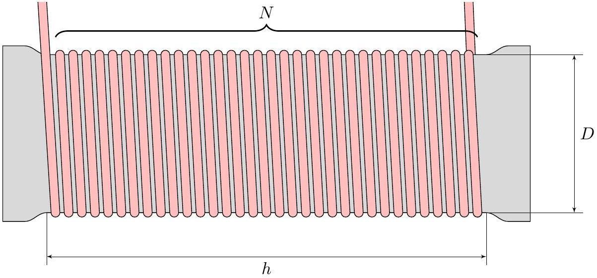
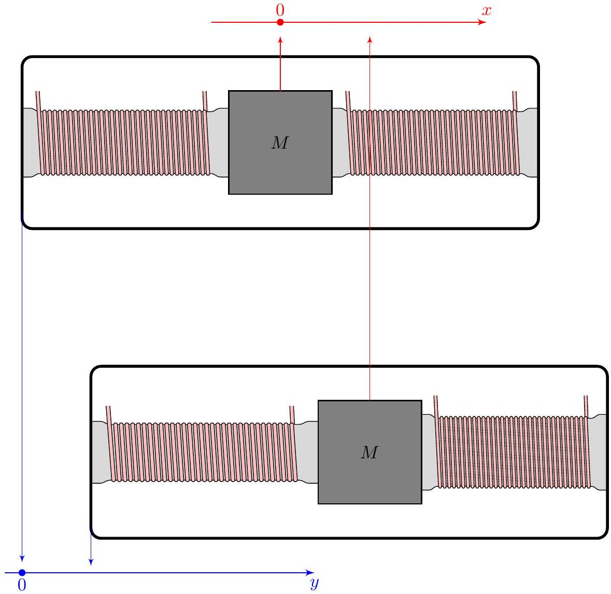
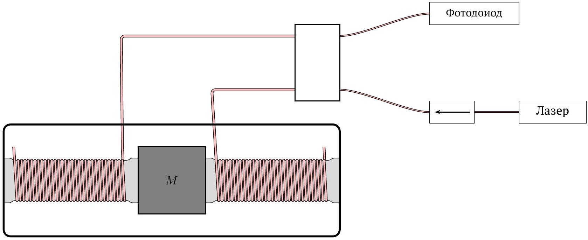
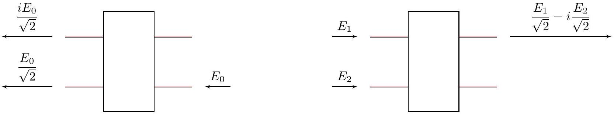
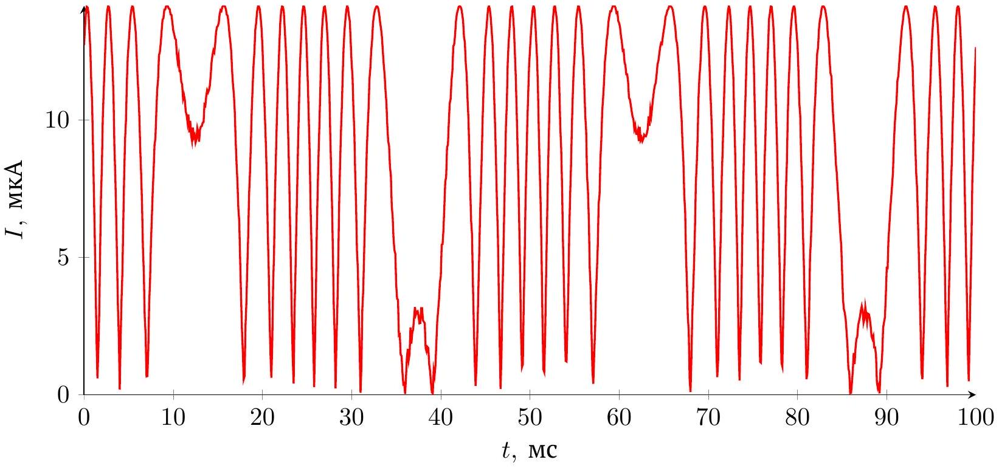

## Road to IPhO

## Волоконный акселерометр

Оптические схемы на основе оптоволокна позволяют изготавливать недорогие и при этом чувствительные сенсоры. В качестве примера рассмотрим волоконный акселерометр - прибор, измеряющий ускорение.

Постоянная Больцмана $k_{B}=1.38 \cdot 10^{-23}$ Дж/K.

## Часть А. Сейсмический сенсор (3.3 балла)

Вокруг резиновой опоры туго намотан жесткий провод диаметром $d=80$ мкм и модулем Юнга $E=74.0$ ГПа. Количество оборотов провода равно $N=80$, высота области намотки $h=2.00$ см, диаметр области намотки $D=3.50$ см.

Силиконовая резина является таким материалом, форма которого чрезвычайно легко может меняться, но при этом ее объемная упругость очень велика. Поэтому объем резины внутри области намотки не меняется.

Допустим, высота области намотки изменилась и стала $h+\delta h, \delta h \ll h$, а диаметр $D+\delta D$.

A1 Выразите изменение диаметра области намотки $\delta D$ через $D, h$ и $\delta h$. 0.2

Из-за деформации резины длина провода стала $L+\delta L$.
A2 Изменение полной длины провода $\delta L$ пропорционально $\delta h$ 0.1
$\delta L=\Lambda \delta h$.
Выразите $\Lambda$ через $N, D, h$. Количество оборотов $N$ жестко зафиксировано.

Рассмотрим груз массы $M=540$ г, зажатый между двумя одинаковыми вертикальными опорами, рассмотренными ранее. Опоры жестко скреплены с недеформируемым корпусом сенсора.

Положение груза массы $M$ в лабораторной системе отсчета (ЛСО) обозначим за $x$ а положение корпуса сенсора в ЛСО обозначим за $y$. Равновесию соответствует $x=y=0$.

## Road to IPhO

A4 Пусть в некоторый момент времени корпус смещен ( $y \neq 0$ ) и груз не находится в равновесии ( $x \neq y$ ). $\mathbf{0 . 5}$ Получите уравнение движения груза в виде

$$
\ddot{x}+\omega_{0}^{2} x=A y .
$$

Выразите $\omega_{0}$ и $A$ через $M, h, N, D, d$ и $E$.
В любой механической системе есть диссипации, поэтому уравнение движения груза, на самом деле, имеет вид

$$
\ddot{x}+2 \zeta \omega_{0} \dot{x}+\omega_{0}^{2} x=A y,
$$

где $\zeta \ll 1$ - коэффициент диссипации. Предположим, что корпус сенсора испытывает гармонические колебания $y=y_{0} e^{i \omega t}$. Тогда груз тоже колеблется, $x=x_{0} e^{i \omega t}$, а вместе с ним для левой опоры $\delta h=h_{0} e^{i \omega t}$ и $\delta L=L_{0} e^{i \omega t}$.

А5 Выразите $L_{0}$ через $y_{0}, \omega / \omega_{0}, \Lambda$ и $\zeta$.

Для частот $\omega$ вдали от резонансной $\omega_{0}$ сенсор работает либо в режиме сейсмографа: $y(t)=K_{s} \cdot \delta L(t)$, либо в режиме акселерометра: $\ddot{y}(t)=K_{a} \cdot \delta L(t)$, где $y(t)$ - суперпозиция нескольких низкочастотных или высокочастотных колебаний.

Пример низкочастотных колебаний:

$$
y(t)=B_{1} \sin \left(\omega_{1} t\right)+B_{2} \cos \left(\omega_{2} t\right),
$$

где $\omega_{1,2} \ll \omega_{0}$. Низкочастотная область характеризуется тем, что $\zeta \ll \omega_{1,2} / \omega_{0}$.
А6 Укажите соответствие между областями частот и режимами работы сенсора. Выразите $K_{s}$ и $K_{a}$ через $M, h, \mathbf{1 . 0}$ $N, D, d$ и $E$.

## Road to IPhO

## Часть В. Волоконный интерферометр (6.7 балла)

Если в качестве жесткого провода для сенсора, описанного в части A, использовать два отрезка оптоволокна, то для измерения $\delta L$ можно использовать изображенную ниже интерферометрическую схему. Показатель преломления сердцевины оптоволокна $n=1.47$.

В этой части продолжают использоваться обозначения и значения величин из части A.

- В качестве источника света используется лазер интенсивностью $I_{0}$ с длиной волны $\lambda=1.15$ мкм. Через изолятор (он пропускает свет только в одном направлении) свет идет в $2 \times 2$ разветвитель $50 / 50$.
- Разделившись, свет попадает в пару отрезков оптоволокна, намотанных на левую и правую опоры сенсора.
- На конце отрезков свет отражается от их края с амплитудным коэффициентом отражения $r$.
- После отражения от края волокон свет снова проходит через разветвитель и попадает на фотодиод, регистрирующий полезный сигнал.

Принцип работы разветвителя следующий: если со стороны лазера падает волна с комплексной амплитудой $E_{0}$, то она выходит из обоих выходов с другой стороны с комплексными амплитудами $E_{0} / \sqrt{2}$ и $i E_{0} / \sqrt{2}$.

Если со стороны измерительной системы падают волны с комплексными амплитудами $E_{1}$ и $E_{2}$, то со стороны фотодиода выходит волна с комплексной амплитудой $E_{1} / \sqrt{2}-i E_{2} / \sqrt{2}$.

Пусть сенсор оказался в таком состоянии, что правая опора сжата, а длина намотанного на нее волокна увеличена на $\delta L$.

## Road to IPhO

Сенсор тестируется для $y(t)=Y \sin (2 \pi f t)$. Зависимость показаний силы тока через фотодиод от времени представлена на рисунке. Сенсор работает в режиме акселерометра.

Найдем строгий теоретический предел для минимальной величины ускорения, которое можно исследовать с помощью акселерометра при работе при комнатной температуре $T$.

B3 Пользуясь теоремой о равномерном распределении энергии по степеням свободы, запишите выражение для $\left\langle\delta L^{2}\right\rangle$ - флуктуаций $\delta L$ при комнатной температуре. Ответ выразите через постоянную Больцмана $k_{B}$, $T, E, D, N$ и $d$.

Кварц, из которого изготовлена сердцевина оптоволокна, имеет температурную дисперсию $\beta=\mathrm{d} n / \mathrm{d} T=7.6 \cdot 10^{-6} \mathrm{~K}^{-1}$ и коэффициент температурного расширения $\alpha=\mathrm{d} L /(L \mathrm{~d} T)=0.54 \cdot 10^{-6} \mathrm{~K}^{-1}$.

Разделим оптическое волокно длиной $L$ на $P$ небольших участков длины $\Delta L$. При прохождении света через $i$-ый участок набегает фаза $\varphi_{i, 0}$. При этом на всем волокне набегает фаза $\Phi_{0}=\sum_{i}^{P} \varphi_{i, 0}$.

B4 Если температура этого участка оптического волокна отличается от комнатной на малую величину $\Delta T_{i}$, то при прохождении света через него набегает фаза $\varphi_{i} \neq \varphi_{i, 0}$. Выразите $\Delta \varphi_{i}=\varphi_{i}-\varphi_{i, 0}$ через $\Delta T_{i}, \Delta L_{i}, \alpha, \beta, n$ и $\lambda$.

Будем считать, что отличие температуры от комнатной $\Delta T_{i}$ является случайным, независимым (для $i \neq j$ выполняется, что $\left\langle\Delta T_{i} \Delta T_{j}\right\rangle=0$ ). При этом оно является в среднем нулевым, $\left\langle\Delta T_{i}\right\rangle=0$, и имеет одинаковую дисперсию $\left\langle\Delta T_{i}^{2}\right\rangle=\left\langle\Delta T^{2}\right\rangle$.

Суммарное изменение набега фазы, вызванное тепловыми флуктуациями, при прохождении (в одну сторону) через волокно длиной $L$ равно $\Delta \Phi=\sum_{i=1}^{P} \Delta \varphi_{i}$.

B5 Выразите $\left\langle\Delta \Phi^{2}\right\rangle$ через $\left\langle\Delta T^{2}\right\rangle, \Delta L, L, n, \alpha, \beta$ и $\lambda$.
Суммарное изменение набега фазы, вызванное тепловыми флуктуациями, при прохождении через волокно туда-обратно (с отражением от второго торца) обозначим за $\Delta \Psi$.

## Road to IPhO

B7 Найдите среднеквадратичную разность изменений набега фазы на двух плечах интерферометра 0.6 $\left\langle\left(\Delta \Psi_{1}-\Delta \Psi_{2}\right)^{2}\right\rangle$. Ответ выразите через $\left\langle\Delta \Psi^{2}\right\rangle$.

Величину $\Delta L$ - длину участка, вдоль которого температура считается постоянной, будем считать равной 30.0 мкм.

B8 Считайте, что сенсор работает при $T=305 \mathrm{~K}$, а величина температурных флуктуаций $\left\langle\Delta T^{2}\right\rangle$ составляет 1.0 $1.0 \cdot 10^{-6} \mathrm{~K}^{2}$. Какое минимальное ускорение $a_{\min }$ возможно измерить с помощью предложенного сенсора?
