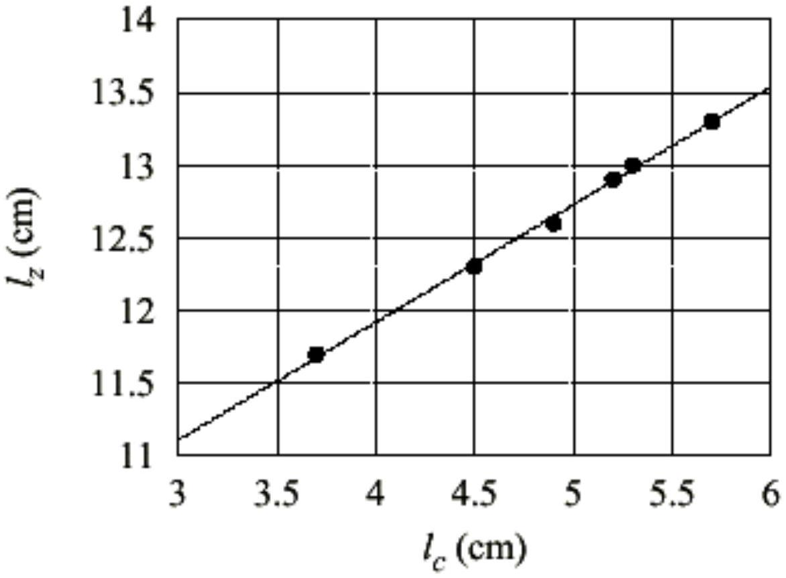

## SOLUTIONS TO EXPERIMENTAL COMPETITION

APRIL 25, 2000

Time available : 5 hours

READ THIS FIRST :

1. Use only the pen provided.
2. Use only the marked side of the paper
3. Each problem should be answered on separate sheets
4. In your answers please user primarily symbols, equations, numbers, graphs, tables and as little text as possible.
5. Write at the top of every sheet in your report:
    - Your candidate number (AphO identification number).
    - The problem number and section identification, e.g.2/a.
    - Number each sheet consecutively.
6. Write on the front page the total number of sheets in your report

## Solution to Problem 1

## Determination of the density of oil

## Experimental Configuration

This experiment is an application of Archimedes' law. The basic experimental configuration is accordingly described by Figure 1. It is assumed in this figure that the tube is in an up-right position (perpendicular to water surface). It is also clear that the same reference point must be used for measuring the positions of water or oil surfaces.

Figure 1: Experimental configuration and experimental quantities to be measured.

In order to apply the law accurately to the experiment, one needs to express the precise volume occupied by the liquid inside the tube, and the volume of water displaced outside the tube. For that purpose, more detailed annotation must be introduced on the dimensional features of the test tube as shown in Figure 2.

Figure 2: Specification of test tube.

## Theoretical formulation

The complete listing of notations to be used in the theoretical formulation along with their corresponding definitions are given below
$S _ { c } =$ internal cross-section of the tube above point A
$S z =$ external cross-section of the tube above point A
$V o =$ internal volume of the test tube below point A
$V e =$ external volume of the test tube below point A
$= V o$ volume of the glass below point A
$l z =$ distance between point A and the water surface outside the tube
$l _ { c } =$ distance between point A and the liquid surface inside the tube
$r c =$ density of the liquid inside the tube
$= \rho w$ for water
$= \rho o$ for oil
$M =$ mass of the empty test tube

At equilibrium, the buoyancy or the Archimedes force $\mathrm { F } _ { \mathrm { A } }$ is equal to the total weight $W$ of the test tube including the liquid inside it. Referring to Figure 1 and 2 as well as the Notations listed above, we are led to the following expressions:

$$
\begin{aligned}
& F _ { A } = \left( V _ { e } + S _ { z } l _ { z } \right) \rho _ { w } g \\
& W = \left( M + V _ { 0 } \rho _ { c } + S _ { c } l _ { c } \rho _ { c } \right) g
\end{aligned}
$$

The equilibrium condition specified by $F A = W$ implies

$$
\left( V _ { e } + S _ { z } l _ { z } \right) \rho _ { w } = M + \left( V _ { 0 } + S _ { c } l _ { c } \right) \rho _ { c }
$$

This equation can be put into the form:

$$
l _ { z } = C + D l _ { c }
$$

where

$$
\begin{aligned}
D & = \frac { \rho _ { c } S _ { c } } { \rho _ { w } S _ { z } } \\
C & = \frac { M + V _ { 0 } \rho _ { c } - V _ { e } \rho _ { w } } { \rho _ { w } S _ { z } }
\end{aligned}
$$

Since the coefficient D does not depend on the zero point of $l z$ and $l c$, the reference point A in this experiment can be chosen at some convenient point on the tube within its length of uniform cross-section as implied by the above formulation.

## Measurements

In the first part of the experiment, water is used as the liquid filling the test tube to various levels corresponding to different sets of values for the pair $l z$ and $l c$. Plotting $l z$ as a function of $l _ { c }$ on the graph paper leads to the determination of $\mathrm { D } _ { 1 }$,

$$
D _ { 1 } = \frac { S _ { c } } { S _ { z } }
$$

since $\rho _ { \mathrm { c } } = \rho _ { \omega }$ in this case.
The same measurements are repeated in the second part, replacing water with oil for the liquid inside the tube. The result is the then given by

$$
D _ { 2 } = \frac { \rho _ { 0 } S _ { c } } { \rho _ { w } S _ { z } }
$$

Equation $S c S z$ from the two equations results in the relation

$$
\rho _ { 0 } = \left( \frac { D _ { 2 } } { D _ { 1 } } \right) \rho _ { w }
$$

## Experimental result

The experimental results consist of two parts. The results shown in Table 1 and 2 were obtained by using water and the oil as the filling liquids respectively.

Table 1: Data from experiment 1 (water).
| distance from the bottom | lc (cm) | lz (cm) |
| :--- | :--- | :--- |
| 2.5 | 3.7 | 11.7 |
| 2.0 | 4.5 | 12.3 |
| 1.7 | 4.9 | 12.6 |
| 1.4 | 5.2 | 12.9 |
| 1.3 | 5.3 | 13.0 |
| 1.0 | 5.7 | 13.3 |

The value of $\mathrm { D } _ { 1 }$ determined from the slope of the plot in Figure 3 is

$$
\mathrm { D } _ { 1 } = 0.8091
$$

Table 2: Data from experiment 2 (parafin).
| distance from the bottom | lc (cm) | lz (cm) |
| :--- | :--- | :--- |
| 1.8 | 5.7 | 12.5 |
| 1.7 | 6.0 | 12.6 |
| 1.5 | 6.0 | 12.8 |
| 1.3 | 6.4 | 13.0 |
| 1.0 | 6.8 | 13.3 |
| 0.8 | 7.2 | 13.5 |

Figure 3: A plot of $l _ { z }$ vs $l _ { c }$ from data in Table 1.

The value of $\mathrm { D } _ { 2 }$ determined from the slope of the plot in Figure 4 is

$$
\mathrm { D } _ { 2 } = 0.6865
$$

The final result for $\rho _ { 0 } \& \Delta \rho _ { 0 }$ are

$$
\begin{aligned}
& \rho _ { 0 } = 0.8484 \\
& \Delta \rho _ { 0 } = 0.04 \%
\end{aligned}
$$

## Remarks

1. For typical test tube, the ratio $S c / S z$ is about 0.8 instead of 1 .
2. All water and liquid surface positions to be measured must lie within the length of the tube with uniform cross-section.
3. For the determination of $\mathrm { D } _ { 1 }$ and $\mathrm { D } _ { 2 }$, one should try to get more than 2 data points and draw the line with the best fit.
4. The test tube should be dried before measurement with the oil.
5. The most crucial problem in this experiment is how to get enough data (more than two data points) with the narrowly limited range of 2-2.5 cm available for $l z$ variation.

## Suggested Grading Scheme

## Theoretical Part

| 1. Statement of the equilibrium condition $F A W$ | (1.0 p) |
| :--- | :--- |
| 2. Expression for $F A$ | (1.0 p) |
| 3. Expression for $W$ | (1.0 p) |
| 4. Expression for $l z$ as a function of $l c$ including expression for $C \& D$ | (1.5 p) |
| 5. Expression of the formula $\rho _ { 0 } = \rho _ { w } \left( D _ { 2 } / D _ { 1 } \right)$ | (1.5 p) |

## Experimental Part

1. Description of experiment detailing (3.0 p) the experimental configuration (1.0 p) quantities to be measured (1.0 p) procedure of measurement (1.0 p)
2. Measurement result of $l z$ - $l c$ for water (more than 2 data points) (2.0 p)
3. Measurement result of $l z$ - $l c$ for oil (more than 2 data points) (2.0 p)
4. Determination of $\mathrm { D } _ { 1 }$ and $\mathrm { D } _ { 2 }$ (1.0 p)
5. Determination of $\rho _ { 0 }$ (1.0 p)
6. Accuracy of the value of $\rho \mathrm { o }$ (max 3.0 p) within $5 \%$ of the real value $\rho _ { 0 } 0.84 \mathrm {~g} / \mathrm { cm } ^ { 3 }$ (3.0 p) (2.0 p)
7. Estimation of uncertainties or errors (2.0 p)

## Solution to Problem 2

## Determination of Stefan-Boltzmann constant

## Theoretical Consideration

According to the theory of electromagnetic radiation of solids, the polished aluminum cylinder, which can be regarded as an ideal reflector, does not absorb nor emit any radiation. On the other hand, the same cylinder covered by a thin layer of candle's soot is assumed to behave as an ideal black body, which is a perfect absorber and emitter of thermal radiation.

Therefore, the hot polished cylinder is expected to lose its thermal energy by means of non-radiative mechanism, such as thermal conductivity and convection of surrounding air. In contrast, the hot blackened cylinder will lose its thermal energy by an additional process of thermal radiation according to Stefan-Boltzmann law.

Based on the different physical processes described above, 3 different methods of experiment can be formulated as follows:

1. Method of constant temperature
Assume that the cylinder is heated to the same temperature $T$ when it is unblackened (polished) and when it is blackened by the soot. The difference in the measured electric power needed to reach that same equilibrium temperature must be equal to power loss due to radiative process. In other words,
$$
P _ { r } ( T ) = P _ { t } ( T ) - P _ { n } ( T )
$$
where:
$\mathrm { P } _ { \mathrm { r } } ( \mathrm { T } ) =$ power loss of the blackened cylinder due to thermal radiation
$\mathrm { P } _ { \mathrm { t } } ( \mathrm { T } ) =$ total power loss of the blackened cylinder at $T$
$\mathrm { P } _ { \mathrm { n } } ( \mathrm { T } ) =$ power loss of the polished cylinder at $T$ due to nonradiative processes
Assuming the same $\mathrm { P } _ { \mathrm { n } } \mathrm { T } =$ in both cases (polished and blackened), one obtains
$$
\sigma = \frac { P _ { t } ( T ) - P _ { n } ( T ) } { S \left( T ^ { 4 } - T _ { 0 } ^ { 4 } \right) }
$$

where $T o$ is the surrounding (or room) temperature
Alternatively, although less accurately, other methods may also be formulated by explicitly assuming that $P n$ is proportional to ( $T - T _ { 0 }$ ), namely

$$
P _ { n } ( T ) = k \left( T - T _ { 0 } \right)
$$

where $k$ is a constant independent of T. On the basis of this relation, one can formulate the following two methods for the determination of $\sigma$.
2. Method of constant power

In this method, the power of heating $P$ is kept the same in both cases. Let the temperatures reached in equilibrium for the polished and blackened cylinder be denoted by $T p$ and $T b$ respectively. Then,

$$
\begin{aligned}
& P = k \left( T _ { p } - T _ { 0 } \right) \\
& P = k \left( T _ { b } - T _ { 0 } \right) + \mathrm { P } _ { r } \left( T _ { b } \right)
\end{aligned}
$$

Eliminating $k$ yields

$$
P _ { r } \left( T _ { b } \right) = \frac { \left( T _ { p } - T _ { b } \right) P } { \left( T _ { p } - T _ { 0 } \right) }
$$

Equating this to the radiative power expression of the Stefan-Boltzmann law, we Obtain

$$
\sigma = \frac { \left( T _ { p } - T _ { b } \right) P } { S \left( T _ { b } ^ { 4 } - T _ { 0 } ^ { 4 } \right) \left( T _ { p } - T _ { 0 } \right) }
$$

3. Method of two temperatures

In this case, the measurements are performed for the blackened cylinder only, but at two equlibrium temperatures $\mathrm { T } _ { 1 }$ and $\mathrm { T } _ { 2 }$. Let the heating powers required to reach
$\mathrm { T } _ { 1 }$ and $\mathrm { T } _ { 2 }$ be $\mathrm { P } _ { 1 }$ and $\mathrm { P } _ { 2 }$ respectively. Then we have

$$
\begin{aligned}
& P _ { 1 } = k \left( T _ { 1 } - T _ { 0 } \right) + \sigma S \left( T _ { 1 } ^ { 4 } - T _ { 0 } ^ { 4 } \right) \\
& P _ { 2 } = k \left( T _ { 2 } - T _ { 0 } \right) + \sigma S \left( T _ { 2 } ^ { 4 } - T _ { 0 } ^ { 4 } \right)
\end{aligned}
$$

Again, eliminating $k$ from the two equations above leads directly to the following

Expression

$$
\sigma = \frac { \left( T _ { 2 } - T _ { 0 } \right) - \left( T _ { 1 } - T _ { 0 } \right) P _ { 2 } } { S \left[ \left( T _ { 1 } ^ { 4 } - T _ { 0 } ^ { 4 } \right) \left( T _ { 2 } - T _ { 0 } \right) - \left( T _ { 2 } ^ { 4 } - T _ { 0 } ^ { 4 } \right) \left( T _ { 1 } - T _ { 0 } \right) \right] }
$$

## Remarks

The formulation of the first experimental method requires the insurance of the same $T$ in both cases. Since $P$ is proportional to $T ^ { 4 }$, a small difference in $T$ determined in two cases will result in great error. It is, however, not easy to satisfy the requirement mentioned above. One way of overcoming this difficulty is to measure the power $P t$ for heating up the blackened cylinder at two temperatures in the vicinity of the temperature reached by the unblackened cylinder, and interpolate the value of $P t$ at the right T.

It is also worth noting that due to the sensitivity of the measurement, a slight change in the surrounding of the cylinder is likely to affect the result significantly. The environment must therefore be kept constant during the experiment.

## Experimental Configuration

The experimental set-up is described in Figure 1. The heater is mounted on a porcelain base, and it is connected with a power supply and the measuring meters. The heater is entirely enclosed by the hollow cylinder which sits also on the same porcelain plate during the measurement. The thermocouple is permanently attached to the cylinder and connected to an mV-meter for the determination of the temperature by using a table listing the characteristics of the thermocouple. The size of the cylinder is 60 mm by length and 12.5 mm by its external diameter, leading to a surface area of $\mathrm { S } = 24.8 \mathrm {~cm} ^ { 2 }$. The wall of the cylinder is about 1 mm thick and the thickness of its base is about 3 mm. All electrical measuring meters are digital instruments.

The power supplied to the heater must be measured separately instead of being read off the power supply display panel, because the resistance of the heater varies somewhat with temperature. The reading of $V$ and $I$ should be done at thermal equilibrium between the cylinder and its surrounding, which will be reached in about 25-30 minutes. In order to avoid undesirable effects from the surrounding, the whole system should be kept at a distance from other objects in the laboratory.

## Results of measurement

In a set of experiments performed at room temperature of 298.8 K, the results obtained are represented by the sample data given in Table 1.

Table 1: The values of $\sigma$ found in a set of three measurements
| Code name for the data | Surface condition during measurement | Data |  |  |
| :--- | :--- | :--- | :--- | :--- |
|  |  | V | A | TK |
| $a$ | polished | 9.8 | 1.50 | 485.5 |
| $b$ | blackened | 9.8 | 1.50 | 433.5 |
| $c$ | blackened | 11.9 | 1.82 | 485.5 |

## Discussion

While the last two methods are supposed to be less accurate than the first one, this is not always confirmed by the experimental results, as the control of experimental condition is not perfect. The major factors affecting the accuracies of the experimental results are enumerated and discussed as follows:

1. The cylinder is not necessarily an ideal reflector when it surface is polished, nor is it an ideal black body when its surface is blackened by the candle's soot. In other words, the absorption coefficient is likely to be larger than 0 in the first case, and less than 1 for the second case. Both of these effects leads to lower value of s .
2. The heat losses via the porcelain base are out of control. Neglecting these losses will lead to deviation of $\sigma$ from its real value.
3. The resistivities of the connecting cables have been neglected also, leading to larger value of s.

Table 2: Results of $\sigma$ obtained by three different methods
| Method used | Data used | Experimental result $\sigma e x W m ^ { 2 } K ^ { 4 }$ | $\sigma _ { \mathrm { ex } } \sigma$ |
| :--- | :--- | :--- | :--- |
| constant $T$ | $a + c$ | 5.945 | 1.05 |
| constant $P$ | $a + b$ | 6.087 | 1.07 |
| two T;s | $b + c$ | 5.386 | 0.95 |

4. The assumption of equal non-radiative loss for the case with polished and blackened surfaces is at best an approximation. For instance, the difference between thermal conductivity of the soot and that of aluminium is neglected in this experiment, leading to lower value of s. The equality will also be violated due to uncontrollable heat losses via the porcelain base.
5. The influences of air convection in the surrounding of the cylinder due to motions of the experimentator and other objects are also possible sources of errors.

## Suggested Grading Scheme

## Theoretical part

1. Statement of non-radiative nature of the thermal energy loss in the case of cylinder with polished surface ( 1.0 p )
2. Recognition of non-radiative as well as radiative contributions to energy loss in the case of cylinder with blackened surface (1.5 p)
3. Assumption of equal non-radiative losses in both cases for the same final equilibrium temperature $T$ ( 2.0 p )
4. Derivation of formula for $\sigma$ (2.5 p)

## Remarks

In case the participants employ the second or the third method, the first three item in the grading scheme for the theoretical part should be accordingly adjusted and combined as folllows.

1. Statements on radiative and non-radiative processes of heat trans-fer

2. Assumption of linear dependence of non radiative loss on tem-perature difference (2.0 p)

## Experimental part

1. Description of the experimental set-up (4.0 p)
The wiring of measuring instruments (1.5 p)
Method and procedure of measurement (1.5 p)
The quantities to be measured (1.0 p)
2. Results of measurement (data of $V A$ and T) (3.0 p)
3. Value of $\sigma ( 1.0 \mathrm { p } )$
4. Accuracy of value of $\sigma$ (max 3.0 p)
within 10\% of the real value $\sigma = 5.67 \times 10 ^ { - 8 } \mathrm {~W} \mathrm {~m} ^ { - 2 } \mathrm {~K} ^ { - 4 }$ (3.0 p)
between $10 \%$ and $20 \%$ of the real value (2.0 p)
5. Estimation of uncertainties or errors (2.0 p)
