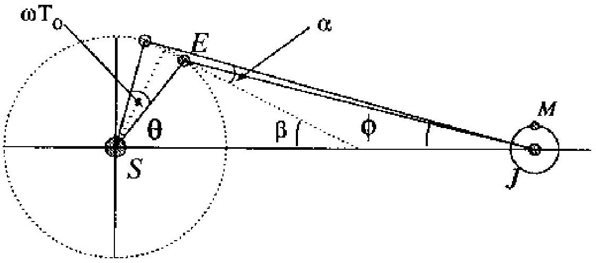

## Solution Problem 1

Eclipses of the Jupiter's Satellite

a. ( Total Point : 1 ) Assume the orbits of the earth and Jupiter are circles, we can write the centripetal force = equal gravitational attraction of the Sun.
$$
\begin{align*}
& G \frac { M _ { E } M _ { s } } { R _ { E } ^ { 2 } } = \frac { M _ { E } V _ { E } ^ { 2 } } { R _ { E } } \\
& G \frac { M _ { J } M _ { S } } { R _ { J } ^ { 2 } } = \frac { M _ { J } V _ { J } ^ { 2 } } { R _ { J } } \tag{0.5point}
\end{align*}
$$
where
$$
\begin{aligned}
\mathrm { G } & = \text { universal gravitational constant } \\
\mathrm { M } _ { \mathrm { S } } & = \text { mass of the Sun } \\
\mathrm { M } _ { \mathrm { E } } & = \text { mass of the Earth } \\
\mathrm { M } _ { \mathrm { J } } & = \text { mass of the Jupiter } \\
\mathrm { R } _ { \mathrm { E } } & = \text { radius of the orbit of the Earth } \\
\mathrm { V } _ { \mathrm { E } } & = \text { velocity of the Earth } \\
\mathrm { V } _ { \mathrm { J } } & = \text { velocity of Jupiter }
\end{aligned}
$$
Hence
$$
\frac { R _ { J } } { R _ { E } } = \left( \frac { v _ { E } } { v _ { J } } \right) ^ { 2 }
$$
We know
$$
\begin{aligned}
& T _ { E } = \frac { 2 \pi } { \omega _ { E } } = \frac { 2 \pi R _ { E } } { v _ { E } } , \text { and } \\
& T _ { J } = \frac { 2 \pi } { \omega _ { J } } = \frac { 2 \pi R _ { J } } { v _ { J } }
\end{aligned}
$$

we get
$$
\begin{aligned}
& \frac { T _ { E } } { T _ { J } } = \frac { \frac { R _ { E } } { v _ { E } } } { \frac { R _ { J } } { v _ { J } } } = \left( \frac { R _ { E } } { R _ { J } } \right) ^ { 3 / 2 } \\
& R _ { J } = 779.8 \times 10 ^ { 6 } \mathrm {~km}
\end{aligned}
$$

b. (Total Point: 1 ) The relative angular velocity is
$$
\begin{align*}
\omega & = \omega _ { E } - \omega _ { J } = 2 \pi \left( \frac { 1 } { 365 } - \frac { 1 } { 11.9 \times 365 } \right) \\
& = 0.0157 \mathrm { rad } / \text { day } \tag{0.5point}
\end{align*}
$$
and the relative velocity is
$$
\begin{align*}
v & = \omega R _ { E } = 2.36 \times 10 ^ { 6 } \mathrm {~km} / \text { day } \\
& = 27.3 \times 10 ^ { 3 } \mathrm {~km} \tag{0.5point}
\end{align*}
$$
c. ( Total Point: 3 ) The distance of Jupiter to the Earth can be written as follows
$$
\begin{align*}
\mathrm { d } ( t ) & = \mathrm { R } _ { J } - \mathrm { R } _ { E } \\
\mathrm {~d} ( t ) \cdot \mathrm { d } ( t ) & = \left( \mathrm { R } _ { J } - \mathrm { R } _ { E } \right) \cdot \left( \mathrm { R } _ { J } - \mathrm { R } _ { E } \right) \tag{1.0point}
\end{align*}
$$
$$
\begin{aligned}
\mathrm { d } ( t ) & = \left( \mathrm { R } _ { \mathrm { J } } ^ { 2 } + \mathrm { R } _ { \mathrm { E } } ^ { 2 } - 2 R _ { E } R _ { J } \cos \omega t \right) ^ { \frac { 1 } { 2 } } \\
& \approx R _ { J } \left( 1 - 2 \left( \frac { R _ { E } } { R _ { J } } \right) \cos \omega t + \ldots \right) ^ { \frac { 1 } { 2 } } \\
& \approx R _ { J } \left( 1 - \frac { R _ { E } } { R _ { J } } \cos \omega t + \ldots \right)
\end{aligned}
$$

Figure 1: Geometrical relationship to get $\Delta d ( t )$

The relative error of the above expression is the order of

$$
\left( \frac { R _ { E } } { R _ { J } } \right) ^ { 2 } \approx 4 \%
$$

The observer saw M begin to emerge from the shadow when his position was at $d ( t )$ and he saw the next emergence when his position was at $d ( t + T 0 ) /$ Light need time to travel the distance $\Delta d = d \left( t + T _ { 0 } \right) - d ( t )$ so the observer will get apparent period T instead of the true period $T _ { o }$.

$$
\begin{align*}
\Delta d & = R _ { E } \left( \cos \omega t - \cos \omega \left( t + T _ { 0 } \right) \right) \\
& \approx R _ { E } \omega T _ { 0 } \sin \omega t \tag{1.0}
\end{align*}
$$

point)
because $\omega T _ { 0 } \approx 0.03 , \sin \omega t + \ldots , \cos \omega T _ { 0 } \approx 1 - \ldots$
We can also get this approximation directly from the geometrical relationship from Figure 1.
(1.0 point)
or we can use another method.

From the figure above we get

$$
\begin{aligned}
\beta & = ( \phi + \alpha ) \\
\frac { \omega T _ { 0 } } { 2 } + \beta + \theta & = \frac { \pi } { 2 }
\end{aligned}
$$

$$
\begin{align*}
\Delta d & \approx \omega T _ { 0 } R _ { E } \cos \alpha \\
& \approx \omega T _ { 0 } R _ { E } \sin \left( \omega t + \frac { \omega T _ { 0 } } { 2 } + \phi \right) \\
\omega T _ { 0 } & \approx 0.03 \text { and } \phi \approx 0.19 \tag{1.0point}
\end{align*}
$$

d. ( Total Point: 2)

$$
\begin{align*}
T - T _ { 0 } & \approx \frac { \Delta d ( t ) } { c } ; c = \text { velocity of light } \\
T & \approx T _ { 0 } + \frac { \Delta d ( t ) } { c } = T _ { 0 } + \frac { R _ { E } \omega T _ { 0 } \sin \omega t } { c } \tag{1.0point}
\end{align*}
$$

e. Total Point : 2 from

$$
T _ { \max } = T _ { 0 } + \frac { R _ { E } \omega T _ { 0 } } { c }
$$

we get

$$
\frac { R _ { E } \omega T _ { 0 } } { c } = 15
$$

Hence

$$
\begin{equation*}
\mathrm { C } = 2.78 \times 10 ^ { 5 } \mathrm {~km} / \mathrm { s } \tag{1.0point}
\end{equation*}
$$
