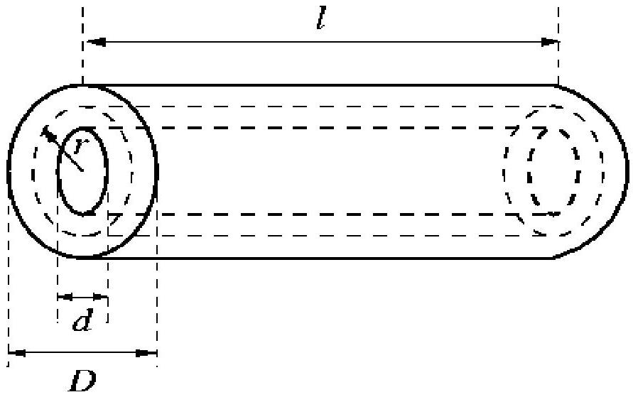

## Solution Problem 2

Detection of Alpha Particles

a. From the given range-energy relation and the data supplied we get
$$
E = \left( \frac { R \alpha } { 0.318 } \right) ^ { \frac { 2 } { 3 } } M e V = \left( \frac { 5.50 } { 0.318 } \right) ^ { \frac { 2 } { 3 } } = 6.69 M e V
$$
(0.5 point)
since $\mathrm { W } _ { \text {ion-pair } } = 35 \mathrm { eV }$, then
$$
N _ { \text {ion- } \rho \text { air } } = \frac { 6.69 \times 10 ^ { 6 } } { 35 } = 1.9 \times 10 ^ { 5 }
$$
(0.5 point)
Size of voltage pulse:
$$
\begin{aligned}
& \Delta V = \frac { \Delta Q } { C } = \frac { N _ { \text {air-pair } } e } { C } \\
& \text { with } C = 45 p F = 4.5 \times 10 ^ { - 11 }
\end{aligned}
$$
(0.5 point)
Hence
$$
\Delta V = \frac { 1.9 \times 10 ^ { 5 } \times 1.6 \times 10 ^ { - 19 } } { 4.5 \times 10 ^ { - 11 } } V = 0.68 m V
$$
(0.5 point)
b. Electrons from the ions-pairs produced by $\alpha$ particles from a radioactive sources of activity A (=number of $\alpha$ particles emitted by the sources per second) which enter the detector with detection efficiency 0.1 , will produce a collected current.
$$
\begin{aligned}
I & = \frac { Q } { t } = 0.1 \times A N _ { \text {ion-pair } } e \\
& = 0.1 \times A \times 1.9 \times 10 ^ { 5 } \times 1.6 \times 10 ^ { - 19 } A
\end{aligned}
$$
(1.0 point)
With $\mathrm { I } _ { \text {min } } = 10 ^ { - 12 } \mathrm {~A}$, the
$$
A _ { \min } = \frac { 10 ^ { - 12 } \mathrm { dis } s ^ { - 1 } } { 1.6 \times 1.9 \times 10 ^ { - 15 } } = 330 \mathrm { dis } s ^ { - 1 }
$$
(1.0 point)

Since $1 \mathrm { Ci } = 3.7 \times 10 ^ { 10 } \mathrm { dis } \mathrm { s } ^ { - 1 }$ then
$$
\begin{equation*}
A _ { \min } = \frac { 330 } { 3.7 \times 10 ^ { 10 } } C i = 8.92 \times 10 ^ { - 9 } C i \tag{1.0point}
\end{equation*}
$$
c. With time constant
$$
\begin{gather*}
\tau = R C \left( \text { with } \mathrm { C } = 45 \times 10 ^ { - 12 } \mathrm {~F} \right) = 10 ^ { - 3 } \mathrm {~s} \\
R = \left( \frac { 1000 } { 45 } \right) M \Omega = 22.22 M \Omega \tag{0.5point}
\end{gather*}
$$
For the voltage signal with height $\Delta \mathrm { V } = 0.68 \mathrm { mV }$ generated at the anode of the ionization chamber by 6.69 MeV $\alpha$ particles in problem (a), to achieve q 0.25 V= 250mV voltage signal, the necessary gain of the voltage pulse amplifier should be
$$
\begin{equation*}
G = \frac { 250 } { 0.68 } = 368 \tag{0.5point}
\end{equation*}
$$
d. By symmetry , the electric field is directed radially and depends only on distance the axis and can be deducted by using Gauss' theorem.
If we construct a Gaussian surface which is a cylinder of radius $\tau$ and length $l$, the charge contained within it is $\sigma l$.
The surface integral
$$
\int E . d S = 2 \pi r l E
$$

Figure 1 : The Gaussian surface used to calculate the electric field E.

(1.0 point)

Since the field E is everywhere constant and normal to the curved surface. By Gauss's theorem :

$$
2 \pi r l E = \frac { \lambda l } { \varepsilon _ { 0 } }
$$

so

$$
\mathrm { E } ( r ) = \frac { \lambda } { 2 \pi \varepsilon _ { 0 } r }
$$

Since E is radial and varies only with $\tau$, then $E = - \frac { d V } { d r }$ and the potential V can be found by integrating $\mathrm { E } ( \tau )$ with respect to $\tau$, if we call the potential of inner wire $\mathrm { V } _ { 0 }$, we have

$$
V ( r ) - V _ { 0 } = - \frac { \lambda } { 2 \pi \varepsilon _ { 0 } } \int _ { \frac { d } { 2 } } ^ { \tau } \frac { d r } { r }
$$

Thus

$$
\begin{equation*}
V ( r ) - V _ { 0 } = - \frac { \lambda } { 2 \pi \varepsilon _ { 0 } } \ln \left( \frac { 2 r } { d } \right) \tag{1.0point}
\end{equation*}
$$

We can use this expression to evaluate the voltage between the capacitor's conductors by setting $r = \frac { D } { 2 }$, giving a potential difference of

$$
V = \frac { \lambda } { 2 \pi \varepsilon _ { 0 } } \ln \left( \frac { D } { d } \right)
$$

since the charge Q in the capacitor is $\sigma l$, and the capacitance C is defined by $\mathrm { Q } = \mathrm { CV }$, the capacitance per unit length is

$$
\begin{equation*}
\frac { 2 \pi \varepsilon L _ { 0 } } { \ln \frac { D } { d } } \tag{1.0point}
\end{equation*}
$$

The maximum electric field occurs where r minimum, i.e. at $r = \frac { d } { 2 }$. if we set the field at $r = \frac { d } { 2 }$ equal to the breakdown field $\mathrm { E } _ { \mathrm { b } }$, our expression for E ® shows that the charges per unit length $\sigma$ in the capacitor must be $\mathrm { E } _ { \mathrm { b } } \pi _ { 0 } \mathrm {~d}$. Substituting for the potential difference V across the capacitor gives

$$
V = \frac { 1 } { 2 } E _ { b } d \ln \left( \frac { D } { d } \right)
$$

Taking $\mathrm { E } _ { \mathrm { b } } = 3 \times 10 ^ { 6 } \mathrm {~V} , \mathrm {~d} = 1 \mathrm {~mm}$, and $\mathrm { D } = 1 \mathrm {~cm}$, gives $\mathrm { V } = 3.453 .45 \mathrm { kV }$. $\square$

## Solution to Problem 3

Stewart-Tolman Effect

Consider a single ring first
Let us take into account a small part of the ring and introduce a reference system in which this part is a rest. The ring is moving with certain angular acceleration $\alpha$. Thus, our reference system is not an inertial one and there exists certain linear acceleration in it. The radial component of this acceleration may be neglected as the ring is very thin and no radial effects should be observed in it. The tangential component of the linear acceleration along the considered part of the ring is $\mathrm { r } \alpha$. When we speak about the reference system in which the positive ions forming the crystal lattice of the metal are at rest. In this system certain inertial force acts on the electrons. This inertial force has the value $m r \alpha$ and its oriented in a opposite side to the acceleration mentioned above.

An interaction between the electrons and crystal lattice does not allow electrons to increase their velocity without any limitations. This interaction, according to the Ohm's law, is increasing when the velocity of electrons with respect to the crystal lattice in increasing. At some moment equilibrium between the inertial force and the breaking force due the interaction with the lattice is reached. The net results is that the positive ions and the negative electrons are moving with different velocities; its means that in the system in which the ions are at rest an electric current will flow!

The inertial force is constant and in each point is tangent to the ring. It's acts onto the electrons in the same way as certain fictitious electric field tangent to the ring in each point.

Now we shall find value of this fictitious electric field. Of course, the force due to it should be equal to the inertial force. Thus:

$$
e E = m r \alpha
$$

Therefore:

$$
E = \frac { m r \alpha } { e }
$$

In the ring 9 at rest) with resistance R , the field of the above value would generate a current:

$$
I = \frac { 2 \pi r E } { R }
$$

Thus, the current in the considered ring should be :

$$
I = \frac { 2 \pi m r ^ { 2 } \alpha } { R }
$$

It is true that the field E is a fictitious electric field. But it describes a real action of the inertial force onto electrons. The current flowing in the ring is real! .

The above considerations allow us to treat the system described in the system described in the text of the problem as a very long solenoid consisting of $n$ loops per unit of length (along the symmetry axis), in which the current I is flowing. It is well known that the magnitude of the field B inside such solenoid (far from its end) is homogenous and its value is equal:

$$
\begin{aligned}
& B = \mu _ { 0 } \eta I \\
& \mathrm {~B} = \mu \mu _ { 0 } \eta I
\end{aligned}
$$

where $\mu _ { 0 }$ denotes the permeability of vacuum. Thus, since the point at the axis is not rotating, it is at rest both in the non-inertial and in the laboratory frame, hence the magnetic field at the center of the axis in the laboratory frame is

$$
B = \frac { 2 \pi \mu _ { 0 } n m r ^ { 2 } } { e R }
$$

It seems that this problem is very instructive as in spite of the fact that the rings are electrically neutral, in the system - unexpectedly., due to a specific structure of matter - there occurs a magnetic field. Moreover, it seems that due to this problem it is easier to understand why the electrical term: electromotive force" contains a mechanical term "force" inside.
