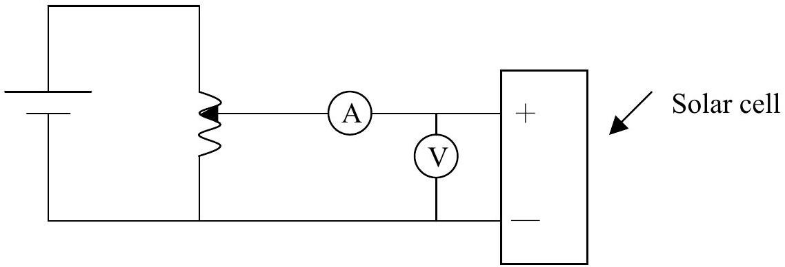
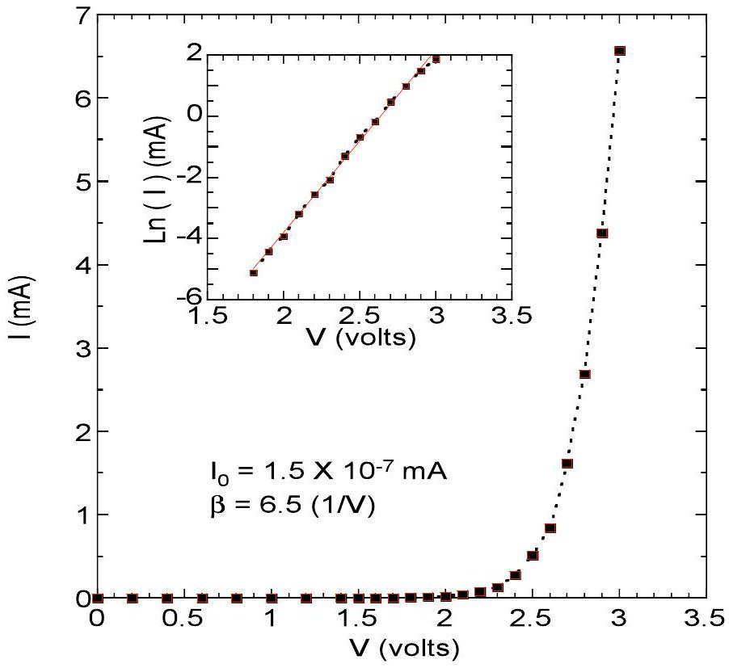
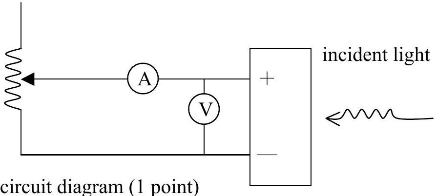
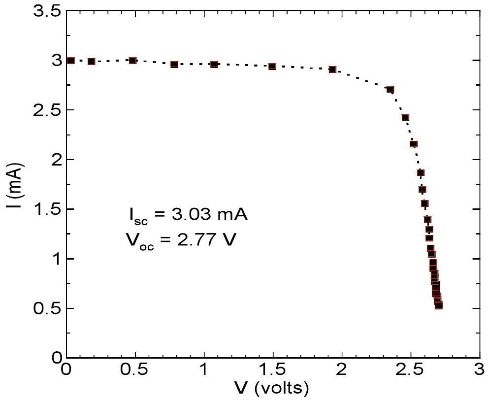
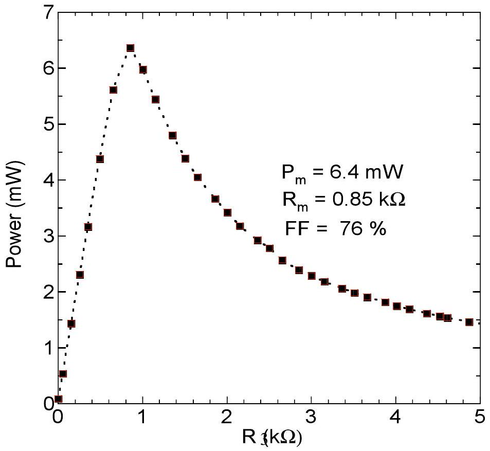
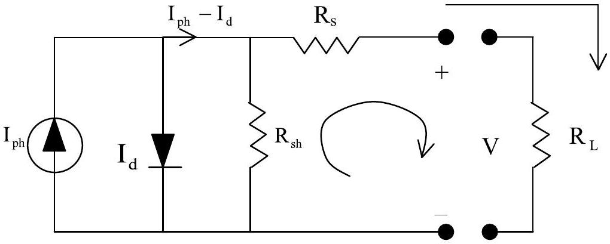
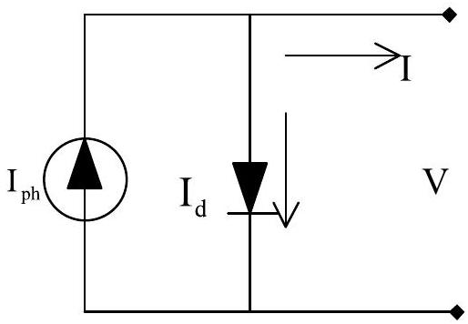
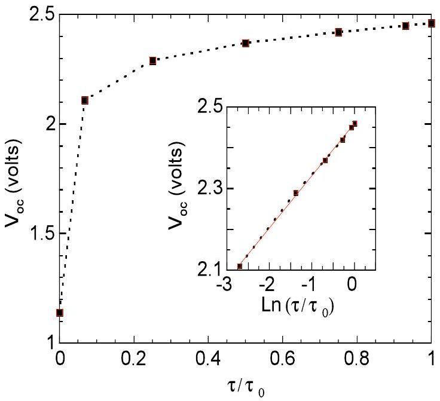
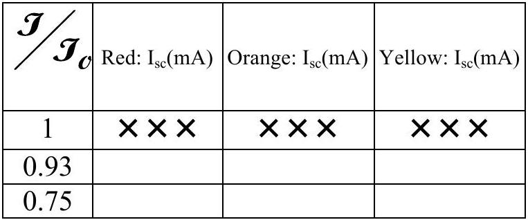
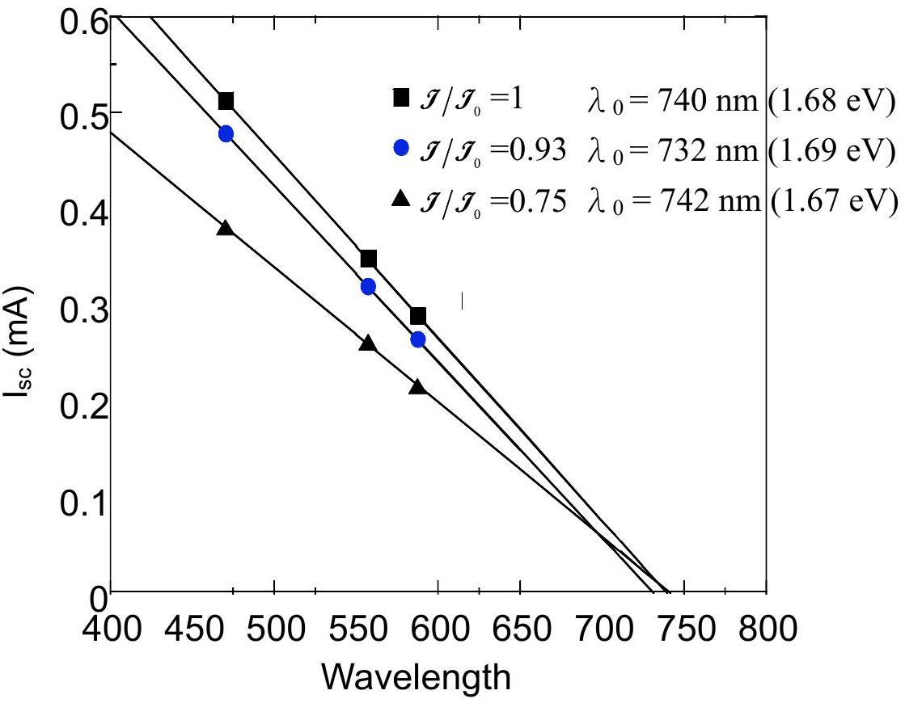

## Solution of the Experimental Problem

(1) (Question (1) : 3 points)
Measure the dark I-V characteristic of the forward biased solar cell .
    a. Draw a diagram of the electrical circuit you used.
    b. Determine the values of $\beta$ and $\mathrm { I } _ { \mathrm { o } }$.
    a. Circuit diagram

    ⊙ Correct Circuit diagram (1 point)
    b. Determine the values $\beta$ and $\mathrm { I } _ { \underline { 0 } }$ in the equation of dark current-voltage characteristic.

|  | $\mathrm { I } _ { 0 }$ | $\beta$ |
| :--- | :--- | :--- |
| 1 | $( \times \times \times ) \times 10 ^ { - \times }$ | ××× |
| 2 |  |  |
| 3 |  |  |

$$
\begin{aligned}
& \overline { \mathrm { I } _ { 0 } } = \times \times \times \pm \times \times \\
& \bar { \beta } = \times \times \times \pm \times \times
\end{aligned}
$$

⊙ Correct I-V curve (1 point)
    - Proper data table marked with variables and units (0.2 points)
    - Properly choose the size of scales and units for abscissa and ordinate that bear relation to the accuracy and range of the experiment (0.3 points)
    - Correct curve including correctly transform the I-V curve into linear curve (0.5 points)
⊙ Correct value of $\beta$ expressed in significant figures and with error $( \beta \pm \Delta \beta )$
$$
\begin{equation*}
\left( \beta = 3.0 \sim 8.0 \mathrm {~V} ^ { - 1 } \right) \tag{0.5points}
\end{equation*}
$$
⊙ Correct value of $\mathrm { I } _ { 0 }$ expressed in significant figures and with error $\left( \mathrm { I } _ { 0 } \pm \Delta \mathrm { I } _ { 0 } \right)$
$$
\begin{align*}
& \left( \mathrm { I } _ { 0 } = 1.3 \times 10 ^ { - 11 } \sim 2.1 \times 10 ^ { - 9 } \mathrm {~A} \right) \text { or } \\
& \left( 1.3 \times 10 ^ { - 8 } \sim 2.1 \times 10 ^ { - 6 } \mathrm {~mA} \right)  \tag{0.5points}\\
& \ln \mathrm { I } _ { 0 } = - 25 \sim - 20 \text { (for } \mathrm { A } \text { ) } \\
& \left. \ln \mathrm { I } _ { 0 } = - 18 \sim - 13 \text { (for } \mathrm { mA } \right)
\end{align*}
$$
(2) (Question (2) : 7 points)
Measure the characteristics of the solar cell, without electrical bias under white light illumination. (Note: the distance between the light source and the solar cell box should be kept at 30 cm as shown in Fig. 5.)
    a. Draw the circuit used.

    b. Measure the short-circuit current , $\mathrm { I } _ { \mathrm { sc } }$.
$$
\left( \mathrm { I } _ { \mathrm { sc } } = \times \times \right) \quad ( 2.0 \mathrm {~mA} \sim 4.5 \mathrm {~mA} )
$$
    ⊙ Correct $\mathrm { I } _ { \mathrm { sc } }$ value (0.5 points)
    c. Measure the open-circuit voltage, $\mathrm { V } _ { \text {oc } }$.
    ⊙ Correct $\mathrm { V } _ { \mathrm { oc } }$ value (0.5 points)

$$
\left( \mathrm { V } _ { \mathrm { oc } } = \times \times \right) \quad ( 2.7 \mathrm {~V} \sim 3.2 \mathrm {~V} )
$$

d. Measure the I vs. V relationship of the solar cell with varying load resistance and plot the I-V curve.

⊙ Correctly measure the I, V data and properly plot the I-V curve (2 points)
    - Proper data table marked with variables and units (0.2 points)
    - Properly choose the size of scales and units for abscissa and ordinate that bear relation to the accuracy and range of the experiment (0.3 points)
    - Correct I, V data and correct I-V curve (1.5 points)
e. Determine the maximum output power of the solar cell.

|  | $\mathrm { P } _ { \mathrm { m } } ( \mathrm { mW } )$ | $\mathrm { R } _ { \mathrm { m } } ( \mathrm { k } \Omega )$ | FF |
| :--- | :--- | :--- | :--- |
| 1 | ×× | $\times \times \times$ | ××\% |
| 2 |  |  |  |
| 3 |  |  |  |

⊙ Accurate method of determining $\mathrm { P } _ { \mathrm { m } }$ (1 point)
⊙ Correct $\mathrm { P } _ { \mathrm { m } }$ value $4.2 \mathrm {~mW} < \mathrm { P } _ { \mathrm { m } } < 9.0 \mathrm {~mW}$ (1 point)
f. Determine the load resistance for the maximum output power.
⊙ Correct load resistance for maximum output power
$$
\begin{gathered}
0.6 \mathrm { k } \Omega < \mathrm { R } < 1.3 \mathrm { k } \Omega \\
\text { (0.5 points) }
\end{gathered}
$$
g. Calculate the filling factor, $\mathrm { FF } \equiv \mathrm { P } _ { \underline { \mathrm { m } } } / \left( \mathrm { I } _ { \mathrm { sc } } \underline { \mathrm { V } } _ { \mathrm { oc } } \right)$
⊙ Correct estimation of the filling factor (FF)
$$
62 \% < \mathrm { FF } < 81 \% \text { ( } 0.5 \text { points) }
$$
(3) (Question (3) : 3.0 points)
Assume that the solar cell can be modeled as a device consisting of an ideal current source (light-generated current source), an ideal diode, a shunt resistance $\mathrm { R } _ { \mathrm { sh } }$, and a series resistance $\mathrm { R } _ { \mathrm { s } }$,
a. Draw a correct equivalent circuit diagram for the solar cell under light illumination.

    ⊙ Correct circuit diagram (1.5 points)
b. Derive I-V relationship for the equivalent circuit.
Express the result in terms of $\mathrm { R } _ { \mathrm { sh } } , \mathrm { R } _ { \mathrm { s } }$, light generated current $\mathrm { I } _ { \mathrm { ph } }$, and current passing through the diode $\mathrm { I } _ { \mathrm { d } }$.
Applying Kirchhoff's loop rule, one obtain
$$
\mathrm { IR } _ { \mathrm { s } } + \mathrm { V } - \left( \mathrm { I } _ { \mathrm { ph } } - \mathrm { I } _ { \mathrm { d } } - \mathrm { I } \right) \mathrm { R } _ { \mathrm { sh } } = 0
$$

⊙ Correct equation (0.5 points)
c. Assuming that $\mathrm { R } _ { \mathrm { sh } } =$ infinity and $\mathrm { R } _ { \mathrm { s } } = 0$ and can be neglected, find the I-V relationship and prove that it can be written in the form as given below:
$$
\mathrm { V } _ { \mathrm { oc } } = \beta ^ { - 1 } \ln \left( \frac { \mathrm { I } _ { \mathrm { sc } } } { \mathrm { I } _ { 0 } } + 1 \right) ,
$$
where $\mathrm { V } _ { \mathrm { oc } }$ is the open-circuit voltage, $\mathrm { I } _ { \mathrm { sc } }$ is the short-circuit current, and $\mathrm { I } _ { 0 }$, $\beta$ are constants.

proof: with $\mathrm { R } _ { \mathrm { s } } = 0 , \mathrm { R } _ { \text {sh } } =$ infinity, the equivalent circuit becomes

Hence $\mathrm { I } = \mathrm { I } _ { \mathrm { ph } } - \mathrm { I } _ { \mathrm { d } } = \mathrm { I } _ { \mathrm { ph } } - \mathrm { I } _ { 0 } \left( \mathrm { e } ^ { \beta \mathrm { V } } - 1 \right)$
for close circuit $\mathrm { V } = 0 \quad \therefore \mathrm { I } _ { \mathrm { ph } } = \mathrm { I } _ { \mathrm { sc } }$
for open circuit $\mathrm { I } = 0 \quad \therefore \mathrm { I } _ { \mathrm { sc } } - \mathrm { I } _ { 0 } \left( \mathrm { e } ^ { \beta \mathrm { V } _ { \mathrm { oc } } } - 1 \right) = 0$

$$
\therefore \mathrm { V } _ { \mathrm { oc } } = \frac { 1 } { \beta } \ln \left( \frac { \mathrm { I } _ { \mathrm { sc } } } { \mathrm { I } _ { 0 } } + 1 \right)
$$

⊙ Correct proof of $\mathrm { V } _ { \mathrm { oc } }$ vs $\mathrm { I } _ { \mathrm { sc } }$ relation (1 point)
Partial credit may be given for appropriate intermediate results.
(4) (Question (4) : 4 points)
Find effects of irradiance.
    a. Measure and plot the $\mathrm { I } _ { \text {sc } }$ vs. relative light intensity curve, and determine the approximate functional relationship between $\mathrm { I } _ { \mathrm { sc } }$ and the relative light intensity.

( $\mathcal { J } _ { 0 }$ is the light intensity when the axes of the two polarizers are parallel)
⊙ Correct usage of polarizers and filters to change the illumination light intensity (1 point)
(Because polarizers are less effective for light with wavelength shorter than that of yellow light as mentioned in the description of "Equipments and Materials", in order to obtain correct relative scale of irradiance, the yellow filter should be used with polarizers)
⊙ Correct measurement of $\mathrm { I } _ { \mathrm { sc } }$ and determination of the relationship between $I _ { \mathrm { sc } }$ and light intensity, including proper plotting of the relationship and knowing how to apply Malus's law. (1.5 points)
$\left( \mathrm { I } _ { \mathrm { sc } } \right.$ is approximately proportional to light intensity: $\left. \mathrm { I } _ { \mathrm { sc } } = \mathrm { A } \mathcal { J } _ { \mathcal { J } _ { 0 } } \right)$
b.Measure and plot the $\mathrm { V } _ { \text {oc } }$ vs. relative light intensity curve, and determine the approximate functional relationship between $\mathrm { V } _ { \text {oc } }$ and the relative light intensity.

| $\mathscr { J } / \mathcal { J } _ { o }$ | $\mathrm { I } _ { \mathrm { sc } } ( \mathrm { mA } )$ | $\mathrm { V } _ { \mathrm { oc } }$ (volts) |
| :--- | :--- | :--- |
| 1 | ××× | ××× |
| 0.93 |  |  |
| 0.75 |  |  |
| 0.50 |  |  |
| 0.25 |  |  |
| 0.067 |  |  |
| 0.00 |  |  |

⊙ Correct measurement of $\mathrm { V } _ { \text {oc } }$ and determination of the relationship between $\mathrm { V } _ { \mathrm { oc } }$ and light intensity including proper plotting of the relationship. (1.5 points)
$$
\left( \mathrm { V } _ { \mathrm { oc } } = \mathrm { A } \ell \mathrm { n } \left( \mathfrak { J } / \mathcal { J } _ { o } \right) + \mathrm { B } \text { or } \mathrm { V } _ { \mathrm { oc } } = \mathrm { A } ^ { \prime } \log \left( \mathfrak { J } / \mathcal { J } _ { o } \right) + \mathrm { B } ^ { \prime } \right)
$$
(5) (Question (5) : 3.0 points)
Find the wavelength response of solar cell under different irradiance.
    a. Measure and plot the $\mathrm { I } _ { \text {sc } }$ vs. different cut-off wavelengths using the three optical filters.

⊙ Correct measurement of the short - circuit current of the solar cell under different optical filters and illuminating intensities (1.5 points)
b. Estimate the longest wavelength for which the solar cell can function properly.
⊙ Correctly analyzing the longest response wavelength (1 point) (730 ~770 nm)
c. Infer which semiconductor material the solar cell is made of. (Hint: the band gaps for commonly used semiconductors are InAs: 0.36 eV, Ge: 0.67 eV, Si: 1.1 eV, amorphous Si(a-Si : H): 1.7 eV, GaN: 3.5 eV)
⊙ Correctly inferring the semiconductor material that the solar cell is made of (0.5 points) (a-Si : H)
