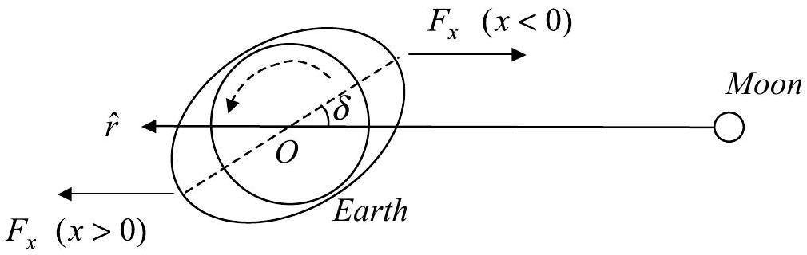

[Solution] Theoretical Question 1

## When will the Moon become a Synchronous Satellite?

(1) The total orbital angular momentum $\vec { L } = L \hat { z }$ of the Earth-Moon system with respect to $C$ can be calculated as follows.
Since all angular momenta are along the $z$-direction, only the $z$-component of each angular momentum will be calculated. The distance between the center of mass $C$ and the center of the Earth $O$ is
$$
r _ { C M } = \frac { M r _ { 0 } } { M + M _ { E } } = \frac { 3.85 \times 10 ^ { 8 } } { 1 + ( 597 / 7.35 ) } = 4.68 \times 10 ^ { 6 } m = 0.735 R _ { E }
$$
The angular speed of the Moon's revolution is
$$
\begin{equation*}
\omega _ { 0 } = \frac { 2 \pi } { 27.322 \times 86400 } = 2.6617 \times 10 ^ { - 6 } \mathrm { rad } / \mathrm { s } \tag{1a}
\end{equation*}
$$
The orbital angular momentum of the Moon about $C$ is
$$
\begin{aligned}
\ell _ { M } & = M \left( r _ { 0 } - r _ { C M } \right) ^ { 2 } \omega _ { 0 } \\
& = 7.35 \times ( 385 - 4.68 ) ^ { 2 } \times 2.6617 \times 10 ^ { 28 } = 2.83 \times 10 ^ { 34 } \mathrm {~kg} \cdot \mathrm {~m} ^ { 2 } / \mathrm { s }
\end{aligned}
$$
The angular speed of the Moon's spinning or rotational motion is
$$
\Omega _ { M } = \omega _ { 0 } = 2.6617 \times 10 ^ { - 6 } \mathrm { rad } / \mathrm { s }
$$
The spin angular momentum of the Moon is
$$
\begin{aligned}
S _ { M } & = \frac { 2 } { 5 } M R _ { M } ^ { 2 } \Omega _ { M } = \frac { 2 } { 5 } \times 7.35 \times ( 1.74 ) ^ { 2 } \times 2.6617 \times 10 ^ { 28 } \\
& = 2.37 \times 10 ^ { 29 } \mathrm {~kg} \cdot \mathrm {~m} ^ { 2 } / \mathrm { s } = 8.40 \times 10 ^ { - 6 } \ell _ { M }
\end{aligned}
$$
This is much smaller than the Moon's orbital angular momentum and can therefore be neglected.
The orbital angular momentum of the Earth about $C$ is
$$
\begin{aligned}
\ell _ { E } & = M _ { E } r _ { C M } ^ { 2 } \omega _ { 0 } = \frac { M } { M _ { E } } \ell _ { M } \\
& = \frac { 7.35 } { 597 } \times 2.83 \times 10 ^ { 34 } = 3.48 \times 10 ^ { 32 } \mathrm {~kg} \cdot \mathrm {~m} ^ { 2 } / \mathrm { s }
\end{aligned}
$$
The angular speed of the Earth's spinning motion is
$$
\Omega _ { E } = \frac { 2 \pi } { 23.933 \times 3600 } = 7.2926 \times 10 ^ { - 5 } \mathrm { rad } / \mathrm { s }
$$
The moment of inertia of the Earth about its axis of rotation is
$$
\begin{equation*}
I = \frac { 2 } { 5 } M _ { E } R _ { E } ^ { 2 } = 0.4 \times 5.97 \times ( 6.37 ) ^ { 2 } \times 10 ^ { 36 } = 9.69 \times 10 ^ { 37 } \mathrm {~km} \cdot \mathrm {~m} ^ { 2 } / \mathrm { s } \tag{1b}
\end{equation*}
$$
The spin angular momentum of the Earth is
$$
S _ { E } = \frac { 2 } { 5 } M _ { E } R _ { E } ^ { 2 } \Omega _ { E } = 7.07 \times 10 ^ { 33 } \mathrm {~kg} \cdot \mathrm {~m} ^ { 2 } / \mathrm { s } = 20.3 \ell _ { E }
$$

[Solution] (continued) Theoretical Question 1

## When will the Moon become a Synchronous Satellite?

Thus, the total angular momentum of the Earth-Moon system $L$ is given by

$$
\begin{align*}
L & = \left( \ell _ { M } + \ell _ { E } + S _ { E } + S _ { M } \right) \\
& = ( 2.83 + 0.0348 + 0.707 + 0.0000237 ) \times 10 ^ { 34 }  \tag{2}\\
& = 3.57 \times 10 ^ { 34 } \mathrm {~kg} \cdot \mathrm {~m} ^ { 2 } / \mathrm { s }
\end{align*}
$$

Note that $L \approx \left( \ell _ { M } + \ell _ { E } + S _ { E } \right)$.

(2) According to Newton's form for Kepler's third law of planetary motions, the angular speed $\omega$ of the revolution of the Moon about the Earth is related to the Earth-Moon distance $r$ by
$$
\begin{equation*}
\omega ^ { 2 } r ^ { 3 } = G \left( M _ { E } + M \right) \tag{3}
\end{equation*}
$$
Therefore, the orbital angular momentum of the Earth-Moon system with respect to $C$ is
$$
\begin{equation*}
\ell = \left( \frac { M _ { E } M } { M + M _ { E } } \right) r ^ { 2 } \omega = M M _ { E } \left( \frac { G ^ { 2 } } { \omega \left( M + M _ { E } \right) } \right) ^ { 1 / 3 } \tag{4}
\end{equation*}
$$
(Note: $\ell _ { M } = M \left( \frac { M _ { E } r } { M + M _ { E } } \right) ^ { 2 } \omega , \ell _ { E } = M _ { E } \left( \frac { M r } { M + M _ { E } } \right) ^ { 2 } \omega$ so that $\ell = \ell _ { E } + \ell _ { M }$.)
When the angular speed of the Earth's rotation is equal to the angular speed $\omega$ of the orbiting Moon, the total angular momentum of the Earth-Moon system is, with the spin angular momentum of the Moon neglected, given by
$$
\begin{align*}
\left( \ell _ { M } + \ell _ { E } + S _ { E } \right) & = M M _ { E } \left\{ \frac { G ^ { 2 } } { \left( M + M _ { E } \right) \omega } \right\} ^ { 1 / 3 } + \frac { 2 } { 5 } M _ { E } R _ { E } ^ { 2 } \omega \\
& = 7.35 \times 5.97 \times \left\{ \frac { 66.726 \times 66.726 } { ( 5.97 + 0.0735 ) \omega } \right\} ^ { 1 / 3 } \times 10 ^ { 30 } + 9.69 \times 10 ^ { 37 } \omega  \tag{5a}\\
& = 3.96 \times 10 ^ { 32 } \omega ^ { - 1 / 3 } + 9.69 \times 10 ^ { 37 } \omega = 3.57 \times 10 ^ { 34 }
\end{align*}
$$
The last equality follows from conservation of total angular momentum and Eq.(2). For an initial estimate of $\omega$, the spin angular momentum of the Earth may be neglected in Eq.(5a) to give
$$
\omega \approx \omega _ { 1 } = \left( \frac { 3.96 } { 357 } \right) ^ { 3 } = 1.36 \times 10 ^ { - 6 } \mathrm { rad } / \mathrm { s } \quad \text { (first iteration) }
$$
An improved estimate may be obtained by using the above estimated value $\omega _ { 1 }$ to compute the spin angular momentum of the Earth and use Eq.(5a) again to solve for $\omega$. The result is

[Solution] (continued) Theoretical Question 1
When will the Moon become a Synchronous Satellite?

$$
\begin{equation*}
\omega \approx \omega _ { f } = \left( \frac { 3.96 } { 358 } \right) ^ { 3 } = 1.35 \times 10 ^ { - 6 } \mathrm { rad } / \mathrm { s } \quad \text { (second iteration) } \tag{5b}
\end{equation*}
$$

Further iterations of the same procedure lead to the same value just given. Thus, the period of rotation of the Earth will be

$$
T _ { f } = \frac { 2 \pi } { \omega _ { f } } = \frac { 6.2832 } { 1.35 \times 10 ^ { - 6 } \times 86400 } = 53.9 \text { days }
$$

(3) Since the total torque $\Gamma$ is proportional to $1 / r ^ { 6 }$, we conclude

$$
\begin{equation*}
r ^ { 6 } \Gamma = \text { constant } \tag{6}
\end{equation*}
$$

Let the current values of $r$ and $\Gamma$ be, respectively, $r _ { 0 }$ and $\Gamma _ { 0 }$. From Eq.(6), we then have

$$
\begin{equation*}
\Gamma = \left( \frac { r _ { 0 } } { r } \right) ^ { 6 } \Gamma _ { 0 } \tag{7}
\end{equation*}
$$

The torque $\Gamma$ is equal to the rate of change of spin angular momentum $I \Omega$ of the Earth so that

$$
\begin{equation*}
I \frac { d \Omega } { d t } = \Gamma \tag{8}
\end{equation*}
$$

By Newton's law of action and reaction or by the law of conservation of the total angular momentum, $- \Gamma$ is equal to the rate of change of the total orbital angular momentum $\ell$ of the Earth-Moon system so that

$$
\begin{equation*}
\frac { d \ell } { d t } = - \Gamma \tag{9}
\end{equation*}
$$

But according to Eq.(3), we have

$$
\omega ^ { 2 } r ^ { 3 } = G \left( M _ { E } + M \right)
$$

and Eq.(4) may be written as

$$
\begin{align*}
\ell & = \left( \frac { M M _ { E } } { M _ { E } + M } \right) \omega r ^ { 2 } = M M _ { E } \left( \frac { G } { M _ { E } + M } \right) ^ { 1 / 2 } r ^ { 1 / 2 } \\
& = M M _ { E } \left( \frac { G ^ { 2 } } { M _ { E } + M } \right) ^ { 1 / 3 } \omega ^ { - 1 / 3 } \tag{10}
\end{align*}
$$

This implies

$$
\begin{align*}
\frac { d \ell } { d t } & = M M _ { E } \left( \frac { G } { M _ { E } + M } \right) ^ { 1 / 2 } \frac { 1 } { 2 r ^ { 1 / 2 } } \frac { d r } { d t } \\
& = - \frac { 1 } { 3 } M M _ { E } \left( \frac { G ^ { 2 } } { M _ { E } + M } \right) ^ { 1 / 3 } \frac { 1 } { \omega ^ { 4 / 3 } } \frac { d \omega } { d t } = - \Gamma \tag{11a}
\end{align*}
$$

The value of $\Gamma _ { 0 }$ can be determined from Eq. (11a) as follows:

$$
\begin{align*}
- \Gamma _ { 0 } & = \left( \frac { d \ell } { d t } \right) _ { 0 } = \frac { 1 } { 2 } M M _ { E } \sqrt { \frac { G } { \left( M _ { E } + M \right) r _ { 0 } } } \left( \frac { d r } { d t } \right) _ { 0 } \\
& = \frac { 1 } { 2 } \times 7.35 \times 5.97 \times 10 ^ { 46 } \cdot \sqrt { \frac { 66.7 \times 10 ^ { - 44 } } { ( 0.0735 + 5.97 ) \times ( 3.85 ) } } \cdot \frac { 3.8 \times 10 ^ { - 8 } } { 3.65 \times 8.64 }  \tag{13}\\
& = 4.5 \times 10 ^ { 16 } \mathrm {~N} \cdot \mathrm {~m}
\end{align*}
$$

Starting with Eq.(11a) in the following form

$$
\frac { d \ell } { d t } = - \frac { 1 } { 3 } M M _ { E } \left( \frac { G ^ { 2 } } { \left( M _ { E } + M \right) } \right) ^ { 1 / 3 } \frac { 1 } { \omega ^ { 4 / 3 } } \frac { d \omega } { d t } = - \left( \frac { r _ { 0 } } { r } \right) ^ { 6 } \Gamma _ { 0 }
$$

we may use Eq.(3) to express $r$ in terms of $\omega$ and obtain the following equations:

$$
\frac { 1 } { 3 } M M _ { E } \left( \frac { G ^ { 2 } } { \left( M _ { E } + M \right) } \right) ^ { 1 / 3 } \left( \frac { d \omega } { d t } \right) = \frac { \left( r _ { 0 } \right) ^ { 6 } \Gamma _ { 0 } } { \left\{ G \left( M _ { E } + M \right) \right\} ^ { 2 } } \omega ^ { 16 / 3 }
$$

## [Solution] (continued) Theoretical Question 1

## When will the Moon become a Synchronous Satellite?

$$
\frac { d \omega } { d t } = \left[ \frac { 3 \left( r _ { 0 } \right) ^ { 6 } \Gamma _ { 0 } } { G M _ { E } M \left\{ G \left( M _ { E } + M \right) \right\} ^ { 5 / 3 } } \right] \omega ^ { 16 / 3 } = b \omega ^ { 16 / 3 }
$$

where the constant $b$ stands for the expression in the square brackets. The last equation leads to the solution

$$
\left( \omega _ { f } \right) ^ { - 13 / 3 } - \left( \omega _ { 0 } \right) ^ { - 13 / 3 } = \frac { - 13 b } { 3 } \left( t _ { f } - 0 \right)
$$

where $t _ { f }$ is the length of time needed for the angular speed of the rotation of the Earth to be equal to that of the Moon's revolution about the Earth.

Using the values of $\omega _ { f }$ and $\omega _ { 0 }$ obtained in Eqs.(1a) and (5b) and the value of $\Gamma _ { 0 }$ in Eq.(13), we have

$$
\frac { - 3 } { 13 b } = \frac { G M _ { E } M \left\{ G \left( M _ { E } + M \right) \right\} ^ { 5 / 3 } } { 13 \left( r _ { 0 } \right) ^ { 6 } \left( - \Gamma _ { 0 } \right) } = 3.4 \times 10 ^ { - 8 }
$$

$$
\begin{aligned}
t _ { f } & = \frac { - 3 } { 13 b } \left( \omega _ { f } ^ { - 13 / 3 } - \omega _ { 0 } ^ { - 13 / 3 } \right) = 3.4 \times \left\{ ( 1.35 ) ^ { - 13 / 3 } - ( 2.6617 ) ^ { - 13 / 3 } \right\} \times 10 ^ { 18 } \\
& = 3.4 \times 10 ^ { 18 } \times ( 0.254 - 0.014376 ) \\
& = 8.1 \times 10 ^ { 17 } \mathrm { sec } \text { onds } \\
& = 2.6 \times 10 ^ { 10 } \text { years }
\end{aligned}
$$
