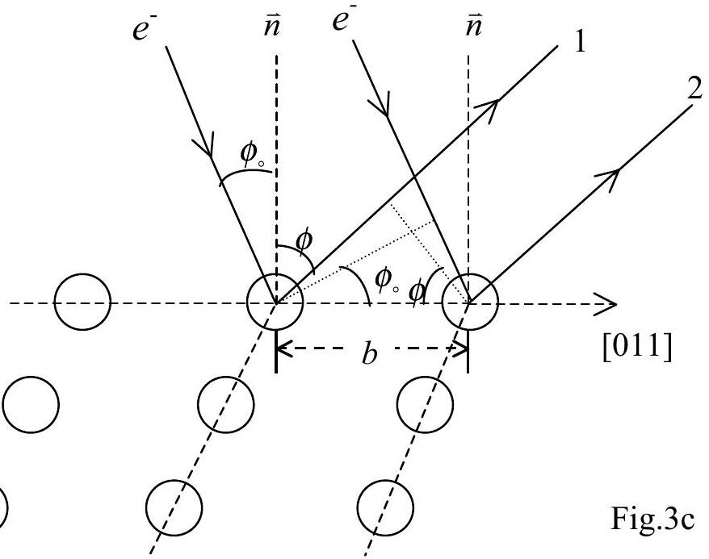
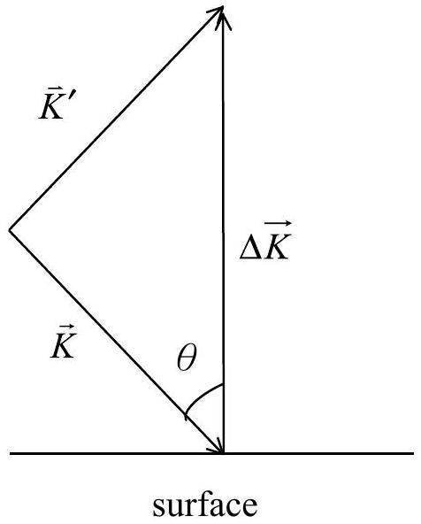

[Solution] Theoretical Question 3

## Thermal Vibration of Surface Atoms

(1) (a) The wavelength of the incident electron is
$$
\begin{aligned}
& \lambda = \frac { h } { p } = \frac { h } { \sqrt { 2 m e V } } \\
& = \frac { 6.63 \times 10 ^ { - 34 } } { \sqrt { 2 \times 9.11 \times 10 ^ { - 31 } \times 1.60 \times 10 ^ { - 19 } \times 64.0 } } \\
& = 1.53 \times 10 ^ { - 10 } \mathrm {~m} = 1.53 \AA
\end{aligned}
$$
    (b) Consider the interference between the atomic rows on the surface as shown in Fig. 3c.

The path difference between electron beam 1 and 2 is
$$
\Delta \ell = b \left( \sin \phi - \sin \phi _ { 0 } \right) = n \lambda
$$
Given $\phi _ { o } = 15.0 ^ { \circ } , \lambda = 1.53 \AA$ and $b = \frac { a } { \sqrt { 2 } } = \frac { 3.92 } { \sqrt { 2 } } = 2.77 \AA$, two solutions are possible.
    (i) When $n = 0 , \phi = \phi _ { \mathrm { o } } = 15.0 ^ { \circ }$

(Answer 1)

(ii) When $n = 1$
$$
\begin{gathered}
\Delta \ell = 2.77 \left( \sin \phi - \sin 15 ^ { \circ } \right) = 1 \times 1.53 \\
\sin \phi = \frac { 1.53 + 0.72 } { 2.77 } = 0.812
\end{gathered}
$$

[Solution] (continued) Theoretical Question 3
Vibration of Surface Atoms

$$
\phi = 54.3 ^ { \circ }
$$

(Answer 2)
For $n = 2$, no solution exists as $\Delta \ell = 2.77 \left( \sin \phi - \sin 15 ^ { \circ } \right) = 2 \times 1.53$ and $\sin \phi > 1$.
(2) $I = I _ { 0 } \exp \left\langle - ( \vec { u } \cdot \Delta \vec { K } ) ^ { 2 } \right\rangle$

Fig. 3d

For the specularly reflected beam, we have from Fig. 3d

$$
\Delta \vec { K } = \vec { K } ^ { \prime } - \vec { K } = 2 K \cos \theta \quad \hat { x }
$$

where $\hat { x }$ is the unit vector in the direction of the surface normal. Take the $x$-component of $\vec { u }$, we then obtain

$$
\begin{equation*}
I = I _ { 0 } e ^ { - \left\langle u _ { x } ^ { 2 } ( t ) \cdot 4 K ^ { 2 } \cos ^ { 2 } \theta \right\rangle } = I _ { 0 } e ^ { - 4 K ^ { 2 } \cos ^ { 2 } \theta \left\langle u _ { x } ^ { 2 } ( t ) \right\rangle } \tag{2}
\end{equation*}
$$

The vibration in the direction of the surface normal of the surface atoms is simple harmonic, take

$$
u _ { x } ( t ) = A \cos \omega t
$$

$$
\begin{aligned}
\text { Q } \quad \left\langle u _ { x } ^ { 2 } ( t ) \right\rangle = \frac { 1 } { \tau } \int _ { 0 } ^ { \tau } u ^ { 2 } d t & = \frac { 1 } { \tau } \int _ { 0 } ^ { \tau } A ^ { 2 } \cos ^ { 2 } \omega t d t = \frac { A ^ { 2 } } { \tau } \cdot \frac { \tau } { 2 } = \frac { A ^ { 2 } } { 2 } \\
& \therefore \quad A ^ { 2 } = 2 \left\langle u _ { x } ^ { 2 } ( t ) \right\rangle
\end{aligned}
$$

The total energy $E$ is thus given by

$$
E = \frac { 1 } { 2 } C A ^ { 2 } = \frac { 1 } { 2 } C \cdot 2 < u _ { x } ^ { 2 } ( t ) > = C < u _ { x } ^ { 2 } ( t ) > = m ^ { \prime } \omega ^ { 2 } < u _ { x } ^ { 2 } ( t ) >
$$

[Solution] (continued) Theoretical Question 3

## Vibration of Surface Atoms

Therefore, one obtains

$$
\begin{aligned}
& \left\langle u _ { x } ^ { 2 } ( t ) \right\rangle = E / \left( m ^ { \prime } \omega ^ { 2 } \right) \\
& E = m ^ { \prime } \omega ^ { 2 } \left\langle u _ { x } ^ { 2 } \right\rangle = k _ { B } T
\end{aligned}
$$

where $m ^ { \prime }$ is the mass of the atom. From either of the above two equations, one then has the following equality

$$
\begin{equation*}
< u _ { x } ^ { 2 } > = \frac { k _ { B } T } { m ^ { \prime } \omega ^ { 2 } } = \frac { k _ { B } T } { m ^ { \prime } 4 \pi ^ { 2 } f ^ { 2 } } \tag{3}
\end{equation*}
$$

From eq. (3) and eq. (2), one obtains

$$
I = I _ { 0 } e ^ { - 4 K ^ { 2 } \cos ^ { 2 } \theta \frac { k _ { B } T } { m ^ { \prime } 4 \pi ^ { 2 } f ^ { 2 } } }
$$

where $K = \frac { 2 \pi p } { h } = \frac { 2 \pi } { \lambda }$. Accordingly,

$$
\begin{equation*}
I = I _ { 0 } e ^ { - \frac { 4 k _ { B } \cos ^ { 2 } \theta } { m ^ { \prime } f ^ { 2 } \lambda ^ { 2 } } T } = I _ { 0 } e ^ { - M ^ { \prime } T } \tag{4}
\end{equation*}
$$

and

$$
\ln \frac { I } { I _ { 0 } } = - M ^ { \prime } T
$$

From the plot of $\ln \frac { I } { I _ { 0 } }$ versus $T$, one obtains the slope

$$
\begin{equation*}
M ^ { \prime } = \frac { 4 k _ { B } \cos ^ { 2 } \theta } { m ^ { \prime } f ^ { 2 } \lambda ^ { 2 } } \tag{5}
\end{equation*}
$$

The slope of the curve can be estimated from Fig. 3b and leads to the result

$$
M ^ { \prime } = 2.3 \times 10 ^ { - 3 } .
$$

Using the following data in Eq.(5),

$$
\begin{gathered}
k _ { B } = 1.38 \times 10 ^ { - 23 } \mathrm {~J} / \mathrm { K } \\
\lambda = 1.53 \times 10 ^ { - 10 } \mathrm {~m} \\
m ^ { \prime } = 195.1 \times 10 ^ { - 3 } / \left( 6.02 \times 10 ^ { 23 } \right) = 3.24 \times 10 ^ { - 25 } \mathrm {~kg} / \text { atom }
\end{gathered}
$$

[Solution] (continued) Theoretical Question 3

## Vibration of Surface Atoms

one finds

$$
2.3 \times 10 ^ { - 3 } = \frac { 4 \times 1.38 \times 10 ^ { - 23 } \cdot \cos ^ { 2 } 15 ^ { \circ } } { \frac { 195.1 \times 10 ^ { - 3 } } { 6.02 \times 10 ^ { 23 } } \times f ^ { 2 } \times \left( 1.53 \times 10 ^ { - 10 } \right) ^ { 2 } }
$$

The solution for frequency is then

$$
f ^ { 2 } = 3.0 \times 10 ^ { 24 } ( \text { new } ) \Rightarrow \quad f = 1.7 \times 10 ^ { 12 } \mathrm {~Hz} \quad \text { Answer (a) }
$$

From $\left\langle u _ { x } { } ^ { 2 } \right\rangle = \frac { k _ { B } T } { m ^ { \prime } 4 \pi ^ { 2 } f ^ { 2 } } , \quad T = 300 K$, one finally obtains

$$
< u _ { x } ^ { 2 } > = \frac { 1.38 \times 10 ^ { - 23 } \cdot 300 } { \frac { 195.1 \times 10 ^ { - 3 } } { 6.02 \times 10 ^ { 23 } } \times 4 \pi ^ { 2 } \times 3.0 \times 10 ^ { 24 } } = 1.1 \times 10 ^ { - 22 } \mathrm {~m} ^ { 2 } \text { (new) }
$$

and

$$
\sqrt { < u _ { x } ^ { 2 } > } = 1.0 \times 10 ^ { - 11 } m = 0.10 \AA \text { (new) }
$$

Ans
