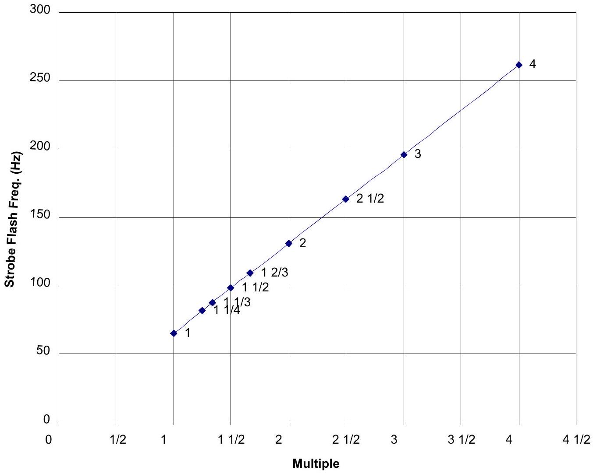
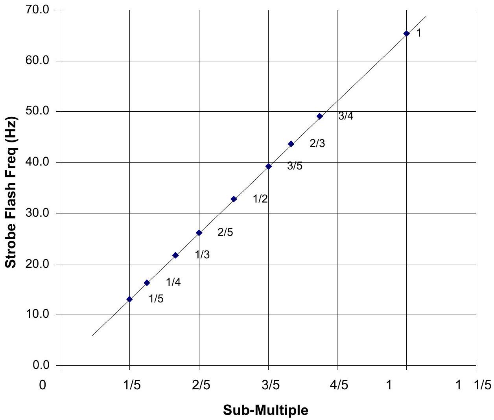
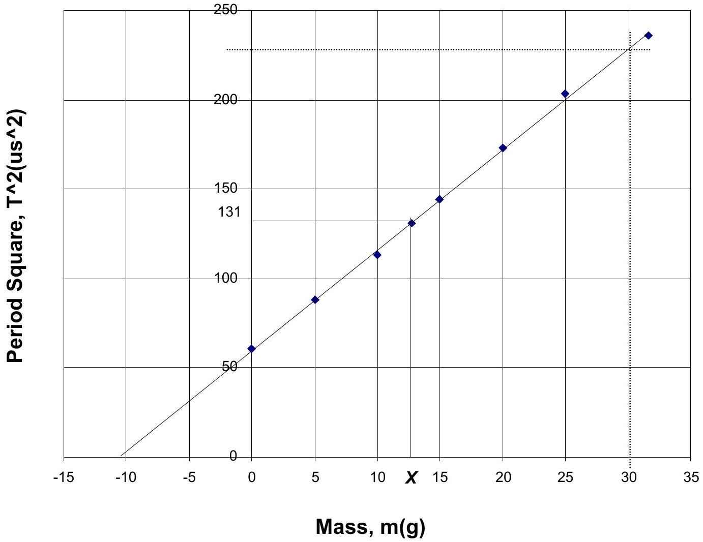

## SOLUTION to Part B of Experimental Competition, APhO 2002

Step 1. Fundamental Synchronism and Multiple Frequencies
| Strobe reading (Hz) | No. of stationary images | q/p value |
| :--- | :--- | :--- |
| - | - | - |
| 65.1 | 1 | 1 |
| 81.7 | 5 | $1 \frac { 1 } { 4 }$ |
| 87.2 | 4 | $1 \frac { 1 } { 3 }$ |
| 98.1 | 3 | $1 \frac { 1 } { 2 }$ |
| 109.0 | 5 | $1 \frac { 2 } { 3 }$ |
| 130.8 | 2 | 2 |
| 163.5 | 5 | $2 \frac { 1 } { 2 }$ |
| 196.2 | 3 | 3 |
| 261.4 | 4 | 4 |

Multiples of Fundamental Freq.

Expt 2 : Sub-multiple frequencies
| Strobe reading (Hz) | No. of stationary images | q/p value |
| :--- | :--- | :--- |
| 65.1 | 1 | 1 |
| 49.0 | 3 | 3/4 |
| 43.6 | 2 | 2/3 |
| 39.2 | 3 | 3/5 |
| 32.7 | 1 | 1/2 |
| 26.2 | 2 | 2/5 |
| 21.8 | 1 | 1/3 |
| 16.3 | 1 | 1/4 |
| 13.0 | 1 | 1/5 |

Sub-Multiples of Fundamental Freq.

Expt 3 : Determination of $\boldsymbol { X }$
| Weight (g) | Frequency (Hz) | Period (T) (ms) | $\mathrm { T } ^ { 2 } \left( \mu \mathrm { s } ^ { 2 } \right)$ |
| :--- | :--- | :--- | :--- |
| 0_ | 128.3_ | 7.794_ | 60.8_ |
| 5 | 106.6 | 9.381 | 88.0 |
| 10 | 94.0 | 10.64 | 113 |
| 12.8 | 87.5 | 11.43 | 131 |
| 15 | 83.2 | 12.02 | 144 |
| 20 | 76.0 | 13.16 | 173 |
| 25 | 70.1 | 14.27 | 204 |
| 31.6 | 65.1 | 15.36 | 236 |

Intercept on m -axis $= - 10.5 \mathrm {~g}$
Best fit slope $= 230 / 40.5 = 5.7 \mu \mathrm {~s} ^ { 2 } / \mathrm { g }$

Step 1: (a) Fundamental synchronism frequency (0.5 mark)

(b) Accuracy and adequacy of other data points (1.3 marks)
(c) Proper tabulation and plot of flash frequency against multiples of tuning fork frequency (0.9 mark)

Step 2: (a) Accuracy and adequacy of data pts (1.4 marks)

(b) Proper tabulation and plot of flash frequency against sub-multiples of tuning fork frequency (0.9 mark)

Step 3: (a) Frequency of unloaded fork (0.5 mark)

(b) Accuracy of data points ( 1.5 marks)
(c) Tabulation, graph and good values for slope and intercept (2.2 marks)
(d) Determination of $X$ (0.8 mark)

## APhO 2002 Part B Mark Sheet: The Stroboscope

|  | - |  | - |  |
| :--- | :--- | :--- | :--- | :--- |
| Country |  | Student No. |  | Ttl No. of Pages |

| Expt. No. \& | Part Number and Description | Max. Mark | Scored Mark | References |
| :--- | :--- | :--- | :--- | :--- |
| 1: Fundamental and multiple frequency | (a) Fundamental frequency | 5 |  | 64-66 Hz: 5 marks, else 63-67 Hz: 4 marks, else 61-69 Hz; 2_ marks, else 0 |
|  | (b) Tabulation, Accuracy \& adequacy of data points | 13 |  | 1 mark for tabulation. 1_ marks per pt. up to 8 pts. excluding fund. freq. pt. |
|  | (c) Graph with identification | 9 |  | 2 marks for proper straight-line graph. 2 marks for proper axes. mark per identification up to 3 marks. 2 marks for inclusion of fundamental freq. pt. |
| 2: Submultiple frequency | (a) Tabulation, Accuracy \& adequacy of data points | 14 |  | 2 marks for tabulation. 1_ marks per pt. up to 8 pts excluding fund. freq. pt. |
|  | (b) Graph with identification | 9 |  | as in part 1(c). |
| 3: Variation of $T ^ { 2 }$ with $m$ | (a) Freq of unloaded fork | 5 |  | 127-129 Hz: 5 marks, else 126-130 Hz: 4_ marks, else 125-131 Hz: 4 marks, else 122-134 Hz: 2_ marks, else 0 |
|  | (b) Accuracy of other data points | 15 |  | 3 marks per pt. excluding those for no and full load. |
|  | (c) Tabulation and Graph | 10 |  | 2 marks for tabulation. 2 marks each for no- and full-load pts. 2 marks for proper straight-line graph. 2 marks for proper axes. |
|  | Slope | 7 |  | $5 - 6.5 \mu \mathrm {~s} ^ { 2 } / \mathrm { g } : 7$ marks, else $4 - 7.5 \mu \mathrm {~s} ^ { 2 } / \mathrm { g } : 5$ _ marks, else $3 - 8.5 \mu \mathrm {~s} ^ { 2 } / \mathrm { g } : 3$ marks, else 0 |
|  | Intercept | 5 |  | -8 to -12g: 5 marks, else -6 to -14g: 3_ marks, else 0 |
|  | (d) Determination of $X$ | 8 |  | 12-14g: 8 marks, else 10-16g: 6 marks, else 8-18g: 3 marks, else 0 |

| TOTAL |  | 50 |  | Normalised = |
| :--- | :--- | :--- | :--- | :--- |
