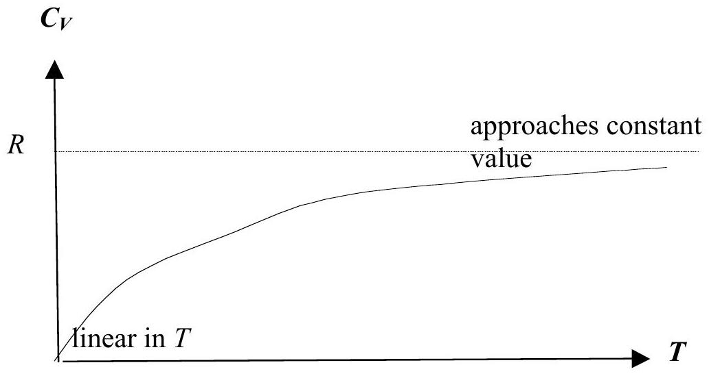
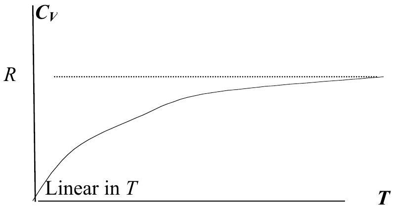
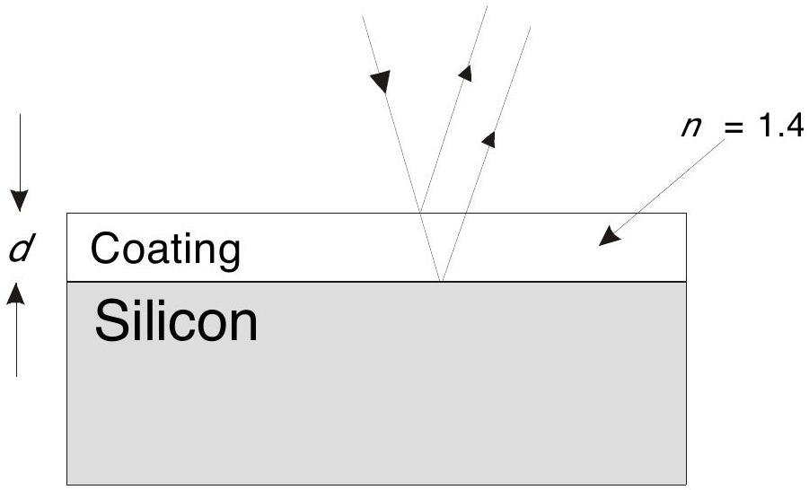

## Solution 1

| (a) $m \ddot { X } _ { n } = S \left( X _ { n + 1 } - X _ { n } \right) - S \left( X _ { n } - X _ { n - 1 } \right)$. | 0.7 |
| :--- | :--- |
| (b) Let $X _ { n } = A \sin n k a \cos ( \omega t + \alpha )$, which has a harmonic time dependence. By analogy with the spring, the acceleration is $\ddot { X } _ { n } = - \omega ^ { 2 } X _ { n }$. |  |
| Substitute into (a): $- m A \omega ^ { 2 } \sin n k a = A S \{ \sin ( n + 1 ) k a - 2 \sin n k a + \sin ( n - 1 ) k a \}$ |  |
| $= - 4 S A \sin n k a \sin ^ { 2 } \_ k a$. | 0.6 |
| Hence $\omega ^ { 2 } = ( 4 S / m ) \sin ^ { 2 } \_ k a$. | 0.2 |
| To determine the allowed values of $k$, use the boundary condition $\sin ( N + 1 ) k a = \sin k L = 0$. | 0.7 |
| The allowed wave numbers are given by $k L = \pi , 2 \pi , 3 \pi , \ldots , N \pi$ ( $N$ in all), | 0.3 |
| and their corresponding frequencies can be computed from $\omega = \omega _ { 0 }$ sin _ ka, |  |
| in which $\omega _ { \text {max } } = \omega _ { 0 } = 2 ( S / m ) ^ { - }$is the maximum allowed frequency. | 0.4 |
| (c) $\langle E ( \omega ) \rangle = \frac { \sum _ { p = 0 } ^ { \infty } p \hbar \omega P _ { p } ( \omega ) } { \sum _ { p = 0 } ^ { \infty } P _ { p } ( \omega ) }$ |  |
| First method: | 1.5 |
| The sum is a geometric series and is $\left\{ 1 - e ^ { - \hbar \omega / k _ { B } T } \right\} ^ { - 1 }$ | 0.5 |
| We find $\langle E ( \omega ) \rangle = \frac { \hbar \omega } { e ^ { \hbar \omega / k _ { B } T } - 1 }$. |  |
| Alternatively: denominator is a geometric series $= \left\{ 1 - e ^ { - \hbar \omega / k _ { B } T } \right\} ^ { - 1 }$ | (0.5) |
| Numerator is $k _ { B } T ^ { 2 }$ (d/dT) (denominator) $= e ^ { - \hbar \omega / k _ { B } T } \left\{ 1 - e ^ { - \hbar \omega / k _ { B } T } \right\} ^ { - 2 }$ and result follows. | (1.5) |

| A non-calculus method:   Let $D = 1 + e ^ { - x } + e ^ { - 2 x } + e ^ { - 3 x } + \ldots$, where $x = \hbar \omega / k _ { \mathrm { B } } T$. This is a geometric series and equals $D = 1 / \left( 1 - e ^ { - x } \right)$. Let $N = e ^ { - x } + 2 e ^ { - 2 x } + 3 e ^ { - 3 x } + \ldots$. The result we want is $N / D$. Observe $\begin{aligned} D - 1 & = & \mathrm { e } ^ { - x } + \mathrm { e } ^ { - 2 x } + \mathrm { e } ^ { - 3 x } + \mathrm { e } ^ { - 4 x } + \mathrm { e } ^ { - 5 x } + \ldots \ldots . . \\ ( D - 1 ) e ^ { - x } & = & \mathrm { e } ^ { - 2 x } + \mathrm { e } ^ { - 3 x } + \mathrm { e } ^ { - 4 x } + \mathrm { e } ^ { - 5 x } + \ldots \ldots \ldots \\ ( D - 1 ) e ^ { - 2 x } & = & \mathrm { e } ^ { - 3 x } + \mathrm { e } ^ { - 4 x } + \mathrm { e } ^ { - 5 x } + \ldots \end{aligned}$   Hence $N = ( D - 1 ) D$ or $N / D = D - 1 = \frac { e ^ { - x } } { 1 - e ^ { - x } } = \frac { 1 } { e ^ { x } - 1 }$. | (2.0) |
| :--- | :--- |
| (d) From part (b), the allowed $k$ values are $\pi / L , 2 \pi / L , \ldots , N \pi / L$. |  |
| Hence the spacing between allowed $k$ values is $\pi / L$, so there are $( L / \pi ) \Delta k$ allowed modes in the | 1.0 |
| wave-number interval $\Delta k$ (assuming $\Delta k \gg \pi / L$ ). |  |
| (e) Since the allowed $k$ are $\pi / L , \ldots , N \pi / L$, there are $N$ modes. | 0.5 |
| Follow the problem: $\begin{aligned} \mathrm { d } \omega / \mathrm { d } k & = \_ a \omega _ { 0 } \cos \_ k a \text { from part } ( \mathrm { a } ) \& ( \mathrm {~b} ) \\ & = \frac { 1 } { 2 } a \sqrt { \omega _ { \max } ^ { 2 } - \omega ^ { 2 } } , \omega _ { \max } = \omega _ { 0 } . \text { This second form is more convenient for integration. } \end{aligned}$ | 0.5 |

The number of modes $\mathrm { d } n$ in the interval $\mathrm { d } \omega$ is

$$
\begin{gathered}
d n = ( L / \pi ) \Delta k = ( L / \pi ) ( \mathrm { d } k / \mathrm { d } \omega ) \mathrm { d } \omega \\
= ( L / \pi ) \left\{ _ { - } a \omega _ { 0 } \cos \_ k a \right\} ^ { - 1 } \mathrm {~d} \omega \\
\quad = \frac { L } { \pi } \frac { 2 } { a } \frac { 1 } { \sqrt { \omega _ { \max } ^ { 2 } - \omega ^ { 2 } } } d \omega \\
\quad = \frac { 2 ( N + 1 ) } { \pi } \frac { 1 } { \sqrt { \omega _ { \max } ^ { 2 } - \omega ^ { 2 } } } d \omega
\end{gathered}
$$

Total number of modes $= \int d n = \int _ { 0 } ^ { \omega _ { \text {max } } } \frac { 2 ( N + 1 ) } { \pi } \frac { d \omega } { \sqrt { \omega _ { \text {max } } ^ { 2 } - \omega ^ { 2 } } } = N + 1 \approx N$ for large $N$.
Total crystal energy from (c) and $\mathrm { d } n$ of part (e) is given by

$$
E _ { T } = \frac { 2 N } { \pi } \int _ { 0 } ^ { m _ { \max } } \frac { \hbar \omega } { e ^ { \hbar \omega / k _ { B } T } - 1 } \frac { d \omega } { \sqrt { \omega _ { \max } ^ { 2 } - \omega ^ { 2 } } } .
$$

(f) Observe first from the last formula that $E _ { T }$ increases monotonically with temperature since

$\left\{ e ^ { \hbar \omega / k T } - 1 \right\} ^ { - 1 }$ is increasing with $T$.

When $T \rightarrow 0$, the term - 1 in the last result may be neglected in the denominator so

$$
\begin{aligned}
& E _ { T } \approx _ { T \rightarrow 0 } \frac { 2 N } { \pi } \int \hbar \omega e ^ { - \hbar \omega / k _ { B } T } \frac { 1 } { \sqrt { \omega _ { \max } ^ { 2 } - \omega ^ { 2 } } } d \omega \\
& = \frac { 2 N } { \hbar \pi \omega _ { \max } } \left( k _ { B } T \right) ^ { 2 } \int _ { 0 } ^ { \infty } \frac { x e ^ { - x } } { \sqrt { 1 - \left( k _ { B } T x / \hbar \omega _ { \max } \right) ^ { 2 } } } d x
\end{aligned}
$$

which is quadratic in $T$ (denominator in integral is effectively unity) hence $C _ { V }$ is linear in $T$ near absolute zero.

Alternatively, if the summation is retained, we have

$$
\begin{align*}
E _ { T } & = \frac { 2 N } { \pi } \sum _ { \omega } \frac { \hbar \omega } { e ^ { \hbar \omega / k _ { B } T } - 1 } \frac { \boldsymbol { \Delta } \omega } { \sqrt { \omega _ { \max } ^ { 2 } - \omega ^ { 2 } } } \rightarrow _ { T \rightarrow 0 } \frac { 2 N } { \pi } \sum _ { \omega } \hbar \omega e ^ { - \hbar \omega / k _ { B } T } \frac { \boldsymbol { \Delta } \omega } { \sqrt { \omega _ { \max } ^ { 2 } - \omega ^ { 2 } } } \\
& = \frac { 2 N } { \pi } \frac { \left( k _ { B } T \right) ^ { 2 } } { \hbar \omega } \sum _ { y } e ^ { - y } y \boldsymbol { \Delta } y \tag{0.5}
\end{align*}
$$

When $T \rightarrow \infty$, use $e ^ { x } \approx 1 + x$ in the denominator,

$$
E _ { T } \approx { } _ { T \rightarrow \infty } \frac { 2 N } { \pi } \int _ { 0 } ^ { \omega _ { \max } } \frac { \hbar \omega } { \hbar \omega / k _ { B } T } \frac { 1 } { \sqrt { \omega _ { \max } ^ { 2 } - \omega ^ { 2 } } } d \omega = \frac { 2 N } { \pi } k _ { B } T \frac { \pi } { 2 } ,
$$

which is linear; hence $C _ { V } \rightarrow N k _ { \mathrm { B } } = R$, the universal gas constant. This is the Dulong-Petit rule. Alternatively, if the summation is retained, write denominator as $e ^ { \hbar \omega / k _ { B } T } - 1 \approx \hbar \omega / k _ { B } T$ and $E _ { T } \rightarrow _ { T \rightarrow \infty } \frac { 2 N } { \pi } k _ { B } T \sum _ { \omega } \frac { \boldsymbol { \Delta } \omega } { \sqrt { \omega _ { \text {max } } ^ { 2 } - \omega ^ { 2 } } }$ which is linear in $T$, so $C _ { V }$ is constant.

Sketch of $C _ { V }$ versus $T$ :
0.2
0.2
0.3
0.2
0.2
(0.5)
0.2
0.1
(0.2)
0.5

Answer sheet: Question 1

(a) Equation of motion of the $n ^ { \text {th } }$ mass is:
$$
m \ddot { X } _ { n } = S \left( X _ { n + 1 } - X _ { n } \right) - S \left( X _ { n } - X _ { n - 1 } \right) .
$$
(b) Angular frequencies $\omega$ of the chain's vibration modes are given by the equation:
$$
\omega ^ { 2 } = ( 4 S / m ) \sin ^ { 2 } \_ k a .
$$
Maximum value of $\omega$ is: $\quad \omega _ { \text {max } } = \omega _ { 0 } = 2 ( S / m ) ^ { - }$
The allowed values of the wave number $k$ are given by:
$$
\pi / L , 2 \pi / L , \ldots , N \pi / L .
$$
How many such values of $k$ are there? $N$

(f) The average energy per frequency mode $\omega$ of the crystal is given by:
$$
\langle E ( \omega ) \rangle = \frac { \hbar \omega } { e ^ { \hbar \omega / k _ { B } T } - 1 }
$$
(g) There are how many allowed modes in a wave number interval $\Delta k$ ?
$$
( L / \pi ) \Delta k .
$$
(e) The total number of modes in the lattice is: $N$

Total energy $E _ { \mathrm { T } }$ of crystal is given by the formula:

$$
E _ { T } = \frac { 2 N } { \pi } \int _ { 0 } ^ { \omega _ { \max } } \frac { \hbar \omega } { e ^ { \hbar \omega / k _ { B } T } - 1 } \frac { d \omega } { \sqrt { \omega _ { \max } ^ { 2 } - \omega ^ { 2 } } } .
$$

(h) A sketch (graph) of $C _ { V }$ versus absolute temperature $T$ is shown below.

For $T \ll 1 , C _ { V }$ displays the following behaviour: $C _ { V }$ is linear in $T$.
As $T \rightarrow \infty , C _ { V }$ displays the following behaviour: $C _ { V } \rightarrow N k _ { \mathrm { B } } = R$, the universal gas constant.

## Solution to Question 2: The Rail Gun

| Proper Solution (taking induced emf into consideration): |  |  |
| :--- | :--- | :--- |
| (a) Let I be the current supplied by the battery in the absence of back emf. Let i be the induced current by back emf $\varepsilon _ { b }$.   Since $\varepsilon _ { b } = d \phi / d t = d ( B L x ) / d t = B L v , \therefore i = B l v / R$. | 1 |  |
| Net current, $I _ { N } = I - i = I - B L v / R$. | 0.5 |  |
| Forces parallel to rail are:   Force on rod due to current is $F _ { c } = B L I _ { N } = B L ( I - B L v / R ) = B L I - B ^ { 2 } L ^ { 2 } v / R$. Net force on rod and young man combined is $F _ { N } = F _ { c } - m g \sin \theta$. | 0.5 |  |
| Newton's law: | 0.5 |  |
| Equating (1) and (2), \& substituting for $F _ { c }$ \& dividing by $m$, we obtain the acceleration   $d v / d t = \alpha - v / \tau , \quad$ where $\alpha = B I L / m - g \sin \theta$ and $\tau = m R / B ^ { 2 } L ^ { 2 }$. | 0.5 | 3 |

| (b)(i)   Since initial velocity of rod $= 0$, and let velocity of rod at time $t$ be $v ( t )$, we have $\begin{equation*} v ( t ) = v _ { \infty } \left( 1 - e ^ { - t / \tau } \right) , \tag{3} \end{equation*}$   where $v _ { \infty } ( \theta ) = \alpha \tau = \frac { I R } { B L } \left( 1 - \frac { m g } { B L I } \sin \theta \right) .$ |  |  |
| :--- | :--- | :--- |
| Let $t _ { s }$ be the total time he spent moving along the rail, and $v _ { s }$ be his velocity when he leaves the rail, i.e. $\begin{equation*} v _ { s } = v \left( t _ { s } \right) = v _ { \infty } \left( 1 - e ^ { - t _ { s } / \tau } \right) . \tag{4} \end{equation*}$ $\begin{equation*} \therefore t _ { s } = - \tau \ln \left( 1 - v _ { s } / v _ { \infty } \right) \tag{5} \end{equation*}$ | 0.5 |  |
|  | 0.5 | 1.5 |

(b) (ii)
Let $t _ { f }$ be the time in flight:

$$
\begin{equation*}
t _ { f } = \frac { 2 v _ { s } \sin \grave { e } } { g } \tag{6}
\end{equation*}
$$

He must travel a horizontal distance $w$ during $t _ { f }$.

$$
\begin{gather*}
w = \left( v _ { s } \cos \grave { e } \right) t _ { f }  \tag{7}\\
t _ { f } = \frac { w } { v _ { s } \cos \theta } = \frac { 2 v _ { s } \sin \theta } { g } \tag{8}
\end{gather*}
$$

From (8), $v _ { s }$ is fixed by the angle $\theta$ and the width of the strait $w$

$$
\begin{equation*}
v _ { s } = \sqrt { \frac { g w } { \sin 2 \theta } } . \tag{9}
\end{equation*}
$$

And

$$
\begin{array} { l l }
\therefore t _ { s } = - \tau \ln \left( 1 - \frac { 1 } { v _ { \infty } } \sqrt { \frac { g w } { \sin 2 \theta } } \right) , & \text { (Substitute (9) in (5)) } \\
t _ { f } = \frac { 2 \sin \theta } { g } \sqrt { \frac { g w } { \sin 2 \theta } } = \sqrt { \frac { 2 w \tan \theta } { g } } & \text { (Substitute (9) in (8)) } \tag{0.5}
\end{array}
$$

(c)
Therefore, total time is: $\quad T = t _ { s } + t _ { f } = - \tau \ln \left( 1 - \frac { 1 } { v _ { \infty } } \sqrt { \frac { g w } { \sin 2 \theta } } \right) + \sqrt { \frac { 2 w \tan \theta } { g } }$
The values of the parameters are: $\mathrm { B } = 10.0 \mathrm {~T} , \mathrm { I } = 2424 \mathrm {~A} , \mathrm {~L} = 2.00 \mathrm {~m} , \mathrm { R } = 1.0 \Omega$, $\mathrm { g } = 10 \mathrm {~m} / \mathrm { s } ^ { 2 } , \mathrm {~m} = 80 \mathrm {~kg}$, and $\mathrm { w } = 1000 \mathrm {~m}$.
Then $\tau = \frac { m R } { B ^ { 2 } L ^ { 2 } } = \frac { ( 80 ) ( 1.0 ) } { ( 10.0 ) ^ { 2 } ( 2.00 ) ^ { 2 } } = 0.20 \mathrm {~s}$.

$$
\begin{aligned}
v _ { \infty } ( \theta ) & = \frac { 2424 } { ( 10.0 ) ( 2.00 ) } \left( 1 - \frac { ( 80 ) ( 10 ) } { ( 10.0 ) ( 2.00 ) ( 2424 ) } \sin \theta \right) \\
& = 121 ( 1 - 0.0165 \sin \theta )
\end{aligned}
$$

So,

$$
T = t _ { s } + t _ { f } = - 0.20 \ln \left( 1 - \frac { 100 } { v _ { \infty } } \frac { 1 } { \sqrt { \sin 2 \theta } } \right) + 14.14 \sqrt { \tan \theta }
$$

By plotting $T$ as a function of $\theta$, we obtain the following graph:

Note that the lower bound for the range of $\theta$ to plot may be determined by the condition $\mathrm { v } _ { \mathrm { s } } / \mathrm { v } _ { \infty } < 1$ (or the argument of ln is positive), and since mg/BLI is small $( 0.0165 ) , \mathrm { v } _ { \infty } \approx I R / B L ( = 121 \mathrm {~m} / \mathrm { s } )$, we have the condition $\sin ( 2 \theta ) > 0.68$, i.e. $\theta > 0.37$. So one may start plotting from $\theta = 0.38$.

From the graph, for $\theta$ within the range (~0.38, 0.505) radian the time $T$ is within 11 s.

Labeling:
0.1 each axis

Unit:
0.1 each axis

Proper Range in θ:
0.3 lower limit (more than 0.37, less than 0.5),
0.2 upper limit (more than 0.5 and less than 0.6)

Proper shape of curve: 0.2

Accurate intersection at $\theta = 0.5$ : 0.4

| (d) However, there is another constraint, i.e. the length of rail $D$. Let $D _ { s }$ be the distance travelled during the time interval $t _ { s }$ $D _ { s } = \int _ { 0 } ^ { t _ { s } } v ( t ) d t = v _ { \infty } \int _ { 0 } ^ { t _ { s } } \left( 1 - e ^ { - t / \tau } \right) d t = v _ { \infty } \left( t + \tau e ^ { - \beta t } \right) d = v _ { \infty } \left[ t _ { s } - \tau \left( 1 - e ^ { - \beta t } \right) \right] = v _ { \infty } t _ { s } - v \left( t _ { s } \right) \tau$ i.e. $D _ { s } = - \tau \left[ v _ { \infty } ( \theta ) \ln \left( 1 - \frac { 1 } { v _ { \infty } ( \theta ) } \sqrt { \frac { g w } { \sin 2 \theta } } \right) + \sqrt { \frac { g w } { \sin 2 \theta } } \right]$ The graph below shows $D _ { s }$ as a function of $\theta$. It is necessary that $D _ { s } \leq D$, which means $\theta$ must range between .5 and 1.06 radians. | 0.5   Labeling: 0.1 each axis   Unit: 0.1 each axis   Proper Range in θ: 0.3 lower limit (more than 0.4, less than 0.49), 0.2 upper limit (more than 0.51 and less than 1.1)   Proper shape of curve: 0.2   Accurate intersection at $\theta = 0.5$ : 0.4 |  |
| :--- | :--- | :--- |
| In order to satisfy both conditions, $\theta$ must range between 0.5 \& 0.505 radians.   (Remarks: Using the formula for $t _ { f } , t _ { s } \& \mathrm { D }$, we get   At $\theta = 0.507 , t _ { f } = 10.540 , t _ { s } = 0.466$, giving $\mathrm { T } = 11.01 \mathrm {~s} , \& \mathrm { D } = 34.3 \mathrm {~m}$ At $\theta = 0.506 , t _ { f } = 10.527 , t _ { s } = 0.467$, giving $\mathrm { T } = 10.99 \mathrm {~s} , \& \mathrm { D } = 34.4 \mathrm {~m}$ At $\theta = 0.502 , t _ { f } = 10.478 , t _ { s } = 0.472$, giving $\mathrm { T } = 10.95 \mathrm {~s} , \& \mathrm { D } = 34.96 \mathrm {~m}$ At $\theta = 0.50 , \quad t _ { f } = 10.453 , t _ { s } = 0.474$, giving $\mathrm { T } = 10.93 \mathrm {~s} , \& \mathrm { D } = 35.2 \mathrm {~m}$, So the more precise angle range is between 0.502 to 0.507, but students are not expected to give such answers. To 2 sig fig $\mathrm { T } = 11 \mathrm {~s}$. Range is 0.50 to 0.51 (in degree: $28.6 ^ { 0 }$ to $29.2 ^ { 0 }$ or $29 ^ { 0 }$ ) |  |  |

| Alternate Solution (Not taking induced emf into consideration): |  |  |
| :--- | :--- | :--- |
| If induced emf is not taken into account, there is no induced current, so the net force acting on the combined mass of the young man and rod is |  |  |
| $F _ { N } = B I L - m g \sin \theta$. | 0.2 BIL $0.2 m g \sin \theta$ |  |
| And we have instead $d v / d t = \alpha ,$ |  |  |
| where |  |  |
| $\therefore v ( t ) = \alpha t$ | 0.1 |  |
| and $\therefore v _ { s } = v \left( t _ { s } \right) = \alpha t _ { s }$ $t _ { f } = \frac { 2 v _ { s } \sin \grave { e } } { g } = \frac { 2 \alpha t _ { s } \sin \grave { e } } { g } .$ | 0.2 |  |
| Therefore, $w = \left( v _ { s } \cos \grave { e } \right) t _ { f } = \frac { \alpha ^ { 2 } t _ { s } ^ { 2 } \sin 2 \grave { e } } { g } ,$ |  |  |
| giving | 0.5 |  |
| $t _ { s } = \frac { 1 } { \alpha } \sqrt { \frac { g w } { \sin 2 \grave { e } } }$   and $t _ { f } = \sqrt { \frac { 2 w \tan \theta } { g } } .$ |  |  |
| Hence, $T = t _ { s } + t _ { f } = \frac { 1 } { \alpha } \sqrt { \frac { g w } { \sin 2 \grave { e } } } + \sqrt { \frac { 2 w \tan \theta } { g } } = \frac { \sqrt { w g } \left[ 1 + 2 \left( \frac { \alpha } { g } \right) \sin \theta \right] } { \sqrt { \sin 2 \grave { e } } } .$   where $\alpha = B I L / m - g \sin \theta$. |  |  |
| The values of the parameters are: $\mathrm { B } = 10.0 \mathrm {~T} , \mathrm { I } = 2424 \mathrm {~A} , \mathrm {~L} = 2.00 \mathrm {~m}$, $\mathrm { R } = 1.0 \Omega , \mathrm {~g} = 10 \mathrm {~m} / \mathrm { s } ^ { 2 } , \mathrm {~m} = 80 \mathrm {~kg}$, and $\mathrm { w } = 1000 \mathrm {~m}$. Then, $T = \frac { 100 } { \alpha } \frac { [ 1 + 0.20 \alpha \sin \theta ] } { \sqrt { \sin 2 \grave { e } } }$   where $\alpha = 606 - 10 \sin \theta$. | 0.3 | 2 |

| For $\theta$ within the range (~0, 0.52 ) radian the time $T$ is within 11 s. | Labeling: 0.1 each axis   Unit: 0.1 each axis   Proper Range in θ: 0.1 lower limit (more than 0, less than 0.5), 0.2 upper limit (more than 0.52 and less than 0.8)   Proper shape of curve: 0.2   Accurate intersection at $\theta = 0.52$ : 0.4   Labeling: 0.1 each axis   Unit: 0.1 each axis   Proper Range in θ:   0.1 lower limit (more than 0.08, less than 0.11), 0.1 upper limit (more than 0.52 and less than 1.5)   Proper shape of curve: 0.2   Accurate intersection at $\theta = 0.11$ : 0.4 |  |
| :--- | :--- | :--- |
| In order to satisfy both conditions, $\theta$ must range between 0.11 \& 0.52 radians. |  | 0.5 |

(a)Since $W ( v ) = 4 \pi \left( \frac { M } { 2 \pi R T } \right) ^ { 3 / 2 } v ^ { 2 } e ^ { - M v ^ { 2 } / ( 2 R T ) }$,

$$
\begin{aligned}
\bar { v } & = \int _ { 0 } ^ { \infty } v W ( v ) d v = \\
& = \int _ { 0 } ^ { \infty } v 4 \pi \left( \frac { M } { 2 \pi R T } \right) ^ { 3 / 2 } v ^ { 2 } e ^ { - M v ^ { 2 } / ( 2 R T ) } d v \\
& = \int _ { 0 } ^ { \infty } 4 \pi \left( \frac { M } { 2 \pi R T } \right) ^ { 3 / 2 } v ^ { 3 } e ^ { - M v ^ { 2 } / ( 2 R T ) } d v \\
& = 4 \pi \left( \frac { M } { 2 \pi R T } \right) ^ { 3 / 2 } \int _ { 0 } ^ { \infty } v ^ { 3 } e ^ { - M v ^ { 2 } / ( 2 R T ) } d v \\
& = 4 \pi \left( \frac { M } { 2 \pi R T } \right) ^ { 3 / 2 } \frac { 4 R ^ { 2 } T ^ { 2 } } { 2 M ^ { 2 } } \\
& = \sqrt { \frac { 8 R T } { \pi M } }
\end{aligned}
$$

Marking Scheme:

| Performing the integration correctly: | 1 mark |
| :--- | :--- |
| Simplifying | 0.5 marks |

Subtotal for the section 1.5
marks

(b) Assuming an ideal gas, $P V = N k T$, so that the concentration of the gas molecules, $n$, is given by
$$
n = \frac { N } { V } = \frac { P } { k T }
$$
the impingement rate is given by
$$
\begin{aligned}
J & = \frac { 1 } { 4 } n \bar { v } \\
& = \frac { 1 } { 4 } \frac { P } { k T } \sqrt { \frac { 8 R T } { \pi M } } \\
& = P \sqrt { \frac { 8 R T } { 16 k ^ { 2 } T ^ { 2 } \pi M } } \\
& = P \sqrt { \frac { N _ { A } k } { 2 k ^ { 2 } T \pi M } } \\
& = P \sqrt { \frac { 1 } { 2 k T \pi m } } \\
& = \frac { P } { \sqrt { 2 \pi m k T } }
\end{aligned}
$$
where we have note that $R = N _ { A } k$ and $m = \frac { M } { N _ { A } }$ ( $N _ { A }$ being Avogadro number).

Marking Scheme:

| Using ideal gas formula to estimate concentration of gas molecules: marks | 0.7 |
| :--- | :--- |
| Simplifying expression: marks | 0.4 |
| Using $R = N k$, and the formula for $m$; marks | 0.4 |
| Subtotal for the section | 1.5 |

marks

(c)Assuming close packing, there are approximately 4 molecules in an area of $16 r ^ { 2 }$ $\mathrm { m } ^ { 2 }$. Thus, the number of molecules in $1 \mathrm {~m} ^ { 2 }$ is given by

$$
n _ { 1 } = \frac { 4 } { 16 \left( 3.6 \times 10 ^ { - 10 } \right) ^ { 2 } } = 1.9 \times 10 ^ { 18 } \mathrm {~m} ^ { - 2 }
$$

However at $( 273 + 300 ) \mathrm { K }$ and 133 Pa , the impingement rate for oxygen is

$$
\begin{aligned}
J & = \frac { P } { \sqrt { 2 \pi m k T } } \\
& = \frac { 133 } { \sqrt { 2 \pi \left( \frac { 32 \times 10 ^ { - 3 } } { 6.02 \times 10 ^ { 23 } } \right) \left( 1.38 \times 10 ^ { - 23 } \right) 573 } } \\
& = 2.6 \times 10 ^ { 24 } \mathrm {~m} ^ { - 2 } \mathrm {~s} ^ { - 1 }
\end{aligned}
$$

Therefore, the time needed for the deposition is $\frac { \boldsymbol { n } _ { 1 } } { \boldsymbol { J } } = 0.7 \mu \mathrm {~s}$
The calculated time is too short compared with the actual processing.
Marking Scheme:

| Estimation of number of molecules in $1 \mathrm {~m} ^ { 2 }$ : | 0.4 marks |
| :--- | :--- |
| Calculation the impingement rate: | 0.6 marks |
| Taking note of temperature in Kelvin | 0.3 marks |
| Calculating the time | 0.4 marks |

Subtotal for the section 1.7
marks

(d)With activation energy of 1 eV and letting the velocity of the oxygen molecule at this energy is $v _ { l }$, we have

$$
\begin{aligned}
& \frac { 1 } { 2 } m v _ { 1 } ^ { 2 } = 1.6 \times 10 ^ { - 19 } \mathrm {~J} \\
& \Rightarrow v _ { 1 } = 2453.57 \mathrm {~ms} ^ { - 1 }
\end{aligned}
$$

At a temperature of 573 K, the distribution of the gas molecules is
We can estimate the fraction of the molecules with speed greater than $2454 \mathrm {~ms} ^ { - 1 }$ using the trapezium rule (or any numerical techniques) with ordinates at 2453, $2453 + 500,2453 + 1000$. The values are as follows:

| Velocity, $v$ | Probability, $W ( v )$ |
| :--- | :--- |
| 2453 | $1.373 \times 10 ^ { - 10 }$ |
| 2953 | $2.256 \times 10 ^ { - 14 }$ |
| 3453 | $6.518 \times 10 ^ { - 19 }$ |

Using trapezium rule, the fraction of molecules with speed greater than $2453 \mathrm {~ms} ^ { - 1 }$ is given by

$$
\begin{aligned}
\text { fraction of molecules } & = \frac { 500 } { 2 } \left[ \left( 1.373 \times 10 ^ { - 10 } \right) + \left( 2 \times 2.256 \times 10 ^ { - 14 } \right) + \left( 6.518 \times 10 ^ { - 19 } \right) \right] \\
f & = 3.43 \times 10 ^ { - 8 }
\end{aligned}
$$

Thus the time needed for the deposition is given by $0.7 \mu \mathrm {~s} / \left( 3.43 \times 10 ^ { - 8 } \right)$ that is 20.4 s

Marking Scheme
Computing the value of the cut-off energy or velocity: 0.6
marks
Estimating the fraction of molecules 1.2 marks
Correct method of final time
0.4 marks
Correct value of final time
0.6 marks

Subtotal for the section 2.8
marks

(e)For destructive interference, optical path difference $= 2 d = \frac { \lambda ^ { \prime } } { 2 }$ where $\lambda ^ { \prime } = \frac { \lambda _ { \text {air } } } { n }$ is the wavelength in the coating.

The relation is given by:

$$
d = \frac { \lambda _ { \text {air } } } { 4 n }
$$

Plugging in the given values, one gets $d = 105$ or 105.2 nm.
Derive equation:

| Finding the optical path length marks | 0.2 |
| :--- | :--- |
| Knowing that there is a phase change at the reflection marks | 0.5 |
| Putting everything together to get the final expression marks | 0.6 |
| Subtotal: | 1.3 marks |
| Computation of $d$ : | 0.6 marks |
| Getting the correct number of significant figures: | 0.6 marks |
| Subtotal: | 1.2 marks |
| Subtotal for Section | 2.5 marks |
| TOTAL | 10 marks |
