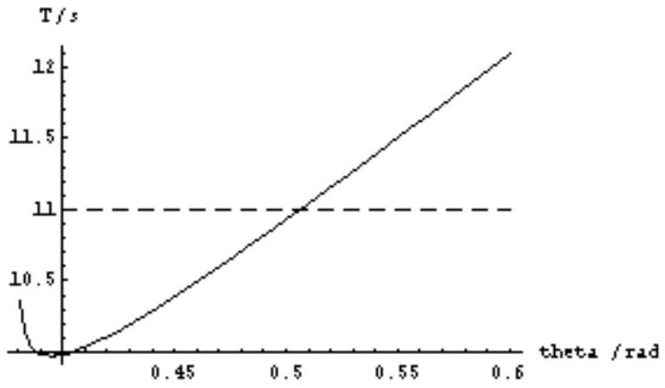

## Solution to Question 2: The Rail Gun

| Proper Solution (taking induced emf into consideration): |  |  |
| :--- | :--- | :--- |
| (a) Let I be the current supplied by the battery in the absence of back emf. Let i be the induced current by back emf $\varepsilon _ { b }$.   Since $\varepsilon _ { b } = d \phi / d t = d ( B L x ) / d t = B L v , \therefore i = B l v / R$. | 1 |  |
| Net current, $I _ { N } = I - i = I - B L v / R$. | 0.5 |  |
| Forces parallel to rail are:   Force on rod due to current is $F _ { c } = B L I _ { N } = B L ( I - B L v / R ) = B L I - B ^ { 2 } L ^ { 2 } v / R$. Net force on rod and young man combined is $F _ { N } = F _ { c } - m g \sin \theta$. | 0.5 |  |
| Newton's law: | 0.5 |  |
| Equating (1) and (2), \& substituting for $F _ { c }$ \& dividing by $m$, we obtain the acceleration   $d v / d t = \alpha - v / \tau , \quad$ where $\alpha = B I L / m - g \sin \theta$ and $\tau = m R / B ^ { 2 } L ^ { 2 }$. | 0.5 | 3 |

| (b)(i)   Since initial velocity of rod $= 0$, and let velocity of rod at time $t$ be $v ( t )$, we have $\begin{equation*} v ( t ) = v _ { \infty } \left( 1 - e ^ { - t / \tau } \right) , \tag{3} \end{equation*}$   where $v _ { \infty } ( \theta ) = \alpha \tau = \frac { I R } { B L } \left( 1 - \frac { m g } { B L I } \sin \theta \right) .$ |  |  |
| :--- | :--- | :--- |
| Let $t _ { s }$ be the total time he spent moving along the rail, and $v _ { s }$ be his velocity when he leaves the rail, i.e. $\begin{equation*} v _ { s } = v \left( t _ { s } \right) = v _ { \infty } \left( 1 - e ^ { - t _ { s } / \tau } \right) . \tag{4} \end{equation*}$ $\begin{equation*} \therefore t _ { s } = - \tau \ln \left( 1 - v _ { s } / v _ { \infty } \right) \tag{5} \end{equation*}$ | 0.5 |  |
|  | 0.5 | 1.5 |

(b) (ii)
Let $t _ { f }$ be the time in flight:

$$
\begin{equation*}
t _ { f } = \frac { 2 v _ { s } \sin \grave { e } } { g } \tag{6}
\end{equation*}
$$

He must travel a horizontal distance $w$ during $t _ { f }$.

$$
\begin{gather*}
w = \left( v _ { s } \cos \grave { e } \right) t _ { f }  \tag{7}\\
t _ { f } = \frac { w } { v _ { s } \cos \theta } = \frac { 2 v _ { s } \sin \theta } { g } \tag{8}
\end{gather*}
$$

From (8), $v _ { s }$ is fixed by the angle $\theta$ and the width of the strait $w$

$$
\begin{equation*}
v _ { s } = \sqrt { \frac { g w } { \sin 2 \theta } } . \tag{9}
\end{equation*}
$$

And

$$
\begin{array} { l l }
\therefore t _ { s } = - \tau \ln \left( 1 - \frac { 1 } { v _ { \infty } } \sqrt { \frac { g w } { \sin 2 \theta } } \right) , & \text { (Substitute (9) in (5)) } \\
t _ { f } = \frac { 2 \sin \theta } { g } \sqrt { \frac { g w } { \sin 2 \theta } } = \sqrt { \frac { 2 w \tan \theta } { g } } & \text { (Substitute (9) in (8)) } \tag{0.5}
\end{array}
$$

(c)
Therefore, total time is: $\quad T = t _ { s } + t _ { f } = - \tau \ln \left( 1 - \frac { 1 } { v _ { \infty } } \sqrt { \frac { g w } { \sin 2 \theta } } \right) + \sqrt { \frac { 2 w \tan \theta } { g } }$
The values of the parameters are: $\mathrm { B } = 10.0 \mathrm {~T} , \mathrm { I } = 2424 \mathrm {~A} , \mathrm {~L} = 2.00 \mathrm {~m} , \mathrm { R } = 1.0 \Omega$, $\mathrm { g } = 10 \mathrm {~m} / \mathrm { s } ^ { 2 } , \mathrm {~m} = 80 \mathrm {~kg}$, and $\mathrm { w } = 1000 \mathrm {~m}$.
Then $\tau = \frac { m R } { B ^ { 2 } L ^ { 2 } } = \frac { ( 80 ) ( 1.0 ) } { ( 10.0 ) ^ { 2 } ( 2.00 ) ^ { 2 } } = 0.20 \mathrm {~s}$.

$$
\begin{aligned}
v _ { \infty } ( \theta ) & = \frac { 2424 } { ( 10.0 ) ( 2.00 ) } \left( 1 - \frac { ( 80 ) ( 10 ) } { ( 10.0 ) ( 2.00 ) ( 2424 ) } \sin \theta \right) \\
& = 121 ( 1 - 0.0165 \sin \theta )
\end{aligned}
$$

So,

$$
T = t _ { s } + t _ { f } = - 0.20 \ln \left( 1 - \frac { 100 } { v _ { \infty } } \frac { 1 } { \sqrt { \sin 2 \theta } } \right) + 14.14 \sqrt { \tan \theta }
$$

By plotting $T$ as a function of $\theta$, we obtain the following graph:

Note that the lower bound for the range of $\theta$ to plot may be determined by the condition $\mathrm { v } _ { \mathrm { s } } / \mathrm { v } _ { \infty } < 1$ (or the argument of ln is positive), and since mg/BLI is small $( 0.0165 ) , \mathrm { v } _ { \infty } \approx I R / B L ( = 121 \mathrm {~m} / \mathrm { s } )$, we have the condition $\sin ( 2 \theta ) > 0.68$, i.e. $\theta > 0.37$. So one may start plotting from $\theta = 0.38$.

From the graph, for $\theta$ within the range (~0.38, 0.505) radian the time $T$ is within 11 s.

Labeling:
0.1 each axis

Unit:
0.1 each axis

Proper Range in θ:
0.3 lower limit (more than 0.37, less than 0.5),
0.2 upper limit (more than 0.5 and less than 0.6)

Proper shape of curve: 0.2

Accurate intersection at $\theta = 0.5$ : 0.4

| (d) However, there is another constraint, i.e. the length of rail $D$. Let $D _ { s }$ be the distance travelled during the time interval $t _ { s }$ $D _ { s } = \int _ { 0 } ^ { t _ { s } } v ( t ) d t = v _ { \infty } \int _ { 0 } ^ { t _ { s } } \left( 1 - e ^ { - t / \tau } \right) d t = v _ { \infty } \left( t + \tau e ^ { - \beta t } \right) d = v _ { \infty } \left[ t _ { s } - \tau \left( 1 - e ^ { - \beta t } \right) \right] = v _ { \infty } t _ { s } - v \left( t _ { s } \right) \tau$ i.e. $D _ { s } = - \tau \left[ v _ { \infty } ( \theta ) \ln \left( 1 - \frac { 1 } { v _ { \infty } ( \theta ) } \sqrt { \frac { g w } { \sin 2 \theta } } \right) + \sqrt { \frac { g w } { \sin 2 \theta } } \right]$ The graph below shows $D _ { s }$ as a function of $\theta$. It is necessary that $D _ { s } \leq D$, which means $\theta$ must range between .5 and 1.06 radians. | 0.5   Labeling: 0.1 each axis   Unit: 0.1 each axis   Proper Range in θ: 0.3 lower limit (more than 0.4, less than 0.49), 0.2 upper limit (more than 0.51 and less than 1.1)   Proper shape of curve: 0.2   Accurate intersection at $\theta = 0.5$ : 0.4 |  |
| :--- | :--- | :--- |
| In order to satisfy both conditions, $\theta$ must range between 0.5 \& 0.505 radians.   (Remarks: Using the formula for $t _ { f } , t _ { s } \& \mathrm { D }$, we get   At $\theta = 0.507 , t _ { f } = 10.540 , t _ { s } = 0.466$, giving $\mathrm { T } = 11.01 \mathrm {~s} , \& \mathrm { D } = 34.3 \mathrm {~m}$ At $\theta = 0.506 , t _ { f } = 10.527 , t _ { s } = 0.467$, giving $\mathrm { T } = 10.99 \mathrm {~s} , \& \mathrm { D } = 34.4 \mathrm {~m}$ At $\theta = 0.502 , t _ { f } = 10.478 , t _ { s } = 0.472$, giving $\mathrm { T } = 10.95 \mathrm {~s} , \& \mathrm { D } = 34.96 \mathrm {~m}$ At $\theta = 0.50 , \quad t _ { f } = 10.453 , t _ { s } = 0.474$, giving $\mathrm { T } = 10.93 \mathrm {~s} , \& \mathrm { D } = 35.2 \mathrm {~m}$, So the more precise angle range is between 0.502 to 0.507, but students are not expected to give such answers. To 2 sig fig $\mathrm { T } = 11 \mathrm {~s}$. Range is 0.50 to 0.51 (in degree: $28.6 ^ { 0 }$ to $29.2 ^ { 0 }$ or $29 ^ { 0 }$ ) |  |  |

| Alternate Solution (Not taking induced emf into consideration): |  |  |
| :--- | :--- | :--- |
| If induced emf is not taken into account, there is no induced current, so the net force acting on the combined mass of the young man and rod is |  |  |
| $F _ { N } = B I L - m g \sin \theta$. | 0.2 BIL $0.2 m g \sin \theta$ |  |
| And we have instead $d v / d t = \alpha ,$ |  |  |
| where |  |  |
| $\therefore v ( t ) = \alpha t$ | 0.1 |  |
| and $\therefore v _ { s } = v \left( t _ { s } \right) = \alpha t _ { s }$ $t _ { f } = \frac { 2 v _ { s } \sin \grave { e } } { g } = \frac { 2 \alpha t _ { s } \sin \grave { e } } { g } .$ | 0.2 |  |
| Therefore, $w = \left( v _ { s } \cos \grave { e } \right) t _ { f } = \frac { \alpha ^ { 2 } t _ { s } ^ { 2 } \sin 2 \grave { e } } { g } ,$ |  |  |
| giving | 0.5 |  |
| $t _ { s } = \frac { 1 } { \alpha } \sqrt { \frac { g w } { \sin 2 \grave { e } } }$   and $t _ { f } = \sqrt { \frac { 2 w \tan \theta } { g } } .$ |  |  |
| Hence, $T = t _ { s } + t _ { f } = \frac { 1 } { \alpha } \sqrt { \frac { g w } { \sin 2 \grave { e } } } + \sqrt { \frac { 2 w \tan \theta } { g } } = \frac { \sqrt { w g } \left[ 1 + 2 \left( \frac { \alpha } { g } \right) \sin \theta \right] } { \sqrt { \sin 2 \grave { e } } } .$   where $\alpha = B I L / m - g \sin \theta$. |  |  |
| The values of the parameters are: $\mathrm { B } = 10.0 \mathrm {~T} , \mathrm { I } = 2424 \mathrm {~A} , \mathrm {~L} = 2.00 \mathrm {~m}$, $\mathrm { R } = 1.0 \Omega , \mathrm {~g} = 10 \mathrm {~m} / \mathrm { s } ^ { 2 } , \mathrm {~m} = 80 \mathrm {~kg}$, and $\mathrm { w } = 1000 \mathrm {~m}$. Then, $T = \frac { 100 } { \alpha } \frac { [ 1 + 0.20 \alpha \sin \theta ] } { \sqrt { \sin 2 \grave { e } } }$   where $\alpha = 606 - 10 \sin \theta$. | 0.3 | 2 |

| For $\theta$ within the range (~0, 0.52 ) radian the time $T$ is within 11 s. | Labeling: 0.1 each axis   Unit: 0.1 each axis   Proper Range in θ: 0.1 lower limit (more than 0, less than 0.5), 0.2 upper limit (more than 0.52 and less than 0.8)   Proper shape of curve: 0.2   Accurate intersection at $\theta = 0.52$ : 0.4   Labeling: 0.1 each axis   Unit: 0.1 each axis   Proper Range in θ:   0.1 lower limit (more than 0.08, less than 0.11), 0.1 upper limit (more than 0.52 and less than 1.5)   Proper shape of curve: 0.2   Accurate intersection at $\theta = 0.11$ : 0.4 |  |
| :--- | :--- | :--- |
| In order to satisfy both conditions, $\theta$ must range between 0.11 \& 0.52 radians. |  | 0.5 |
