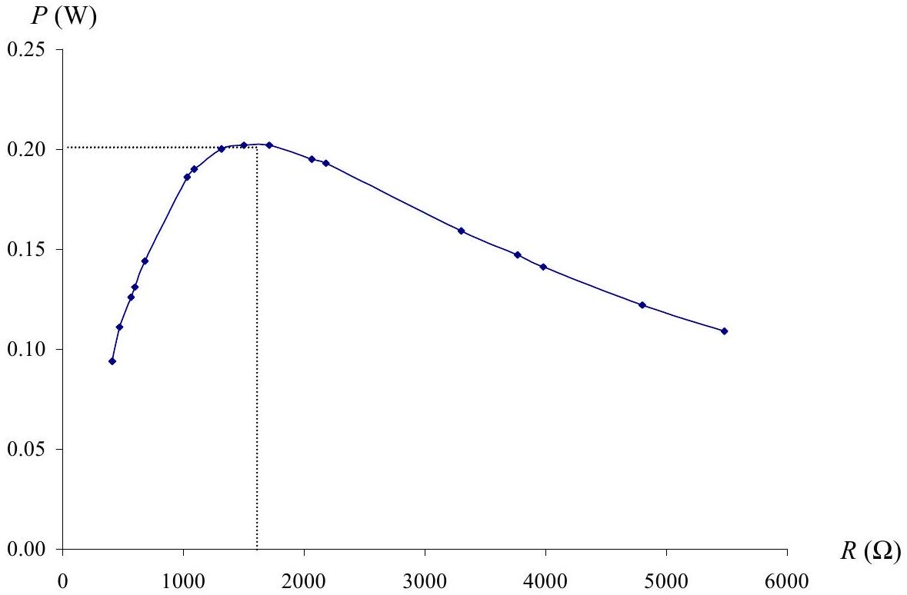
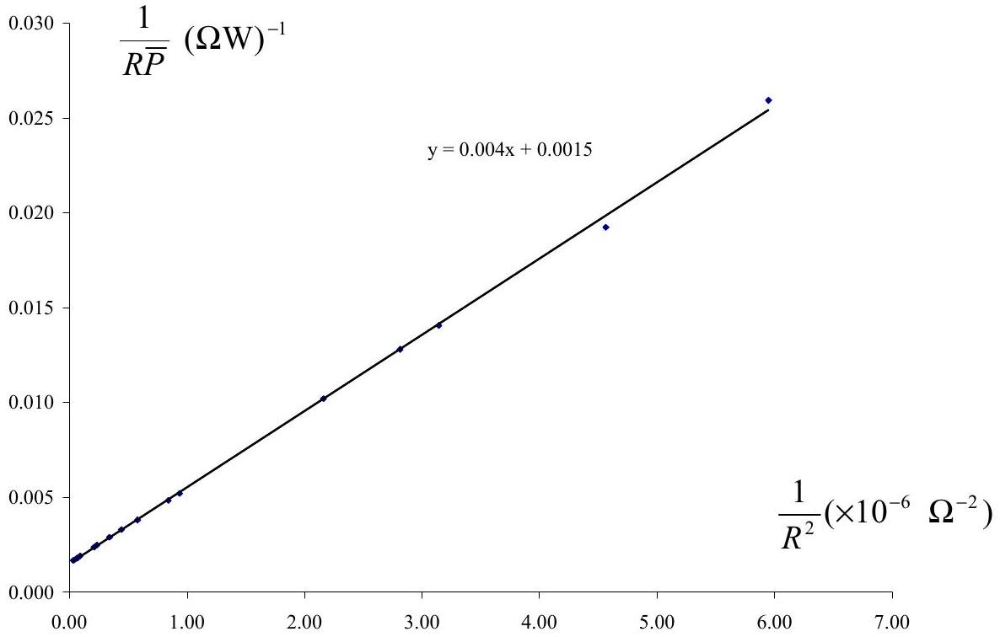
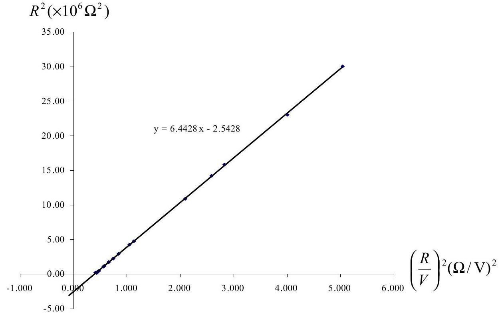

## Solution and Marking Scheme Experiment

## I. Determination of Capacitance

a) $$
\begin{equation*}
\bar { P } = I ^ { 2 } R = \frac { \frac { 1 } { 2 } \mathcal { E } _ { 0 } { } ^ { 2 } } { R ^ { 2 } + \left( \frac { 1 } { \omega C } \right) ^ { 2 } } R \tag{1.0point}
\end{equation*}
$$
b) $$
\begin{equation*}
\frac { d } { d R } \bar { P } = 0 \tag{0.3point}
\end{equation*}
$$
$$
\begin{equation*}
\frac { d } { d R } \bar { P } = \frac { d } { d R } \left( \frac { \frac { 1 } { 2 } \varepsilon _ { 0 } { } ^ { 2 } } { R ^ { 2 } + \left( \frac { 1 } { \omega C } \right) ^ { 2 } } R \right) \tag{0.4point}
\end{equation*}
$$
$$
= \frac { 1 } { 2 } \varepsilon _ { 0 } ^ { 2 } \frac { R ^ { 2 } + \left( \frac { 1 } { \omega C } \right) ^ { 2 } - R ( 2 R ) } { \left( R ^ { 2 } + \left( \frac { 1 } { \omega C } \right) ^ { 2 } \right) ^ { 2 } }
$$
condition for $\bar { P } _ { \max }$ :
$$
\begin{equation*}
R = \frac { 1 } { \omega C } \tag{0.3point}
\end{equation*}
$$
$$
\bar { P } = \frac { \frac { 1 } { 2 } \varepsilon _ { 0 } { } ^ { 2 } } { } R = \frac { \frac { 1 } { 2 } \varepsilon _ { 0 } { } ^ { 2 } R } { } = \frac { \frac { 1 } { 2 } \varepsilon _ { 0 } { } ^ { 2 } } { }
$$
Note: The linear graph will be $\frac { 1 } { R \bar { P } }$ or $\frac { 1 } { V ^ { 2 } }$ versus $\frac { 1 } { R ^ { 2 } }$. If $a$ is the slope and $b$ is the intercept with the Y axis, then
$$
\frac { 1 } { \omega ^ { 2 } C ^ { 2 } } = \frac { a } { b } \Rightarrow C = \frac { 1 } { \omega } \sqrt { \frac { b } { a } }
$$
An alternative method:
$$
\begin{aligned}
& \frac { V ^ { 2 } } { R ^ { 2 } } = \frac { \frac { 1 } { 2 } \mathcal { E } _ { 0 } ^ { 2 } } { R ^ { 2 } + \left( \frac { 1 } { \omega C } \right) ^ { 2 } } \\
& \frac { R ^ { 2 } } { V ^ { 2 } } = \left( R ^ { 2 } + \left( \frac { 1 } { \omega C } \right) ^ { 2 } \right) \frac { 2 } { \mathcal { E } _ { 0 } ^ { 2 } }
\end{aligned}
$$

$$
\begin{aligned}
& \frac { 1 } { V ^ { 2 } } = \left[ 1 + \left( \frac { 1 } { \omega C } \right) ^ { 2 } \frac { 1 } { R ^ { 2 } } \right] \frac { 2 } { \mathcal { E } _ { 0 } ^ { 2 } } = \frac { 2 } { \mathcal { E } _ { 0 } ^ { 2 } } + \frac { 2 } { \mathcal { E } _ { 0 } ^ { 2 } } \left( \frac { 1 } { \omega C } \right) ^ { 2 } \frac { 1 } { R ^ { 2 } } \\
& R ^ { 2 } = \left( \frac { 1 } { 2 } \varepsilon _ { 0 } ^ { 2 } \right) \left( \frac { R } { V } \right) ^ { 2 } - \left( \frac { 1 } { \omega C } \right) ^ { 2 }
\end{aligned}
$$

Note: The graph will be $R ^ { 2 }$ versus $\left( \frac { R } { V } \right) ^ { 2 }$ and $C$ is determined from the Y-intercept.

d)
| No. | Resistor(s) | $R ( \Omega )$ | $V ( \mathrm {~V} )$ | $\bar { P } = \frac { V ^ { 2 } } { R } ( \mathrm {~W} )$ |
| :--- | :--- | :--- | :--- | :--- |
| 1 | $R _ { A }$ | 680 | 9.86 | 0.144 |
| 2 | $R _ { B }$ | 1500 | 17.36 | 0.202 |
| 3 | $R _ { C }$ | 3300 | 22.81 | 0.159 |
| 4 | $R _ { A } + R _ { B }$ | 2180 | 20.49 | 0.193 |
| 5 | $R _ { A } / / R _ { B }$ | 468 | 7.28 | 0.111 |
| 6 | $R _ { B } + R _ { C }$ | 4800 | 23.98 | 0.122 |
| 7 | $R _ { B } / / R _ { C }$ | 1032 | 13.78 | 0.186 |
| 8 | $R _ { C } + R _ { A }$ | 3980 | 23.66 | 0.141 |
| 9 | $R _ { C } / / R _ { A }$ | 564 | 8.42 | 0.126 |
| 10 | $R _ { A } + R _ { B } + R _ { C }$ | 5480 | 24.40 | 0.109 |
| 11 | $\left( R _ { A } / / R _ { B } \right) + R _ { C }$ | 3768 | 23.43 | 0.147 |
| 12 | $\left( R _ { B } / / R _ { C } \right) + R _ { A }$ | 1712 | 18.63 | 0.202 |
| 13 | $\left( R _ { C } / / R _ { A } \right) + R _ { B }$ | 2064 | 20.15 | 0.195 |
| 14 | $\left( R _ { A } / / R _ { B } \right) / / R _ { C }$ | 410 | 6.22 | 0.094 |
| 15 | $\left( R _ { A } + R _ { B } \right) / / R _ { C }$ | 1313 | 16.18 | 0.200 |
| 16 | $\left( R _ { B } + R _ { C } \right) / / R _ { A }$ | 596 | 8.82 | 0.131 |
| 17 | $\left( R _ { C } + R _ { A } \right) / / R _ { B }$ | 1089 | 14.36 | 0.190 |
$( 2.5$ points $) : ($ data points $= 17 ; 2.5 , > 13 ; 2.0 , > 9 ; 1.5 ; > 3 ; 1.0 , \leq 3 ; 0.5 )$
e) (1.5 points):good graph (0.5 point): correct value

$$
R \text { at } \bar { P } _ { \max } = 1600 \Omega \Rightarrow C = \frac { 1 } { \omega R } = \frac { 1 } { 2 \pi \times 50 \times 1600 } = 1.9 \times 10 ^ { - 6 } \mathrm {~F} = 1.9 \mu \mathrm {~F}
$$

f) Linear graph.

| $R ( \Omega )$ | $V ( \mathrm {~V} )$ | $\bar { P } = \frac { V ^ { 2 } } { R } ( \mathrm {~W} )$ | $\frac { 1 } { R \bar { P } } ( \Omega \mathrm {~W} ) ^ { - 1 }$ | $\frac { 1 } { R ^ { 2 } } \left( \times 10 ^ { - 6 } \Omega ^ { - 2 } \right)$ |
| :--- | :--- | :--- | :--- | :--- |
| 410 | 6.22 | 0.094 | 0.0259 | 5.948 |
| 468 | 7.28 | 0.111 | 0.0193 | 4.565 |
| 564 | 8.42 | 0.126 | 0.0141 | 3.143 |
| 596 | 8.82 | 0.131 | 0.0128 | 2.815 |
| 680 | 9.86 | 0.144 | 0.0102 | 2.162 |
| 1032 | 13.78 | 0.186 | 0.0052 | 0.938 |
| 1089 | 14.36 | 0.190 | 0.0048 | 0.843 |
| 1313 | 16.18 | 0.200 | 0.0038 | 0.580 |
| 1500 | 17.36 | 0.202 | 0.0033 | 0.444 |
| 1712 | 18.63 | 0.202 | 0.0029 | 0.341 |
| 2064 | 20.15 | 0.195 | 0.0025 | 0.234 |
| 2180 | 20.49 | 0.193 | 0.0024 | 0.210 |
| 3300 | 22.81 | 0.159 | 0.0019 | 0.091 |
| 3768 | 23.43 | 0.147 | 0.0018 | 0.070 |
| 3980 | 23.66 | 0.141 | 0.0018 | 0.0631 |
| 4800 | 23.98 | 0.122 | 0.0017 | 0.0434 |
| 5480 | 24.40 | 0.109 | 0.0017 | 0.0333 |

$$
\begin{gathered}
\text { slope } = a = 0.004 \times 10 ^ { 6 } \Omega / \mathrm { W } , \quad \mathrm { Y } \text {-intercept } = b = 0.0015 ( \Omega \mathrm {~W} ) ^ { - 1 } : \\
\frac { 1 } { \omega ^ { 2 } C ^ { 2 } } = \frac { a } { b } \Rightarrow C = \frac { 1 } { \omega } \sqrt { \frac { b } { a } } = 1.95 \times 10 ^ { - 6 } \mathrm {~F} = 1.95 \mu \mathrm {~F}
\end{gathered}
$$

An alternative method of linear graph

| $R ( \Omega )$ | $V ( \mathrm {~V} )$ | $\bar { P } = \frac { V ^ { 2 } } { R } ( \mathrm {~W} )$ | $\left( \frac { R } { V } \right) ^ { 2 } ( \Omega / V ) ^ { 2 }$ | $R ^ { 2 } \left( \times 10 ^ { 6 } \Omega ^ { 2 } \right)$ |
| :--- | :--- | :--- | :--- | :--- |
| 410 | 6.22 | 0.094 | 4345 | 0.17 |
| 468 | 7.28 | 0.111 | 4133 | 0.22 |
| 564 | 8.42 | 0.126 | 4487 | 0.32 |
| 596 | 8.82 | 0.131 | 4566 | 0.36 |
| 680 | 9.86 | 0.144 | 4756 | 0.46 |
| 1032 | 13.78 | 0.186 | 5609 | 1.07 |
| 1089 | 14.36 | 0.190 | 5751 | 1.19 |
| 1313 | 16.18 | 0.200 | 6585 | 1.72 |
| 1500 | 17.36 | 0.202 | 7466 | 2.25 |
| 1712 | 18.63 | 0.202 | 8445 | 2.93 |
| 2064 | 20.15 | 0.195 | 10492 | 4.26 |
| 2180 | 20.49 | 0.193 | 11320 | 4.75 |
| 3300 | 22.81 | 0.159 | 20930 | 10.89 |
| 3768 | 23.43 | 0.147 | 25863 | 14.20 |
| 3980 | 23.66 | 0.141 | 28297 | 15.84 |
| 4800 | 23.98 | 0.122 | 40067 | 23.04 |
| 5480 | 24.40 | 0.109 | 50441 | 30.03 |

Graphical analysis: $\quad \mathrm { Y }$-intercept $= \left( \frac { 1 } { \omega C } \right) ^ { 2 } = 2.5428 \times 10 ^ { 6 } \Omega ^ { 2 }$

$$
\frac { 1 } { \omega C } = 1.595 \times 10 ^ { 3 } \Omega \Rightarrow C = 1.99 \times 10 ^ { - 6 } \mathrm {~F} = 1.99 \mu \mathrm {~F}
$$

(1.5 points): good graph
(0.5 point): correct value
a) Estimation of the uncertainty in the values of $C$ obtained in e)
(0.25 point)

Estimation of the uncertainty in the values of $C$ obtained in f)
(0.25 point)
