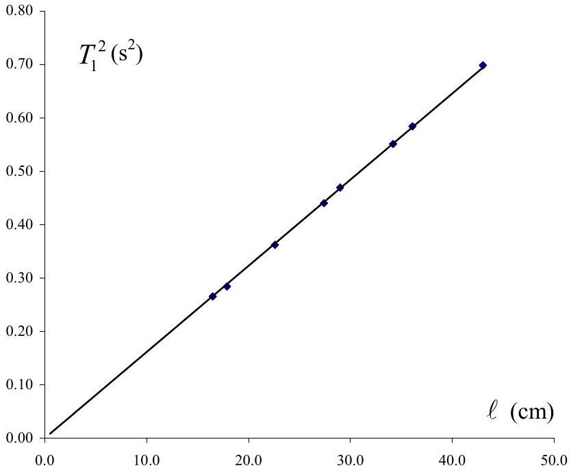
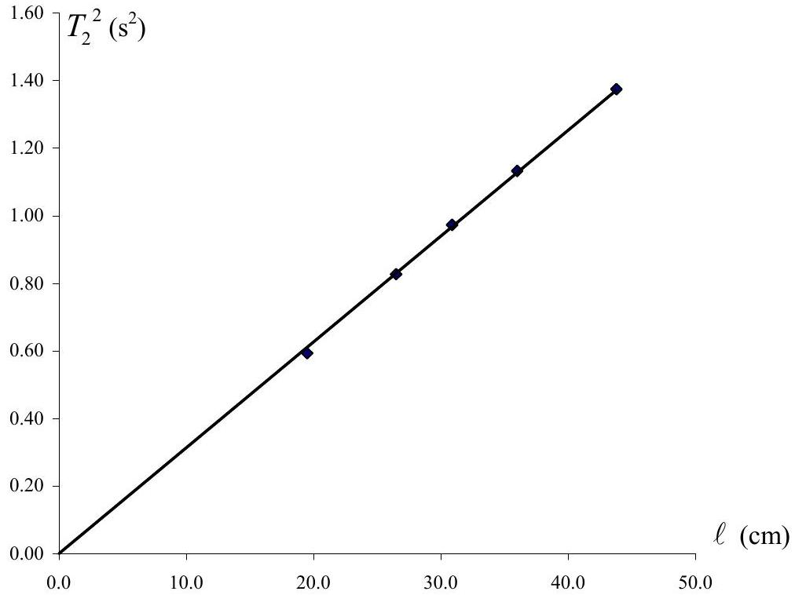

## Solution and Marking Scheme Experiment

## II. Cylindrical Bore

a) Derivation of moment of inertia $I$ (0.5 points)
Configuration Fig. 1.2(a)
$$
\begin{aligned}
I _ { 1 } & = \frac { 1 } { 6 } M a ^ { 2 } - \frac { 1 } { 2 } m b ^ { 2 } = \frac { 1 } { 6 } \left( \rho a ^ { 3 } \right) a ^ { 2 } - \frac { 1 } { 2 } \left( \rho \pi b ^ { 2 } a \right) b ^ { 2 } \\
& = \frac { 1 } { 6 } \rho a ^ { 5 } - \frac { 1 } { 2 } \rho \pi a b ^ { 4 }
\end{aligned}
$$
Configuration Fig. 1.2(b)
$$
\begin{aligned}
I _ { 2 } & = \frac { 1 } { 6 } M a ^ { 2 } - \frac { 1 } { 12 } m a ^ { 2 } - \frac { 1 } { 4 } m b ^ { 2 } = \frac { 1 } { 6 } \left( \rho a ^ { 3 } \right) a ^ { 2 } - \frac { 1 } { 12 } \left( \rho \pi b ^ { 2 } a \right) a ^ { 2 } - \frac { 1 } { 4 } \left( \rho \pi b ^ { 2 } a \right) b ^ { 2 } \\
& = \frac { 1 } { 6 } \rho a ^ { 5 } - \frac { 1 } { 12 } \rho \pi a ^ { 3 } b ^ { 2 } - \frac { 1 } { 4 } \rho \pi a b ^ { 4 }
\end{aligned}
$$
Derivation of period of oscillation $T$
For both configurations:
the restoring torque $\quad \tau = F d$
where
$$
\begin{align*}
& F = \frac { 1 } { 2 } m _ { 0 } g \frac { \delta s } { \ell } \text { and } \frac { \delta s } { d / 2 } \approx \theta \\
& F \approx \frac { 1 } { 2 } m _ { 0 } g \frac { d } { 2 \ell } \theta \tag{0.5points}
\end{align*}
$$
net mass $m _ { 0 } = \rho a ^ { 3 } \left( 1 - \pi \frac { b ^ { 2 } } { a ^ { 2 } } \right) = \rho a ^ { 3 } \left( 1 - \pi x ^ { 2 } \right) \quad$ where $\quad x \equiv \frac { b } { a }$
since
$$
\begin{equation*}
\tau = I \alpha , \quad \alpha = \frac { \frac { 1 } { 4 } m _ { 0 } g \frac { d ^ { 2 } } { \ell } \theta } { I } \tag{0.5points}
\end{equation*}
$$
$$
\begin{aligned}
\omega ^ { 2 } & = \frac { 4 \pi ^ { 2 } } { T ^ { 2 } } = \frac { \frac { 1 } { 4 } m _ { 0 } g \frac { d ^ { 2 } } { \ell } } { I } \\
T ^ { 2 } & = \frac { 4 \pi ^ { 2 } I \ell } { \frac { 1 } { 4 } m _ { 0 } g d ^ { 2 } } = \left( \frac { 16 \pi ^ { 2 } I } { m _ { 0 } g d ^ { 2 } } \right) \ell
\end{aligned}
$$
For configuration in Fig. 2.2(a),
$$
T _ { 1 } ^ { 2 } = \left( \frac { 16 \pi ^ { 2 } } { g d ^ { 2 } } \frac { \frac { 1 } { 6 } \rho a ^ { 5 } - \frac { 1 } { 2 } \rho \pi a b ^ { 4 } } { \rho a ^ { 3 } \left( 1 - \pi x ^ { 2 } \right) } \right) e
$$

$$
= \frac { 8 \pi ^ { 2 } } { 3 g } \left( \frac { a } { d } \right) ^ { 2 } \left( \frac { 1 - 3 \pi x ^ { 4 } } { 1 - \pi x ^ { 2 } } \right) \ell \quad \text { (0.5 points) }
$$

For configuration in Fig. 2.2(b), $\quad T _ { 2 } ^ { 2 } = \left( \frac { 16 \pi ^ { 2 } \frac { 1 } { 6 } \rho a ^ { 5 } \left( 1 - \frac { \pi } { 2 } \frac { b ^ { 2 } } { a ^ { 2 } } - \frac { 3 \pi } { 2 } \frac { b ^ { 4 } } { a ^ { 4 } } \right) } { \rho a ^ { 3 } \left( 1 - \pi x ^ { 2 } \right) g d ^ { 2 } } \right) \ell$

$$
= \frac { 8 \pi ^ { 2 } } { 3 g } \left( \frac { a } { d } \right) ^ { 2 } \left( \frac { 1 - \frac { \pi x ^ { 2 } } { 2 } - \frac { 3 \pi } { 2 } x ^ { 4 } } { 1 - \pi x ^ { 2 } } \right) \ell
$$

b)For configuration in Fig. 2.2(a), $d = 7.0 \mathrm {~cm}$

| $\ell ( \mathrm { cm } )$ | $T _ { 1 }$ for 40 oscillations(s) |  |  | $T _ { 1 } ( \mathrm {~s} )$ | $\left( T _ { 1 } \right) ^ { 2 } \left( \mathrm {~s} ^ { 2 } \right)$ |
| :--- | :--- | :--- | :--- | :--- | :--- |
| 16.5 | 20.60 | 20.50 | 20.70 | 0.515 | 0.265 |
| 17.9 | 21.35 | 21.35 | 21.30 | 0.533 | 0.284 |
| 22.6 | 24.05 | 24.00 | 24.00 | 0.601 | 0.362 |
| 27.4 | 26.55 | 26.45 | 26.55 | 0.663 | 0.440 |
| 29.0 | 27.40 | 27.40 | 27.40 | 0.685 | 0.469 |
| 34.2 | 29.75 | 29.70 | 29.65 | 0.743 | 0.551 |
| 36.1 | 30.60 | 30.60 | 30.50 | 0.764 | 0.584 |
| 43.0 | 33.40 | 33.35 | 33.50 | 0.835 | 0.698 |

(3 points):
3 sets of $n$ oscillations (1 point) [2 sets -0.3, 1 set -0.7]
$n \geq 20 \quad ( 1$ point $) [ \geq 15 , - 0.3 , \geq 10 , - 0.7 , < 10 , - 1.0 ]$
number of lengths, $\ell , \geq 5$ ( 1 point) [4, -0.3, 3, -0.5, 1 or 2, -1.0]

slope of graph: $s _ { 1 } = \frac { 0.698 - 0.265 } { ( 43.0 - 16.5 ) \times 10 ^ { - 2 } } = \frac { 0.433 } { 26.5 \times 10 ^ { - 2 } } = 1.634 \mathrm {~s} ^ { 2 } / \mathrm { m }$

$$
x = \frac { b } { a } = 0.24 \pm 0.02
$$

For configuration in Fig. 2.2(b), $\quad d = 4.9 \mathrm {~cm}$

| $\ell ( \mathrm { cm } )$ | $T _ { 2 }$ for 40 oscillations (s) |  |  | $T _ { 2 } ( \mathrm {~s} )$ | $\left( T _ { 2 } \right) ^ { 2 } \left( \mathrm {~s} ^ { 2 } \right)$ |
| :--- | :--- | :--- | :--- | :--- | :--- |
| 43.8 | 46.95 | 46.90 | 46.80 | 1.172 | 1.374 |
| 36.0 | 42.70 | 42.45 | 42.50 | 1.064 | 1.132 |
| 30.9 | 39.60 | 39.40 | 39.35 | 0.986 | 0.973 |
| 26.5 | 36.40 | 36.30 | 36.45 | 0.909 | 0.827 |
| 19.5 | 30.80 | 30.85 | 30.75 | 0.776 | 0.593 |

slope of graph: $s _ { 2 } = \frac { 1.374 - 0.827 } { ( 43.8 - 26.5 ) \times 10 ^ { - 2 } } = \frac { 0.547 } { 17.3 \times 10 ^ { - 2 } } = 3.14 \mathrm {~s} ^ { 2 } / \mathrm { m }$

$$
x = \frac { b } { a } = 0.25 \pm 0.03
$$

graph (3.0 points): good graph (1.5 points)
slope (1.0 point)
error of experimental points (0.5 point)
calculation for $\frac { b } { a }$ (1.0 point) error estimation (1.0 point)
