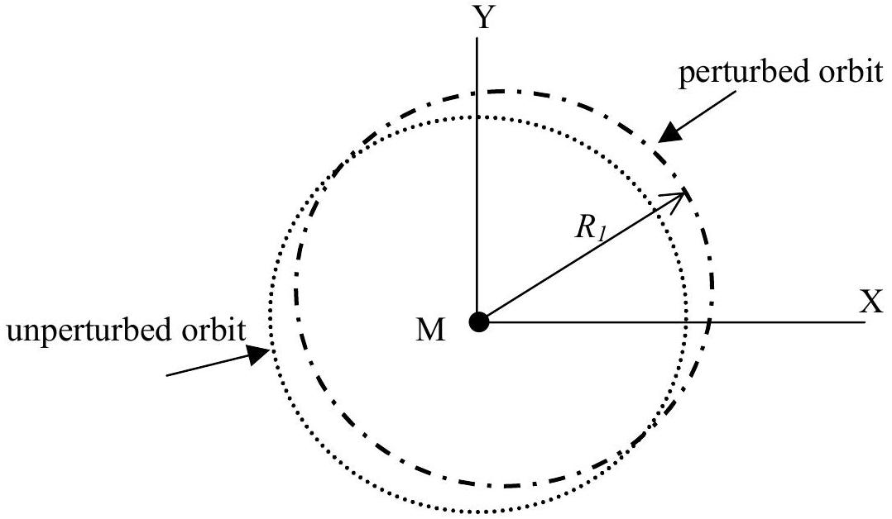

## Solution and Marking Scheme

Theory

## I. Satellite's orbit transfer

a) $\frac { m u _ { 0 } { } ^ { 2 } } { R _ { 0 } } = \frac { G M m } { R _ { 0 } { } ^ { 2 } } , \quad u _ { 0 } = \sqrt { \frac { G M } { R _ { 0 } } }$ (1 point)
b) conservation of angular momentum: $m u _ { 1 } R _ { 0 } = m u _ { 2 } R _ { 1 }$ conservation of energy: $\frac { 1 } { 2 } m u _ { 2 } { } ^ { 2 } - \frac { G M m } { R _ { 1 } } = \frac { 1 } { 2 } m u _ { 1 } { } ^ { 2 } - \frac { G M m } { R _ { 0 } }$
$$
\begin{aligned}
{ \left[ \left( \frac { R _ { 0 } } { R _ { 1 } } \right) ^ { 2 } - 1 \right] u _ { 1 } ^ { 2 } } & = 2 G M \left[ \frac { 1 } { R _ { 1 } } - \frac { 1 } { R _ { 0 } } \right] \\
\frac { \left( R _ { 0 } - R _ { 1 } \right) \left( R _ { 0 } + R _ { 1 } \right) } { R _ { 1 } ^ { 2 } } u _ { 1 } ^ { 2 } & = ( 2 G M ) \frac { \left( R _ { 0 } - R _ { 1 } \right) } { R _ { 0 } R _ { 1 } } \\
u _ { 1 } = \sqrt { \frac { G M } { R _ { 0 } } } \sqrt { \frac { 2 R _ { 1 } } { R _ { 1 } + R _ { 0 } } } & = u _ { 0 } \sqrt { \frac { 2 R _ { 1 } } { R _ { 1 } + R _ { 0 } } }
\end{aligned}
$$
(2 points)
c) $\quad \lim _ { R _ { 1 } \rightarrow \infty } u _ { 1 } = \sqrt { 2 } u _ { 0 }$ (1 point)
d) $\quad u _ { 2 } = u _ { 1 } \frac { R _ { 0 } } { R _ { 1 } } = u _ { 0 } \frac { \sqrt { 2 } R _ { 0 } } { \sqrt { R _ { 1 } \left( R _ { 1 } + R _ { 0 } \right) } }$ (1 point)
e) $$
\begin{aligned}
u _ { 3 } & = \sqrt { \frac { G M } { R _ { 1 } } } = \sqrt { \frac { G M } { R _ { 0 } } } \sqrt { \frac { R _ { 0 } } { R _ { 1 } } } = u _ { 0 } \sqrt { \frac { R _ { 0 } } { R _ { 1 } } } \\
& = \sqrt { \frac { R _ { 0 } } { R _ { 1 } } } \sqrt { \frac { R _ { 1 } \left( R _ { 1 } + R _ { 0 } \right) } { \sqrt { 2 } R _ { 0 } } } u _ { 2 } \\
u _ { 3 } & = u _ { 2 } \sqrt { \frac { R _ { 1 } + R _ { 0 } } { 2 R _ { 0 } } }
\end{aligned}
$$
(1 point)
f) (3 points) combining equations (1) and (2) :
$$
\frac { d ^ { 2 } } { d t ^ { 2 } } r - \frac { C / m } { r ^ { 3 } } = - \frac { G M } { r ^ { 2 } }
$$
and for the circular orbit of radius $R _ { 1 }$ we have $\frac { C } { m } = G M R _ { 1 }$
hence $\quad \frac { d ^ { 2 } } { d t ^ { 2 } } r - \frac { G M R _ { 1 } } { r ^ { 3 } } = - \frac { G M } { r ^ { 2 } }$
putting $r = R _ { 1 } + \eta$, where $\eta \ll R _ { 1 }$
$$
\therefore \frac { d ^ { 2 } } { d t ^ { 2 } } \eta - \frac { G M R _ { 1 } } { R _ { 1 } ^ { 3 } \left( 1 + \frac { \eta } { R _ { 1 } } \right) ^ { 3 } } = - \frac { G M } { R _ { 1 } ^ { 2 } \left( 1 + \frac { \eta } { R _ { 1 } } \right) ^ { 2 } }
$$

$$
\begin{aligned}
& \frac { d ^ { 2 } } { d t ^ { 2 } } \eta - \frac { G M } { R _ { 1 } ^ { 2 } } \left( 1 - 3 \frac { \eta } { R _ { 1 } } \right) \approx - \frac { G M } { R _ { 1 } ^ { 2 } } \left( 1 - 2 \frac { \eta } { R _ { 1 } } \right) \\
& \frac { d ^ { 2 } } { d t ^ { 2 } } \eta \approx - \frac { G M } { R _ { 1 } ^ { 3 } } \eta
\end{aligned}
$$

the frequency of oscillation about mean distance is $f = \frac { 1 } { 2 \pi } \sqrt { \frac { G M } { R _ { 1 } { } ^ { 3 } } }$ the period $T = \frac { 1 } { f } = 2 \pi \sqrt { \frac { R _ { 1 } { } ^ { 3 } } { G M } }$
Note that this period is the same as the orbital period

h) (1 point)

