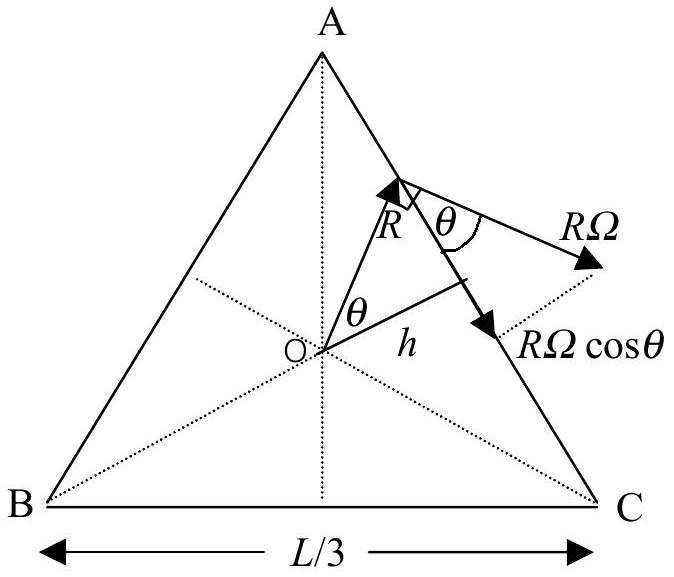

## Solution and Marking Scheme Theory

## II. Optical Gyroscope

The light wave moves with speed $c ^ { \prime } = \frac { c } { \mu }$ in the medium having refractive index $\mu$. Wavelength of light in medium $\lambda ^ { \prime } = \frac { \lambda } { \mu }$, where $\lambda$ is the wavelength of light in vacuum.

a) (2 points)
transit time for the CW beam: $t ^ { + } = \frac { 2 \pi R + R \Omega t ^ { + } } { c ^ { \prime } } = \frac { 2 \pi R } { c ^ { \prime } } \left( 1 - \frac { R \Omega } { c ^ { \prime } } \right) ^ { - 1 }$
transit time for the CCW beam: $t ^ { - } = \frac { 2 \pi R - R \Omega t ^ { - } } { c ^ { \prime } } = \frac { 2 \pi R } { c ^ { \prime } } \left( 1 + \frac { R \Omega } { c ^ { \prime } } \right) ^ { - 1 }$
the time difference between $t ^ { + }$and $t ^ { - } : \Delta t = \frac { 4 \pi R ^ { 2 } \Omega } { \left( c ^ { \prime } \right) ^ { 2 } - R ^ { 2 } \Omega ^ { 2 } }$
since $\quad ( R \Omega ) ^ { 2 } \ll \left( c ^ { \prime } \right) ^ { 2 } \quad \Delta t \approx \frac { 4 \pi R ^ { 2 } \Omega } { \left( c ^ { \prime } \right) ^ { 2 } }$
b) (2 points) the round-trip optical path difference, $\Delta L$, is given by
$$
\Delta L = c ^ { \prime } \Delta t = \frac { 4 \pi R ^ { 2 } \Omega } { c ^ { \prime } }
$$
c) $( 1$ point $) \quad \Delta \mathrm { L } \cong 4.5 \times 10 ^ { - 12 } \mathrm {~m}$.
d) (1 point) the corresponding optical phase difference $\Delta \theta$ is, $\Delta \theta = \frac { 2 \pi \Delta L } { \lambda ^ { \prime } } = \frac { 8 \pi ^ { 2 } R ^ { 2 } \Omega } { c \lambda ^ { \prime } }$, where $\lambda ^ { \prime } = \frac { \lambda } { \mu }$
for $N$ turns of fiber optic ring,
$$
\Delta \theta = \frac { 8 \pi ^ { 2 } R ^ { 2 } N \Omega } { c \lambda ^ { \prime } }
$$

e) (2 points)

The figure shows the triangular ring rotating about the centre o with the angular speed $\Omega$ in the clockwise direction. Without loosing generality, let's first consider the velocity of light along AC in the CW and CCW direction,
$$
\begin{aligned}
& v _ { \pm } = c \pm R \Omega \cos \theta = c \pm \Omega h , \text { where } \mathrm { h } \text { is constant. } \\
& \tau _ { \pm } = \frac { L / 3 } { v _ { \pm } } = \frac { L / 3 } { c \pm \Omega h } \approx \frac { L / 3 } { c } \left( 1 \mp \frac { \Omega h } { c } \right)
\end{aligned}
$$
where $\tau _ { \pm }$is the time taken for light travelling along AC in the CW and CCW.
$$
t _ { \pm } = \frac { L } { v _ { \pm } } = \frac { L } { c \pm \Omega h } \approx \frac { L } { c } \left( 1 \mp \frac { \Omega h } { c } \right) \text {, where } \mathrm { L } \text { is the perimeter of the triangular }
$$
ring.
Therefore, the time difference of light travelling in one complete cycle.
$$
\Delta t = \frac { 2 \Omega L h } { c ^ { 2 } } = \frac { 4 \Omega } { c ^ { 2 } } \left( \frac { 1 } { 2 } L h \right) = \frac { 4 \Omega A } { c ^ { 2 } } , \text { where } A \text { is the area of the triangular ring. }
$$
f) The resonance frequencies associated with $L _ { \pm }$corresponding to the effective cavity lengths seen by CW and CCW propagating beams respectively is,
$$
\begin{aligned}
& L _ { + } = c t ^ { + } \approx L \left( 1 - \frac { \Omega h } { c } \right) \\
& L _ { - } = c t ^ { - } \approx L \left( 1 + \frac { \Omega h } { c } \right)
\end{aligned}
$$
where $\mathrm { L } _ { \pm }$is the perimeter of the equilateral triangle in the CW (+) and CCW (-) and we also use the fact that $h \Omega \ll c$. Therefore,
$$
\Delta L = L _ { - } - L _ { + } = 2 L \frac { \Omega h } { c } = \frac { 4 \Omega A } { c } = \frac { \Omega L ^ { 2 } } { \sqrt { 3 } c }
$$
The condition to sustain the laser oscillation (given in the problem),
$$
\begin{align*}
& v _ { \pm } = \frac { m } { L _ { \pm } } c , \mathrm {~m} = 1,2,3 , \ldots \text { integers }  \tag{1point}\\
& \Delta v = v _ { - } - v _ { + } = \frac { m } { L _ { - } } c - \frac { m } { L _ { + } } c \approx m c \frac { \Delta L } { L ^ { 2 } } = v \frac { \Delta L } { L } \tag{1point}
\end{align*}
$$

the approximation arises from $L _ { + } L _ { - } \approx L ^ { 2 }$
where L is the perimeter of the triangular ring. Hence,

$$
\begin{equation*}
\Delta \nu = \frac { \Delta L } { L } \nu = \frac { 4 A } { L c } \nu \Omega = \frac { 1 } { \sqrt { 3 } } \frac { L } { \lambda } \Omega \tag{1point}
\end{equation*}
$$
