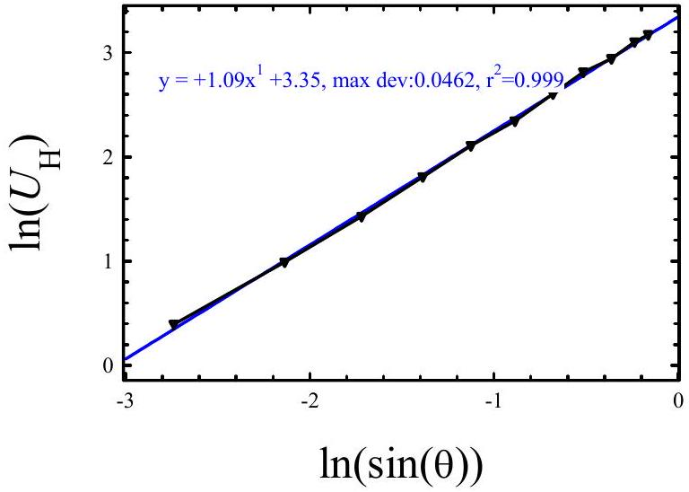
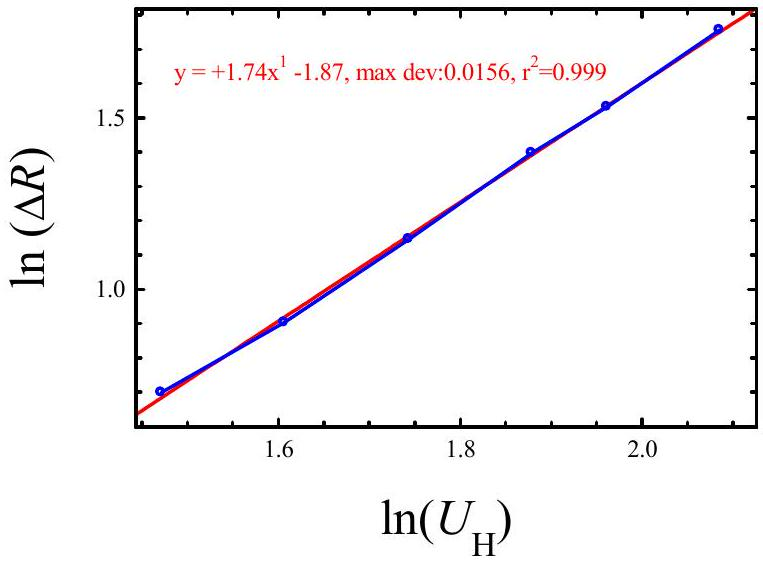

## Solution of Experimental Problem No. 1 Hall effect and magnetoresistivity effect

1. Determination of the sensitivity $\boldsymbol { \alpha }$ of the Hall sensor:

The current $I _ { \mathrm { H } }$ supplied by battery 1 and flowing through the miliammeter and the sensor via the pins P and Q is maintained unchanged. Use the variable resistance to maintain $I _ { \mathrm { H } } \sim 1$ mA . The Hall voltage $U _ { \mathrm { H } }$ is measured across the pins M and N with a milivoltmeter.

In the absence of a magnetic field, we obtain $- 1,3 \mathrm { mV } < \mathrm { V } _ { \mathrm { MN } } < 1,3 \mathrm { mV }$.
Put the magnet on the protractor at a distance $y = 2 \mathrm {~cm} = 2.10 ^ { - 2 } \mathrm {~m}$ from the sensor.
Rotate the protractor to obtain the maximum value of $U _ { \mathrm { H } }$. We find the position of the magnet, in which the line joining the magnet and the sensor is perpendicular to the surface of the sensor. In this position of the magnet the axis is perpendicular to the surface of the sensor and $\stackrel { 1 } { B }$ is perpendicular to the current $I _ { \mathrm { H } }$, and $\theta = 90 ^ { 0 }$.

Measure $U _ { \mathrm { MN } }$ and calculate the value of $U _ { \mathrm { H } } : \quad U _ { \mathrm { H } } = \mathrm { U } _ { \mathrm { MN } } - \mathrm { V } _ { \mathrm { MN } }$.
Calculate the value of $B$ by using equation (1).
Use the relation $\alpha = U _ { \mathrm { H } } / \mathrm { IB }$ to calculate the value of $\alpha$.
Repeat the measurement to obtain 4-5 different values of $\alpha$, and calculate the mean value of $\alpha$ and the deviation $\Delta \alpha$.
2. Study the dependence of $\boldsymbol { U } _ { \mathbf { H } }$ on $\boldsymbol { \theta }$.
a. Keeping $y$ unchanged, $\mathrm { y } = 2 \mathrm {~cm}$. By rotating the protractor, we change the angle $\theta$ between $\stackrel { 1 } { B }$ and the current direction.
b. At each angle $\theta$, measure $U _ { \mathrm { H } }$ (always with the same $I _ { \mathrm { H } }$ ). Vary the angle in the range -$90 ^ { \circ } \leq \theta \leq 90 ^ { \circ }$.

Tabulate $U _ { \mathrm { H } }$ versus $\theta$.
For $U _ { \mathrm { H } } = \gamma \boldsymbol { \operatorname { s i n } } ^ { m } \theta$, then:

$$
\begin{equation*}
\ln U _ { \mathrm { H } } = \ln \gamma + m \cdot \ln ( \sin \theta ) \tag{2}
\end{equation*}
$$

Plot $\boldsymbol { \operatorname { l n } } U _ { \mathrm { H } }$ versus $\boldsymbol { \operatorname { l n } } ( \boldsymbol { \operatorname { s i n } } \theta )$, we get $m$ and the error.
We find that the graph of $\boldsymbol { \operatorname { l n } } U _ { \mathrm { H } }$ versus $\boldsymbol { \operatorname { l n } } ( \boldsymbol { \operatorname { s i n } } \theta )$ is a straight line. From the graph we can deduce $m = 1$.

3. Study the dependence of $\Delta \boldsymbol { R } / \boldsymbol { R }$ on $\boldsymbol { B }$.

The Hall sensor, with its sensitivity $\alpha$ obtained from part 1., is used to measure the magnetic induction $B$. It serves to study the magnetoresistivity as well. Because the

resistance between N and M does not change during the experiment (and equals about 350 $\Omega$ ) we can study the dependence $\Delta R$ instead of $\Delta R / R$ on $B$.
a. Keep the axis of the magnet perpendicular to the surface of the sensor by the procedure described in part 1. Provide a current $I = 1 \mathrm {~mA}$ to the Hall sensor and measure the intensity of the magnetic field (at the sensor).

Turn off the current, and switch the multimeter from the milivoltmeter regime to the ohmmeter regime.

Measure the resistance between N and M and calculate the value of $\Delta R$.
Vary the distance $y$ from the sensor to the magnet from 2 cm to 0.6 cm and repeat the above measurement. Tabulate the values of $\Delta R / R$ or $\Delta R$ versus $B$.
b. Assuming $\frac { \Delta R } { R } = \beta . B ^ { k }$, we have:

$$
\begin{equation*}
\ln \left( \frac { \Delta R } { R } \right) = \ln \beta + k \ln B \tag{1}
\end{equation*}
$$

Plot $\boldsymbol { \operatorname { l n } } \left( \frac { \Delta R } { R } \right)$ versus $\boldsymbol { \operatorname { l n } } B$.
Draw a straight line passing as nearly the experimental points as possible. The slope of this line gives the value of $k$. One can find the value $k \sim 2$. The deviation of $k$ can be estimated from the graph by using eye-balling method.

The student may use the less square method to determine $k$ and the error.

## 4. Determination of the permeability $\boldsymbol { \mu }$ of a ferromagnetic core in a toroidal coil.

Put the Hall sensor into the gap. Keep the current through the sensor constant, $I = 1 \mathrm {~mA}$. The sensor is used to measure $B$ in the gap.

Connect the coil to battery 2 via an ammeter. Note the value $I _ { C }$ of the current flowing in the coil. $I _ { C }$ varies from 3 to 4 amperes. Turn off immediately the current $I _ { \mathrm { C } }$ after reading its value, to avoid the variation of the temperature of the sensor.

Count the number $N$ of turns of the coil. From the values of $U _ { \mathrm { H } } , \alpha$, determine $B$. From the values of $B , \rho , d$ and $N$, using the relation :

$$
\frac { B ( \rho - d ) } { \mu } + B d = 4 \pi \cdot 10 ^ { - 7 } \cdot N \cdot I ,
$$

we obtain the value of $\mu$.
