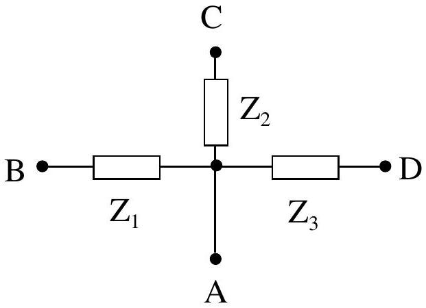
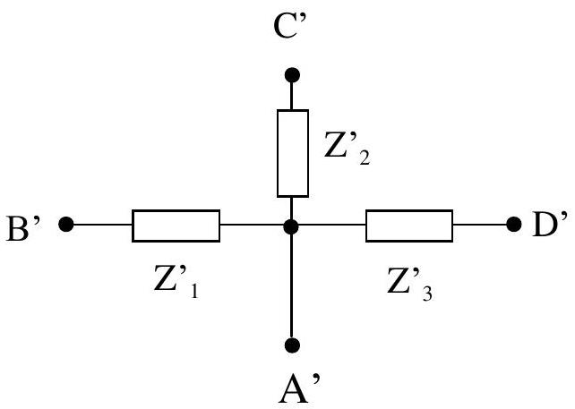

## Experimental Competition - Problem No. 2   Black box

APPARATUS AND MATERIALS

1. A double beam oscilloscope.
2. A function generator capable to generate sine, triangle and square waves over the
0.02 Hz to 2 MHz range.
3. A "Black box" with two groups of connectors: the ABCD group and $\mathrm { A } ^ { \prime } \mathrm { B } ^ { \prime } \mathrm { C } ^ { \prime } \mathrm { D } ^ { \prime }$ group. Besides, there are also two connectors for the standard resistor $R _ { \mathrm { n } } = 5 \mathrm { k } \Omega$, which is isolated from the two groups.
4. Conductors of negligible resistance.
5. Graph paper.

Warning: You are not allowed to open the black box.
EXPERIMENT
In the black box, there are two groups of passive elements (that are elements of the types: resistor $R$, capacitor $C$ or inductor (induction coil) $L$ ). The first group consists of three elements $Z _ { 1 } , Z _ { 2 } , Z _ { 3 }$ connected in a star circuit as shown in Figure 1. The elements are led out to the connectors A, B, C and D, with A - the common connector of the ABCD group. The second group consists of three elements $Z _ { 1 } ^ { \prime } , Z _ { 2 } ^ { \prime } , Z _ { 3 } ^ { \prime }$ connected in the same manner to connectors $\mathrm { A } ^ { \prime } , \mathrm { B } ^ { \prime } , \mathrm { C } ^ { \prime }$ and $\mathrm { D } ^ { \prime }$, with $\mathrm { A } ^ { \prime }$ - the common

Figure 1

connector of the $\mathrm { A } ^ { \prime } \mathrm { B } ^ { \prime } \mathrm { C } ^ { \prime } \mathrm { D } ^ { \prime }$ group (see Figure 2).

1. By using the oscilloscope and the function generator, determine the type and the parameter (that is resistance of $R$, capacity of $C$, inductivity of $L$ ) of each of the elements $Z _ { 1 } , Z _ { 2 } , Z _ { 3 }$ and $Z _ { 1 } ^ { \prime } , Z _ { 2 } ^ { \prime } , Z _ { 3 } ^ { \prime }$.
[5.0 pts]
2. Connect five points B, C, B', C' and D' together. We obtain a new black box with terminals DD'A' (called DD'A').
a. Draw the electric circuit of this black box.

Figure 2

b. Apply a sine wave from the generator to connectors D and A'.

Plot a graph of the ratio of the voltage amplitudes $K = \frac { U _ { \mathrm { D } ^ { \prime } \mathrm { A } ^ { \prime } } } { U _ { \mathrm { DA } ^ { \prime } } }$ and the phase shift $\varphi$ between these voltages as functions of the frequency $f$ of the signal.

c. The graphs possess a particular point at a certain frequency $f _ { 0 }$. Determine the value

d. Derive the relation between $f _ { 0 }$ and the parameters of the elements in the black box and calculate the values of $f _ { 0 . }$ [5.0 pts]
