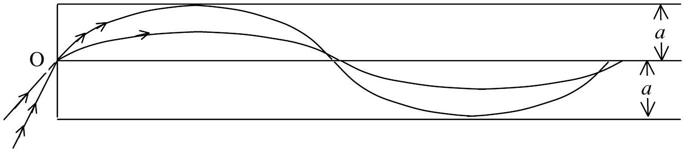
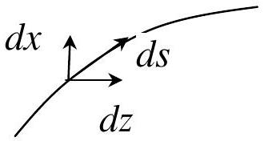

## Solutions of Problem No. 1   Optical fiber

1.a. At both sides of the point O (outside and inside the fiber), according to Snell law, we have:

$$
\begin{equation*}
n _ { 0 } \boldsymbol { \operatorname { s i n } } \theta _ { \mathrm { i } } = n _ { 1 } \boldsymbol { \operatorname { s i n } } \theta _ { 1 } \tag{1}
\end{equation*}
$$

where $\theta _ { 1 }$ is the value of angle $\theta$ at point O inside the fiber.
The light trajectory lays in the $x O z$ plane. Because the refraction index $n$ varies along $x$ direction, we divide $O x$ axis into small elements $d x$, so that in each of these elements $n$ can be considered as constant. We have, then:

$$
\begin{equation*}
n \boldsymbol { \operatorname { s i n } } i = ( n + d n ) \cdot \boldsymbol { \operatorname { s i n } } ( i + d i ) \tag{2}
\end{equation*}
$$

where $i$ is the angle between the light trajectory and $x$ direction. Because $\theta + i = \frac { \pi } { 2 }$, then

$$
\begin{equation*}
n \cos \theta = ( n + d n ) \cdot \cos ( \theta + d \theta ) \tag{3}
\end{equation*}
$$

Thus, at each point of coordinate $x$ on the light trajectory, we have:

$$
\begin{equation*}
n \cos \theta = n _ { 1 } \sqrt { 1 - \alpha ^ { 2 } x ^ { 2 } } \cos \theta = n _ { 1 } \cos \theta _ { 1 } \tag{4}
\end{equation*}
$$

Because

$$
\begin{equation*}
\boldsymbol { \operatorname { c o s } } \theta _ { 1 } = \sqrt { 1 - \boldsymbol { \operatorname { s i n } } ^ { 2 } \theta _ { 1 } } = \sqrt { 1 - \frac { \boldsymbol { \operatorname { s i n } } ^ { 2 } \theta _ { \mathrm { i } } } { n _ { 1 } ^ { 2 } } } \tag{5}
\end{equation*}
$$

we have

$$
n \boldsymbol { \operatorname { c o s } } \theta = n _ { 1 } \boldsymbol { \operatorname { c o s } } \theta _ { 1 } = n _ { 1 } \sqrt { 1 - \frac { \boldsymbol { \operatorname { s i n } } ^ { 2 } \theta _ { i } } { n _ { 1 } ^ { 2 } } } = \sqrt { n _ { 1 } ^ { 2 } - \boldsymbol { \operatorname { s i n } } ^ { 2 } \theta _ { i } }
$$

Then

$$
\begin{equation*}
n \boldsymbol { \operatorname { c o s } } \theta = C = \sqrt { n _ { 1 } ^ { 2 } - \boldsymbol { \operatorname { s i n } } ^ { 2 } \theta _ { \mathrm { i } } } \tag{6}
\end{equation*}
$$

1.2. Because $\frac { d x } { d z } = x ^ { \prime } = \boldsymbol { \operatorname { t a n } } \theta$, from (6) we have:

$$
\begin{equation*}
n _ { 1 } \sqrt { 1 - \alpha ^ { 2 } x ^ { 2 } } \cos \theta = n _ { 1 } \sqrt { 1 - \alpha ^ { 2 } x ^ { 2 } } \left( 1 + \tan ^ { 2 } \theta \right) ^ { - \frac { 1 } { 2 } } = C \tag{7}
\end{equation*}
$$

Squaring the two sides, we obtain:

$$
\left( 1 - \alpha ^ { 2 } x ^ { 2 } \right) \left( 1 + \boldsymbol { \operatorname { t a n } } ^ { 2 } \theta \right) ^ { - 1 } = \frac { C ^ { 2 } } { n _ { 1 } ^ { 2 } }
$$

and

$$
\begin{equation*}
1 + x ^ { \prime 2 } = \left( 1 - \alpha ^ { 2 } x ^ { 2 } \right) \frac { n _ { 1 } ^ { 2 } } { C ^ { 2 } } \tag{8}
\end{equation*}
$$

After derivating the two sides of (8) versus $z$, we get:

$$
\begin{equation*}
x ^ { \prime \prime } + \frac { \alpha ^ { 2 } n _ { 1 } ^ { 2 } } { C ^ { 2 } } x = 0 \tag{9}
\end{equation*}
$$

Because $n = n _ { 1 } \sqrt { 1 - \alpha ^ { 2 } x ^ { 2 } }$ and

- $n = n _ { 1 }$ at $x = 0$
- $n = n _ { 2 }$ at $x = a$

we get

$$
\alpha = \frac { \sqrt { n _ { 1 } ^ { 2 } - n _ { 2 } ^ { 2 } } } { a \cdot n _ { 1 } }
$$

Finally, we get the equation for $x ^ { \prime \prime }$

$$
\begin{equation*}
x ^ { \prime \prime } + \frac { n _ { 1 } ^ { 2 } - n _ { 2 } ^ { 2 } } { a ^ { 2 } \left( n _ { 1 } ^ { 2 } - \boldsymbol { \operatorname { s i n } } ^ { 2 } \theta _ { i } \right) } \cdot x = 0 \tag{10}
\end{equation*}
$$

1.c. The equation for the light trajectory is obtained by solving (10). This is an equation similar to that for an harmonic oscillation, which solution can be written right away

$$
\begin{equation*}
x = x _ { 0 } \sin ( p z + q ) \tag{11}
\end{equation*}
$$

with

$$
p = \frac { 1 } { a } \sqrt { \frac { n _ { 1 } ^ { 2 } - n _ { 2 } ^ { 2 } } { n _ { 1 } ^ { 2 } - \boldsymbol { \operatorname { s i n } } ^ { 2 } \theta _ { \mathrm { i } } } }
$$

The parameters $p$ and $q$ are determined from the boundary conditions:

- at $z = 0 , x = 0$, hence $q = 0$
- at $z = 0$ inside the fiber, $x ^ { \prime } = \frac { d x } { d z } = \boldsymbol { \operatorname { t a n } } \theta _ { 1 }$, then
$$
\begin{equation*}
x _ { 0 } = \frac { \boldsymbol { \operatorname { t a n } } \theta _ { 1 } } { p } = \frac { a \cdot \boldsymbol { \operatorname { s i n } } \theta _ { \mathrm { i } } } { \sqrt { n _ { 1 } ^ { 2 } - n _ { 2 } ^ { 2 } } } \tag{12}
\end{equation*}
$$

The equation for the trajectory of the light inside the fiber is:

$$
\begin{equation*}
x = \frac { a \sin \theta _ { \mathrm { i } } } { \sqrt { n _ { 1 } ^ { 2 } - n _ { 2 } ^ { 2 } } } \cdot \sin \left( \sqrt { \frac { n _ { 1 } ^ { 2 } - n _ { 2 } ^ { 2 } } { n _ { 1 } ^ { 2 } - \sin ^ { 2 } \theta _ { \mathrm { i } } } } \cdot \frac { z } { a } \right) \tag{13}
\end{equation*}
$$

1.d. Here is a sketch of the trajectories of two rays entering the fiber at O , under different incident angles.

2.a. The condition for the light to propagate along the fiber is that $x _ { 0 } \leq a$. This means that:

$$
\frac { a \sin \theta _ { \mathrm { i } } } { \sqrt { n _ { 1 } ^ { 2 } - n _ { 2 } ^ { 2 } } } \leq a
$$

or:

$$
\begin{equation*}
\boldsymbol { \operatorname { s i n } } \theta _ { \mathrm { i } } \leq \sqrt { n _ { 1 } ^ { 2 } - n _ { 2 } ^ { 2 } } \tag{14}
\end{equation*}
$$

Thus the incident angle $\theta _ { \mathrm { i } }$ must not exceed $\theta _ { \mathrm { i } \mathrm { M } }$, with

$$
\begin{equation*}
\boldsymbol { \operatorname { s i n } } \theta _ { \mathrm { iM } } = \sqrt { n _ { 1 } ^ { 2 } - n _ { 2 } ^ { 2 } } = 0.344 \tag{14a}
\end{equation*}
$$

or:

$$
\theta _ { \mathrm { i } } \leq \theta _ { \mathrm { i } \mathrm { M } } = \operatorname { Arc } \sin \left( \sqrt { n _ { 1 } ^ { 2 } - n _ { 2 } ^ { 2 } } \right) = \operatorname { Arc } \sin 0.344 = 0.351 \mathrm { rad } = 20.13 ^ { \circ }
$$

2.b. The crossing points of the light beam with $\mathrm { O } z$ axis must satisfy the condition $p z = k \pi$, with $k$ - an integer. The $z$ coordinates of these points are:

$$
\begin{equation*}
z = \frac { k \pi } { p } = k \pi a \sqrt { \frac { n _ { 1 } ^ { 2 } - \sin ^ { 2 } \theta _ { \mathrm { i } } } { n _ { 1 } ^ { 2 } - n _ { 2 } ^ { 2 } } } \tag{15}
\end{equation*}
$$

except for $\theta _ { \mathrm { i } } = 0$.
3.a. The rays entering the fiber at different incident angles have different trajectories. As a consequence, the propagation speeds of the rays along the fiber should be different.

The light trajectories are sinusoidal as given in (13). Let us calculate the time $\tau$ it takes the light to propagate from point O to its first crossing point with Oz axis. This is twice the time it takes the light to propagate from point O to its position most distant from $\mathrm { O } z$ axis.

The time required for the light to travel a small segment $d s$ along its trajectory is

$$
\begin{aligned}
d t = \frac { n } { c } d s & = \frac { n } { c } \sqrt { d x ^ { 2 } + d z ^ { 2 } } = \frac { n } { c } \sqrt { 1 + \frac { d z ^ { 2 } } { d x ^ { 2 } } } \cdot d x \\
& = \frac { n } { c } \sqrt { 1 + \left( \frac { 1 } { \tan \theta } \right) ^ { 2 } } \cdot d x = \frac { n } { c } \frac { d x } { \sin \theta }
\end{aligned}
$$

From (6), we have

$$
d t = \frac { n _ { 1 } ^ { 2 } \left( 1 - \alpha ^ { 2 } x ^ { 2 } \right) } { c \cdot \sqrt { \sin ^ { 2 } \theta _ { \mathrm { i } } - n _ { 1 } ^ { 2 } \alpha ^ { 2 } x ^ { 2 } } } \cdot d x
$$

and

$$
\begin{align*}
\frac { \tau } { 2 } = \int _ { 0 } ^ { x _ { 0 } } d t & = \frac { n _ { 1 } ^ { 2 } } { c } \left[ \int _ { 0 } ^ { x _ { 0 } } \frac { d x } { \sqrt { \boldsymbol { \operatorname { s i n } } ^ { 2 } \theta _ { \mathrm { i } } - n _ { 1 } ^ { 2 } \alpha ^ { 2 } x ^ { 2 } } } - \alpha ^ { 2 } \int _ { 0 } ^ { x _ { 0 } } \frac { x ^ { 2 } d x } { \sqrt { \boldsymbol { \operatorname { s i n } } ^ { 2 } \theta _ { \mathrm { i } } - n _ { 1 } ^ { 2 } \alpha ^ { 2 } x ^ { 2 } } } \right]  \tag{16}\\
& = \frac { n _ { 1 } ^ { 2 } } { c } \left[ I _ { 1 } - \alpha ^ { 2 } I _ { 2 } \right]
\end{align*}
$$

where

$$
\begin{gather*}
I _ { 1 } = \left. \frac { 1 } { n _ { 1 } \alpha } \operatorname { Arcsin } \frac { n _ { 1 } \alpha x } { \boldsymbol { \operatorname { s i n } } \theta _ { \mathrm { i } } } \right| _ { 0 } ^ { x _ { 0 } } = \frac { \pi a } { 2 \sqrt { n _ { 1 } ^ { 2 } - n _ { 2 } ^ { 2 } } }  \tag{17}\\
I _ { 2 } = \left. \frac { - x \sqrt { \boldsymbol { \operatorname { s i n } } ^ { 2 } \theta _ { \mathrm { i } } - n _ { 1 } ^ { 2 } \alpha ^ { 2 } x ^ { 2 } } } { 2 n _ { 1 } ^ { 2 } \alpha ^ { 2 } } \right| _ { 0 } ^ { x _ { 0 } } + \left. \frac { \boldsymbol { \operatorname { s i n } } ^ { 2 } \theta _ { \mathrm { i } } \cdot \operatorname { Arc } \boldsymbol { \operatorname { s i n } } \frac { n _ { 1 } \alpha x } { \boldsymbol { \operatorname { s i n } } \theta _ { \mathrm { i } } } } { 2 n _ { 1 } ^ { 3 } \alpha ^ { 3 } } \right| _ { 0 } ^ { x _ { 0 } } = \frac { \pi \boldsymbol { \operatorname { s i n } } ^ { 2 } \theta _ { \mathrm { i } } } { 4 n _ { 1 } ^ { 3 } \alpha ^ { 3 } } \tag{18}
\end{gather*}
$$

Using (16), (17), (18), we obtain

$$
\begin{equation*}
\tau = \frac { \pi a \cdot n _ { 1 } ^ { 2 } } { c \sqrt { n _ { 1 } ^ { 2 } - n _ { 2 } ^ { 2 } } } \left( 1 - \frac { \sin ^ { 2 } \theta _ { i } } { 2 n _ { 1 } ^ { 2 } } \right) \tag{19}
\end{equation*}
$$

The propagation speed along the fiber is $v = \frac { z } { \tau }$, where $z$ is the coordinate of the first crossing point, which is determined by (15) for $k = 1$. Because $z$ and $\tau$ depend on the incident angle $\theta _ { \mathrm { i } } , v$ also depends on $\theta _ { \mathrm { i } }$.

For $\theta _ { \mathrm { i } } = \theta _ { \mathrm { iM } }$, from (14a), we get

$$
\begin{equation*}
v _ { \mathrm { M } } = \frac { \pi a n _ { 2 } } { \sqrt { n _ { 1 } ^ { 2 } - n _ { 2 } ^ { 2 } } } \cdot \frac { 2 c \sqrt { n _ { 1 } ^ { 2 } - n _ { 2 } ^ { 2 } } } { \pi a n _ { 1 } ^ { 2 } } \left( 1 + \frac { n _ { 2 } ^ { 2 } } { n _ { 1 } ^ { 2 } } \right) ^ { - 1 } = \frac { 2 c n _ { 2 } } { n _ { 1 } ^ { 2 } + n _ { 2 } ^ { 2 } } \tag{20}
\end{equation*}
$$

and

$$
\begin{equation*}
v _ { \mathrm { M } } = \frac { 2 \times 2.998 \times 10 ^ { 8 } \times 1.460 } { 1.500 ^ { 2 } + 1.460 ^ { 2 } } = 1.998 \times 10 ^ { 8 } \mathrm {~m} / \mathrm { s } \tag{20a}
\end{equation*}
$$

The propagation speed of the light along the $\mathrm { O } z$ axis is

$$
\begin{equation*}
v = \frac { c } { n _ { 1 } } \tag{21}
\end{equation*}
$$

because the refraction index is $\mathrm { n } _ { 1 }$ on the axis of the fiber.
The numerical value is

$$
\begin{equation*}
v _ { 0 } = \frac { 2.998 \times 10 ^ { 8 } } { 1.5 } = 1.999 \times 10 ^ { 8 } \mathrm {~m} / \mathrm { s } \tag{21a}
\end{equation*}
$$

3.b. If the beam of the light pulses is formed by rays converging at O, then the rays with different incident angles has different propagation speeds. The two rays of incident angles $\theta _ { i } = 0$ and $\theta _ { i } = \theta _ { \mathrm { iM } }$ arrive to the plane $z$ with a time delay

$$
\begin{equation*}
\Delta t = \frac { z } { v _ { \mathrm { M } } } - \frac { z } { v _ { 0 } } = \frac { z } { c } \cdot \frac { \left( n _ { 1 } - n _ { 2 } \right) ^ { 2 } } { 2 n _ { 2 } } \tag{22}
\end{equation*}
$$

This means that a very short light pulse becomes a pulse of finite width $\Delta t$ given by (22) at the plane $z$. If two consecutive pulses enter the fiber with a delay greater than $\Delta t$, then at the plane $z$, they are separated. Hence the repetition frequency of the pulses must not exceed the maximal value:

$$
\begin{equation*}
f _ { \mathrm { M } } = ( \Delta t ) ^ { - 1 } = \frac { 2 \cdot c \cdot n _ { 2 } } { z \cdot \left( n _ { 1 } - n _ { 2 } \right) ^ { 2 } } \tag{23}
\end{equation*}
$$

If $z = 1000 \mathrm {~m}$, then

$$
f _ { \mathrm { M } } = \frac { 2 \times 2.998 \times 10 ^ { 8 } \times 1.460 } { 1000 \times ( 1.500 - 1.460 ) ^ { 2 } } = 547.1 \mathrm { MHz }
$$
