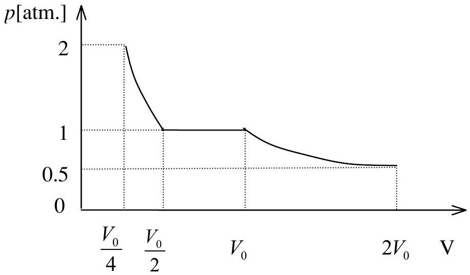
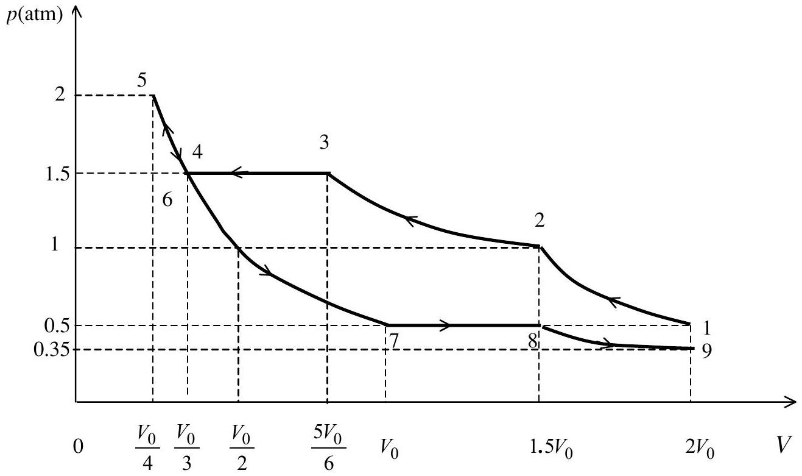

## Solution of Problem No. 3   Compression and expansion of a two gases system

1.
a.The isotherm curve is shown in Figure 1.

Figure 1

$$
\begin{aligned}
V _ { 0 } = \frac { R T _ { 1 } } { p _ { 1 } } = \frac { 8.31 \times 373 } { 0.5 \times 1.013 \times 10 ^ { 5 } } & = 0.0612 \mathrm {~m} ^ { 3 } \\
& = 61.2 \mathrm { dm } ^ { 3 }
\end{aligned}
$$

b. The process of compressing can be divided into 3 stages:

$$
\begin{array} { c r }
\left( p _ { 1 } , 2 V _ { 0 } \right) & \rightarrow \quad \left( 2 p _ { 1 } , V _ { 0 } \right) \tag{4}
\end{array} \rightarrow \quad \left( 2 p _ { 1 } , V _ { 0 } / 2 \right) \rightarrow ( 4 ) \rightarrow \left( 4 p _ { 1 } , V _ { 0 } \right)
$$

The work in each stage can be calculated as follows:

$$
\begin{aligned}
& A _ { 12 } = - \int _ { 2 V _ { 0 } } ^ { V _ { 0 } } p d V = 2 R T _ { 1 } \int _ { V _ { 0 } } ^ { 2 V _ { 0 } } \frac { d V } { V } = 2 R T _ { 1 } \ln 2 = 4297 \mathrm {~J} \\
& A _ { 23 } = 2 p _ { 1 } \left( V _ { 0 } - V _ { 0 } / 2 \right) = R T _ { 1 } = 3100 \mathrm {~J} \\
& A _ { 34 } = - \int _ { \frac { 1 } { 2 } V _ { 0 } } ^ { \frac { 1 } { 4 } V _ { 0 } } p ^ { \prime } d V = R T _ { 1 } \int _ { \frac { 1 } { 4 } V _ { 0 } } ^ { \frac { 1 } { 2 } V _ { 0 } } \frac { d V } { V } = R T _ { 1 } \ln 2 = 2149 \mathrm {~J} .
\end{aligned}
$$

The total work of gases compressing is:

$$
\begin{equation*}
A = A _ { 12 } + A _ { 23 } + A _ { 34 } = 9545 \mathrm {~J} \cong 9.55 \mathrm {~kJ} \tag{1}
\end{equation*}
$$

c. In the second stage 23, all the water vapor (one mole) condenses. The heat $Q ^ { \prime }$ delivered in the process equals the sum of the work $A$ and the decrease $\Delta U$ of internal energy of one mole of water vapor in the condensing process.

$$
Q ^ { \prime } = \Delta U + A _ { 12 } + A _ { 23 } + A _ { 34 }
$$

One can remark that $\Delta U + A _ { 23 }$ is the heat delivered when one mole of water vapor condenses, and equals $0.018 \times L$. Thus

$$
\begin{equation*}
Q ^ { \prime } = \Delta U + A _ { 11 } + A _ { 23 } + A _ { 34 } = 0.018 \times L + A _ { 11 } + A _ { 34 } = 46.946 \mathrm {~J} \cong 47 \mathrm {~kJ} \tag{2}
\end{equation*}
$$

2. The process of compression (2. a.) and expansion (2.c.) of gases can be divided into several stages. The stages are limited by the following states:

| State | Left compartment Volume \| Pressure |  | Right compartment Volume \| Pressure |  |  | Total volume | Pressure on piston (atm.) |
| :--- | :--- | :--- | :--- | :--- | :--- | :--- | :--- |
|  | \| | (atm.) | 1 (atm.) |  |  |  |  |
| 1 | $V _ { 0 }$ | 0.5 | $V _ { 0 }$ | I | 0.5 | $2 V _ { 0 }$ | 0.5 |
| 2 | $V _ { 0 }$ | 0.5 | $0.5 V _ { 0 }$ | \| | 1 | $1.5 V _ { 0 }$ | 1 |
| 3 | $0.5 V _ { 0 }$ | \| 1 | $V _ { 0 } / 3$ | \| | 1.5 | $5 / 6 V _ { 0 }$ | 1.5 |
| 4 | 0 | 1 | $V _ { 0 } / 3$ |  | \| 1.5 | $V _ { 0 } / 3$ | 1.5 |
| 5 | 0 | 1.5 | $V _ { 0 } / 4$ | \| 2 |  | $V _ { 0 } / 4$ | 2 |
| 6 | 0 | 1.5 | $V _ { 0 } / 3$ | \| | 1.5 | $V _ { 0 } / 3$ | 1.5 |
| 7 | 0 | 1 | $V _ { 0 }$ | \| | 0.5 | $V _ { 0 }$ | 0.5 |
| 8 | $0.5 V _ { 0 }$ | \| 1 | $V _ { 0 }$ | \| | 0.5 | $1.5 V _ { 0 }$ | 0.5 |
| 9 | $V _ { 0 } ( 2 - \sqrt { 2 } ) \mathrm { I } ( \sqrt { 2 } + 2 ) / 4$ |  | $V _ { 0 } \sqrt { 2 }$   $\sqrt { 2 }$ /4 |  |  | $2 V _ { 0 }$ | $\sqrt { 2 / 4 } = 0.35$ |

a. See figure 2 below.
b. The work $A _ { \mathrm { p } }$ done by the piston in the process of compressing the gases equals the sum of the work $A$ calculated in 1. and the work done by the force of friction. The latter equals $0.5 \mathrm {~atm} . \times V _ { 0 } = p _ { 1 } V _ { 0 }$ (the force of kinetic friction appears in the process 234 during which the displacement of the partition NM corresponding to a variation $V _ { 0 }$ of volume of the left compartment). Then, we have:

$$
A _ { \mathrm { p } } = A + p _ { 1 } V _ { 0 } = 9545 + 8.31 \times 373 = 12645 \mathrm {~J} \cong 12.65 \mathrm {~kJ}
$$

c. In process 89 the pressure in the left compartment is always larger than the pressure in the right one (with a difference of 0.5 atm .). If $p$ denotes the pressure in the right compartment, the pressure in the left one will be $p + 0.5 \mathrm {~atm}$.

Let $V$ be the total volume in process 89 , we have

$$
\frac { R T _ { 1 } } { p } + \frac { R T _ { 1 } } { p + 0.5 } = V
$$

with $V = 2 V _ { 0 } = \frac { 2 R T _ { 1 } } { 0.5 } , p$ can be defined by $\frac { R T _ { 1 } } { p } + \frac { R T _ { 1 } } { p + 0.5 } = \frac { 2 R T _ { 1 } } { 0.5 }$
This is equivalent to:

$$
\begin{aligned}
& p + 0.5 + p = 4 p . ( p + 0.5 ) \\
& p = \frac { 1 } { \sqrt { 8 } } = \frac { \sqrt { 2 } } { 4 } = 0.35 \mathrm {~atm} .
\end{aligned}
$$

The pressure in the right compartment is $p = 0.35 \mathrm {~atm}$.
The volume of the right compartment is $\sqrt { 2 } V _ { 0 }$
The pressure in the left compartment is $\quad p + 0.35 = 0.85 \mathrm {~atm}$.
The volume of the left compartment is $( 2 - \sqrt { 2 } ) V _ { 0 }$

Figure 2

3.

a. Apply the first law of thermodynamic for the system of two gases in the cylinder:

$$
\begin{equation*}
\delta q = d U + \delta A \tag{3}
\end{equation*}
$$

In an element of process in which the variations of temperature and volume are respectively $\mathrm { d } T$ and $\mathrm { d } V$ :

$$
\delta q = 0 \quad ; \quad \mathrm { d } U = \left( C _ { \mathrm { V } 1 } + C _ { \mathrm { V } 2 } \right) \mathrm { d } T = \left( \frac { R } { \gamma _ { 1 } - 1 } + \frac { R } { \gamma _ { 2 } - 1 } \right) \mathrm { d } T \quad ; \quad \delta A = p . \mathrm { d } V
$$

On the other hand:

$$
\begin{equation*}
p V = R T \tag{4}
\end{equation*}
$$

One can deduce the differential equation for the process:

$$
\left( \frac { R } { \gamma _ { 1 } - 1 } + \frac { R } { \gamma _ { 2 } - 1 } \right) \mathrm { d } T + p \cdot \mathrm {~d} V = 0
$$

or

$$
\begin{equation*}
\frac { d T } { T } + \frac { \left( \gamma _ { 1 } - 1 \right) \left( \gamma _ { 2 } - 2 \right) } { \gamma _ { 1 } + \gamma _ { 2 } - 2 } \frac { d V } { V } = 0 \tag{5}
\end{equation*}
$$

By putting

$$
\begin{equation*}
K = \frac { \left( \gamma _ { 1 } - 1 \right) \left( \gamma _ { 2 } - 1 \right) } { \gamma _ { 1 } + \gamma _ { 2 } - 2 } = \frac { 2 } { 11 } \tag{6}
\end{equation*}
$$

after integrating (5), we have:

$$
\begin{equation*}
T V ^ { K } = \text { const } . \tag{7}
\end{equation*}
$$

The condensing temperature of water vapor under the pressure 0.5 atm. is also the boiling temperature $T ^ { \prime }$ of water under the same pressure. By using the given approximate formula, we obtain

$$
\frac { 1 } { T ^ { \prime } } - \frac { 1 } { T _ { 0 } } = \left( - \frac { R } { \mu L } \right) \ln \frac { p } { p _ { 0 } }
$$

- If we consider $p$ approximatively constant (with relative deviation about $20 / 373 \approx 5 \%$ ) $T ^ { \prime }$ can be easily found, and
$$
T ^ { \prime } = 354 \mathrm {~K}
$$
The volume $V ^ { \prime }$ of the right compartment at temperature $T ^ { \prime }$ can be calculated as follows:
$$
\begin{aligned}
V ^ { \prime } = V _ { 0 } \left( \frac { T _ { 1 } } { T ^ { \prime } } \right) ^ { \frac { 1 } { K } } & = V _ { 0 } \left( \frac { 373 } { 354 } \right) ^ { \frac { 11 } { 2 } } = 1.33 V _ { 0 } \cong 1.3 V _ { 0 } \\
& = 81.6 \mathrm { dm } ^ { 3 } = 0.0816 \mathrm {~m} ^ { 3 } \cong 0.08 \mathrm {~m} ^ { 3 }
\end{aligned}
$$
b. The work done by the gas in the expansion is:
$$
\begin{aligned}
A = - \Delta U = \left( C _ { V 1 } + C _ { V 2 } \right) \left( T _ { 0 ^ { - } } T ^ { \prime } \right) & = \left( \frac { R } { \gamma _ { 1 } - 1 } + \frac { R } { \gamma _ { 2 } - 2 } \right) ( 373 - 354 ) = \\
& = \left( \frac { 5 } { 2 } R + \frac { 6 } { 2 } R \right) \times 19 = 868 \mathrm {~J} \cong 9 \times 10 ^ { 2 } \mathrm {~J}
\end{aligned}
$$
- If we consider the dependence of water vapor pressure $p$ on temperature $T ^ { \prime }$, we must resolve the transcendental equation
$$
\frac { 1 } { T ^ { \prime } } - \frac { 1 } { T _ { 0 } } = \left( - \frac { R } { \mu L } \right) \ln \frac { 1 } { 2 } \frac { T ^ { \prime } } { T _ { 0 } } = \frac { R } { \mu L } \ln 2 - \frac { R } { \mu L } \ln \frac { T ^ { \prime } } { T _ { 0 } }
$$
This equation can be reduced to a numerical one:
$$
\frac { 1 } { T ^ { \prime } } - \frac { 1 } { 373 } = 1.422 \times 10 ^ { - 4 } - 2.052 \times 10 ^ { - 4 } \ln \frac { T ^ { \prime } } { 373 }
$$
By giving $T ^ { \prime }$ different values 354, 353, 352 and choosing the one which satisfies this equation, we find the approximate solution :
$$
T ^ { \prime } = 353 \mathrm {~K}
$$
With this value of temperature, the volume of the right compartment is :
$$
V ^ { \prime } = V _ { o } \left( \frac { 373 } { 353 } \right) ^ { \frac { 11 } { 2 } } = 1.35 V _ { o } = 0.082 \mathrm {~m} ^ { 3 } \cong 0.08 \mathrm {~m} ^ { 3 }
$$
b. The work done by the gas in the expansion is:
$$
A = \frac { 11 } { 2 } R \times 20 = 914 \mathrm {~J} \cong 9 \times 10 ^ { 2 } \mathrm {~J}
$$
