## 1. SHAPES DETERMINATION BY REFLECTION   SUGGESTED SOLUTION

Barcode: B00110

| Object Position ( $\alpha ^ { \circ }$ ) | Reflected Ray ( $\beta ^ { \circ }$ ) | Cal. Reflected Ray ( $\beta ^ { \circ }$ ) |
| :--- | :--- | :--- |
| -10 | 211 | -149 |
| -5 | 223 | -137 |
| 0 | 230 | -130 |
| 10 | 251 | -109 |
| 20 | 270 | -90 |
| 30 | 290 | -70 |
| 40 | 310 | -50 |
| 50 | 330 | -30 |
| 60 | 349 | -11 |
| 75 | 17 | 17 |
| 80 | 28 | 28 |
| 90 | 46 | 46 |
| 100 | 65 | 65 |
| 110 | 87 | 87 |
| 120 | 117 | 117 |
| 130 | 128 | 128 |
| 140 | 273 | -87 |
| 150 | 291 | -69 |
| 160 | 310 | -50 |
| 170 | 326 | -34 |
| 180 | 343 | -17 |
| 195 | 10 | 10 |
| 200 | 12 | 12 |
| 210 | 34 | 34 |
| 220 | 249 | -111 |
| 230 | 267 | -93 |
| 240 | 285 | -75 |
| 250 | 301 | -59 |
| 260 | 319 | -41 |
| 270 | 337 | -23 |
| 275 | 345 | -15 |
| 290 | 13 | 13 |
| 300 | 29 | 29 |
| 310 | 46 | 46 |
| 320 | 64 | 64 |
| 330 | 83 | 83 |
| 340 | 102 | 102 |

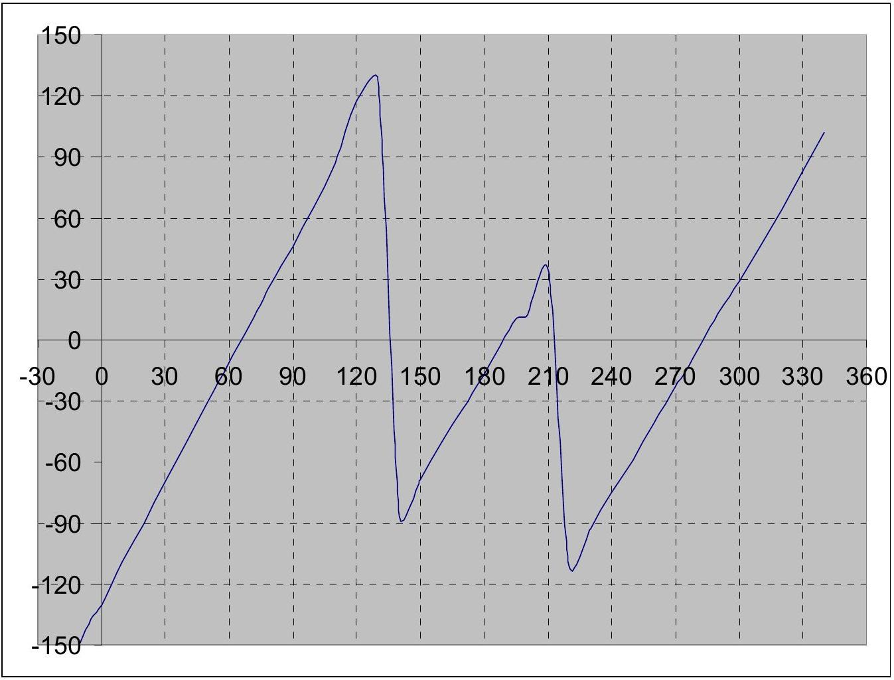

Function: $\beta ( \alpha )$
There are 3 jumps on the graph. This is observed at $\alpha = - 10 ^ { \circ } , 140 ^ { \circ }$ and $220 ^ { \circ }$. The jump in the reflection angles are caused by the change of sides, therefore the object has 3 sides and if all the sides are straight sides, we can approximate the lines on the graph using linear regression, i.e:

$$
\boldsymbol { \beta } = \mathbf { m } \boldsymbol { \alpha } + \mathbf { c }
$$

Where: $\alpha =$ position angle of the object (in ${ } ^ { \circ }$ ) and $\beta =$ reflected ray angle (in °)

$$
\begin{equation*}
\text { Segment } 1 \text { ( } - 10 \text { to } 130 \text { ): } \quad \beta = 1.98 \alpha + \mathrm { c } 1 \tag{A1}
\end{equation*}
$$

$$
\begin{equation*}
\text { Segment } 2 \text { (140 to } 210 \text { ): } \beta = 1.73 \alpha + \mathrm { c } 2 \tag{A2}
\end{equation*}
$$

$$
\begin{equation*}
\text { Segment } 3 \text { (220 to 340): } \beta = 1.78 \alpha + \mathrm { c } 3 \tag{A3}
\end{equation*}
$$

To find the gradient, m , as function of side distance from the rotation axis, r , we can simulate it and get a graph and for 'small' r:

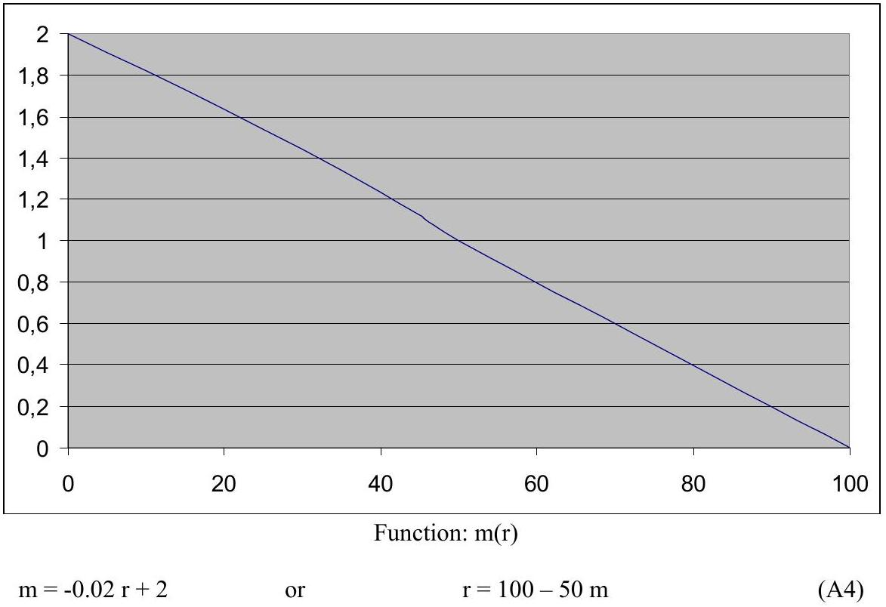

From (A1) to (A3) and using (A4) we can determine r from the 3 sides:

$$
\begin{aligned}
& \mathrm { r } _ { 1 } = 100 - 50 ( 1.98 ) = 1.5 \mathrm {~mm} \\
& \mathrm { r } _ { 2 } = 100 - 50 ( 1.73 ) = 13.5 \mathrm {~mm} \\
& \mathrm { r } _ { 3 } = 100 - 50 ( 1.78 ) = 11.0 \mathrm {~mm}
\end{aligned}
$$

For each side, we can use the object position when the reflection angle is $0 ^ { \circ }$ to draw with a higher precision. The angle for each segment is:

$$
\begin{aligned}
& \alpha _ { 1 } = 66 ^ { \circ } \\
& \alpha _ { 2 } = 189 ^ { \circ } \\
& \alpha _ { 3 } = 282 ^ { \circ }
\end{aligned}
$$

From data obtain the shape of the object can be determined as:
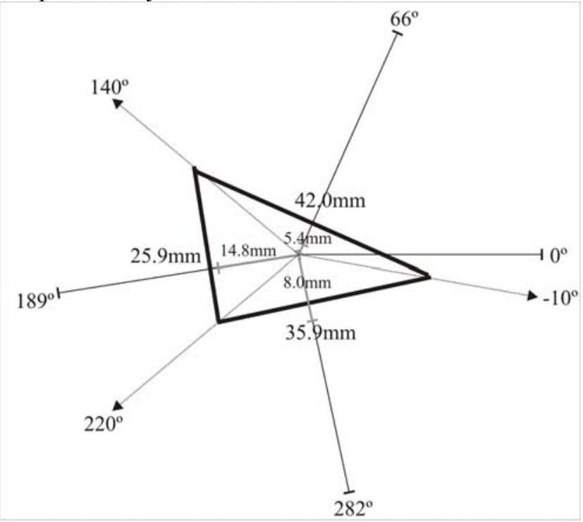

## EXPERIMENTAL COMPETITION

Barcode : B01110
| Object Position $\left( \alpha ^ { \circ } \right)$ | Reflected Ray $\left( \beta ^ { \circ } \right)$ | Cal Reflected Ray $\left( \beta ^ { \circ } \right)$ |
| :--- | :--- | :--- |
| 10 | 278 | -82 |
| 20 | 296 | -64 |
| 30 | 313 | -47 |
| 40 | 330 | -30 |
| 50 | 347 | -13 |
| 65 | 12 | 12 |
| 70 | 20 | 20 |
| 80 | 36 | 36 |
| 90 | 56 | 56 |
| 100 | 73 | 73 |
| 110 | 91 | 91 |
| 120 | 300 | -60 |
| 130 | 320 | -40 |
| 140 | 342 | -18 |
| 145 | 351 | -9 |
| 155 | 13 | 13 |
| 160 | 23 | 23 |
| 170 | 43 | 43 |
| 180 | 67 | 67 |
| 190 | 277 | -83 |
| 200 | 297 | -63 |
| 210 | 313 | -47 |
| 220 | 330 | -30 |
| 230 | 347 | -13 |
| 245 | 13 | 13 |
| 250 | 22 | 22 |
| 260 | 39 | 39 |
| 270 | 55 | 55 |
| 280 | 74 | 74 |
| 290 | 91 | 91 |
| 300 | 335 | -25 |
| 305 | 335 | -25 |
| 310 | 336 | -24 |
| 315 | 337 | -23 |
| 320 | 338 | -22 |
| 345 | 21 | 21 |
| 350 | 22 | 22 |
| 355 | 22 | 22 |
| 360 | 23 | 23 |
| 365 | 23 | 23 |

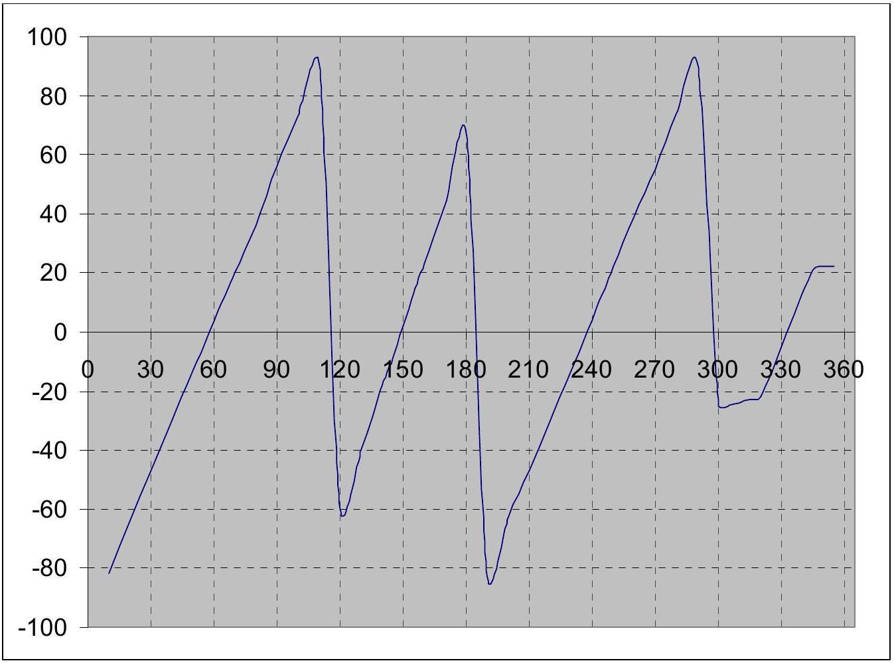

Function: $\beta ( \alpha )$
There are 5 jumps in the graphics. This can be observed at $\alpha = 10 ^ { \mathrm { o } } , 120 ^ { \mathrm { o } } , 190 ^ { \mathrm { o } } , 300 ^ { \mathrm { o } }$ and $345 ^ { \circ }$. The jumps in reflection angle are caused by the change of sides, therefore there are 5 sides in the object and if all the sides are straight, we can approximate the lines using linear regression, i.e:

$$
\boldsymbol { \beta } = \mathbf { m } \boldsymbol { \alpha } + \mathbf { c }
$$

Where $\alpha =$ angular position of the object (in ${ } ^ { \circ }$ ) and $\beta =$ reflected ray angle (in °)

$$
\begin{equation*}
\text { Segment } 1 ( 10 \text { to } 110 ) : \quad \beta = 1.56 \alpha + \mathrm { c } 1 \tag{B1}
\end{equation*}
$$

$$
\begin{equation*}
\text { Segment } 2 \text { (120 to } 180 \text { ): } \beta = 2.12 \alpha + \mathrm { c } 2 \tag{B2}
\end{equation*}
$$

$$
\begin{equation*}
\text { Segment } 3 \text { (190 to 290): } \beta = 1.64 \alpha + \mathrm { c } 3 \tag{B3}
\end{equation*}
$$

$$
\begin{equation*}
\text { Segment } 4 \text { (190 to 290): } \beta = 0.15 \alpha + \mathrm { c } 3 \tag{B4}
\end{equation*}
$$

$$
\begin{equation*}
\text { Segment } 5 \text { (190 to 290): } \beta = 0.10 \alpha + \mathrm { c } 3 \tag{B5}
\end{equation*}
$$

From (B1) to (B3) and (A4) we can determine r from the 5 sides:

$$
\begin{aligned}
\mathrm { r } _ { 1 } & = 100 - 50 ( 1.56 ) \\
\mathrm { r } _ { 2 } & = 22.0 \mathrm {~mm} \\
\mathrm { r } _ { 3 } & = 100 - 50 ( 2.12 ) \\
\mathrm { r } _ { 4 } & = - 6.0 \mathrm {~mm} \\
\mathrm { r } _ { 5 } & = 100 - 50 ( 0.15 )
\end{aligned}
$$

## EXPERIMENTAL COMPETITION

There are weird data for $\mathrm { r } _ { 2 } , \mathrm { r } _ { 4 }$ and $\mathrm { r } _ { 5 }$. It is impossible to have r with either negative or very large value but not so small angle of reflection. So we can guess that it is either a curve sides or double reflection. For double reflection we need to have two adjacent sides with concave angle, so only $\mathrm { r } _ { 4 }$ and $\mathrm { r } _ { 5 }$ are possible. So $\mathrm { r } _ { 2 }$ can only be a curve side. From segment 2 of the graph we can see that the graph looks like a reverse "S" shape, so it is only possible when the sides is concave.

Considering error in the experiment, we can guess that the shape has reflection symmetry.
For each side, we can use the object position when the reflection angle is 0 to draw with a higher precision. The angle for segment 1 to 3 is:

$$
\begin{aligned}
& \alpha _ { 1 } = 58 ^ { \circ } \\
& \alpha _ { 2 } = 149 ^ { \circ } \\
& \alpha _ { 3 } = 237 ^ { \circ }
\end{aligned}
$$

From the data obtained, the shape of the object can be determined as:
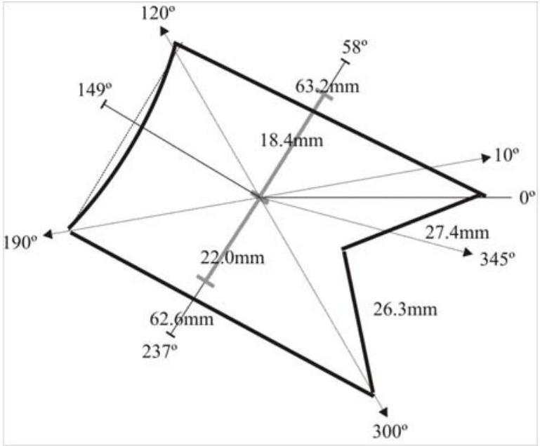

## EXPERIMENTAL COMPETITION

[Marking Scheme] Experimental Question 1
Shapes Determination by Reflection

| (A) | 0.5 | - Get data for object 1 |
| :--- | :--- | :--- |
| 2.0 | 0.5 | - Get data for object 2 |
|  | 0.5 | - Plot graph of object 1 |
|  | 0.5 | - Plot graph of object 2 |
| (B) | 0.25 | - Number of side of the object 1 |
|  | 0.25 | - Number of side of the object 2 |
| 0.5 |  |  |
| (C) | 0.5 | - Angles positions of object 1 |
| 3.0 | 0.5 | - Angles positions of object 2 |
|  | 0.5 | - Orientation of sides of object 1 |
|  | 0.5 | - Orientation of sides of object 2 |
|  | 0.5 | - Side shapes of object 1 |
|  | 0.5 | - Side shapes of object 2 |
| (D) | 1 | - Axis distance from side A of object 1 |
|  | 1 | - Axis distance from side $B$ of object 1 |
| 3.0 | 1 | - Axis distance from side C of object 1 |
| (E) | 0.5 | - Dimension of side $A$ of object 1 |
|  | 0.5 | - Dimension of side $B$ of object 1 |
| 1.5 | 0.5 | - Dimension of side $C$ of object 1 |

## 2.MAGNETIC BRAKING ON AN INCLINED

## PLANE

SUGGESTED SOLUTION
(A) Setup and Introduction

A1. To minimize the torque due to interaction of the magnet and the earth's magnetic field we have to set the orientation of the inclined plane so that the magnet will roll down with the poles aligned to the North-South direction as shown.

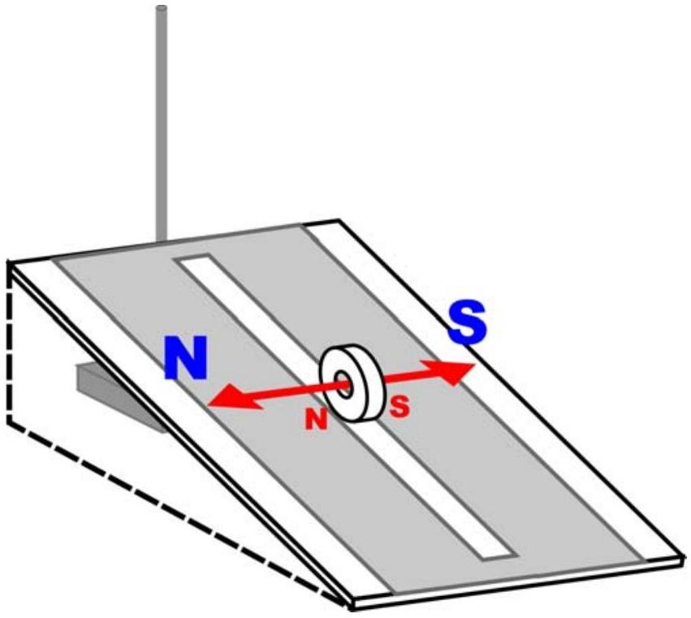
Figure 1. Adjusting the orientation of the inclined plane

## EXPERIMENTAL COMPETITION

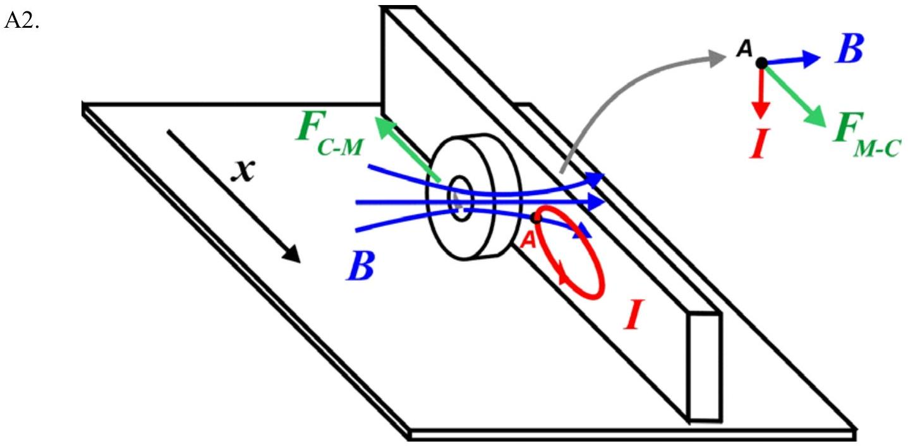
Figure 2. Field and interactions in the magnetic braking effect

Answer with some vector analysis:
Consider a point A on the conductor. As the magnet moves, its magnetic field sweeps the conductor inducing electric field and causing current flow due to Faraday's law, whose direction can be determined using Lenz's law. Let's choose an arbitrary loop as shown. At point A, the magnetic field and the current will cause Lorentz force $F _ { M - } { } _ { c }$ pointing at x+ direction. This force is acting on the electrons in the conductor

On the other hand, due to Newtons' Third law there is reaction force $F _ { C - M }$ with the same magnitude but with opposite direction acting on the magnet, which is the magnetic braking force.
(B) Investigation of the magnetic braking force

## EXPERIMENTAL COMPETITION

B1. Determination of the power factor $\boldsymbol { n }$ : Dependence of the magnetic braking force with the velocity

In this experiment the student has to be aware that the magnet should reach the terminal velocity first before start the timing. From observation we can see that the magnet reaches terminal velocity almost immediately. To make sure we let the magnet travels first for about 5 cm before we start measuring the time. Here we use $s$ $= 250 \mathrm {~mm}$ from start to finish to obtain speed: $v = s / t$.

The angle of inclination is varied to take several data. Given $l = 425 \mathrm {~mm}$, we measure $h$ where $\sin \theta = h / l$.

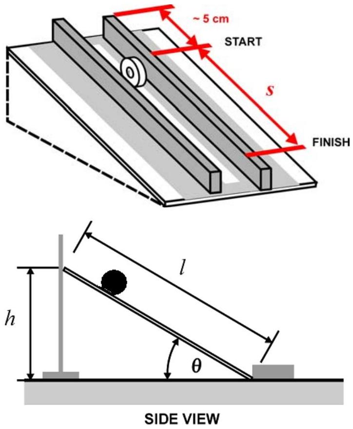
Figure 3. a. Measurement of the velocity b. Measurement of the plane inclination

Because the magnet-conductor distance is kept constant $( d \approx 5 \mathrm {~mm} )$, the magnetic braking force only depends on the velocity of the magnet, so we can simplify:

$$
F _ { M B } = - k _ { 0 } d ^ { p } v ^ { n } = - k _ { 1 } v ^ { n }
$$

where $k _ { 1 } = k _ { 0 } d ^ { p }$ is constant in this experiment.

## EXPERIMENTAL COMPETITION

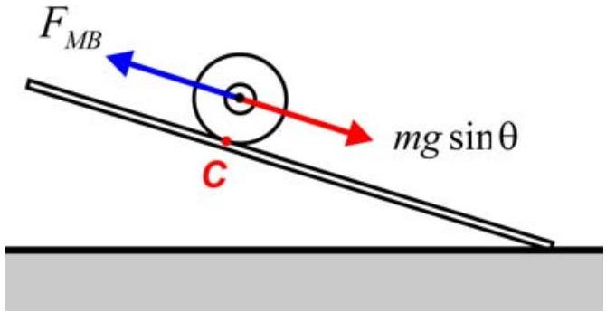
Figure 4. Force diagram of the rolling magnet

When the magnet reaches the terminal velocity then the total torque should be zero. The equation of the motion at the contact point $C$ will be:

$$
\begin{gathered}
\sum \tau _ { C } = 0 \\
m g \sin \theta R + F _ { M B } R = 0 \\
m g \sin \theta - k _ { 1 } v ^ { n } = 0 \\
\sin \theta = \frac { k _ { 1 } } { m g } v ^ { n }
\end{gathered}
$$

To calculate the power factor $n$ :

$$
\ln \sin \theta = \ln \left( \frac { k _ { 1 } } { m g } \right) + n \ln ( v )
$$

The experimental data:

| H (mm) | $\bar { t }$ (s) | $\operatorname { Sin } \theta$ | v mm/s | $\ln ( v )$ | $\ln ( \sin \theta )$ |
| :--- | :--- | :--- | :--- | :--- | :--- |
| 23±0.5 | 22.98±0.00 5 | 0.054 | 10.88 | 2.39 | -2.92 |
| 40 | 12.78 | 0.094 | 19.56 | 2.97 | -2.36 |
| 50 | 10.17 | 0.118 | 24.58 | 3.20 | -2.14 |
| 60 | 8.62 | 0.141 | 29.00 | 3.37 | -1.96 |
| 70 | 6.96 | 0.165 | 35.92 | 3.58 | -1.80 |
| 80 | 6.09 | 0.188 | 41.05 | 3.71 | -1.67 |
| 91 | 5.48 | 0.214 | 45.62 | 3.82 | -1.54 |
| 101 | 5.05 | 0.238 | 49.50 | 3.90 | -1.44 |
| 111 | 4.57 | 0.261 | 54.70 | 4.00 | -1.34 |
| 120 | 4.17 | 0.282 | 59.95 | 4.09 | -1.26 |
| 130 | 3.72 | 0.306 | 67.20 | 4.21 | -1.18 |
| 150 | 3.25 | 0.353 | 76.92 | 4.34 | -1.04 |
| 170 | 2.81 | 0.400 | 88.97 | 4.49 | -0.92 |

Table 1. Experimental data for power factor $n$ determination

## EXPERIMENTAL COMPETITION

Note:

- Column in bold are the data directly taken from the experiment.
- Typical error for $h$ measurement is shown in the first row: $h = ( 23 \pm 5 ) m m$. Similar error applies for the rest of $h$ data.
- Data $\bar { t }$ are the average data taken from 3 to 5 measurement. Even though standard deviation error is quite small (±0.1s), the error should be dominated by response delay of the observer in pressing the stopwatch. Widely accepted value for human eye response is 0.25 sec, in this experiment we choose more conservative value (±0.5 s)

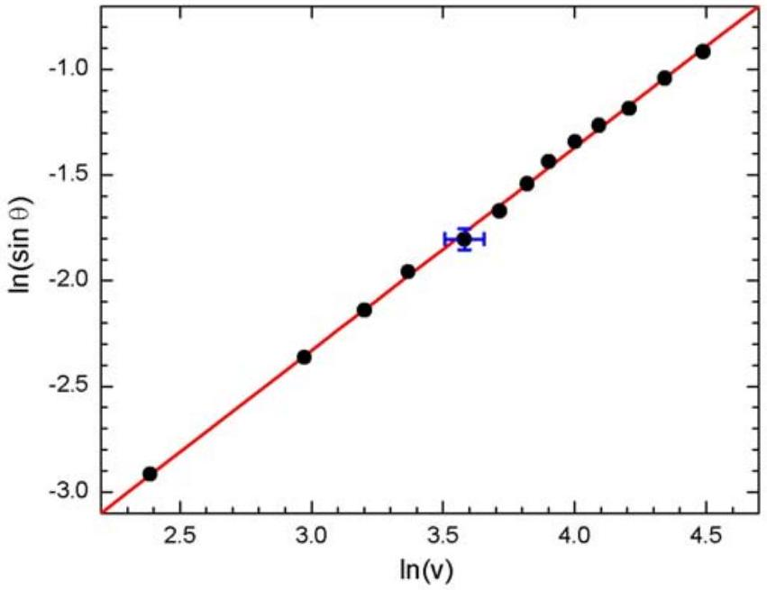
Figure 5. Graph of $\ln ( \sin \theta )$ vs $\ln ( v )$. Typical error bar is shown in the central data.

Using linear regression method or graphical method as shown in Fig. 5 one can determine $n$ from the slope.

$$
n = 0.96
$$

Whose result is very close to the theoretical value of $n = 1$. From the data shown in Fig. 5 (as well as the coefficient of correlation $r = 0.9995$ ), it can be shown that this experiment is very good in demonstrating the linear velocity dependence of the magnetic braking force. This result has been repeated and verified by three independent persons and apparatus setups.

## Error estimate of $\boldsymbol { n }$ :

Instead of laboring on detailed error propagation analysis that could be very time consuming, in olympiad context one can make the error estimate as follows:

## EXPERIMENTAL COMPETITION

The typical error of the data points in Fig 5 can be obtained from the central data:

$$
\begin{aligned}
& \ln v = 3.58 \pm 0.075 \\
& \ln ( \sin \theta ) = - 1.8 \pm 0.075
\end{aligned}
$$

whose errors propagated from the uncertainties in $h$ and $t$.
The power factor $n$ can be obtained from the slope of Fig. 5: $n = \Delta y / \Delta x$ where $y = \ln ( \sin \theta )$ and $x = \ln v$.

From the data in Fig. 5. we have: $\Delta x = 2.1$ and $\Delta y = 2.0$, and the typical errors: $\delta x = 0.075$ and $\delta y = 0.075$.
So the error estimate for $n$ :

$$
\begin{aligned}
& \frac { \Delta n } { n } = \sqrt { \left( \frac { \delta x } { \Delta x } \right) ^ { 2 } + \left( \frac { \delta y } { \Delta y } \right) ^ { 2 } } = \sqrt { \left( \frac { 0.075 } { 2.1 } \right) ^ { 2 } + \left( \frac { 0.075 } { 2.0 } \right) ^ { 2 } } = 0.05 \\
& \Delta n = 0.05 n = 0.048
\end{aligned}
$$

So we can conclude the result of our experiment is:

$$
n = 0.96 \pm 0.05
$$

## EXPERIMENTAL COMPETITION

B2.Determination of the power factor $\boldsymbol { p }$ : Dependence of the magnetic braking force with the magnet-conductor distance
In this experiment we use one value of inclination angle, $h = 50 \mathrm {~mm} ( l = 425 \mathrm {~mm} )$ so that $\theta = \arcsin \mathrm { s } ( h / l ) = 6.8 ^ { \circ }$. Distance travelled remains: $s = 250 \mathrm {~mm}$, and the timing is done after the magnet travel first for about 5 cm as before.
The equation of motion, similar to previous section:

$$
\begin{gathered}
\sum \tau _ { C } = 0 \\
m g \sin \theta R + F _ { M B } R = 0 \\
m g \sin \theta - k _ { 0 } d ^ { p } v ^ { n } = 0 \\
v ^ { - n } = \frac { k _ { 0 } } { m g \sin \theta } d ^ { p } \\
- n \ln v = \ln \left( \frac { k _ { 0 } } { m g \sin \theta } \right) + p \ln d
\end{gathered}
$$

Here again $p$ can be obtained using linear regression or graphical method where we use the previously obtained value: $n = 0.96 \pm 0.05$.
The experimental data:

| $\boldsymbol { d }$ | $\bar { t }$ | $V$ | $- n \ln v$ | $\ln d$ |
| :--- | :--- | :--- | :--- | :--- |
| mm | S | mm/s |  |  |
| 4.5±0.5 | 13.53±0.00 5 | 18.48 | -2.80 | 1.50 |
| 5.5 | 9.60 | 26.04 | -3.13 | 1.70 |
| 6.5 | 6.70 | 37.31 | -3.47 | 1.87 |
| 7.5 | 4.99 | 50.10 | -3.76 | 2.01 |
| 8.5 | 3.47 | 72.05 | -4.11 | 2.14 |
| 9.5 | 2.87 | 87.11 | -4.29 | 2.25 |
| 10.5 | 2.14 | 116.82 | -4.57 | 2.35 |
| 11.5 | 1.66 | 150.60 | -4.81 | 2.44 |

Table 2. Experimental data for power factor $p$ determination

Note:
Distance $d$ is measured from the center of the magnet.

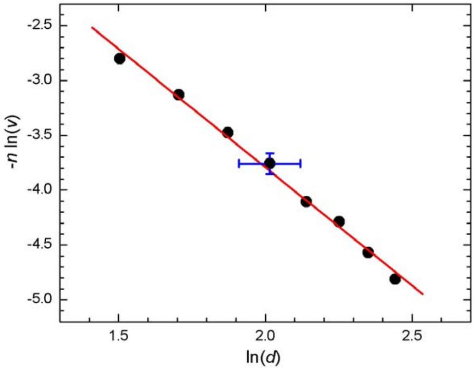
Figure 6. Graph of $- n \ln ( v )$ vs $\ln ( d )$. Typical error bar is shown in the central data.

From linear regression calculation we have:

$$
p = - 2.16
$$

So the magnetic braking force is very sensitive with the magnet-conductor distance $d$ in which the relationship is almost inversely quadratic. In brief, the further the magnet from the conductor the weaker the magnetic braking force becomes. This result has been repeated and verified by three independent persons and apparatus setups.

Error estimate of $\boldsymbol { p }$ :
Similar to previous section, we use the central data shown in Fig. 6.:

$$
\begin{aligned}
& \ln d = 2.01 \pm 0.105 \\
& - n \ln ( v ) = - 3.76 \pm 0.095
\end{aligned}
$$

The power factor $p$ can be obtained from the slope of line in di Fig. 6: $p = \Delta y / \Delta x$ where $y = - n \ln v$ and $x = \ln d$.

For the data shown in Fig. 6 we obtain: $\Delta x = 0.94$ dan $\Delta y = 2.01$, with typical error: $\delta x = 0.105$ and $\delta y = 0.095$
So the error estimate for $p$ :

$$
\frac { \Delta p } { p } = \sqrt { \left( \frac { \delta x } { \Delta x } \right) ^ { 2 } + \left( \frac { \delta y } { \Delta y } \right) ^ { 2 } } = \sqrt { \left( \frac { 0.105 } { 0.94 } \right) ^ { 2 } + \left( \frac { 0.095 } { 2.01 } \right) ^ { 2 } } = 0.12
$$

## EXPERIMENTAL COMPETITION

$$
\Delta p = 0.12 p = 0.26
$$

So we can conclude the result of our experiment is:

$$
p = - 2.2 \pm 0.3
$$

## EXPERIMENTAL COMPETITION

[Marking Scheme] Experimental Question 2

## Magnetic Braking on an inclined plane

| (A.1) 1.0 | 1.0 | Adjusting the orientation of the inclined plane track |
| :--- | :--- | :--- |
| (A.2) 1.0 | 1.0 | Explanation using appropriate diagram of field and force lines |
| (B.1) 4.0 | 0.5 | Recognizing v terminal |
|  | 0.5 | Equation of motion |
|  | 0.5 | Obtain data >= 5 sets + corresponding calculations , 0.1 each data set. |
|  | 0.25 | Units |
|  | 0.5 | Graph |
|  | 0.25 | Linear regression or graphic analysis |
|  | 0.5 | Final result: $0.5 \leq n \leq 1.5$ |
|  | 0.5 | Final result: $0.9 \leq n \leq 1.1$ |
|  | 0.5 | Error analysis |
| (B.2) 4.0 | 0.5 | Equation of motion |
|  | 0.5 | Obtain data >= 5 sets + corresponding calculations , 0.1 each data set. |
|  | 0.25 | Units |
|  | 0.5 | Graph |
|  | 0.25 | Linear regression or graphic analysis |
|  | 0.5 | Correct sign (-) for final result p |
|  | 0.5 | Final result: $1.0 \leq \| p \| \leq 3.0$ |
|  | 0.5 | Final result: $1.5 \leq \| p \| \leq 2.5$ |
|  | 0.5 | Error analysis |
