## Question 1

## 1A. SPRING CYLINDER WITH MASSIVE PISTON (5 points)

Consider $n = 2$ moles of ideal Helium gas at a pressure $P _ { 0 }$, volume $V _ { 0 }$ and temperature $T _ { 0 } = 300 \mathrm {~K}$ placed in a vertical cylindrical container (see Figure 1.1). A moveable frictionless horizontal piston of mass $m =$ 10 kg (assume $g = 9.8 \mathrm {~m} / \mathrm { s } ^ { 2 }$ ) and cross section $A = 500$ $\mathrm { cm } ^ { 2 }$ compresses the gas leaving the upper section of the container void. There is a vertical spring attached to the piston and the upper wall of the container. Disregard any gas leakage through their surface contact, and neglect the specific thermal capacities of the container, piston and spring. Initially the system is in equilibrium and the spring is unstretched. Neglect the spring's mass.

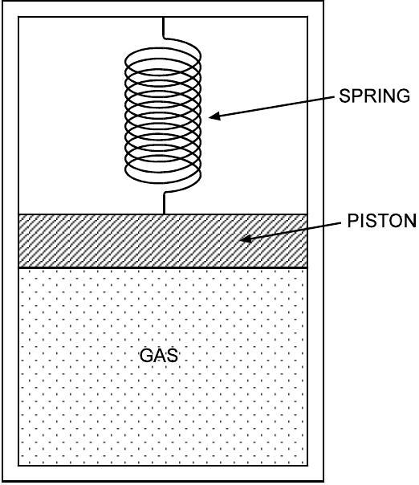
Figure 1.1

a. Calculate the frequency $f$ of small oscillation of the piston, when it is slightly displaced from equilibrium position.
(2 points)
b. Then the piston is pushed down until the gas volume is halved, and released with zero velocity. calculate the value(s) of the gas volume when the piston speed is
$$
\begin{equation*}
\sqrt { \frac { 4 g V _ { 0 } } { 5 A } } \tag{3points}
\end{equation*}
$$

Let the spring constant $k = m g A / V _ { 0 }$. All the processes in gas are adiabatic. Gas constant $R = 8.314 \mathrm { JK } ^ { - 1 } \mathrm {~mol} ^ { - 1 }$. For mono-atomic gas (Helium) use Laplace constant $\gamma = 5 / 3$.

Solution:
a) Gas Volume

At the initial condition, the system is in equilibrium and the spring is unstreched; therefore

$$
\begin{equation*}
P _ { 0 } A = m g \quad \text { or } \quad P _ { 0 } = \frac { m g } { A } \tag{1}
\end{equation*}
$$

The initial volume of gas

$$
\begin{equation*}
V _ { 0 } = \frac { n R T _ { 0 } } { P _ { 0 } } = \frac { n R T _ { 0 } A } { m g } \tag{2}
\end{equation*}
$$

The work done by the gas from $\frac { 1 } { 2 } V _ { 0 }$ to $V$

$$
\begin{equation*}
W _ { g a s } = \int _ { V _ { 0 } / 2 } ^ { V } P d V = \int _ { V _ { 0 } / 2 } ^ { V } \frac { P _ { 0 } V _ { 0 } ^ { \gamma } } { V ^ { \gamma } } d V = \frac { P _ { 0 } V _ { 0 } ^ { \gamma } } { 1 - \gamma } \left( V ^ { 1 - \gamma } - \left( \frac { V _ { 0 } } { 2 } \right) ^ { 1 - \gamma } \right) \tag{3}
\end{equation*}
$$

Equation (3) can also be obtained by calculating the internal energy change (without integration)

$$
\begin{equation*}
W _ { \text {gas } } = - \Delta E = - n C _ { V } \left( T - T _ { 0 } { } ^ { \prime } \right) \tag{4}
\end{equation*}
$$

where $T _ { 0 } { } ^ { \prime }$ is the temperature when the gas volume is $V _ { 0 } / 2$.

The change of the gravitational potential energy

$$
\begin{equation*}
\Delta _ { P E } = m g \Delta h = m g \frac { V - \frac { 1 } { 2 } V _ { 0 } } { A } \tag{5}
\end{equation*}
$$

## THEORETICAL COMPETITION

The change of the potential energy of the spring

$$
\begin{align*}
\Delta _ { \text {spring } } & = \frac { 1 } { 2 } k x ^ { 2 } - \frac { 1 } { 2 } k x _ { 0 } ^ { 2 } \\
& = \frac { 1 } { 2 } \left( \frac { m g A } { V _ { 0 } } \right) \left( \frac { V _ { 0 } - V } { A } \right) ^ { 2 } - \frac { 1 } { 2 } \left( \frac { m g A } { V _ { 0 } } \right) \left( \frac { V _ { 0 } - V _ { 0 } / 2 } { A } \right) ^ { 2 }  \tag{6}\\
& = \frac { 1 } { 2 } \frac { m g V _ { 0 } } { A } \left( 1 - \frac { V } { V _ { 0 } } \right) ^ { 2 } - \frac { 1 } { 8 } \left( \frac { m g V _ { 0 } } { A } \right)
\end{align*}
$$

The kinetic energy

$$
\begin{equation*}
K E = \frac { 1 } { 2 } m v ^ { 2 } = \frac { 1 } { 2 } m \frac { 4 g V _ { 0 } } { 5 A } = \frac { 2 m g V _ { 0 } } { 5 A } \tag{7}
\end{equation*}
$$

By conservation of energy, we have

$$
\begin{gather*}
W _ { g a s } = \Delta _ { P E } + \Delta _ { \text {spring } } + K E  \tag{8}\\
\frac { P _ { 0 } V _ { 0 } ^ { \gamma } } { 1 - \gamma } \left( V ^ { 1 - \gamma } - \left( \frac { V _ { 0 } } { 2 } \right) ^ { 1 - \gamma } \right) = m g \frac { V - \frac { V _ { 0 } } { 2 } } { A } + \frac { 1 } { 2 } \frac { m g V _ { 0 } } { A } \left( 1 - \frac { V } { V _ { 0 } } \right) ^ { 2 } - \frac { 1 } { 8 } \frac { m g V _ { 0 } } { A } + \frac { 2 } { 5 } \frac { m g V _ { 0 } } { A }  \tag{9}\\
\frac { m g V _ { 0 } } { A ( 1 - \gamma ) } \left( \frac { V ^ { 1 - \gamma } } { V _ { 0 } ^ { 1 - \gamma } } - \left( \frac { 1 } { 2 } \right) ^ { 1 - \gamma } \right) = m g \frac { V - \frac { V _ { 0 } } { 2 } } { A } + \frac { m g V _ { 0 } } { 2 A } \left( 1 - \frac { V } { V _ { 0 } } \right) ^ { 2 } + \frac { 11 } { 40 } \frac { m g V _ { 0 } } { A } \tag{10}
\end{gather*}
$$

Let $s = V / V _ { 0 }$, so the above equation becomes

$$
\begin{equation*}
\frac { 1 } { ( 1 - \gamma ) } \left( s ^ { 1 - \gamma } - \left( \frac { 1 } { 2 } \right) ^ { 1 - \gamma } \right) = \left( s - \frac { 1 } { 2 } \right) + \frac { 1 } { 2 } ( 1 - s ) ^ { 2 } + \frac { 11 } { 40 } \tag{11}
\end{equation*}
$$

With $\gamma = 5 / 3$ we get

$$
\begin{equation*}
0 = \frac { 1 } { 2 } s ^ { 2 } + \frac { 11 } { 40 } + \frac { 3 } { 2 } \left( s ^ { - 2 / 3 } - \left( \frac { 1 } { 2 } \right) ^ { - 2 / 3 } \right) \tag{12}
\end{equation*}
$$

Solving equation (12) numerically, we get

$$
s _ { 1 } = 0.74 \text { and } s _ { 2 } = 1.30
$$

Therefore $V _ { 1 } = 0.74 V _ { 0 } = 0.74 \frac { n R T _ { 0 } A } { m g } = 1.88 \mathrm {~m} ^ { 3 }$ or $V _ { 2 } = 1.30 V _ { 0 } = 3.31 \mathrm {~m} ^ { 3 }$.

b) Small Oscillation (2 points)

The equation of motion when the piston is displaced by $x$ from the equilibrium position is

$$
\begin{equation*}
m \ddot { x } = - k x - P A + m g \tag{13}
\end{equation*}
$$

$P$ is the gas pressure

$$
\begin{equation*}
P = \frac { P _ { 0 } V _ { 0 } ^ { \gamma } } { V ^ { \gamma } } = \frac { P _ { 0 } V _ { 0 } ^ { \gamma } } { \left( V _ { 0 } - A x \right) ^ { \gamma } } = \frac { P _ { 0 } } { \left( 1 - \frac { A x } { V _ { 0 } } \right) ^ { \gamma } } \tag{14}
\end{equation*}
$$

Since $A x \ll V _ { 0 }$ then we have $P \approx P _ { 0 } \left( 1 + \gamma \frac { A x } { V _ { 0 } } \right)$, therefore

$$
\begin{align*}
& m \ddot { x } \approx - k x - P _ { 0 } A \left( 1 + \gamma \frac { A x } { V _ { 0 } } \right) + m g \\
& m \ddot { x } = - \left( k + P _ { 0 } A \left( \gamma \frac { A } { V _ { 0 } } \right) \right) x  \tag{15}\\
& m \ddot { x } = - \left( \frac { m g A } { V _ { 0 } } + \frac { m g } { A } A \left( \gamma \frac { A } { V _ { 0 } } \right) \right) x \\
& m \ddot { x } + ( 1 + \gamma ) \frac { m g A } { V _ { 0 } } x = 0
\end{align*}
$$

The frequency of the small oscillation is

$$
\begin{equation*}
f = \frac { 1 } { 2 \pi } \sqrt { ( 1 + \gamma ) \frac { g A } { V _ { 0 } } } = \frac { 1 } { 2 \pi } \sqrt { ( 1 + \gamma ) \frac { m g ^ { 2 } } { n R T _ { 0 } } } \tag{16}
\end{equation*}
$$

Numerically $f = 0.114 \mathrm {~Hz}$.

THEORETICAL COMPETITION

Questions and Solutions
FINAL VERSION
[Marking Scheme] THEORETICAL Question 1A
Spring Cylinder with Massive Piston

| a. (3.0) | 0.2 | Initial Pressure $P _ { 0 } = m g / A$ |
| :--- | :--- | :--- |
|  | 0.2 | Initial volume $V _ { 0 } = n R T _ { 0 } A / m g$ |
|  | 0.3 | Work done by gas $W _ { \text {gas } } = \frac { P _ { 0 } V _ { 0 } ^ { \gamma } } { 1 - \gamma } \left( V ^ { 1 - \gamma } - \left( \frac { V _ { 0 } } { 2 } \right) ^ { 1 - \gamma } \right)$ |
|  | 0.3 | Gravitational Potential Energy $\Delta _ { P E } = \frac { m g } { A } \left( V - \frac { 1 } { 2 } V _ { 0 } \right)$ |
|  | 0.3 | Spring Potential Energy $\Delta _ { \text {spring } } = \frac { 1 } { 2 } \frac { m g V _ { 0 } } { A } \left( 1 - \frac { V } { V _ { 0 } } \right) ^ { 2 } - \frac { 1 } { 8 } \left( \frac { m g V _ { 0 } } { A } \right)$ |
|  | 0.3 | Conservation of energy $W _ { \text {gas } } = \Delta _ { P E } + \Delta _ { \text {spring } } + K E$ |
|  | 0.9(*) | Equation $\quad 0 = \frac { 1 } { 2 } s ^ { 2 } + \frac { 11 } { 40 } + \frac { 3 } { 2 } \left( s ^ { - 2 / 3 } - \left( \frac { 1 } { 2 } \right) ^ { - 2 / 3 } \right)$ |
|  | 0.3 | $V _ { 1 } = 0.74 V _ { 0 }$ or $V _ { 2 } = 1.30 V _ { 0 }$ |
|  | 0.2 | $V _ { 1 } = 1.88 \mathrm {~m} ^ { 3 }$ or $V _ { 2 } = 3.31 \mathrm {~m} ^ { 3 }$ |
| b (2.0) | 0.5 | Force Equation $m \ddot { x } = - k x - P A + m g$ |
|  | 0.3 | Pressure $P = \frac { P _ { 0 } V _ { 0 } ^ { \gamma } } { V ^ { \gamma } } = \frac { P _ { 0 } V _ { 0 } ^ { \gamma } } { \left( V _ { 0 } - A x \right) ^ { \gamma } }$ |
|  | 0.2 | Approximation $P \approx P _ { 0 } \left( 1 + \gamma \frac { A x } { V _ { 0 } } \right)$ |
|  | 0.5 | Equation $m \ddot { x } + ( 1 + \gamma ) \frac { m g A } { V _ { 0 } } x = 0$ |
|  | 0.3 | $f = \frac { 1 } { 2 \pi } \sqrt { ( 1 + \gamma ) \frac { m g ^ { 2 } } { n R T _ { 0 } } }$ |
|  | 0.2 | $f = 0.114 \mathrm {~Hz}$ |

(*) Propagation errors reduce marks halved.

## 1B. THE PARAMETRIC SWING (5 points)

A child builds up the motion of a swing by standing and squatting. The trajectory followed by the center of mass of the child is illustrated in Fig. 1.2. Let $r _ { \mathrm { u } }$ be the radial distance from the swing pivot to the child's center of mass when the child is standing, while $r _ { \mathrm { d } }$ is the radial distance from the swing pivot to the child's center of mass when the child is squatting. Let the ratio of $r _ { \mathrm { d } }$ to $r _ { \mathrm { u } }$ be $2 ^ { 1 / 10 } = 1.072$, that is the child moves its center of mass by roughly 7\% compared to its average radial distance from the swing pivot.

To keep the analysis simple it is assumed that the swing be mass-less, the swing amplitude is sufficiently small and that the mass of the child resides at its center of mass. It is also assumed that the transitions from squatting to standing (the A to B and the E to F transitions) are fast compared to the swing cycle and can be taken to be instantaneous. It is similarly assumed that the squatting transitions (the C to D and the G to H transitions) can also be regarded as occurring instantaneously.

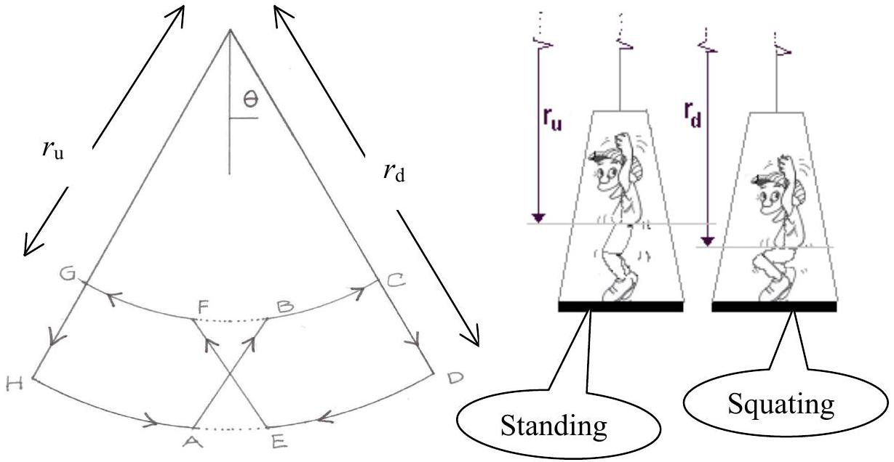
Figure 1.2

How many cycles of this maneuver does it take for the child to build up the amplitude (or the maximum angular velocity) of the swing by a factor of two?

Solution 1 (5 points)

(1) The conservation of angular momentum (CAM) from A to B, C to D, E to F and G to H.
$$
\begin{equation*}
L = I \dot { \theta } = m r ^ { 2 } \dot { \theta } \tag{1}
\end{equation*}
$$
$m =$ mass of the child
$r$ = distance of the child's center of mass to the swing's pivot P
$\dot { \theta } =$ the swing's angular velocity with respect to P
A to B:
Let $\dot { \theta } _ { d }$ and $\dot { \theta } _ { u }$ are the angular velocity at point A and B respectively, then according to CAM,
$$
\begin{equation*}
L _ { A } = m r _ { d } ^ { 2 } \dot { \theta } _ { d } = L _ { B } m r _ { u } ^ { 2 } \dot { \theta } _ { u } \tag{2}
\end{equation*}
$$
so that,
$$
\begin{equation*}
\dot { \theta } _ { d } = \frac { r _ { u } ^ { 2 } } { r _ { d } ^ { 2 } } \dot { \theta } _ { u } \tag{3}
\end{equation*}
$$
hence each time the swing repeat moving upward(A to B or E to F) its angular speed increases by factor of $\left( r _ { d } / r _ { u } \right) ^ { 2 }$
(2) The Conservation of Mechanical Energy (from B to C)
$$
\begin{equation*}
E _ { B } = E _ { C } = K + V = \frac { 1 } { 2 } m r _ { u } ^ { 2 } \dot { \theta } _ { B } ^ { 2 } - m g r _ { u } ( 1 - \cos \theta ) \tag{4}
\end{equation*}
$$
The change of the potential energy (from B to C ) is the same as the rotation energy at point B,
$$
\begin{equation*}
m g r _ { u } ( 1 - \cos \theta ) = \frac { 1 } { 2 } m r _ { u } ^ { 2 } \dot { \theta } _ { u } ^ { 2 } \tag{5}
\end{equation*}
$$
Using the similar method, we could get the following equation for the transition from D to E,
$$
\begin{equation*}
m g r _ { d } ( 1 - \cos \theta ) = \frac { 1 } { 2 } m r _ { d } ^ { 2 } \dot { \theta } _ { d } ^ { 2 } \tag{6}
\end{equation*}
$$

From equations (3), (5) and (6) we have,

$$
\begin{equation*}
\frac { r _ { u } } { r _ { d } } = \left( \frac { r _ { u } } { r _ { d } } \right) ^ { 2 } \left( \frac { \dot { \theta } _ { u } } { \dot { \theta } _ { d ^ { \prime } } } \right) ^ { 2 } \rightarrow \frac { \dot { \theta } _ { d ^ { \prime } } } { \dot { \theta } _ { u } } = \sqrt { \frac { r _ { u } } { r _ { d } } } \tag{7}
\end{equation*}
$$

For half a cycle we have $\dot { \theta } _ { u ^ { \prime } } = \left( \frac { r _ { d } } { r _ { u } } \right) ^ { 2 } \dot { \theta } _ { d ^ { \prime } } = \left( \frac { r _ { d } } { r _ { u } } \right) ^ { 3 / 2 } \dot { \theta } _ { u }$
For $n$ complete cycles, the growth of angular velocity amplitude as well as the angular amplitude $\theta _ { A }$ increases by a factor of $\rho _ { A , n } = \left( r _ { d } / r _ { u } \right) ^ { 3 n }$ For $\rho _ { A , n } = 2$ then with $r _ { d } / r _ { u } = 2 ^ { 1 / 10 }$ one gets $\left( 2 ^ { 1 / 10 } \right) ^ { 3 n } = 2 = 2 ^ { 3 n / 10 } \rightarrow n = \frac { 10 } { 3 }$

## ALTERNATE SOLUTION

The moment of inertia with respect to the swing pivot

$$
\begin{equation*}
I = M r ^ { 2 } \tag{1}
\end{equation*}
$$

Since the A to B transition is fast one has by conservation of angular momentum,

$$
\begin{equation*}
I _ { A } \omega _ { A } = I _ { B } \omega _ { B } \tag{2}
\end{equation*}
$$

The energy at point A is

$$
\begin{equation*}
E _ { A } = \frac { 1 } { 2 } I _ { A } \omega _ { A } ^ { 2 } \tag{3}
\end{equation*}
$$

The energy at point B is

$$
\begin{equation*}
E _ { B } = \frac { 1 } { 2 } I _ { B } \omega _ { B } ^ { 2 } + M g h \tag{4}
\end{equation*}
$$

where $h = r _ { d } - r _ { u }$ is the vertical distance the child's center of mass moves.
The energy at point C (conservation of energy)

$$
\begin{equation*}
E _ { C } = E _ { B } = \frac { 1 } { 2 } I _ { B } \omega _ { B } ^ { 2 } + M g h \tag{5}
\end{equation*}
$$

As the child squats at the C to D transition, the swing losses energy of the amount $M g h$ so

$$
\begin{equation*}
E _ { D } = \frac { 1 } { 2 } I _ { B } \omega _ { B } ^ { 2 } \tag{6}
\end{equation*}
$$

Energy at point E is equal to energy at point D (conservation energy)

$$
\begin{equation*}
E _ { E } = E _ { D } = \frac { 1 } { 2 } I _ { B } \omega _ { B } ^ { 2 } \tag{7}
\end{equation*}
$$

But we have also

$$
\begin{equation*}
E _ { E } = \frac { 1 } { 2 } I _ { E } \omega _ { E } ^ { 2 } \tag{8}
\end{equation*}
$$

From equation (7) and (8) we have,

$$
\begin{equation*}
\omega _ { E } ^ { 2 } = \frac { I _ { B } } { I _ { E } } \omega _ { B } ^ { 2 } \tag{9}
\end{equation*}
$$

Using equation(2) this equation yields,

$$
\begin{equation*}
\omega _ { E } ^ { 2 } = \frac { I _ { A } } { I _ { B } } \omega _ { A } ^ { 2 } \tag{10}
\end{equation*}
$$

Where we have used $I _ { E } = I _ { A }$.
Using equation (1) one obtains from equation (10)

$$
\begin{equation*}
\omega _ { E } ^ { 2 } = \frac { r _ { d } ^ { 2 } } { r _ { u } ^ { 2 } } \omega _ { A } ^ { 2 } \tag{11}
\end{equation*}
$$

From this one obtains,

$$
\begin{equation*}
\frac { \left| \omega _ { E } \right| } { \left| \omega _ { A } \right| } = \frac { r _ { d } } { r _ { u } } \tag{12}
\end{equation*}
$$

This ratio gives the fractional increase in the amplitude for one half cycle of the swing motion. The fractional increase in the amplitude after $n$ cycles is thus,

$$
\begin{equation*}
\frac { \left| \omega _ { E } \right| _ { n } } { \left| \omega _ { A } \right| _ { 0 } } = \left( \frac { r _ { d } } { r _ { u } } \right) ^ { 2 n } \tag{13}
\end{equation*}
$$

Where $\left| \omega _ { A } \right| _ { 0 }$ is the initial amplitude and $\left| \omega _ { E } \right| _ { n }$ is the amplitude after $n$ cycles. Substitute the values,

$$
\begin{equation*}
2 = 2 ^ { \frac { 2 n } { 10 } } \tag{14}
\end{equation*}
$$

or,

$$
\begin{equation*}
n = 5 \tag{15}
\end{equation*}
$$

Thus it takes only 5 swing cycles for the amplitude to build up by a factor of two.

## [Marking Scheme] THEORETICAL Question 1B   The Parametric Swing

| (5.0) | 0.25 | Moment of inertia $I = M r ^ { 2 }$ |
| :--- | :--- | :--- |
|  | 0.25 | Conservation of angular momentum A to B $I _ { A } \omega _ { A } = I _ { B } \omega _ { B }$ |
|  | 0.25 | Correct expression of energy at point A |
|  | 0.25 | Correct expression of energy at point B |
|  | 0.25 | Correct expression of energy at point C |
|  | 0.25 | Correct expression of energy at point D |
|  | 0.25 | Correct expression of energy at point E |
|  | 0.25 | Conservation of angular momentum C to D |
|  | 0.50   0.50 | Conservation of energy $E _ { B } = E _ { C } = \frac { 1 } { 2 } M r ^ { 2 } \dot { \theta } ^ { 2 } - M g r + \frac { 1 } { 2 } M g \theta ^ { 2 }$   Conservation of energy $E _ { C } = E _ { B } = \frac { 1 } { 2 } I _ { B } \omega _ { B } ^ { 2 } + M g h$ |
|  | 0.5   0.5 | Conservation of energy $E _ { E } = E _ { D } = \frac { 1 } { 2 } I _ { B } \omega _ { B } ^ { 2 } - \frac { 1 } { 2 } m r _ { u } ^ { 2 } \theta ^ { 2 }$   Conservation of energy $E _ { E } = E _ { D } = \frac { 1 } { 2 } I _ { B } \omega _ { B } ^ { 2 }$ |
|  | 0.5   0.5 | Equation $\frac { \left\| \omega _ { E } \right\| } { \left\| \omega _ { A } \right\| } = \left( \frac { r _ { d } } { r _ { u } } \right) ^ { 3 / 2 }$   Equation $\frac { \left\| \omega _ { E } \right\| } { \left\| \omega _ { A } \right\| } = \frac { r _ { d } } { r _ { u } }$ |
|  | 1.0   1.0 | Equation $\frac { \left\| \omega _ { E } \right\| _ { n } } { \left\| \omega _ { A } \right\| _ { 0 } } = \left( \frac { r _ { d } } { r _ { u } } \right) ^ { 3 n }$   Equation $\quad \frac { \left\| \omega _ { E } \right\| _ { n } } { \left\| \omega _ { A } \right\| _ { 0 } } = \left( \frac { r _ { d } } { r _ { u } } \right) ^ { 2 n }$ |
|  | 0.25   0.25 | Equation $2 = 2 ^ { \frac { 3 n } { 10 } }$   Equation $2 = 2 ^ { \frac { 2 n } { 10 } }$ |
|  | 0.25   0.25 | $n = 10 / 3$   $n = 5$ |

Note: Propagation errors will not be considered here.

## Question 2 magnetic focusing

There exist many devices that utilize fine beams of charged particles. The cathode ray tube used in oscilloscopes, in television receivers or in electron microscopes. In these devices the particle beam is focused and deflected in much the same manner as a light beam is in an optical instrument.

Beams of particles can be focused by electric fields or by magnetic fields. In problem 2A and 2B we are going to see how the beam can be focused by a magnetic field.

## 2A. MAGNETIC FOCUSING SOLENOID (4 points)

Figure 2.1 shows an electron gun situated inside (near the middle) a long solenoid. The electrons emerging from the hole on the anode have a small transverse velocity component. The electron will follow a helical path. After one complete turn, the electron will return to the axis connecting the hole and point F . By adjusting the magnetic field $B$ inside the solenoid correctly, all the electrons will converge at the same point F after one complete turn. Use the following data:

- The voltage difference that accelerates the electrons $V = 10 \mathrm { kV }$
- The distance between the anode and the focus point $\mathrm { F } , L = 0.50 \mathrm {~m}$
- The mass of an electron $m = 9.11 \times 10 ^ { - 31 } \mathrm {~kg}$
- The charge of an electron $e = 1.60 \times 10 ^ { - 19 } \mathrm { C }$
- $\mu _ { 0 } = 4 \pi \times 10 ^ { - 7 } \mathrm { H } / \mathrm { m }$
- Treat the problem non-relativistically
a) Calculate $B$ so that the electron returns to the axis at point F after one complete turn. (3 points)
b) Find the current in the solenoid if the latter has 500 turns per meter. (1 point)

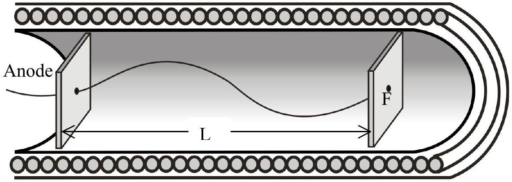
Figure 2.1

SOLUTION
a) In magnetic field, the particle will be deflected and follow a helical path.

Lorentz Force in a magnetic field $B$,

$$
\begin{equation*}
\frac { m v _ { \perp } ^ { 2 } } { R } = e v _ { \perp } B \tag{1}
\end{equation*}
$$

Where $v _ { \perp }$ is the transverse velocity of the electron, $R$ is the radius of the path.
Since $v _ { \perp } = \omega R \left( \omega = \frac { 2 \pi } { T } \right.$ is the particle angular velocity and $T$ is the period), then,

$$
\begin{equation*}
m \frac { 2 \pi } { T } = e B \tag{2}
\end{equation*}
$$

To be focused, the period of electron $T$ must be equal to $\frac { L } { v _ { l l } }$, where $v _ { l l }$ is the parallel component of the velocity.

We also know,

$$
\begin{equation*}
e V = \frac { 1 } { 2 } m \left( v _ { \perp } ^ { 2 } + v _ { l l } ^ { 2 } \right) \approx \frac { 1 } { 2 } m v _ { l l } ^ { 2 } \tag{3}
\end{equation*}
$$

All the information above leads to

$$
\begin{equation*}
B = 2 ^ { 3 / 2 } \pi \frac { ( m V / e ) ^ { 1 / 2 } } { L } \tag{4}
\end{equation*}
$$

Numerically

$$
B = 4.24 \mathrm { mT }
$$

b) The magnetic field of the Solenoid:

$$
\begin{align*}
& B = \mu _ { 0 } i n  \tag{5}\\
& i = \frac { B } { n \mu _ { 0 } } \tag{6}
\end{align*}
$$

Numerically

$$
i = 6.75 \mathrm {~A} .
$$

THEORETICAL COMPETITION

Questions and Solutions
FINAL VERSION
[Marking Scheme] THEORETICAL Question 2A
Magnetic Focusing Solenoid

| a. (3.0) | 0.3 | Lorentz force $\quad \frac { m v _ { \perp } ^ { 2 } } { R } = e v _ { \perp } B$ |
| :--- | :--- | :--- |
|  | 0.1 | Transverse velocity $v _ { \perp } = \omega R$ |
|  | 0.1 | $\omega = \frac { 2 \pi } { T }$ |
|  | 0.3 | Equation $\quad m \frac { 2 \pi } { T } = e B$ |
|  | 0.2 | Equation $T = \frac { L } { v _ { l l } }$ |
|  | 0.5 | Conservation energy $e V = \frac { 1 } { 2 } m \left( v _ { \perp } ^ { 2 } + v _ { l l } ^ { 2 } \right) \approx \frac { 1 } { 2 } m v _ { l l } ^ { 2 }$ |
|  | 1.0 | Formula $B = 2 ^ { \frac { 3 } { 2 } } \pi \frac { ( m V / e ) ^ { 1 / 2 } } { L }$ |
|  | 0.5 | Numerical value $B = 4.23 \mathrm { mT }$ |
| b. (1.0) | 0.5 | $B = \mu _ { 0 } i n$ |
|  | 0.3 | $i = \frac { B } { n \mu _ { 0 } }$ |
|  | 0.2 | $i = 6.75 \mathrm {~A}$. |

Note: Propagation errors will not be considered.

## 2B. MAGNETIC FOCUSING (FRINGING FIELD) (6 points)

Two pole magnets positioned on horizontal planes are separated by a certain distance such that the magnetic field between them be $B$ in vertical direction (see Figure 2.2). The poles faces are rectangular with length $l$ and width $w$. Consider the fringe field near the edges of the poles (fringe field is field particularly associated to the edge effects). Suppose the extent of the fringe field is $b$ (see Fig. 2.3). The fringe field has two components $B _ { x } \mathbf { i }$ and $B _ { z } \mathbf { k }$. For simplicity assume that $\left| B _ { x } \right| = B | z | / b$ where $z = 0$ is the mid plane of the gap, explicitly:

- when the particle enters the fringe field $B _ { x } = + B z / b$,
- when the particle enters the fringe field after traveling through the magnet, $B _ { x } = - B z / b$

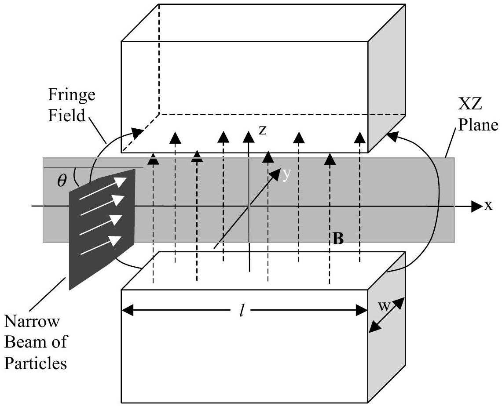
Fig.2.2: Overall view (note that $\theta$ is very small).

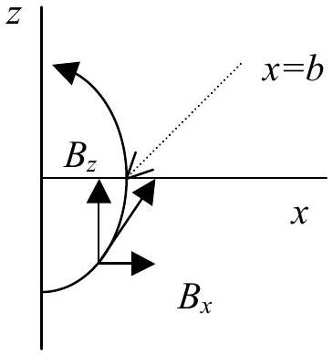
Figure 2.3. Fringe field

A parallel narrow beam of particles, each of mass $m$ and positive charge $q$ enters the magnet (near the center) with a high velocity $v$ parallel to the horizontal plane. The vertical size of the beam is comparable to the distance between the magnet poles. A certain beam enters the magnet at an angle $\theta$ from the center line of the magnet and leaves the magnet at an angle $- \theta$ (see Figure 2.4. Assume $\theta$ is very small). Assume that the angle $\theta$ with which the particle enters the fringe field is the same as the angle $\theta$ when it enters the uniform field.

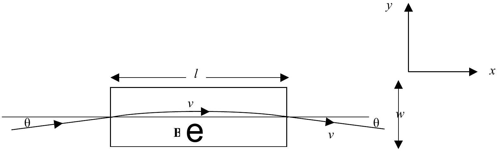
Figure 2.4. Top view

The beam will be focused due to the fringe field. Calculate the approximate focal length if we define the focal length as illustrated in Figure 2.5 (assume $b \ll l$ and assume that the $z$-component of the deflection in the uniform magnetic field $B$ is very small).

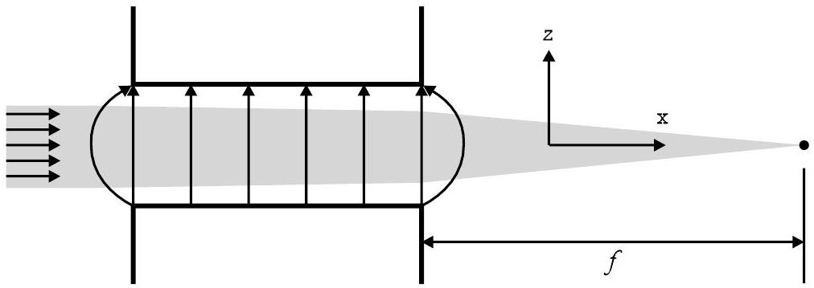
Figure 2.5. Side view

Solution:
The magnetic force due to the fringe field on charge $q$ with velocity $v$ is

$$
\begin{equation*}
\vec { F } = q \vec { v } \times \vec { B } \tag{1}
\end{equation*}
$$

The $z$-component of the force obtained from the cross product is

$$
\begin{equation*}
F _ { z } = q \left( v _ { x } B _ { y } - v _ { y } B _ { x } \right) = - q v _ { y } B _ { x } = - \frac { q v \sin \theta B z } { b } \tag{2}
\end{equation*}
$$

The vertical momentum gained by the particle after entering the fringe field

$$
\begin{equation*}
\Delta P _ { z } = \int F _ { z } d t = - \frac { q v B z \sin \theta } { b } \Delta t = - \frac { q v B z \sin \theta } { b } \frac { b } { v \cos \theta } = - q B z \tan \theta \tag{3}
\end{equation*}
$$

The particle undergoes a circular motion in the constant magnetic field B region

$$
\begin{array} { r }
m \frac { v ^ { 2 } } { R } = q v B \\
v = \frac { q B R } { m } = \frac { q B l } { 2 m \sin \theta } \tag{5}
\end{array}
$$

Therefore,

$$
\begin{equation*}
\sin \theta = \frac { q B l } { 2 m v } \tag{6}
\end{equation*}
$$

After the particle exits the fringe field at the other end, it will gain the same momentum.

The total vertical momentum gained by the particle is

$$
\begin{equation*}
\left( \Delta P _ { z } \right) _ { \text {total } } = 2 \Delta P _ { z } = - 2 q B z \tan \theta \approx - 2 q B z \frac { q B l } { 2 m v } = - \frac { q ^ { 2 } B ^ { 2 } z l } { m v } \tag{7}
\end{equation*}
$$

Note that for small $\theta$, we can approximate $\tan \theta \approx \sin \theta$
Meanwhile, the momentum along the horizontal plane ( $x y$-plane) is

$$
\begin{equation*}
p = m v \tag{8}
\end{equation*}
$$

From the geometry in figure 4, we can get the focal length by the following relation,

$$
\begin{equation*}
\frac { \left| \Delta P _ { z } \right| } { p } = \frac { | Z | } { f } \tag{9}
\end{equation*}
$$

$$
\begin{equation*}
f = \frac { m ^ { 2 } v ^ { 2 } } { q ^ { 2 } B ^ { 2 } l } \tag{10}
\end{equation*}
$$

THEORETICAL COMPETITION
[Marking Scheme]

## THEORETICAL Question 2B

Magnetic Focusing (Fringing Field)

| (6.0) | 0.25 | Lorentz force $\vec { F } = q \vec { v } \times \vec { B }$ |
| :--- | :--- | :--- |
|  | 0.25 | $z$-component $F _ { z } = q \left( v _ { x } B _ { y } - v _ { y } B _ { x } \right)$ |
|  | 0.25 | $z$-component $F _ { z } = - q v _ { y } B _ { x } = - \frac { q v \sin \theta B z } { b }$ |
|  | 0.5 | $z$-component gained momentum $\Delta P _ { z } = \int F _ { z } d t$ |
|  | 0.75 | $\Delta P _ { z } = - q B z \tan \theta$ |
|  | 0.5 | Equation $m \frac { v ^ { 2 } } { R } = q v B$ |
|  | 0.25 | $\sin \theta = \frac { q B l } { 2 m v }$ |
|  | 0.5 | $\left( \Delta P _ { z } \right) _ { \text {total } } = 2 \Delta P _ { z }$ (factor of 2) |
|  | 0.25 | $\left( \Delta P _ { z } \right) _ { \text {total } } = - \frac { q ^ { 2 } B ^ { 2 } z l } { m v }$ |
|  | 0.5 | Horizontal momentum $p = m v$ |
|  | 1.0 | Equation $\frac { \left\| \Delta P _ { z } \right\| _ { \text {total } } } { p } = \frac { \| Z \| } { f }$ |
|  | 1.0 | $f = \frac { m ^ { 2 } v ^ { 2 } } { q ^ { 2 } B ^ { 2 } l }$ |

Note: No propagation error will be considered here.

## Question 3 light deflection by a moving mirror

Reflection of light by a relativistically moving mirror is not theoretically new. Einstein discussed the possibility or worked out the process using the Lorentz transformation to get the reflection formula due to a mirror moving with a velocity $\vec { v }$. This formula, however, could also be derived by using a relatively simpler method. Consider the reflection process as shown in Fig. 3.1, where a plane mirror M moves with a velocity $\vec { v } = v \hat { e } _ { x }$ (where $\hat { e } _ { x }$ is a unit vector in the $x$-direction) observed from the lab frame F. The mirror forms an angle $\phi$ with respect to the velocity (note that $\phi \leq 90 ^ { \circ }$, see figure 3.1). The plane of the mirror has n as its normal. The light beam has an incident angle $\alpha$ and reflection angle $\beta$ which are the angles between $\vec { n }$ and the incident beam 1 and reflection beam $1 ^ { \prime }$, respectively in the laboratory frame F. It can be shown that,

$$
\begin{equation*}
\sin \alpha - \sin \beta = \frac { v } { c } \sin \phi \sin ( \alpha + \beta ) \tag{1}
\end{equation*}
$$

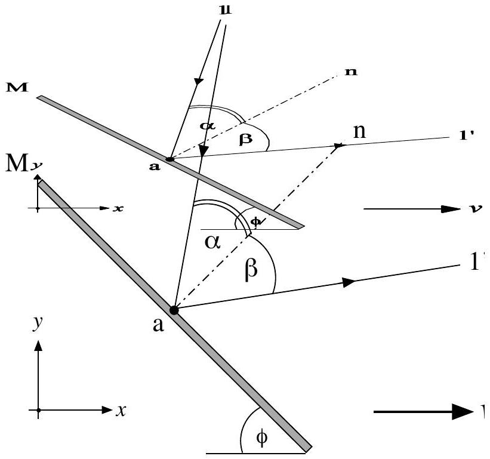
Figure 3.1. Reflection of light by a relativistically moving mirror

## 3A. Einstein's Mirror (2.5 points)

About a century ago Einstein derived the law of reflection of an electromagnetic wave by a mirror moving with a constant velocity $\vec { v } = - v \hat { e } _ { x }$ (see Fig. 3.2). By applying the Lorentz transformation to the result obtained in the rest frame of the mirror, Einstein found that:

$$
\begin{equation*}
\cos \beta = \frac { \left( 1 + \left( \frac { v } { c } \right) ^ { 2 } \right) \cos \alpha - 2 \frac { v } { c } } { 1 - 2 \frac { v } { c } \cos \alpha + \left( \frac { v } { c } \right) ^ { 2 } } \tag{2}
\end{equation*}
$$

Derive this formula using Equation (1) without Lorentz transformation!

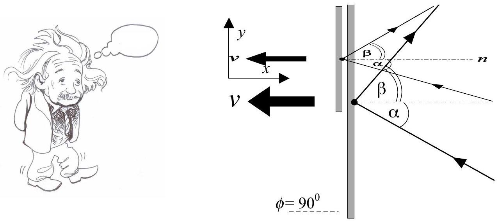
Figure 3.2. Einstein mirror moving to the left with a velocity $v$.

## 3B. Frequency Shift (2 points)

In the same situation as in 3A, if the incident light is a monochromatic beam hitting M with a frequency $f$, find the new frequency $f ^ { \prime }$ after it is reflected from the surface of the moving mirror. If $\alpha = 30 ^ { 0 }$ and $v = 0.6 c$ in figure 3.2, find frequency shift $\Delta f$ in percentage of $f$.

## 3C. Moving Mirror Equation (5.5 Points)

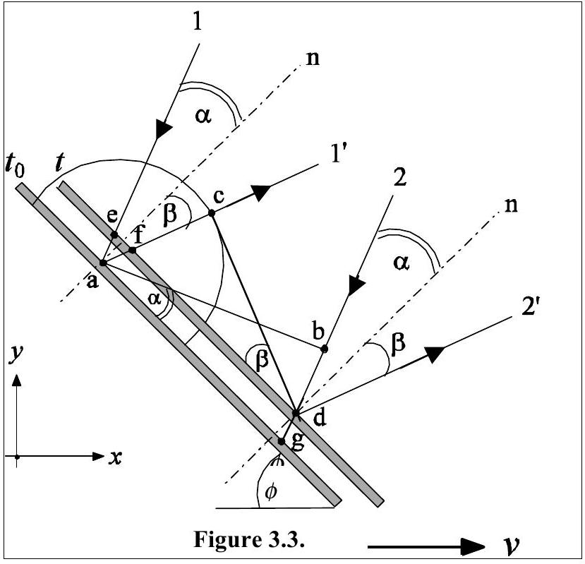
Figure 3.3 shows the positions of the mirror at time $t _ { 0 }$ and $t$. Since the observer is moving to the left, the mirror moves relatively to the right. Light beam 1 falls on point $a$ at $t _ { 0 }$ and is reflected as beam $1 ^ { \prime }$. Light beam 2 falls on point $d$ at $t$ and is reflected as beam 2'. Therefore, $\overline { a b }$ is the wave front of the incoming light at time $t _ { 0 }$. The atoms at point are disturbed by the incident wave front $\overline { a b }$ and begin to radiate a wavelet. The disturbance due to the wave front $\overline { a b }$ stops at time $t$ when the wavefront strikes point $d$.

By referring to figure 3.3 for light wave propagation or using other methods, derive equation (1).

Solution:
a) EINSTEIN'S MIRROR

By taking $\phi = \pi / 2$ and replacing $v$ with $- v$ in Equation (1) we obtain

$$
\begin{equation*}
\sin \alpha - \sin \beta = - \frac { v } { c } \sin ( \alpha + \beta ) \tag{3}
\end{equation*}
$$

This equation can also be written in the form of

$$
\begin{equation*}
\left( 1 + \frac { v } { c } \cos \beta \right) \sin \alpha = \left( 1 - \frac { v } { c } \cos \alpha \right) \sin \beta \tag{4}
\end{equation*}
$$

The square of this equation can be written in terms of a squared equation of $\cos \beta$, as follows,

$$
\begin{equation*}
\left( 1 - 2 \frac { v } { c } \cos \alpha + \frac { v ^ { 2 } } { c ^ { 2 } } \right) \cos ^ { 2 } \beta + 2 \frac { v } { c } \left( 1 - \cos ^ { 2 } \alpha \right) \cos \beta + 2 \frac { v } { c } \cos \alpha - \left( 1 + \frac { v ^ { 2 } } { c ^ { 2 } } \right) \cos ^ { 2 } \alpha = 0 \tag{5}
\end{equation*}
$$

which has two solutions,

$$
\begin{equation*}
( \cos \beta ) _ { 1 } = \frac { 2 \frac { v } { c } \cos ^ { 2 } \alpha - \left( 1 + \frac { v ^ { 2 } } { c ^ { 2 } } \right) \cos \alpha } { 1 - 2 \frac { v } { c } \cos \alpha + \frac { v ^ { 2 } } { c ^ { 2 } } } \tag{6}
\end{equation*}
$$

and

$$
\begin{equation*}
( \cos \beta ) _ { 2 } = \frac { - 2 \frac { v } { c } + \left( 1 + \frac { v ^ { 2 } } { c ^ { 2 } } \right) \cos \alpha } { 1 - 2 \frac { v } { c } \cos \alpha + \frac { v ^ { 2 } } { c ^ { 2 } } } \tag{7}
\end{equation*}
$$

However, if the mirror is at rest ( $v = 0$ ) then $\cos \alpha = \cos \beta$; therefore the proper solution is

$$
\begin{equation*}
\cos \beta _ { 2 } = \frac { - 2 \frac { v } { c } + \left( 1 + \frac { v ^ { 2 } } { c ^ { 2 } } \right) \cos \alpha } { 1 - 2 \frac { v } { c } \cos \alpha + \frac { v ^ { 2 } } { c ^ { 2 } } } \tag{8}
\end{equation*}
$$

b) FREQUENCY SHIFT

The reflection phenomenon can be considered as a collision of the mirror with a beam of photons each carrying an incident and reflected momentum of magnitude

$$
\begin{equation*}
p _ { f } = h f / c \text { and } p _ { f } { } ^ { \prime } = h f ^ { \prime } / c \text {, } \tag{9}
\end{equation*}
$$

The conservation of linear momentum during its reflection from the mirror for the component parallel to the mirror appears as

$$
\begin{equation*}
p _ { f } \sin \alpha = p _ { f } { } ^ { \prime } \sin \beta \text { or } f ^ { \prime } \sin \beta = f ^ { \prime } \frac { \left( 1 - \frac { v ^ { 2 } } { c ^ { 2 } } \right) \sin \alpha } { \left( 1 + \frac { v ^ { 2 } } { c ^ { 2 } } \right) - 2 \frac { v } { c } \cos \alpha } = f \sin \alpha \tag{10}
\end{equation*}
$$

Thus

$$
\begin{equation*}
f ^ { \prime } = \frac { \left( 1 + \frac { v ^ { 2 } } { c ^ { 2 } } \right) - 2 \frac { v } { c } \cos \alpha } { \left( 1 - \frac { v ^ { 2 } } { c ^ { 2 } } \right) } f \tag{11}
\end{equation*}
$$

For $\alpha = 30 ^ { 0 }$ and $v = 0.6 c$,

$$
\begin{equation*}
\cos \alpha = \frac { 1 } { 2 } \sqrt { 3 } , 1 - \frac { v ^ { 2 } } { c ^ { 2 } } = 0.64,1 + \frac { v ^ { 2 } } { c ^ { 2 } } = 1.36 \tag{12}
\end{equation*}
$$

so that

$$
\begin{equation*}
\frac { f ^ { \prime } } { f } = \frac { 1.36 - 0.6 \sqrt { 3 } } { 0.64 } = 0.5 \tag{13}
\end{equation*}
$$

Thus, there is a decrease of frequency by $50 \%$ due to reflection by the moving mirror.

## c) RELATIVISTICALLY MOVING MIRROR EQUATION

Figure 3.3 shows the positions of the mirror at time $t _ { 0 }$ and $t$. Since the observer is moving to the left, system is moving relatively to the right. Light beam 1 falls on point $a$ at $t _ { 0 }$ and is reflected as beam $1 ^ { \prime }$. Light beam 2 falls on point $d$ at $t$ and is reflected as beam 2'. Therefore, $\overline { a b }$ is the wave front of the incoming light at time $t _ { 0 }$. The atoms at point are disturbed by the incident wave front $\overline { a b }$ and begin to radiate a wavelet. The disturbance due to the wave front $\overline { a b }$ stops at time $t$ when the wavefront strikes point $d$. As a consequence

$$
\begin{equation*}
\overline { a c } = \overline { b d } = c \left( t - t _ { 0 } \right) . \tag{14}
\end{equation*}
$$

From this figure we also have $\overline { e d } = \overline { a g }$, and

$$
\begin{equation*}
\sin \alpha = \frac { \overline { b d } + \overline { d g } } { \overline { a g } } , \quad \sin \beta = \frac { \overline { a c } - \overline { a f } } { \overline { a g } - \overline { e f } } . \tag{15}
\end{equation*}
$$

Figure 3.4 displays the beam path 1 in more detail. From this figure it is easy to show that

$$
\begin{equation*}
\overline { d g } = \overline { a e } = \frac { \overline { a o } } { \cos \alpha } = \frac { v \left( t - t _ { 0 } \right) \sin \phi } { \cos \alpha } \tag{16}
\end{equation*}
$$

and

$$
\begin{equation*}
\overline { a f } = \frac { \overline { a o } } { \cos \beta } = \frac { v \left( t - t _ { 0 } \right) \sin \phi } { \cos \beta } \tag{17}
\end{equation*}
$$

From the triangles aeo and afo we have $\overline { e o } = \overline { a o } \tan \alpha$ and $\overline { o f } = \overline { a o } \tan \beta$. Since $\overline { e f } = \overline { e o } + o f$, then

$$
\begin{equation*}
\overline { e f } = v \left( t - t _ { 0 } \right) \sin \phi ( \tan \alpha + \tan \beta ) \tag{18}
\end{equation*}
$$

By substituting Equations (14), (16), (17), and (18) into Equation (15) we obtain

$$
\begin{equation*}
\sin \alpha = \frac { c + v \frac { \sin \phi } { \cos \alpha } } { \frac { \overline { a g } } { t - t _ { 0 } } } \tag{19}
\end{equation*}
$$

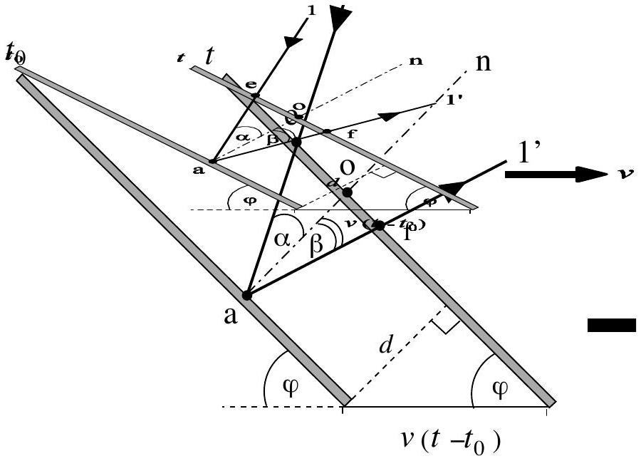
Figure 3.4.

and

$$
\begin{equation*}
\sin \beta = \frac { c - v \frac { \sin \phi } { \cos \beta } } { \overline { \overline { a g } } - v \sin \phi ( \tan \alpha + \tan \beta ) } \tag{20}
\end{equation*}
$$

Eliminating $\overline { a g } / \left( t - t _ { 0 } \right)$ from the two Equations above leads to

$$
\begin{equation*}
v \sin \phi ( \tan \alpha + \tan \beta ) = c \left( \frac { 1 } { \sin \alpha } - \frac { 1 } { \sin \beta } \right) + v \sin \phi \left( \frac { 1 } { \sin \alpha \cos \alpha } + \frac { 1 } { \sin \beta \cos \beta } \right) \tag{21}
\end{equation*}
$$

By collecting the terms containing $v \sin \phi$ we obtain

$$
\begin{equation*}
\frac { v } { c } \sin \phi \left( \frac { \cos \alpha } { \sin \alpha } + \frac { \cos \beta } { \sin \beta } \right) = \frac { \sin \alpha - \sin \beta } { \sin \alpha \sin \beta } \tag{22}
\end{equation*}
$$

or

$$
\begin{equation*}
\sin \alpha - \sin \beta = \frac { v } { c } \sin \phi \sin ( \alpha + \beta ) \tag{23}
\end{equation*}
$$

THEORETICAL COMPETITION

Questions and Solutions
FINAL VERSION
[Marking Scheme]

## THEORETICAL Question 3

Relativistic Mirror

| A. (3.0) | 0.5 | Equation: $\sin \alpha - \sin \beta = - \frac { v } { c } \sin ( \alpha + \beta )$ |
| :--- | :--- | :--- |
|  | 0.25 | Equation $\left( 1 + \frac { v } { c } \cos \beta \right) \sin \alpha = \left( 1 - \frac { v } { c } \cos \alpha \right) \sin \beta$ |
|  | 0.5 | $\left( 1 - 2 \frac { v } { c } \cos \alpha + \frac { v ^ { 2 } } { c ^ { 2 } } \right) \cos ^ { 2 } \beta + 2 \frac { v } { c } \left( 1 - \cos ^ { 2 } \alpha \right) \cos \beta + 2 \frac { v } { c } \cos \alpha - \left( 1 + \frac { v ^ { 2 } } { c ^ { 2 } } \right) \cos ^ { 2 } \alpha = 0$ |
|  | 0.75 | $\begin{aligned} & ( \cos \beta ) _ { 1 } = \frac { 2 \frac { v } { c } \cos ^ { 2 } \alpha - \left( 1 + \frac { v ^ { 2 } } { c ^ { 2 } } \right) \cos \alpha } { 1 - 2 \frac { v } { c } \cos \alpha + \frac { v ^ { 2 } } { c ^ { 2 } } } \\ & ( \cos \beta ) _ { 2 } = \frac { - 2 \frac { v } { c } + \left( 1 + \frac { v ^ { 2 } } { c ^ { 2 } } \right) \cos \alpha } { 1 - 2 \frac { v } { c } \cos \alpha + \frac { v ^ { 2 } } { c ^ { 2 } } } \end{aligned}$ |
|  | 0.5 | Recognize the mirror is at rest ( $v = 0$ ) then $\cos \alpha = \cos \beta$ |
|  | 0.5 | $\cos \beta _ { 2 } = \frac { - 2 \frac { v } { c } + \left( 1 + \frac { v ^ { 2 } } { c ^ { 2 } } \right) \cos \alpha } { 1 - 2 \frac { v } { c } \cos \alpha + \frac { v ^ { 2 } } { c ^ { 2 } } }$ |
| B(2.0) | 0.25 | $p _ { f } \sin \alpha = p _ { f } { } ^ { \prime } \sin \beta$ |
|  | 0.25   0.25 | $\begin{aligned} & \text { Know how to calculate } \sin \beta \\ & p _ { f } = h f / c \end{aligned}$ |
|  | 0.75 | $f ^ { \prime } = \frac { \left( 1 + \frac { v ^ { 2 } } { c ^ { 2 } } \right) - 2 \frac { v } { c } \cos \alpha } { \left( 1 - \frac { v ^ { 2 } } { c ^ { 2 } } \right) } f$ |
|  | 0.5 | $\frac { f ^ { \prime } } { f } = 0.5$ |

For part $C$, if the students is not able to prove the equation maximum point is 2.5 .

| (5.0) | 1.0 | Equation $\overline { \text { ef } } = v \left( t - t _ { 0 } \right) \sin \phi ( \tan \alpha + \tan \beta )$ |
| :--- | :--- | :--- |
|  | 1.0 | $\sin \alpha = \frac { c + v \frac { \sin \phi } { \cos \alpha } } { \frac { \overline { a g } } { t - t _ { 0 } } }$ |
|  | 0.5 | $\sin \beta = \frac { c - v \frac { \sin \phi } { \cos \beta } } { \frac { \overline { a g } } { t - t _ { 0 } } - v \sin \phi ( \tan \alpha + \tan \beta ) }$ |
|  | 2.5 | $\sin \alpha - \sin \beta = \frac { v } { c } \sin \phi \sin ( \alpha + \beta )$ |

Propagation error can be considered but the maximum point is 2.5 .
