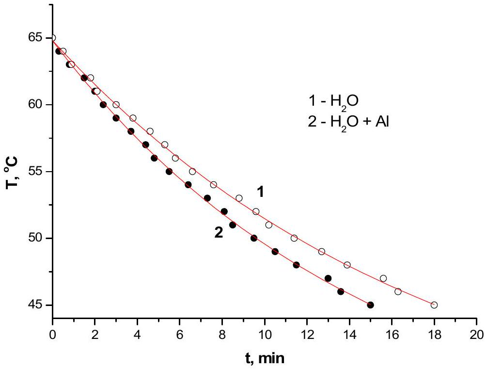
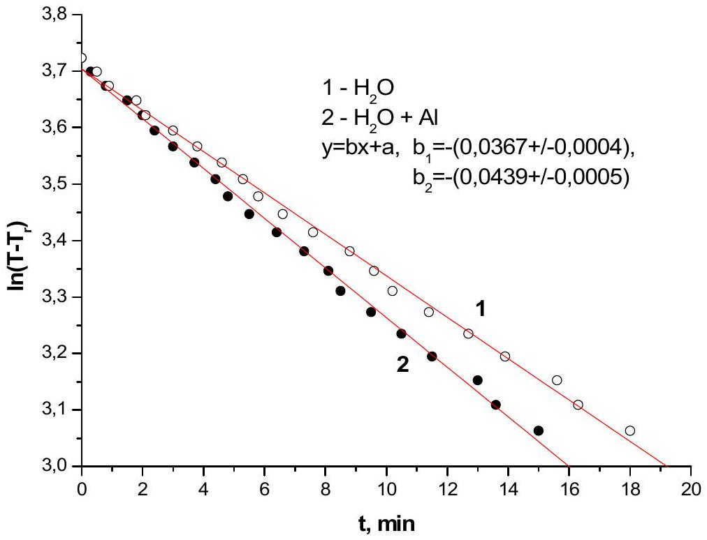
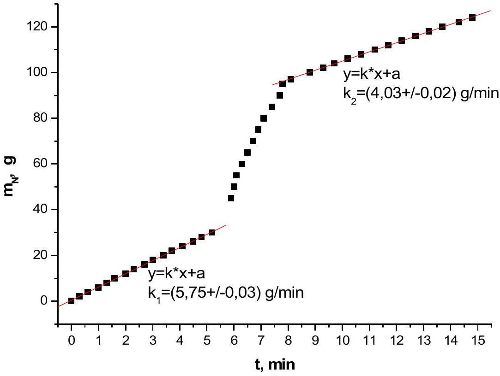

## Experimental problem

## Solutions

Part 1
Measurement of the specific heat of aluminum in the $\mathbf { 4 5 } ^ { \mathbf { 0 } } \mathbf { ~ C } - \mathbf { 6 5 } ^ { \mathbf { 0 } } \mathbf { ~ C }$ temperature range (10 points).

1a) [1.0 point] The heat capacity of water in the first experiment is

$$
\begin{equation*}
C _ { 1 } = c _ { w } m _ { 1 } \tag{1.1}
\end{equation*}
$$

where $c _ { w } = 4,2 k J / ( k g K )$ is the specific heat of water and $m _ { 1 }$ is the mass of water in the experiment. The heat capacity of water with the aluminum cylinder immersed in it:

$$
\begin{equation*}
C _ { 2 } = c _ { w } m _ { 2 } + c _ { A l } m \tag{1.2}
\end{equation*}
$$

where $m _ { 2 }$ is the mass of water in the experiment, $c _ { A l }$ is the specific heat of aluminum and $m$ is the mass of aluminum cylinder. The ratio of heat capacities is $K = C _ { 1 } / C _ { 2 }$. Then, specific heat capacity of aluminum is determined by the formula

$$
\begin{equation*}
c _ { A l } = \frac { m _ { 1 } - K \cdot m _ { 2 } } { K \cdot m } c _ { w } . \tag{1.3}
\end{equation*}
$$

The ratio of heat capacities $K$ can be determined from the experiment in 1b) and 1c). To be able to extract $K$ from these two experiments, one should perform the measurements in the regime such that the level of water is the same for both experiments. This can be done by marking the level of the water on the side of the cup by usual pen, or by choosing the masses of water such that the equation

$$
\frac { m _ { 1 } } { \rho _ { w } } = \frac { m _ { 2 } } { \rho _ { w } } + \frac { m } { \rho _ { A l } }
$$

is closely satisfied. Since (1.3) have the difference in the numerator, best results are obtained when $m _ { 1 }$ is chosen to be close to $m$.

1b) [1.5 points] The following table shows the $T _ { 1 }$,--the temperature of hot water as it cools down, as a function of time $t$ in the $45 ^ { \circ } \mathrm { C } - 65 ^ { \circ } \mathrm { C }$ temperature range:

| N | $\mathbf { T } _ { \mathbf { 1 } } \boldsymbol { , } { } ^ { \mathbf { 0 } } \mathbf { C }$ | t, min.sec | t, min | $\boldsymbol { \operatorname { l n } } \boldsymbol { ( } \mathbf { T } _ { \mathbf { 1 } } \boldsymbol { - } \mathbf { T } _ { \mathbf { r } } \boldsymbol { ) }$ |
| :--- | :--- | :--- | :--- | :--- |
| 1 | 65 | 0.00 | 0,0 | 3,72 |
| 2 | 64 | 0.27 | 0,5 | 3,69 |
| 3 | 63 | 0.56 | 0,9 | 3,67 |
| 4 | 62 | 1.49 | 1,8 | 3,64 |
| 5 | 61 | 2.08 | 2,1 | 3,62 |
| 6 | 60 | 3.02 | 3,0 | 3,59 |
| 7 | 59 | 3.48 | 3,8 | 3,56 |
| 8 | 58 | 4.34 | 4,6 | 3,53 |
| 9 | 57 | 5.20 | 5,3 | 3,51 |
| 10 | 56 | 5.48 | 5,8 | 3,47 |
| 11 | 55 | 6.33 | 6,6 | 3,44 |
| 12 | 54 | 7.37 | 7,6 | 3,41 |
| 13 | 53 | 8.50 | 8,8 | 3,38 |
| 14 | 52 | 9.37 | 9,6 | 3,34 |
| 15 | 51 | 10.13 | 10,2 | 3,31 |
| 16 | 50 | 11.26 | 11,4 | 3,27 |
| 17 | 49 | 12.39 | 12,7 | 3,23 |
| 18 | 48 | 13.52 | 13,9 | 3,19 |
| 19 | 47 | 15.33 | 15,6 | 3,15 |
| 20 | 46 | 16.17 | 16,3 | 3,11 |
| 21 | 45 | 18.00 | 18,0 | 3,06 |

The mass of water is $m _ { 1 } = ( 50 \pm 1 ) g$ and the room temperature is $\mathrm { T } _ { \mathrm { r } } = ( 23,4 \pm 0,2 ) ^ { 0 } \mathrm { C }$

1c) [1.5 points] The following table shows the temperature $T _ { 2 }$ of hot water with aluminum cylinder immersed as the water cools down as a function of time $t$ in the $45 ^ { 0 } \mathrm { C } - 65 ^ { 0 } \mathrm { C }$ temperature range:

| N | $\mathbf { T } _ { \mathbf { 1 } } \boldsymbol { , } { } ^ { \mathbf { 0 } } \mathbf { C }$ | t, min.sec | t, min | $\boldsymbol { \operatorname { l n } } \boldsymbol { ( } \mathbf { T } _ { \mathbf { 1 } } \boldsymbol { - } \mathbf { T } _ { \mathbf { r } } \boldsymbol { ) }$ |
| :--- | :--- | :--- | :--- | :--- |
| 1 | 65 | 0.00 | 0,0 | 3,72 |
| 2 | 64 | 0.18 | 0,3 | 3,69 |

| 3 | 63 | 0.46 | 0,8 | 3,67 |
| :--- | :--- | :--- | :--- | :--- |
| 4 | 62 | 1.32 | 1,5 | 3,64 |
| 5 | 61 | 2.00 | 2,0 | 3,62 |
| 6 | 60 | 2.26 | 2,4 | 3,59 |
| 7 | 59 | 3.03 | 3,0 | 3,56 |
| 8 | 58 | 3.39 | 3,7 | 3,53 |
| 9 | 57 | 4.25 | 4,4 | 3,51 |
| 10 | 56 | 4.45 | 4,8 | 3,47 |
| 11 | 55 | 5.29 | 5,5 | 3,44 |
| 12 | 54 | 6.24 | 6,4 | 3,41 |
| 13 | 53 | 7.19 | 7,3 | 3,38 |
| 14 | 52 | 8.05 | 8,1 | 3,34 |
| 15 | 51 | 8.33 | 8,5 | 3,31 |
| 16 | 50 | 9.27 | 9,5 | 3,27 |
| 17 | 49 | 10.31 | 10,5 | 3,23 |
| 18 | 48 | 11.35 | 11,5 | 3,19 |
| 19 | 47 | 12.58 | 13,0 | 3,15 |
| 20 | 46 | 13.35 | 13,6 | 3,11 |
| 21 | 45 | 14.57 | 15,0 | 3,06 |

The mass of aluminum cylinder is $m = ( 69 \pm 1 ) \mathrm { g }$, the mass of water is $m _ { 2 } =$ $( 27 \pm 1 ) g$, and the room temperature is $\left. \mathrm { T } _ { \mathrm { r } } = ( 23,4 \pm 0,2 ) ^ { \circ } \mathrm { C } \right)$

The graphs $T _ { 1 } ( t )$ and $T _ { 2 } ( t )$ are shown below:

1d) [4.0 points] Water in the first experiment and water with aluminum cylinder immersed in the second experiment cool down because of heat exchange with the air in the room according to the following linear law:
$$
\begin{equation*}
\alpha \left( T - T _ { r } \right) d t = - C d T , \tag{1.4}
\end{equation*}
$$
where $\alpha$ is a constant and $C$ is heat capacity ( $C _ { 1 }$ or $C _ { 2 }$ ). If we integrate the expression (1.4), we get
$$
\begin{equation*}
T - T _ { r } = A e ^ { - \frac { \alpha } { C } t } \tag{1.5}
\end{equation*}
$$
where $A = T _ { 0 } - T _ { r }$ ( $T _ { 0 }$ is the initial temperature of water in the experiment from the experimental data).
Various methods can be used to obtain the ratio of heat capacities but the most precise result can be obtained from the following linear relation:
$$
\begin{equation*}
\ln \left( T - T _ { r } \right) = \ln A - \frac { \alpha } { C } t \tag{1.6}
\end{equation*}
$$
The graphs $\ln \left[ T _ { 1 } ( t ) - T _ { r } \right]$ and $\ln \left[ T _ { 2 } ( t ) - T _ { r } \right]$ appear to be approximately linear and are shown below:

We can obtain the ratio $K = C _ { 1 } / C _ { 2 }$ by comparing the slopes of the graphs derived from the first and second experiments. The value of $K$ obtained in terms of the slopes of the two linear relationships is as follows:

$$
K = \frac { b _ { 2 } } { b _ { 1 } } = \frac { - 0.0439 } { - 0.0367 } = 1.196 ,
$$

And the uncertainty is:

$$
\Delta K = K \cdot \left( \frac { \Delta b _ { 1 } } { b _ { 1 } } + \frac { \Delta b _ { 2 } } { b _ { 2 } } \right) = 1,196 \cdot \left( \frac { 0.0004 } { 0.0367 } + \frac { 0.0005 } { 0.0439 } \right) = 1.196 \cdot 0.022 = 0.026 , \varepsilon _ { K } = 2 \%
$$

1e) [2.0 points] At $K = 1.196$ the specific heat of aluminum obtained from formula (1.3) is:
$$
c _ { A l } = 0.90 \mathrm {~kJ} / ( \mathrm { kg } \cdot \mathrm {~K} ) .
$$
And the uncertainty is:
$$
\begin{aligned}
& \Delta c _ { A l } = c _ { A l } \left( \frac { \Delta m _ { 1 } + K \Delta m _ { 2 } } { m _ { 1 } - K m _ { 2 } } + \frac { \Delta m } { m } + \frac { \Delta K } { K } \frac { m _ { 1 } } { m _ { 1 } - K m _ { 2 } } \right) = 0.90 \cdot \left( \frac { 2.196 g } { 17.7 g } + \frac { 1 g } { 69 g } + \frac { 50 g } { 17.7 g } \frac { 0.026 } { 1.196 } \right) = \\
& = 0.90 \cdot 0.2 = 0.18 \mathrm {~kJ} / ( \mathrm { kg } \cdot K )
\end{aligned}
$$

## Part 2   Measurement of the specific latent heat of evaporation of the liquid nitrogen

2a) [3.0 points] Below is the table showing the the mass of evaporated nitrogen $m _ { N }$ versus time:

| $\boldsymbol { N }$ | $\boldsymbol { M }$, gr | t, min.sec | $\boldsymbol { t } \boldsymbol { , } \mathbf { m i n }$ | $\boldsymbol { m } _ { \mathbf { N } }$, gr |
| :--- | :--- | :--- | :--- | :--- |
| 1 | 250 | 0.0 | 0 | 0 |
| 2 | 248 | 0.19 | 0,3 | 2 |
| 3 | 246 | 0.39 | 0,6 | 4 |
| 4 | 244 | 0.59 | 1 | 6 |
| 5 | 242 | 1.19 | 1,3 | 8 |
| 6 | 240 | 1.38 | 1,6 | 10 |
| 7 | 238 | 2.00 | 2 | 12 |
| 8 | 236 | 2.19 | 2,3 | 14 |
| 9 | 234 | 2.41 | 2,7 | 16 |
| 10 | 232 | 3.02 | 3 | 18 |
| 11 | 230 | 3.22 | 3,4 | 20 |
| 12 | 228 | 3.44 | 3,7 | 22 |
| 13 | 226 | 4.06 | 4,1 | 24 |
| 14 | 224 | 4.28 | 4,5 | 26 |
| 15 | 222 | 4.50 | 4,8 | 28 |
| 16 | 220 | 5.13 | 5,2 | 30 |
| 17 | 274 | 5.52 | 5,9 | 45 |
| 18 | 269 | 6.00 | 6 | 50 |
| 19 | 264 | 6.07 | 6,1 | 55 |
| 20 | 259 | 6.18 | 6,3 | 60 |
| 21 | 254 | 6.30 | 6,5 | 65 |
| 22 | 249 | 6.41 | 6,7 | 70 |
| 23 | 244 | 6.54 | 6,9 | 75 |
| 24 | 239 | 7.09 | 7,1 | 80 |
| 25 | 234 | 7.25 | 7,4 | 85 |

| 26 | 229 | 7.40 | 7,7 | 90 |
| :--- | :--- | :--- | :--- | :--- |
| 27 | 224 | 7.48 | 7,8 | 95 |
| 28 | 222 | 8.06 | 8,1 | 97 |
| 29 | 219 | 8.49 | 8,8 | 100 |
| 30 | 217 | 9.16 | 9,3 | 102 |
| 31 | 215 | 9.44 | 9,7 | 104 |
| 32 | 213 | 10.14 | 10,2 | 106 |
| 33 | 211 | 10.44 | 10,7 | 108 |
| 34 | 209 | 11.14 | 11,2 | 110 |
| 35 | 207 | 11.45 | 11,7 | 112 |
| 36 | 205 | 12.13 | 12,2 | 114 |
| 37 | 203 | 12.43 | 12,7 | 116 |
| 38 | 201 | 13.14 | 13,2 | 118 |
| 39 | 199 | 13.46 | 13,7 | 120 |
| 40 | 197 | 14.16 | 14,3 | 122 |
| 41 | 195 | 14.50 | 14,8 | 124 |

2b) [1 point] Below is the graph of the mass of evaporated nitrogen $m _ { N } ( t )$ versus time $t$ (all the three stages of the experiment are shown):

2c) [3.0 points] Applying the ordinary least squares method to graph 2b), we can determine nitrogen's evaporation rates $k _ { 1 }$ and $k _ { 2 }$, before the immersion of aluminum and after violent boiling, respectively. Nitrogen's evaporation rate before the immersion of aluminum is:
$$
k _ { 1 } = ( 5.75 \pm 0.03 ) \frac { g } { \min }
$$
And the evaporation rate after violent boiling ends is:
$$
k _ { 2 } = ( 4.03 \pm 0.02 ) \frac { g } { \mathrm {~min} }
$$
It is obvious from these rates that evaporation rate depends on the amount of nitrogen in the cup. Therefore the evaporation rate during violent boiling due to heat exchange with the environment can be estimated as the average of the evaporation rate before and after violent boiling:
$$
k = \frac { k _ { 1 } + k _ { 2 } } { 2 } = \frac { 5.75 + 4.03 } { 2 } = 4.89 \frac { g } { \min }
$$
To determine the mass $m _ { N } ^ { A l }$ consider the time period from $t _ { 1 } = 5.2 \mathrm {~min}$ to $t _ { 2 } = 7.8 \mathrm {~min} . t _ { 1 }$ is set by the moment of immersion, $t _ { 2 }$ is determined as described in the introduction, or by analyzing the $m _ { N } ( t )$ dependence. Then
$$
m _ { N } ^ { A l } = \left( m _ { N } \left( t _ { 2 } \right) - m _ { N } \left( t _ { 1 } \right) \right) - k \left( t _ { 2 } - t _ { 1 } \right) = ( 95 - 30 ) - 4,89 \times ( 7.8 - 5.2 ) = 52.3 \mathrm {~g}
$$
It should be noted that any other mean, for instance geometric mean, can be used as an estimate of nitrogen's average evaporation rate due to heat exchange with the environment. The difference between the arithmetic mean and geometric mean will be used as an estimate of the error of average evaporation rate: $\Delta k = \pm 0.10 g / \mathrm { min }$.
The uncertainty is
$$
\Delta m _ { N } ^ { A l } = \Delta m _ { N } \left( t _ { 2 } \right) + \Delta m _ { N } \left( t _ { 1 } \right) + k \left( t _ { 2 } - t _ { 1 } \right) \left( \frac { \Delta k } { k } + 2 \frac { \Delta t } { t } \right) = 2.4 g
$$
Then
$$
m _ { N } ^ { A l } = ( 52.3 \pm 2.4 ) g
$$
2d) [0.5 points] In the $45 ^ { \circ } \mathrm { C } - 65 ^ { \circ } \mathrm { C }$ temperature range the specific heat of aluminum is approximately constant and equal to the measurement performed in Part 1:
$$
c _ { A l } = 0.90 \mathrm {~kJ} / ( \mathrm { kg } \cdot \mathrm {~K} )
$$
In this temperature range, the value of specific heat in arbitrary units is
$$
c _ { A l } ( \text { arb.units } ) = 4.5 \text { arb.units }
$$

Consequently the coefficient of conversion of specific heat from arbitrary units to absolute units, $\beta$, is

$$
\beta = \frac { c _ { A l } } { c _ { A l } ( \text { arb.units } ) } = \frac { 0,90 } { 4,5 } = 0,2 \mathrm {~kJ} / ( \mathrm { kg } \cdot \mathrm {~K} \cdot \text { arb.units } )
$$

2e) [2.5 points] The amount of heat transferred from the aluminum cylinder to the liquid nitrogen as the cylinder is cooled down to the temperature $T _ { N } = 77 \mathrm {~K}$, is equal to

$$
Q = m \cdot \int _ { T _ { N } } ^ { T _ { r } } c _ { A l } ( T ) d T
$$

The value of this integral can be found using numerical integration. It can be approximated as the area under the $c _ { A l } ( T )$ curve. In our experiment, the number of cells under the curve is $N = 311 \pm 1$ and each cell represents $0.5 \mathrm {~J} / ( \mathrm { g } \cdot \mathrm { K } )$, then

$$
\int _ { T _ { N } } ^ { T _ { r } } c _ { A l } ( T ) d t = 155.5 \mathrm {~J} / \mathrm { g } .
$$

Then the amount of heat released is

$$
Q = 69 \times 155.5 = 10.73 \mathrm {~kJ} .
$$

The value of specific latent heat of nitrogen's evaporation can be found from the heat balance equation,

$$
m _ { N } ^ { A l } \cdot \lambda = Q
$$

Thus we finally get

$$
\begin{gathered}
\lambda = \frac { Q } { m _ { N } ^ { A l } } = \frac { 10.3 k J } { 52.3 g } = 205 \mathrm {~J} / \mathrm { g } \\
\Delta \lambda = \lambda \left( \frac { \Delta c _ { A l } } { c _ { A l } } + \frac { \Delta N } { N } + \frac { \Delta m _ { N } ^ { A l } } { m _ { N } ^ { A l } } + \frac { \Delta m } { m } \right) = 60 \mathrm {~J} / \mathrm { g }
\end{gathered}
$$

Marking Scheme
Part 1
| No | Total Pt | Partial Pt | Contents |
| :--- | :--- | :--- | :--- |
| 1a) | 1.0 | 1.0 | Expression for $c _ { A l }$ |
| 1b) | 1.5 | 1.0 | Experimental data, at least 8 points in the specified range. If less than 8 points are present, (0.1*Number of used points) is given. |
|  |  | 0.3 | Correct units of measurements |
|  |  | 0.2 | Estimation of errors |
| 1c) | 1.5 | 1.0 | Experimental data, at least 8 points in the specified range. If less than 8 points are present, (0.1*Number of used points) is given. |
|  |  | 0.3 | Correct units of measurements |
|  |  | 0.2 | Estimation of errors |
| 1d) | 4.0 | 1.0 | Correct choice of masses to satisfy $\frac { m _ { 1 } } { \rho _ { w } } = \frac { m _ { 2 } } { \rho _ { w } } + \frac { m } { \rho _ { A l } }$ within 10\% accuracy. |
|  |  | 1.0 | Some method to determine $K$ with theoretical formulas |
|  |  | 1.0 | Usage of proper coordinates to do a linear fit |
|  |  | 0.5 | Determination of $K$. |
|  |  | 0.3 | Correct units of measurements |
|  |  | 0.2 | Estimation of errors |
| 1e) | 2.0 | 1.5 | Final result for $c _ { A l }$ within 20\% of the correct value. If within 30\%, 1.0points. If within 50\%, 0.5 points. |
|  |  | 0.5 | Estimation of $\Delta c _ { A l }$ |

Part 2
| No | Total Pt | Partial Pt | Contents |
| :--- | :--- | :--- | :--- |
| 2a) | 3.0 | 2.0 | Raw data $M ( t )$. At least 5 points in $1 ^ { \text {st } }$ and $3 ^ { \text {rd } }$ regimes, and at least 3 points during $2 { } ^ { \text {nd } }$ regime |
|  |  | 0.5 | Correct conversion to $m _ { N } ( t )$ |
|  |  | 0.3 | Correct units of measurements |
|  |  | 0.2 | Estimation of errors |
| 2b) | 1.0 | 0.8 | $m _ { N } ( t )$ plot with all three periods shown. |
|  |  | 0.2 | Correct units of measurements |
| 2c) | 3.0 | 0.5 | Determination of $k _ { 1 }$ and $k _ { 2 }$. |
|  |  | 0.5 | $t _ { 1 }$ and $t _ { 2 }$ consistent with the graph $m _ { N } ( t )$. |
|  |  | 0.8 | Subtraction of heat losses to environment to determine $m _ { N } ^ { A l }$ |
|  |  | 1.0 | $m _ { N } ^ { A l }$ within 10\% of the correct value |

|  |  | 0.2 | Estimation of errors |
| :--- | :--- | :--- | :--- |
| d) | 0.5 | 0.5 | The value of $\beta$ consistent with the Part 1. |
| e) | 2.5 | 1.0 | Determination of $Q$ from numerical integration |
|  |  | 0.5 | Equation of heat balance |
|  |  | 0.8 | Final value of $\lambda$ with $\lambda / c _ { A l }$ within 10\% of the correct value |
|  |  | 0.2 | Estimation of $\Delta \lambda$ |
