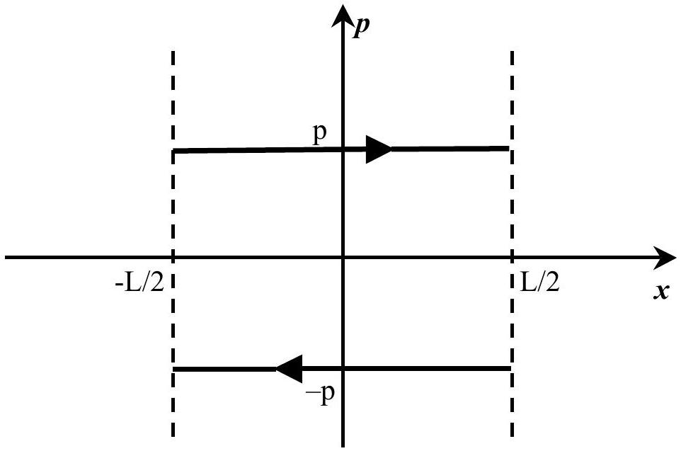
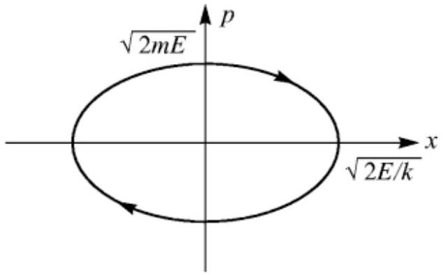
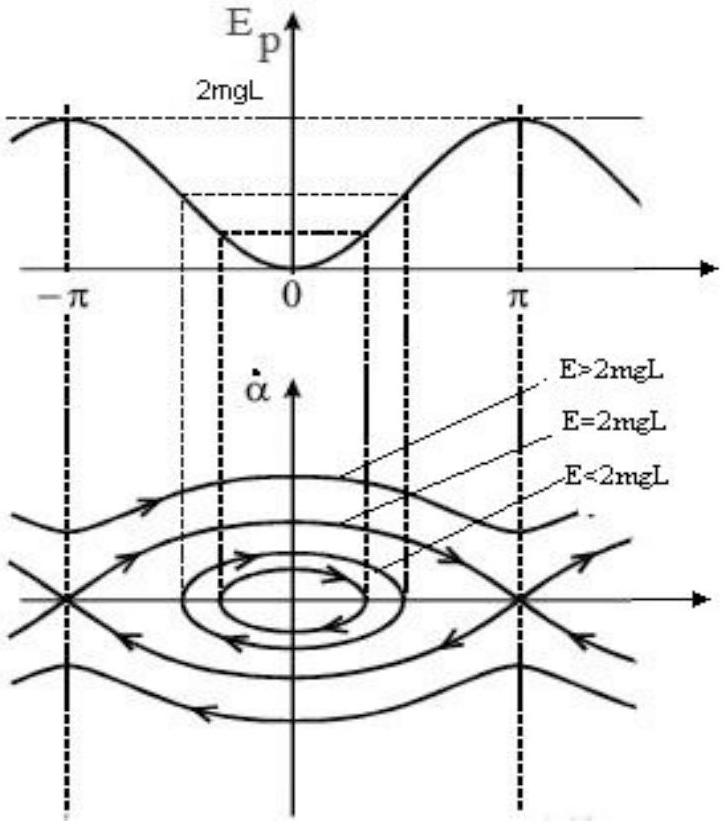
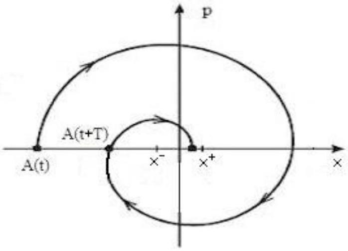
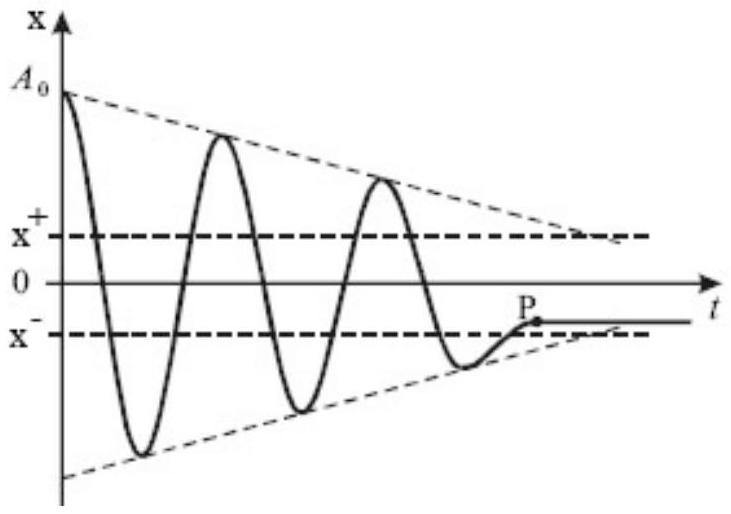

## Theoretical Question 2

## Solution

## A. Phase portraits (3.0)

A1. [0.5 p] Let Ox axis be pointed perpendicular to the walls. Since the material point is free and collisions are absolutely elastic then the magnitude of momentum is conserved, while its direction is changed to opposite at the collisions. Hence, the phase trajectory is of the following form (Fig. 1):

Fig. 1.

The motion with positive values of the momentum is directed along increasing values of the coordinate. Thus, the phase trajectory is directed clockwise, as indicated in Fig. 1.

A2. [1.0 p]
a) [0.5 p] For the harmonic oscillator, let us denote the coordinate by x , the momentum by p , and the total energy by E . The energy conservation law is

$$
\frac { p ^ { 2 } } { 2 m } + \frac { k x ^ { 2 } } { 2 } = E
$$

This expression determines the equation of phase trajectory, for a given E. Dividing both sides of the equation by E, we obtain

$$
\frac { p ^ { 2 } } { 2 m E } + \frac { x ^ { 2 } } { 2 E / k } = 1
$$

This is a canonical form of the equation of ellipse in (x, p). The centre of the ellipse is at $( 0,0 )$ and the semiaxes are $\sqrt { 2 E / k }$ and $\sqrt { 2 E m }$ respectively.

b) [0.5 p] The phase trajectory is of the following form (Fig. 2):

Fig. 2.

The motion with positive values of the momentum is directed along increasing values of the coordinate. Thus, the phase trajectory is directed clockwise, as indicated in Fig. 1.

A3. [1.5 p] Let us choose the potential energy level at the lowest point of the pendulum (equilibrium state). Taking into account for that linear velocity of the point is $v = L \dot { \alpha }$, we write down the total energy of the mathematical pendulum

$$
\frac { m L ^ { 2 } \dot { \alpha } ^ { 2 } } { 2 } + m g L ( 1 - \cos \alpha ) = E
$$

Analysis of this expression leads to the following:
at $E < 2 m g L$ the pendulum oscillates about the lower equilibrium position; if $E \ll m g L$ then the oscillations are harmonic;
at $E = 2 m g L$ the pendulum does not oscillate; the pendulum tends to the upper point of equilibrium.
at $E > 2 m g L$ the pendulum rotates about fixed point.
The phase trajectory is shown in Fig. 3.

Fig. 3. (0.5)

There are $K = 3$ qualitatively different types of the phase trajectories: oscillations, rotations, and the motion to the upper point of equilibrium (separatrisse) (1.0). (We do not take the equilibrium points as phase trajectories)

## B. The oscillator damped by sliding friction. (7.0)

B1. [1.0 p] For the sliding friction the magnitude of the friction force does not depend on the magnitude of velocity, but its direction is opposite to the velocity vector of the body. Therefore, the equations of motion should be written separately for the motion to the right and to the left from the "equilibrium" point (the spring is not stretched). Let us choose the $x$-axis along the direction of motion, and the origin of the coordinate system at the equilibrium point without the friction force. We obtain the equations of motion as follows:

$$
\begin{array} { l l }
\ddot { x } + \omega _ { 0 } ^ { 2 } x = - \frac { F _ { f r } } { m } , & \dot { x } > 0  \tag{1}\\
\ddot { x } + \omega _ { 0 } ^ { 2 } x = \frac { F _ { f r } } { m } , & \dot { x } < 0
\end{array}
$$

Here, $F _ { f r } = \mu m g$ is the friction force, $\omega _ { 0 } { } ^ { 2 } = k / m$ is the frequency of oscillations of the pendulum without the friction.

B2. [2.0 p] Introducing the variables $x _ { 1 } = x + F _ { f r } / m \omega _ { 0 } ^ { 2 }$ and $x _ { 2 } = x - F _ { f r } / m \omega _ { 0 } ^ { 2 }$ we can write down the equations of motion in the same form for both the cases,

$$
\ddot { x } _ { 1,2 } + \omega _ { 0 } ^ { 2 } x _ { 1,2 } = 0 ( 0.5 )
$$

which coincides with the equation of motion of harmonic oscillator without the friction. The action of the friction force is reduced to a drift of the equilibrium points: for $\dot { x } > 0$, it becomes $x _ { - } = - F _ { f r } / m \omega _ { 0 } ^ { 2 } , x _ { 1 } = 0$ and for $\dot { x } < 0$ it becomes $x _ { + } = F _ { f r } / m \omega _ { 0 } ^ { 2 } , x _ { 2 } = 0 ( 0.5 )$.
Thus, due to the section A 2 above the phase trajectory is a combination of parts of ellipses with centers at the point $x _ { - }$for an upper half-plane $\mathrm { p } > 0$, and at the point $\mathrm { x } _ { + }$ for a lower half-plane $\mathrm { p } < 0$. As the result of a continuity of motion these parts of ellipses should comprise a continuous curve by meeting each other at $\mathrm { p } = 0$. Thus, the phase trajectory is (Fig. 4) (2.5)

Fig. 4. (1.0)

B3. [1.0 p] According to the phase trajectory combination, the body not necessarily stops at the point $x = 0$. It will stop when it falls into the range from $\mathrm { x } _ { - }$to $\mathrm { x } _ { + }$. (0.5) This region is called stagnation region. The width of this region is

$$
\begin{equation*}
x _ { + } - x _ { - } = \frac { 2 F _ { f r } } { m \omega _ { 0 } ^ { 2 } } \tag{0.5}
\end{equation*}
$$

B4. [1.5 p] From the definition of equilibrium points and the obtained form of phase trajectory it is easy to find the decrease of amplitude during one period:

$$
\begin{equation*}
\Delta A = A ( t ) - A ( t + T ) = 2 \left( x _ { + } - x _ { - } \right) = \frac { 4 F _ { f r } } { m \omega _ { 0 } ^ { 2 } } \tag{0.5}
\end{equation*}
$$

This can be rewritten as

$$
\begin{equation*}
A ( t ) - A ( t + T ) = \frac { 4 F _ { f r } } { 2 \pi m \omega _ { 0 } } T \tag{0.5}
\end{equation*}
$$

One can see that, unlike the case of viscous friction, the amplitude decreases in accord to a linear law, $A = A _ { 0 } - p t _ { n }$, where $p = 2 F _ { f r } / \pi m \omega _ { 0 }$ (0.5).

B5. [1.5 p] The total number of oscillations depends on the initial amplitude $\mathrm { A } _ { 0 }$, and it can be found as

$$
N = \frac { A _ { 0 } } { 2 \left( x _ { + } - x _ { - } \right) } ( 0.5 )
$$

As the result of the above conclusions the plot of $x ( t )$ is of the following form (Fig. 5)

Fig. 5.

The frequency is equal to the frequency of free oscillator, $\omega _ { 0 } { } ^ { 2 } = k / m$. The time between two successive maximal deviations is $\mathrm { T } = 2 \pi / \omega _ { 0 } ( 0.5 )$
The oscillations do not stop until the amplitude is more than half-width of the stagnation region $x _ { + } - x _ { - }$. In real situations, the body stops in random positions within the stagnation region. In Fig. 5 the point P denotes the point where the body stops.

Marking scheme of Theoretical Question 2
| A. Phase portraits (3.0) |  |  |
| :--- | :--- | :--- |
| A1 [0.5] | The draw of phase trajectory with the arrows indicating the direction of motion. | 0.5 Points |
| A2 [1.0] | a) $\frac { p ^ { 2 } } { 2 m E } + \frac { x ^ { 2 } } { 2 E / k } = 1$ with semiaxes $\sqrt { 2 E / k }$ and $\sqrt { 2 E m }$ | 0.5 Points |
|  | b) The draw of the ellipse with the arrows indicating the direction of motion. | 0.5 Points |
| A3 [1.5] | $K = 3$   Discussion of three cases: $E < 2 m g L , E = 2 m g L$ and $E > 2 m g L$. | 1.0 Point |
|  | Phase portrait with the arrows indicating the direction of motion. | 0.5 Points |
| B. The oscillator damped by sliding friction (7.0) |  |  |
| B1 [1.0] | $\ddot { x } + \omega _ { 0 } { } ^ { 2 } x = - \frac { F _ { f r } } { m } , \quad \dot { x } > 0$   $\ddot { x } + \omega _ { 0 } { } ^ { 2 } x = \frac { F _ { f r } } { m } , \quad \dot { x } < 0$ | 1.0 Point |
| B2 [2.0] | $\ddot { x } _ { 1,2 } + \omega _ { 0 } { } ^ { 2 } x _ { 1,2 } = 0$ | 0.5 Points |
|  | Equilibrium points   $x _ { - } = - F _ { f r } / m \omega _ { 0 } ^ { 2 } , x _ { 1 } = 0$, and $x _ { + } = F _ { f r } / m \omega _ { 0 } ^ { 2 } , x _ { 2 } = 0$ | 0.5 Points |
|  | Phase trajectory with equilibrium points and the arrows indicating the direction of motion | 1.0 Point |
| B3 [1.0] | Complete stop within ( $\mathrm { x } _ { - } , \mathrm { x } _ { + }$) | 0.5 Points |
|  | $x _ { + } - x _ { - } = \frac { 2 F _ { f r } } { m \omega _ { 0 } ^ { 2 } }$ | 0.5 Points |
| B4 [2.0] | $\Delta A = A ( t ) - A ( t + T ) = 2 \left( x _ { + } - x _ { - } \right) = \frac { 4 F _ { f r } } { m \omega _ { 0 } ^ { 2 } }$ | 0.5 Points |
|  | $A ( t ) - A ( t + T ) = \frac { 4 F _ { f r } } { 2 \pi m \omega _ { 0 } } T$ or analogous expression | 0.5 Points |
|  | $A ( t ) = A _ { 0 } - p t$, where $p = 2 F _ { f r } / \pi m \omega _ { 0 }$ | 0.5 Points |
|  | $t _ { n } - t _ { n - 1 }$ | 0.5 Points |
| B5 [1.0] | $N = \frac { A _ { 0 } } { 2 \left( x _ { + } - x _ { - } \right) }$ | 0.5 Points |
|  | The draw of $\mathrm { x } ( \mathrm { t } )$ with a linear decrease of amplitude and complete stop. | 0.5 Points |
