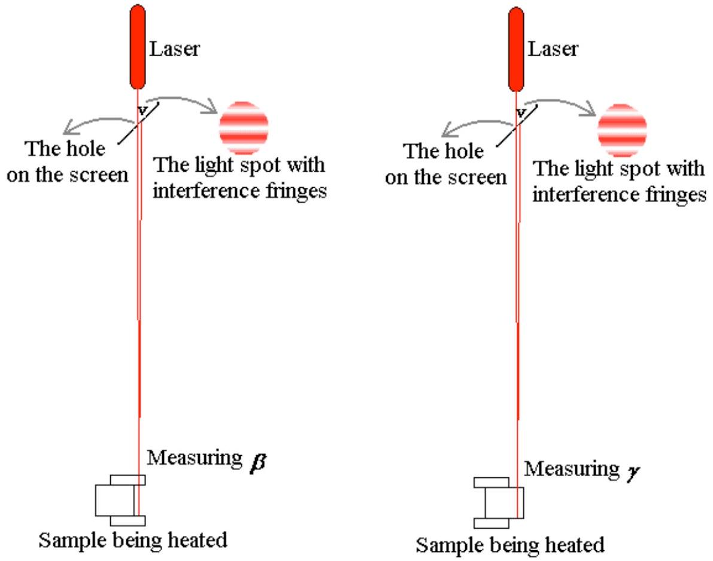
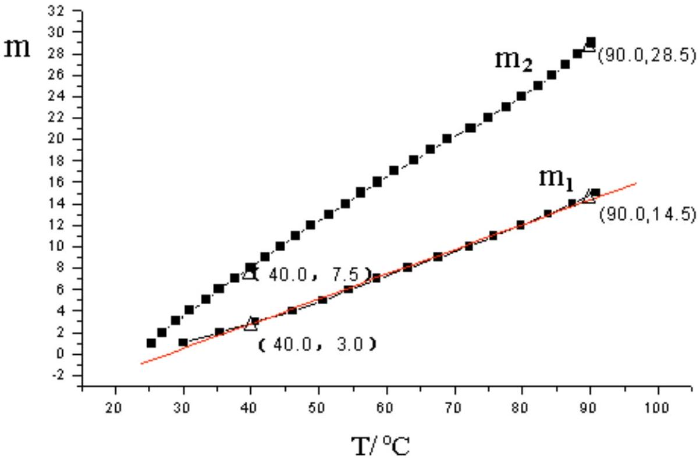

## Solution of Problem EX1

Using the interference method to measure the thermal expansion coefficient and temperature coefficient of refractive index of glass
1.Questions ( 2.4 point)
1.1 C (0.4 point)
1.2 a Fill in the blanks ( $\mathbf { 1 . 8 }$ point)

| Region | Number of reflected light spots observed | Must the profile of the reflected light spots be the same as that of the incident light? If "Yes", fill in "Y"; if "No", fill in "N" |  |  |  |  |
| :--- | :--- | :--- | :--- | :--- | :--- | :--- |
|  |  | 1st (if any) | 2nd (if any) | 3rd (if any) | 4th (if any) | ⋯ |
| $a$ | 1 | N |  |  |  |  |
| $b$ | 2 | Y | Y |  |  |  |
| $c$ | 3 | Y | N | Y |  |  |

Illustration:
Region a: Because the upper and lower surface of the glass cylinder A are approximately parallel to each other, when the laser beam arrives on the cylinder nearly perpendicular to the surface, the reflected light spots will overlap each other, causing interference fringes. Therefore the distribution of light intensity would be different from that of the incident light.

Region b: Because the refractive index of the glue is the same as that of the glass and its thickness is negligible, no light will be reflected from the interface between them. However the upper and lower surface of each glass plate are not parallel to each other, the upper surface of the upper plate will also be not parallel to the lower surface of the lower plate, therefore the two reflected beams from each of them will form two light spots and their distribution of the light intensity would surely be the same as that of the incident light.

Region c: Because the upper and lower surface of each glass plate are not parallel to each other, but the upper and lower surface of the glass cylinder are approximately parallel to each other, there must be a pair of reflected light spots from the two plates

overlap each other, causing interference fringes, while the light intensity distribution of the other two reflected light spots would be the same as that of the incident light.
1.2 b ( 0.2 point)
If you choose "No" (N), use one keyword to account for the reason: $\_\_\_\_$ interference.
2. Experiment: Measuring $\boldsymbol { \beta }$ and $\boldsymbol { \gamma }$ (7.6 points)
2.1 Design the Experiment, Draw the experimental ray diagrams and derive the formulae relevant to the measurement (3.2 points)

The experimental ray diagrams for measuring $\beta$ (left) and $\gamma$ (right) are shown in Fig. 1

Fig. 1

When the laser light is reflected from the $c$ region of the sample as shown in Fig. 1 (left), three reflected light spots can be observed on the screen, some interference fringes appear at spot $v$, which are caused by the interference between the two light rays reflected from the bottom surface of the upper glass plate and the top surface of the lower glass plate. The difference between the optical lengths of the two light rays is $2 L$. After the electric oven starts heating, assume that the temperature $T$ has increased by $\Delta T$, the length increment of the sample due to the thermal expansion of glass will be $\Delta L = L \beta \Delta T$, and the shift in the number of the

moving interference fringes is $m _ { 1 }$. Then, $2 \Delta L = m _ { 1 } \lambda$, where $\lambda$ stands for the wavelength of the laser light. Thus,

$$
\beta = \frac { m _ { 1 } \lambda } { 2 L \Delta T } .
$$

With the given $L$ and $\lambda$, from the graphic relation of $m _ { 1 }$ and $T$ we obtain the shift in the number of the moving fringes $m _ { 1 }$ over the temperature range from $40 ^ { \circ } \mathrm { C }$ to $90 ^ { \circ } \mathrm { C }$. Then, $\beta$ can be obtained.

When the laser light is reflected from the region $a$ as shown in Fig. 1 (right), the difference between the optical paths is $2 n L$. The variation of optical path difference caused by temperature increase $\Delta T$ is

$$
\Delta ( 2 n L ) = 2 \left( n \frac { \Delta L } { \Delta T } + L \frac { \Delta n } { \Delta T } \right) \Delta T = 2 L ( n \beta + \gamma ) \Delta T .
$$

Assume that at this time the shift in the number of the moving interference fringes is $m _ { 2 }$,

$$
2 L ( n \beta + \gamma ) \Delta T = m _ { 2 } \lambda ,
$$

i.e.,

$$
\gamma = \frac { m _ { 2 } \lambda } { 2 L \Delta T } - n \beta = \left( \frac { m _ { 2 } } { m _ { 1 } } - n \right) \times \beta .
$$

From the graphic relation of $m _ { 2 } \sim T$ we obtain the shift in the number of the moving interference fringes $m _ { 2 }$ over the temperature range from $40 ^ { \circ } \mathrm { C }$ to $90 ^ { \circ } \mathrm { C }$. Thus, $\gamma$ can be obtained.
2.2 (1) Data recorded during the measurement of the thermal expansion coefficient $\beta$
(0.8 points)

Measured Relation of $m _ { 1 }$ and $T$ :

| $m _ { 1 }$ (fringes) | 1 | 2 | 3 | 4 | 5 | 6 | 7 | 8 |
| :--- | :--- | :--- | :--- | :--- | :--- | :--- | :--- | :--- |
| $T \left( { } ^ { \circ } \mathrm { C } \right)$ | 30.0 | 35.4 | 40.6 | 46.1 | 50.6 | 54.4 | 58.6 | 63.1 |
| $m _ { 1 }$ (fringes) | 9 | 10 | 11 | 12 | 13 | 14 | 15 |  |
| $T \left( { } ^ { \circ } \mathrm { C } \right)$ | 67.6 | 72.2 | 75.8 | 79.8 | 83.8 | 87.4 | 90.9 |  |

2.2 (2) Data recorded during the measurement of the temperature coefficient of the refraction index $\gamma$ (0.8 points)

Measured relation of $m _ { 2 }$ and $T$ :
| $m _ { 2 }$ (fringes) | 1 | 2 | 3 | 4 | 5 | 6 | 7 | 8 | 9 | 10 |
| :--- | :--- | :--- | :--- | :--- | :--- | :--- | :--- | :--- | :--- | :--- |
| $T \left( { } ^ { \circ } \mathrm { C } \right)$ | 25.4 | 27.0 | 28.9 | 31.0 | 33.4 | 35.3 | 37.6 | 40.0 | 42.2 | 44.4 |
| $m _ { 2 }$ (fringes) | 11 | 12 | 13 | 14 | 15 | 16 | 17 | 18 | 19 | 20 |
| $T \left( { } ^ { \circ } \mathrm { C } \right)$ | 46.6 | 48.9 | 51.6 | 54.0 | 56.2 | 58.6 | 61.2 | 64.0 | 66.4 | 69.0 |
| $m _ { 2 }$ (fringes) | 21 | 22 | 23 | 24 | 25 | 26 | 27 | 28 | 29 | 30 |
| $T \left( { } ^ { \circ } \mathrm { C } \right)$ | 72.4 | 75.0 | 77.6 | 79.8 | 82.4 | 84.4 | 86.4 | 88.2 | 90.2 |  |

2.3 Get the thermal expansion coefficient $\beta$ and the temperature coefficient of refractive index $\gamma$ and estimate their uncertainties. (2.6 points)
(1) Draw the graphic relation of $m _ { 1 } \sim T$ and $m _ { 2 } \sim T$.

(2) Calculate $\beta$.

With the parameters: $L = 10.12 \pm 0.05 \mathrm {~mm} , \lambda = 632.8 \mathrm {~nm} , \Delta T = 50.0 ^ { \circ } \mathrm { C }$, and $m _ { 1 } = 11.5$ (over temperature from $40 ^ { \circ } \mathrm { C }$ to $90 ^ { \circ } \mathrm { C }$ ) obtained from Fig.4., we get

$$
\beta = \frac { m _ { 1 } \lambda } { 2 L \Delta T } = 7.19 \times 10 ^ { - 6 } { } ^ { \circ } \mathrm { C } ^ { - 1 } .
$$

(3) Estimate the uncertainty of $\beta$.
With $u ( L ) = 0.05 \mathrm {~mm} , u ( \Delta T ) = 0.2 ^ { \circ } \mathrm { C }$, and estimation of $u \left( m _ { 1 } \right) = 0.2$, we get
$$
\begin{aligned}
\left( \frac { u ( \beta ) } { \beta } \right) ^ { 2 } & = \left( \frac { u \left( m _ { 1 } \right) } { m _ { 1 } } \right) ^ { 2 } + \left( \frac { u ( L ) } { L } \right) ^ { 2 } + \left( \frac { u ( \Delta T ) } { \Delta T } \right) ^ { 2 } \\
& = \left( \frac { 0.2 } { 11.5 } \right) ^ { 2 } + \left( \frac { 0.05 } { 10.12 } \right) ^ { 2 } + \left( \frac { 0.2 } { 50 } \right) ^ { 2 } = 3.4 \times 10 ^ { - 4 }
\end{aligned}
$$
and $\quad u ( \beta ) = 0.13 \times 10 ^ { - 6 } { } ^ { \circ } \mathrm { C } ^ { - 1 }$.
(4) Calculate $\gamma$.
With $n = 1.515$ and $m _ { 1 } = 11.5$ it can be obtained from the graphic relation of $m _ { 2 } \sim T$ that $m _ { 2 } = 21.0$ over temperatures from $40 ^ { \circ } \mathrm { C }$ to $90 ^ { \circ } \mathrm { C }$. Therefore from the measured $\beta = ( 7.19 \pm 0.13 ) \times 10 ^ { - 6 } { } ^ { \circ } \mathrm { C } ^ { - 1 }$ and $\gamma = \left( \frac { m _ { 2 } } { m _ { 1 } } - n \right) \beta$ we obtain $\gamma = 2.24 \times 10 ^ { - 6 } { } ^ { \circ } \mathrm { C } ^ { - 1 }$,
(5) Estimate the uncertainty of $\gamma$
With obtained $u ( \beta ) = 0.13 \times 10 ^ { - 6 } { } ^ { \circ } \mathrm { C } ^ { - 1 }$ and estimation $u \left( m _ { 1 } \right) = u \left( m _ { 2 } \right) = 0.2$
$$
\begin{gathered}
\frac { u ( \gamma ) } { \gamma } = \sqrt { \left( \frac { u \left( m _ { 2 } \right) + n u \left( m _ { 1 } \right) } { m _ { 2 } - n m _ { 1 } } \right) ^ { 2 } + \left( \frac { u ( \beta ) } { \beta } \right) ^ { 2 } + \left( \frac { u \left( m _ { 1 } \right) } { m _ { 1 } } \right) ^ { 2 } } = 0.13 \\
u ( \gamma ) = 0.30 \times 10 ^ { - 6 } { } ^ { \circ } \mathrm { C } ^ { - 1 } .
\end{gathered}
$$

### 2.4 Experimental results (0.2 points)

The thermal expansion coefficient of the sample glass material is

$$
\beta = ( 7.19 \pm 0.13 ) \times 10 ^ { - 6 } { } ^ { \circ } \mathrm { C } ^ { - 1 } .
$$

The temperature coefficient of the refractive index of the sample glass material is

$$
\gamma = ( 2.24 \pm 0.30 ) \times 10 ^ { - 6 } { } ^ { \circ } \mathrm { C } ^ { - 1 }
$$
