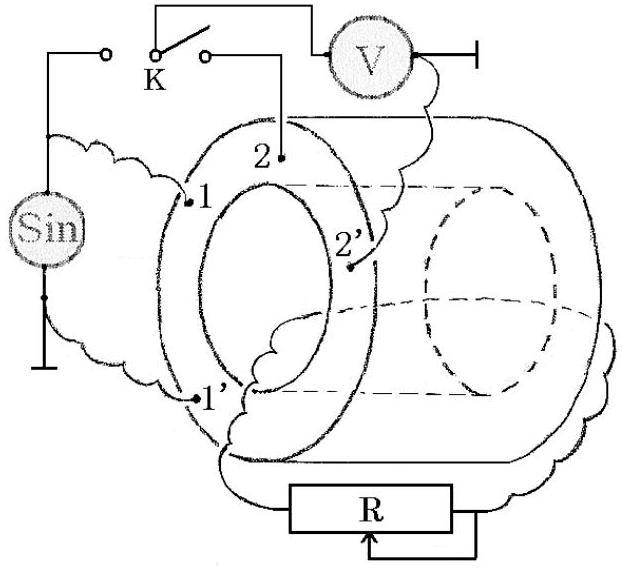
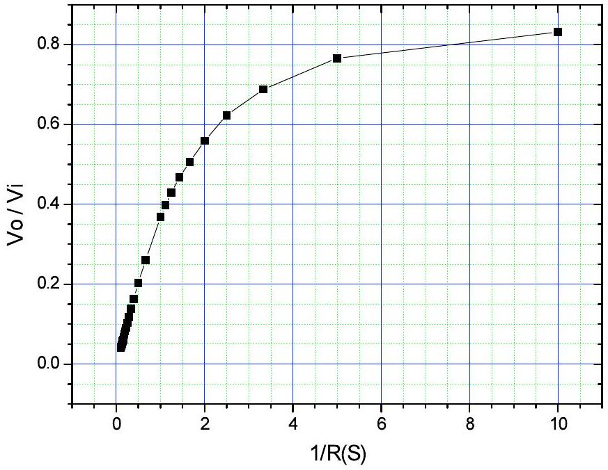
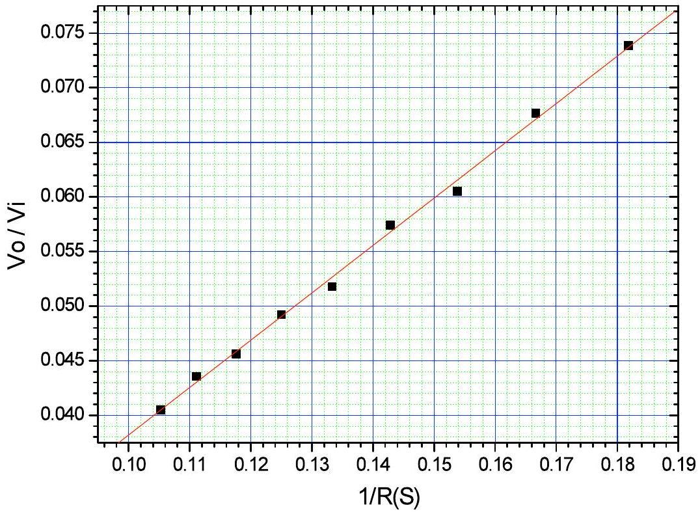

## Solution of EX2

## Measurement of liquid electric conductivity

1. Graph the experimental circuit diagram for scaling the sensor of liquid conductivity and the connection of the circuit.

2. Measure $\frac { V _ { o } } { V _ { i } }$ for different standard resistors. Record the data in the Table designed by yourself.

| $V _ { i } ( \mathrm {~V} )$ | $V _ { 0 } ( \mathrm {~V} )$ | $R ( \Omega )$ | $V _ { 0 } / V _ { i }$ | 1 / $R$ (S) |
| :--- | :--- | :--- | :--- | :--- |
| 1.95 | 1.621 | 0.1 | 0.831 | 10.000 |
| 1.95 | 1.494 | 0.2 | 0.766 | 5.000 |
| 1.95 | 1.342 | 0.3 | 0.688 | 3.333 |
| 1.95 | 1.216 | 0.4 | 0.624 | 2.500 |
| 1.95 | 1.091 | 0.5 | 0.559 | 2.000 |
| 1.95 | 0.987 | 0.6 | 0.506 | 1.667 |
| 1.95 | 0.912 | 0.7 | 0.468 | 1.429 |
| 1.95 | 0.837 | 0.8 | 0.429 | 1.250 |
| 1.95 | 0.775 | 0.9 | 0.397 | 1.111 |
| 1.95 | 0.718 | 1.0 | 0.368 | 1.000 |
| 1.95 | 0.508 | 1.5 | 0.260 | 0.667 |
| 1.95 | 0.396 | 2.0 | 0.203 | 0.500 |
| 1.95 | 0.318 | 2.5 | 0.163 | 0.400 |
| 1.95 | 0.270 | 3.0 | 0.138 | 0.333 |
| 1.95 | 0.230 | 3.5 | 0.118 | 0.286 |
| 1.95 | 0.201 | 4.0 | 0.103 | 0.250 |
| 1.95 | 0.177 | 4.5 | 0.091 | 0.222 |

| 1.95 | 0.160 | 5.0 | 0.082 | 0.200 |
| :--- | :--- | :--- | :--- | :--- |
| 1.95 | 0.144 | 5.5 | 0.074 | 0.182 |
| 1.95 | 0.132 | 6.0 | 0.068 | 0.167 |
| 1.95 | 0.118 | 6.5 | 0.061 | 0.154 |
| 1.95 | 0.112 | 7.0 | 0.057 | 0.143 |
| 1.95 | 0.101 | 7.5 | 0.052 | 0.133 |
| 1.95 | 0.096 | 8.0 | 0.049 | 0.125 |
| 1.95 | 0.089 | 8.5 | 0.046 | 0.118 |
| 1.95 | 0.085 | 9.0 | 0.044 | 0.111 |
| 1.95 | 0.079 | 9.5 | 0.041 | 0.105 |

3-1. Take the ratio of ( $\frac { V _ { o } } { V _ { i } }$ ) as ordinate; take the reciprocal of the resistance $R$ of the standard resistor , $( 1 / R )$, as abscissa. Graph the curve of $\left( \frac { V _ { o } } { V _ { i } } \right)$ versus $1 / R$.

3-2 Graph the linear region of the curve of $\left( \frac { V _ { o } } { V _ { i } } \right)$ versus $\frac { 1 } { R }$ and use the graphic method to get the slope $B$ of the straight line and its relative uncertainty.

$$
B = 0.434 \Omega , u ( B ) = 0.009 \Omega , u ( B ) / B = 0.21 , ( u ( B ) / B ) ^ { 2 } = 0.00044
$$

Remark: $u ( B )$ may be calculated by using several methods. As long as it is calculated, the resulting values closing to the correct value are recognized to be correct.

4. With the give length $L = ( 30.500 \pm 0.025 ) \mathrm { mm }$ and diameter of the liquid cylinder $d = ( 13.900 \pm 0.025 ) \mathrm { mm }$, calculate $K$ and its relative uncertainty.
$$
\begin{gathered}
K = \frac { 1 } { B } \frac { L } { S } = \frac { 4 \times 30.50 } { 0.434 \times 13.90 ^ { 2 } \times 3.142 } = 0.463 ( \mathrm {~S} / \mathrm { mm } ) \\
\left( \frac { u ( K ) } { K } \right) ^ { 2 } = \left( \frac { u ( B ) } { B } \right) ^ { 2 } + \left( \frac { u ( L ) } { L } \right) ^ { 2 } + \left( 2 \times \frac { u ( d ) } { d } \right) ^ { 2 } = \\
= 0.00044 + 0.000001 + 0.0013 = 0.0017
\end{gathered}
$$
    5. Measure the conductivity of the liquid in the container and write the result. With the given experimental apparatus measure the conductivity of the liquid, the formulae for calculating the liquid conductivity and its relative uncertainty are:
$$
\sigma = \left( \frac { 1 } { B } \frac { L } { S } \right) V o / V i = K \times A = 0.463 \times A ( \mathrm {~S} / \mathrm { mm } ) \quad A = \frac { V _ { o } } { V _ { i } }
$$

$$
\left( \frac { u ( \sigma ) } { \sigma } \right) ^ { 2 } = \left( \frac { u ( K ) } { K } \right) ^ { 2 } + \left( \frac { u ( A ) } { A } \right) ^ { 2 }
$$

Repeat the measurement of $\frac { V _ { o } } { V _ { i } }$ for six times. The resulting data suggested are listed in the Table below:

| $V _ { i } ( \mathrm {~V} )$ | $V _ { 0 } ( \mathrm {~V} )$ | $V _ { \mathrm { o } } / V _ { \mathrm { i } }$ |
| :--- | :--- | :--- |
| 1. 95 | 0. 037 | 0. 0190 |
| 1. 95 | 0. 037 | 0. 0190 |
| 1. 95 | 0. 037 | 0. 0190 |
| 1. 95 | 0. 037 | 0. 0190 |
| 1. 95 | 0. 038 | 0. 0195 |
| 1. 95 | 0. 038 | 0. 0195 |
| $A = V o / V i = 0.01917$ |  |  |
|  |  |  |
| $) ^ { 2 } = 0.000258 , \quad \frac { u ( A ) } { A } = 0.013 , \quad \left( \frac { u ( A ) } { A } \right) ^ { 2 } = 0.00017 ,$ |  |  |

Therefore the measured conductivity of the liquid is:

$$
0.00888 \pm 0.00039 ( \mathrm {~S} / \mathrm { mm } ) \text { or } 0.0089 \pm 0.0004 ( \mathrm {~S} / \mathrm { mm } ) \text { 。 }
$$

Remark: The above experimental data are obtained with a homogeneous solution after stirring, and the solute is salt (NaCl, 100mL), while the solvent is water (700mL,10.1°C).
