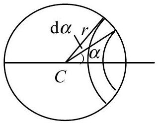
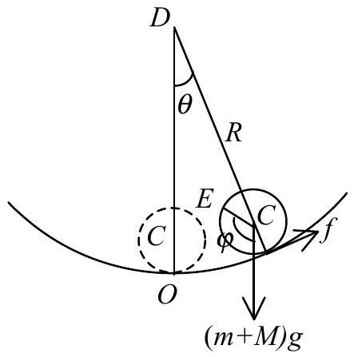

## Solution of the theoretical problem 1

## Back-and-Forth Rolling of a Liquid-Filled Sphere

1. (1) Let $I _ { 1 }$ and $I _ { 2 }$ denote the rotational inertia of the spherical shell and $\mathbf { W }$ in solid state respectively, while $I$ be the sum of $I _ { 1 }$ and $I _ { 2 }$. The surface mass density of the spherical shell is $\sigma = \frac { m } { 4 \pi r ^ { 2 } }$. Cut a narrow zone from the spherical shell perpendicular to its diameter, which spans a small angle $\mathrm { d } \alpha$ with respect to the center of the sphere $C$, while the spherical zone makes an angle $\alpha$ with the diameter of the spherical shell, which is called $C$ axes hereafter, as shown in Fig. 1. The rotational inertia of the narrow zone about the $C$ axis is $2 \pi r \sin \alpha ( r \mathrm {~d} \alpha ) \sigma ( r \sin \alpha ) ^ { 2 }$, therefore integral over the whole spherical shell gives

$$
\begin{equation*}
I _ { 1 } = \int _ { 0 } ^ { \pi } 2 \pi r \sin \alpha ( r \mathrm {~d} \alpha ) \sigma ( r \sin \alpha ) ^ { 2 } = \frac { 2 } { 3 } m r ^ { 2 } . \tag{1A.1}
\end{equation*}
$$

Figure 1

The volume density of $\mathbf { W }$ is $\rho = \frac { M } { 4 \pi r ^ { 3 } / 3 }$. By using above result for the spherical zone it can be seen that the rotational inertia of the solid $\mathbf { W }$ about the $C$ axis is

$$
\begin{equation*}
I _ { 2 } = \int _ { 0 } ^ { r } \frac { 2 } { 3 } r ^ { \prime 2 } \cdot \rho \cdot 4 \pi r ^ { \prime 2 } \mathrm {~d} r ^ { \prime } = \frac { 2 } { 5 } M r ^ { 2 } \tag{1A.2}
\end{equation*}
$$

Then,

$$
\begin{equation*}
I = I _ { 1 } + I _ { 2 } = \frac { 2 } { 3 } m r ^ { 2 } + \frac { 2 } { 5 } M r ^ { 2 } . \tag{1A.3}
\end{equation*}
$$

(2) According to the Newton's second law we can derive the translational motion equation of the center of mass for the sphere along the tangent of the bowl,

$$
\begin{equation*}
( m + M ) ( R - r ) \ddot { \theta } = - ( m + M ) g \theta + f , \tag{1A.4}
\end{equation*}
$$

Figure 2

where $\theta ( \theta \ll 1 )$ denotes the angular position of the center of mass of the sphere as shown in Fig.2, and $f$ is the frictional force acting on the sphere by the inside wall of the bowl. From the rotational dynamics, we have,

$$
\begin{equation*}
f r = - \ddot { \phi } = - \left( \frac { 2 } { 3 } m ^ { 2 } \stackrel { 2 } { r } + \frac { 2 } { 5 } M ^ { 2 } \right) \ddot { \varphi } , \tag{1A.5}
\end{equation*}
$$

where $\varphi$ is the angular position of the reference radius $C E$ with respect to the starting position. Assumed constraint of pure rolling on the motion of the sphere reads,

$$
\begin{equation*}
( R - r ) \ddot { \theta } = r \ddot { \varphi } , \tag{1A.6}
\end{equation*}
$$

Equations (1A.4)-(1A.6) lead to

$$
\left( \frac { 5 } { 3 } m + \frac { 7 } { 5 } M \right) ( R - r ) \ddot { \theta } = - ( m + M ) g \theta .
$$

This is a motion equation of the type of simple harmonic oscillator. Therefore, we obtain the angular frequency and period of the sphere rolling right and left:

$$
\begin{align*}
& \omega _ { 1 } = \sqrt { \frac { m + M } { 5 m / 3 + 7 M / 5 } \frac { g } { R - r } } ,  \tag{1A.7}\\
& T _ { 1 } = 2 \pi \sqrt { \frac { R - r } { g } } \sqrt { \frac { 5 m / 3 + 7 M / 5 } { m + M } } . \tag{1A.8}
\end{align*}
$$

2. This case can be treated similarly, except taking that the ideal liquid does not rotate into consideration. Therefore Eqs. (1A.4) and (1A.6) are still applicable, while Eq. (1A.5) needs to be modified as

$$
\begin{equation*}
f r = - \nmid \ddot { \varphi } = - \frac { 2 } { 3 } m ^ { 2 } \ddot { \varphi } . \tag{1A.9}
\end{equation*}
$$

Equations (1A.4), (1A.6), and (1A.9) result in

$$
( 5 m / 3 + M ) ( R - r ) \ddot { \theta } = - ( m + M ) g \theta .
$$

Then, the angular frequency and period of the sphere rolling back-and-forth are obtained respectively.

$$
\begin{align*}
& \omega _ { 2 } = \sqrt { \frac { m + M } { 5 m / 3 + M } } \sqrt { \frac { g } { R - r } } ,  \tag{1A.10}\\
& T _ { 2 } = 2 \pi \sqrt { \frac { R - r } { g } } \sqrt { \frac { 5 m / 3 + M } { m + M } } . \tag{1A.11}
\end{align*}
$$

3. The time taken by the sphere from position $A _ { 0 }$ to equilibrium position $O$ is $T _ { 2 } / 4$, $T _ { 1 } / 4$ from $O$ to $A _ { 0 } ^ { \prime }$, and $T _ { 2 } / 4$ from $A _ { 0 } ^ { \prime }$ to $O , T _ { 1 } / 4$ from $O$ to $A _ { 1 }$. Although the angular amplitude decreases step by step (see below) during the rolling process of the sphere right and left, the period keeps unchanged. This means

$$
\begin{equation*}
T _ { 3 } = \frac { 1 } { 2 } \left( T _ { 1 } + T _ { 2 } \right) = \pi \sqrt { \frac { R - r } { g } } \left( \sqrt { \frac { 5 m / 3 + 7 M / 5 } { m + M } } + \sqrt { \frac { 5 m / 3 + M } { m + M } } \right) . \tag{1A.12}
\end{equation*}
$$

Next, we calculate the change of the angular amplitude. When the sphere passes through the equilibrium position $O$ after it rolled down from the initial position $A _ { 0 }$, the velocity of its center is

$$
\begin{equation*}
v _ { C } = \omega _ { 2 } ( R - r ) \theta _ { 0 } = \sqrt { \frac { m + M } { 5 m / 3 + M } } \sqrt { g ( R - r ) } \theta _ { 0 } . \tag{1A.13}
\end{equation*}
$$

Now the angular velocity of the spherical shell rotating about the $C$ axis is

$$
\begin{equation*}
\Omega = \frac { v _ { C } } { r } = \frac { \theta _ { 0 } } { r } \sqrt { \frac { m + M } { 5 m / 3 + M } } \sqrt { g ( R - r ) } . \tag{1A.14}
\end{equation*}
$$

where $C$ axis is the axis of rotation through the center of the sphere and perpendicular to the paper plane of Fig.2. When $\mathbf { W }$ behaves as liquid (before it changes into solid state), the angular momentum of the sphere relative to point $O$ is

$$
\begin{equation*}
L = ( m + M ) v _ { C } r + I _ { 1 } \Omega . \tag{1A.15}
\end{equation*}
$$

When W changes suddenly into solid state, due to the fact that both gravitational and frictional force pass through point $O$, the angular momentum of the sphere relative to $O$ is conserved, we have

$$
\begin{equation*}
L = ( m + M ) v _ { C } r + I _ { 1 } \Omega = \left[ I + ( m + M ) r ^ { 2 } \right] \Omega ^ { \prime } . \tag{1A.16}
\end{equation*}
$$

where $\Omega$ and $\Omega ^ { \prime }$ represent the angular velocity of the sphere immediately before and after passing through point $O$. Therefore

$$
\begin{equation*}
\Omega ^ { \prime } = \frac { ( m + M ) v _ { C } r + I _ { 1 } \Omega } { I + ( m + M ) r ^ { 2 } } = \frac { v _ { C } } { r } \frac { 5 m / 3 + M } { 5 m / 3 + 7 M / 5 } , \tag{1A.17}
\end{equation*}
$$

while after passing through point $O$ the velocity of the center of the sphere becomes

$$
\begin{equation*}
v _ { C } ^ { \prime } = \Omega ^ { \prime } r = v _ { C } \frac { 5 m / 3 + M } { 5 m / 3 + 7 M / 5 } . \tag{1A.18}
\end{equation*}
$$

Once the sphere reaches the left highest position $A _ { 0 } ^ { \prime }$ corresponding to the left angular amplitude $\theta _ { 0 } ^ { \prime }$ we have

$$
v _ { C } { } ^ { \prime } = \omega _ { 1 } ( R - r ) \theta _ { 0 } { } ^ { \prime } .
$$

However,

$$
v _ { C } = \omega _ { 2 } ( R - r ) \theta _ { 0 } .
$$

From above two expressions we obtain

$$
\begin{equation*}
\theta _ { 0 } ^ { \prime } = \frac { v _ { c } ^ { \prime } \omega _ { 2 } } { v _ { C } \omega _ { 1 } } \theta _ { 0 } = \theta _ { 0 } \sqrt { \frac { 5 m / 3 + M } { 5 m / 3 + 7 M / 5 } } . \tag{1A.19}
\end{equation*}
$$

Similarly we can treat the process that the sphere rolls from position $A _ { 0 } ^ { \prime }$ back to $A _ { 1 }$, the second highest position on the right, corresponding to the second right angular amplitude $\theta _ { I }$, and obtain

$$
\frac { \theta _ { 1 } } { \theta _ { 0 } { } ^ { \prime } } = \frac { \theta _ { 0 } { } ^ { \prime } } { \theta _ { 0 } } .
$$

Then,

$$
\theta _ { 1 } = \frac { \theta _ { 0 } ^ { \prime 2 } } { \theta _ { 0 } } = \frac { 5 m / 3 + M } { 5 m / 3 + 7 M / 5 } \theta _ { 0 } .
$$

Following the similar procedure repeatedly we finally obtain:

$$
\begin{equation*}
\theta _ { n } = \left( \frac { 5 m / 3 + M } { 5 m / 3 + 7 M / 5 } \right) ^ { n } \theta _ { 0 } . \tag{1A.20}
\end{equation*}
$$
