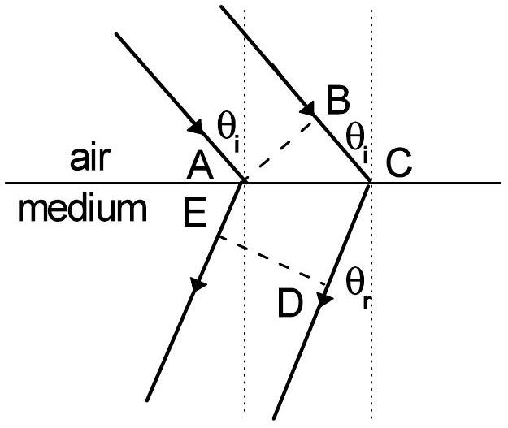
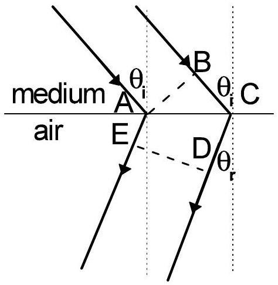
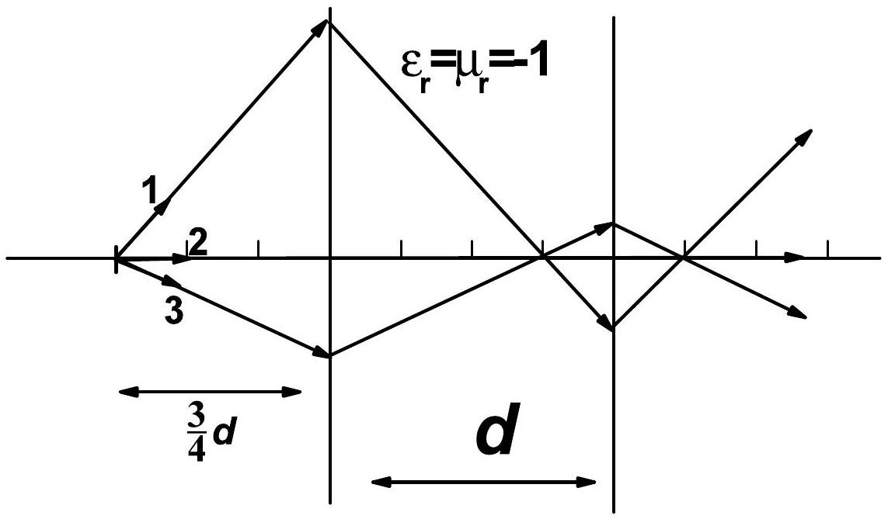
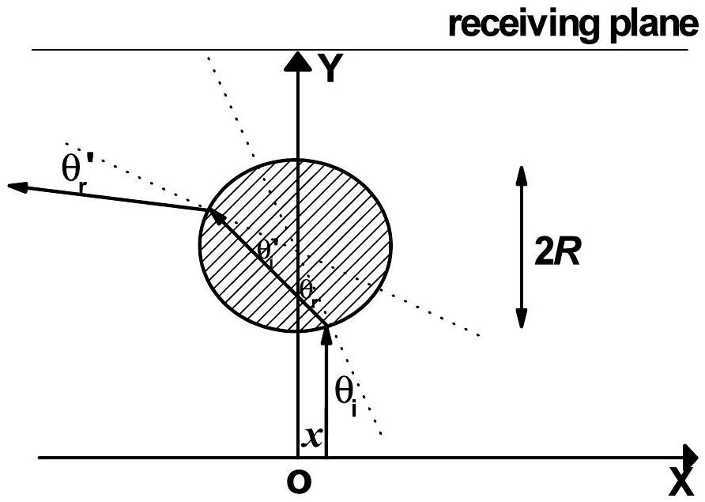

## Solution of theoretical problem 2

## 2A. Optical properties of an unusual material

1. (1)

Prove: Assume E-D shows one of the wavefronts of the refracted light. According to the Huygens' principle the phase accumulation from A to E should be equal to that from B via C to D:

$$
\begin{equation*}
\phi _ { A E } = \phi _ { B C } + \phi _ { C D } \tag{2A.1}
\end{equation*}
$$

With the Hints given these phase differences can be calculated respectively, then

$$
\begin{equation*}
- \sqrt { \varepsilon _ { r } \mu _ { r } } k d _ { A E } = k d _ { B C } - \sqrt { \varepsilon _ { r } \mu _ { r } } k d _ { C D } \tag{2A..2}
\end{equation*}
$$

Simplification of (2A.2) gives

$$
\begin{equation*}
- \sqrt { \varepsilon _ { r } \mu _ { r } } \left( d _ { A E } - d _ { C D } \right) = d _ { B C } \tag{2A.3}
\end{equation*}
$$

Because $d _ { B C } > 0$ and $\sqrt { \varepsilon _ { r } \mu _ { r } } > 0$, we obtain

$$
\begin{equation*}
d _ { A E } < d _ { C D } \tag{2A.4}
\end{equation*}
$$

Therefore the schematic ray diagram of the refracted light shown in above figure is reasonable.

(2) From the above figure, the refraction angle $\theta _ { r }$ and incidence angle $\theta _ { i }$ satisfy
$$
\begin{equation*}
d _ { B C } = d _ { A C } \sin \theta _ { i } , \quad d _ { C D } - d _ { A E } = d _ { A C } \sin \theta _ { r } \tag{2A.5}
\end{equation*}
$$
respectively. Substitution of (2A.5) into (2A.3) results in:
$$
\begin{equation*}
\sqrt { \varepsilon _ { r } \mu _ { r } } \sin \theta _ { r } = \sin \theta _ { i } \tag{2A.6}
\end{equation*}
$$

(3) 

Prove: Assume E-D shows one of the wavefronts of refracted light.
According to the Huygens' principle the phase accumulation from A to E should be equal to that from B via C to D:

$$
\begin{equation*}
\phi _ { A E } = \phi _ { B C } + \phi _ { C D } \tag{2A.7}
\end{equation*}
$$

With the Hints given these phase differences can be calculated respectively, then

$$
\begin{equation*}
k d _ { A E } = - \sqrt { \varepsilon _ { r } \mu _ { r } } k d _ { B C } + k d _ { C D } \tag{2A.8}
\end{equation*}
$$

Simplification of (2A.8) gives

$$
\begin{equation*}
d _ { A E } - d _ { C D } = - \sqrt { \varepsilon _ { r } \mu _ { r } } d _ { B C } \tag{2A.9}
\end{equation*}
$$

Because $d _ { B C } > 0$ and $\sqrt { \varepsilon _ { r } \mu _ { r } } > 0$, we obtain

$$
\begin{equation*}
d _ { A E } < d _ { C D } \tag{2A.10}
\end{equation*}
$$

Therefore the schematic ray diagram of the refracted light shown in the above figure is reasonable.

(4) From the above figure, the refraction angle $\theta _ { r }$ and incidence angle $\theta _ { i }$ satisfy
$$
\begin{equation*}
d _ { B C } = d _ { A C } \sin \theta _ { i } , \quad d _ { C D } - d _ { A E } = d _ { A C } \sin \theta _ { r } \tag{2A.11}
\end{equation*}
$$
respectively. Substitution of (2A.11) into (2A.9) results in :
$$
\begin{equation*}
\sin \theta _ { r } = \sqrt { \varepsilon _ { r } \mu _ { r } } \sin \theta _ { i } \tag{2A.12}
\end{equation*}
$$
2. The ray diagram is shown below.

Illustration:
The light is negatively refracted at both interfaces, and the refraction angle equals to incidence angle. Meanwhile according to the Hints provided there is no reflected light from each interface. Therefore within the medium light rays converge strictly at a point symmetric to the source about the left side of the medium, and on the other side

of the medium the rays converge strictly at a point which is symmetric to the image of the source within the medium about the right side of the medium.

3. The phase difference between the two waves transmitting through the right side of the medium in succession is

$$
\begin{equation*}
\Delta \phi = 2 k ( d - 0.4 d ) - 2 \cdot 0.5 k \cdot 0.4 d + 2 \pi \tag{2A.13}
\end{equation*}
$$

On the right side of above equation the first term shows the phase difference of the light wave accumulated during its propagation in air, the second term shows the phase difference of the light wave accumulated during its propagation in the unusual medium, while the third term accounts for the phase difference of the light wave accumulated due to the two reflections in succession from the interface between air and the medium. Taking $k = \frac { 2 \pi } { \lambda }$, (2A.13) changes into

$$
\begin{equation*}
\Delta \phi = 0.8 \frac { 2 \pi } { \lambda } d + 2 \pi \tag{2A.14}
\end{equation*}
$$

Resonant condition means

$$
\begin{equation*}
0.8 \frac { 2 \pi } { \lambda } d + 2 \pi = m \cdot 2 \pi \tag{2A.15}
\end{equation*}
$$

Thus

$$
\begin{equation*}
\lambda = \frac { 0.8 d } { m - 1 } , \quad m = 2,3,4 , \ldots \tag{2A.16}
\end{equation*}
$$

4. 
From the given conditions the ray diagram can be accordingly constructed. Above figure shows schematically the ray diagram for $x > 0$. Because for the unusual medium $\varepsilon _ { r } = \mu _ { r } = - 1$, from the solution of the first question we have $\theta _ { i } = \theta _ { r } = \theta _ { i } { } ^ { \prime } = \theta _ { r } { } ^ { \prime }$.Therefore the direction of the final out-going light deviates from that of the incident light by $4 \theta _ { i }$. Because the direction of the incident light is given in the y direction, only if the condition
$$
\begin{equation*}
\pi / 2 \leq 4 \theta _ { i } \leq 3 \pi / 2 \quad \Rightarrow \quad \pi / 8 \leq \theta _ { i } \leq 3 \pi / 8 \tag{2A.17}
\end{equation*}
$$
is satisfied the light signal can not reach the receiving plane. Notice
$$
\begin{equation*}
\sin \theta _ { i } = x / R , \tag{2A.18}
\end{equation*}
$$
and the similarity of the monotonicity of $\sin \theta$ to that of $\theta$ in the range of $[ 0 , \pi / 2 ]$, we find that (2A. 17) goes to
$$
\begin{equation*}
\sin ( \pi / 8 ) \leq \frac { x } { R } \leq \sin ( 3 \pi / 8 ) \tag{2A.19}
\end{equation*}
$$
Further taking the symmetry about the y axis into consideration we obtain that if the following condition
$$
\begin{equation*}
R \sin ( \pi / 8 ) \leq | x | \leq R \sin ( 3 \pi / 8 ) \tag{2A.20}
\end{equation*}
$$
is satisfied, the light emitted from a light source located on the x axis can not reach the receiving plane.

## 2B. Dielectric spheres inside an external electric field

1. (1) Adopting the polar coordinates, the z component of the electric field produced by a dipole located at the origin with its axis parallel to the z axis is:
$$
\begin{equation*}
E _ { z } ( \theta , \phi ) = - \frac { p } { 4 \pi \varepsilon _ { 0 } } \frac { 1 - 3 \cos ^ { 2 } \theta } { r ^ { 3 } } \tag{2B.1}
\end{equation*}
$$
where $r$ is the length of the relative position vector of the two dipoles. In the external electric field $\boldsymbol { E }$, the energy of a dipole with its axis parallel to the z axis is:
$$
U = - \vec { p } \cdot \vec { E } = - p E _ { z }
$$
Therefore we obtain that the interaction energy between two contacting small dielectric spheres is
$$
\begin{equation*}
U _ { 12 } = \frac { p ^ { 2 } } { 4 \pi \varepsilon _ { 0 } } \frac { 1 - 3 \cos ^ { 2 } \theta } { ( 2 a ) ^ { 3 } } \tag{2B.2}
\end{equation*}
$$
    (2) Based on Eq. (2B.2) for the configuration (a) we obtain:
$$
\begin{equation*}
U _ { a } = \frac { 1 } { 4 \pi \varepsilon _ { 0 } } \frac { 1 - 3 } { ( 2 a ) ^ { 3 } } p ^ { 2 } = - \frac { 1 } { 4 \pi \varepsilon _ { 0 } } \frac { p ^ { 2 } } { 4 a ^ { 3 } } \tag{2B.3}
\end{equation*}
$$
For configuration (b)
$$
\begin{equation*}
U _ { b } = \frac { 1 } { 4 \pi \varepsilon _ { 0 } } \frac { 1 - 0 } { ( 2 a ) ^ { 3 } } p ^ { 2 } = \frac { 1 } { 4 \pi \varepsilon _ { 0 } } \frac { p ^ { 2 } } { 8 a ^ { 3 } } \tag{1B.4}
\end{equation*}
$$
For configuration (c),
$$
\begin{equation*}
U _ { c } = \frac { 1 } { 4 \pi \varepsilon _ { 0 } } \frac { 1 - 3 \cos ^ { 2 } \pi / 4 } { ( 2 a ) ^ { 3 } } p ^ { 2 } = - \frac { 1 } { 4 \pi \varepsilon _ { 0 } } \frac { p ^ { 2 } } { 16 a ^ { 3 } } \tag{1B.5}
\end{equation*}
$$
    (3) Comparison between (2B.3), (2B.4) and (2B.5) shows that configuration (a) has the lowest energy, corresponding to the ground state of the system.
2. With the similar approach to question 1 the interaction energies for the three different configurations can also be calculated.
For configuration (d),
$$
\begin{equation*}
U _ { d } = \frac { 1 } { 4 \pi \varepsilon _ { 0 } } \left( - \frac { p ^ { 2 } } { 4 a ^ { 3 } } + 2 \times \frac { p ^ { 2 } } { 32 a ^ { 3 } } \right) = - \frac { 1 } { 4 \pi \varepsilon _ { 0 } } \frac { 3 p ^ { 2 } } { 16 a ^ { 3 } } \tag{2B.6}
\end{equation*}
$$
For configuration (e),
$$
\begin{equation*}
U _ { e } = \frac { 1 } { 4 \pi \varepsilon _ { 0 } } \left( - \frac { p ^ { 2 } } { 4 a ^ { 3 } } \times 2 - \frac { p ^ { 2 } } { 32 a ^ { 3 } } \right) = - \frac { 1 } { 4 \pi \varepsilon _ { 0 } } \frac { 17 p ^ { 2 } } { 32 a ^ { 3 } } \tag{2B.7}
\end{equation*}
$$

For configuration (f),

$$
\begin{equation*}
U _ { f } = \frac { 1 } { 4 \pi \varepsilon _ { 0 } } \left( \frac { p ^ { 2 } } { 8 a ^ { 3 } } \times 2 + \frac { p ^ { 2 } } { 64 a ^ { 3 } } \right) = \frac { 1 } { 4 \pi \varepsilon _ { 0 } } \frac { 17 p ^ { 2 } } { 64 a ^ { 3 } } \tag{2B.8}
\end{equation*}
$$

Comparison shows that configuration (e) of the lowest energy is most stable, while configuration (f) of the highest energy is most unstable.
