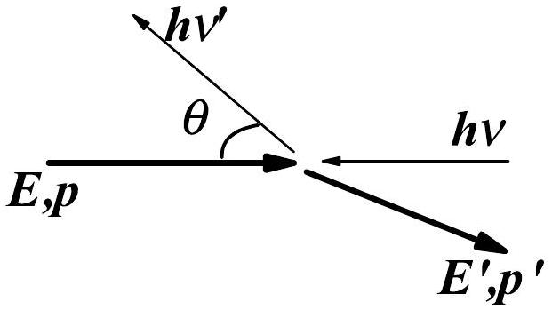
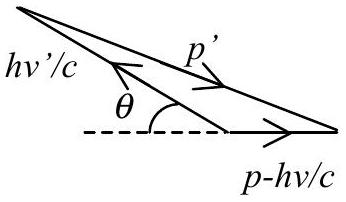
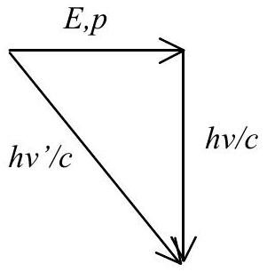
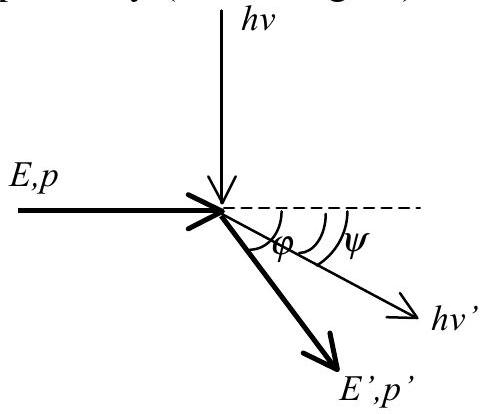

## Solution of the theoretical problem 3

## 3A. Average specific heat of each free electron at constant volume

(1). Each free electron has 3 degrees of freedom. According to the equipartition of energy theorem, at temperature $T$ its average energy $\bar { E }$ equals to $\frac { 3 } { 2 } k _ { B } T$, therefore the average specific heat $c _ { v }$ equals to

$$
c _ { V } = \frac { \mathrm { d } \bar { E } } { \mathrm {~d} T } = \frac { 3 } { 2 } k _ { B }
$$

(2). Let $U$ be the total energy of the electron gas, then

$$
U = \int _ { 0 } ^ { S } E f ( E ) \mathrm { d } S
$$

where $S$ is the total number of the electronic states, $E$ the electron energy.
Substitution of (1) for $\mathrm { d } S$ in the above expression gives

$$
U = C V \int _ { 0 } ^ { \infty } E ^ { 3 / 2 } f ( E ) d E = C V I
$$

where $I$ represents the integral

$$
I = \int _ { 0 } ^ { \infty } E ^ { 3 / 2 } f ( E ) d E
$$

Usually at room temperature $k _ { B } T \ll E _ { F }$. Therefore, with the simplified $f ( E )$

$$
f ( E ) = \left\{ \begin{array} { c l }
1 & E < E _ { F } - k _ { B } T \\
- \frac { E - \left( E _ { F } + k _ { B } T \right) } { 2 k _ { B } T } & E _ { F } - k _ { B } T < E < E _ { F } + k _ { B } T \\
0 & E > E _ { F } + k _ { B } T
\end{array} \right.
$$

$I$ can be simplified as

$$
\begin{aligned}
& I = \frac { 2 } { 5 } E _ { F } ^ { 3 / 2 } \left( 1 - k _ { B } T / E _ { F } \right) ^ { 5 / 2 } + \frac { E _ { F } + k _ { B } T } { 5 k _ { B } T } E _ { F } ^ { 5 / 2 } \left[ \left( 1 + k _ { B } T / E _ { F } \right) ^ { 5 / 2 } - \left( 1 - k _ { B } T / E _ { F } \right) ^ { 5 / 2 } \right] \\
& - \frac { 1 } { 7 k _ { B } T } E _ { F } ^ { 7 / 2 } \left[ \left( 1 + k _ { B } T / E _ { F } \right) ^ { 7 / 2 } - \left( 1 - k _ { B } T / E _ { F } \right) ^ { 7 / 2 } \right] \\
& \approx E _ { f } ^ { 5 / 2 } \left[ \frac { 2 } { 5 } + \frac { 3 } { 4 } \left( k _ { B } T / E _ { F } \right) ^ { 2 } \right]
\end{aligned}
$$

Therefore

$$
U = C V E _ { F } ^ { 5 / 2 } \left[ \frac { 2 } { 5 } + \frac { 3 } { 4 } \left( k _ { B } T / E _ { F } \right) ^ { 2 } \right]
$$

However the total electron number

$$
\begin{aligned}
& N = C V \int _ { 0 } ^ { E _ { F } ^ { 0 } } E ^ { 1 / 2 } \mathrm {~d} E = \frac { 2 } { 3 } C V E _ { F } ^ { 03 / 2 } \\
& C V = \frac { 3 } { 2 } N \left( E _ { F } ^ { 0 } \right) ^ { - 3 / 2 }
\end{aligned}
$$

where $E _ { F } ^ { 0 }$ is the Fermi level at 0K, leading to

$$
U = \frac { 3 } { 2 } N \left( E _ { F } ^ { 0 } \right) ^ { - 3 / 2 } E _ { F } ^ { 5 / 2 } \left[ \frac { 2 } { 5 } + \frac { 3 } { 4 } \left( k _ { B } T / E _ { F } \right) ^ { 2 } \right]
$$

Taking $E _ { F } \approx E _ { F } ^ { 0 }$, and $U = N \bar { E }$,

$$
\begin{aligned}
& \bar { E } \approx \frac { 3 } { 2 } E _ { F } \left[ \frac { 2 } { 5 } + \frac { 3 } { 4 } \left( k _ { B } T / E _ { F } \right) ^ { 2 } \right] \\
& c _ { v } = \frac { \partial \bar { E } } { \partial T } = \frac { 9 } { 4 } k _ { B } \frac { k _ { B } T } { E _ { F } } \ll \frac { 3 } { 2 } k _ { B }
\end{aligned}
$$

(3). Because at room temperature $k _ { B } T = 0.026 \mathrm { eV }$ while Fermi level of metals at room temperature is generally of several eVs, it can be seen from the above expression that according to the quantum theory the calculated average specific heat of each free electron at constant volume is two orders of magnitude lower than that of the classical theory. The reason is that with the temperature increase the energy of those electrons whose energy is far below Fermi level (several times of $k _ { B } T$ less than $E _ { F }$ ) does not change obviously, only those minor electrons of energy near $E _ { F }$ contribute to the specific heat, resulting in a much less value of the average specific heat.

## Solution of the theoretical problem 3

## 3B. The Inverse Compton Scattering

1. Let $p$ and $E$ denote the momentum and energy of the incident electron, $p ^ { \prime }$ and $E ^ { \prime }$ the momentum and energy of the scattered electron, and $h v$ and $h v ^ { \prime }$ the energies of the incident and scattered photon respectively. For this scattering process (see Fig. 1) energy conservation reads

$$
\begin{equation*}
h v + E = h v ^ { \prime } + E ^ { \prime } \tag{1B.1}
\end{equation*}
$$

while the momentum conservation can be shown as (see Fig.2)

$$
\left( p ^ { \prime } c \right) ^ { 2 } = \left( h v ^ { \prime } \right) ^ { 2 } + ( p c - w ) ^ { 2 } + 2 w ^ { \prime } ( p c - w ) \cos \theta
$$

Equations (1B.1) and (1B.2), combined with the energy-momentum relations

Figure 1

Figure 2

$$
\begin{equation*}
E ^ { 2 } = ( p c ) ^ { 2 } + E _ { 0 } ^ { 2 } \tag{1B.3}
\end{equation*}
$$

and

$$
\begin{equation*}
E ^ { \prime 2 } = \left( p ^ { \prime } c \right) ^ { 2 } + E _ { 0 } ^ { 2 } \tag{1B.4}
\end{equation*}
$$

lead to

$$
\begin{equation*}
h v ^ { \prime } = \frac { E + p c } { E + h v + ( p c - h v ) \cos \theta } h v = \frac { E + \sqrt { E ^ { 2 } - E _ { 0 } ^ { 2 } } } { E + h v + \left( \sqrt { E ^ { 2 } - E _ { 0 } ^ { 2 } } - h v \right) \cos \theta } h v . \tag{1B.5}
\end{equation*}
$$

We have assumed that the kinetic energy of the incident electron is higher than its static energy, and the energy of the incident photon $h v$ is less than $E _ { 0 }$, so that $\sqrt { E ^ { 2 } - E _ { 0 } ^ { 2 } } > h \nu$. Therefore from Eq. (1B.5), it can be easily seen that $\theta = \pi$ results in the maximum of $h v ^ { \prime }$, and the maximum $h v ^ { \prime }$ is

$$
\begin{equation*}
\left( h v ^ { \prime } \right) _ { \max } = \frac { E + \sqrt { E ^ { 2 } - E _ { 0 } ^ { 2 } } } { E + 2 h v - \sqrt { E ^ { 2 } - E _ { 0 } ^ { 2 } } } h v . \tag{1B.6}
\end{equation*}
$$

2. Substitution of $E = \gamma E _ { 0 }$ into Eq. (1B.6) yields

$$
\begin{equation*}
\left( h v ^ { \prime } \right) _ { \max } = \frac { \gamma E _ { 0 } + \sqrt { \gamma ^ { 2 } - 1 } E _ { 0 } } { \gamma E _ { 0 } - \sqrt { \gamma ^ { 2 } - 1 } E _ { 0 } + 2 h v } h v = \frac { \gamma + \sqrt { \gamma ^ { 2 } - 1 } } { \gamma - \sqrt { \gamma ^ { 2 } - 1 } + 2 h v / E _ { 0 } } h v . \tag{1B.7}
\end{equation*}
$$

Due to $\gamma \gg 1 , \sqrt { \gamma ^ { 2 } - 1 } \approx \gamma \left( 1 - \frac { 1 } { 2 \gamma ^ { 2 } } \right) = \gamma - \frac { 1 } { 2 \gamma }$, and $h \nu / E _ { 0 } \ll 1 / \gamma$, then we have

$$
\begin{equation*}
\left( h v ^ { \prime } \right) _ { \max } \approx \frac { \gamma + \gamma - 1 / 2 \gamma } { \gamma - \gamma + 1 / 2 \gamma + 2 h v / E _ { 0 } } h v \approx 4 \gamma ^ { 2 } h v . \tag{1B.8}
\end{equation*}
$$

In the case of $\gamma = 200$ and the wavelength of the incident photon $\lambda = 500 \mathrm {~nm}$

$$
\begin{aligned}
& h v = \frac { h c } { \lambda } = \frac { 1.24 \times 10 ^ { 3 } } { 500 } = 2.48 \mathrm { eV } , \\
& \frac { h v } { E _ { 0 } } = \frac { 2.48 } { 0.511 \times 10 ^ { 6 } } = 4.85 \times 10 ^ { - 6 } \ll \frac { 1 } { \gamma } = \frac { 1 } { 200 } = 5.0 \times 10 ^ { - 3 } ,
\end{aligned}
$$

satisfying expression (1B.8). Therefore the maximum energy of the scattered photon $\left( h v ^ { \prime } \right) _ { \text {max } } \approx 4 \times 200 ^ { 2 } h v = 1.6 \times 10 ^ { 5 } \times 2.48 = 3.97 \times 10 ^ { 5 } \mathrm { eV } \approx 4.0 \times 10 ^ { 5 } \mathrm { eV } = 0.40 \mathrm { MeV }$
corresponding to a wavelength $\lambda ^ { \prime } = \frac { h c } { h v ^ { \prime } } = \frac { 1.24 \times 10 ^ { 3 } } { 4.0 \times 10 ^ { 5 } } = 3.1 \times 10 ^ { - 3 } \mathrm {~nm}$.
3. (1) It is obvious that if the incident electron gives its total kinetic energy to the photon, the photon gains the maximum energy from the incident electron through the scattering process, namely the electron should become at rest after the collision. In this case, we have (see Fig. 3)

$$
\stackrel { E , p } { \longrightarrow } \underset { \substack { \circ \longrightarrow \\ E _ { 0 } \longrightarrow h v ^ { \prime } } } { \longleftrightarrow }
$$

$p - h v / c = h v ^ { \prime } / c \quad$ (Conservation of momentum)
or

$$
\begin{equation*}
p c - h = h ^ { \prime } \tag{1B.10}
\end{equation*}
$$

Figure 3
Subtracting (1B.10) from (1B.9) leads to the energy of the incident photon

$$
\begin{equation*}
h v = \frac { 1 } { 2 } \left( E _ { 0 } - E + p c \right) = \frac { 1 } { 2 } \left( E _ { 0 } - E + \sqrt { E ^ { 2 } - E _ { 0 } ^ { 2 } } \right) . \tag{1B.11}
\end{equation*}
$$

In above equation the energy- momentum relation

$$
\begin{equation*}
( p c ) ^ { 2 } = E ^ { 2 } - E _ { 0 } ^ { 2 } \tag{1B.12}
\end{equation*}
$$

has been taken into account. Therefore from Eq. (1B.9) we obtain the energy of the scattered photon

$$
\begin{equation*}
h v ^ { \prime } = h v + E - E _ { 0 } = \frac { 1 } { 2 } \left( E - E _ { 0 } + \sqrt { E ^ { 2 } - E _ { 0 } ^ { 2 } } \right) . \tag{1B.13}
\end{equation*}
$$

(2) Similar to question 3. (1), now we have (see Fig. 4)

$$
\begin{equation*}
h v + E = h v ^ { \prime } + E _ { 0 } \quad \text { (Conservation of energy) } \tag{1B.9}
\end{equation*}
$$

Figure 4

$$
\begin{equation*}
p ^ { 2 } + ( h v / c ) ^ { 2 } = \left( h v ^ { \prime } / c \right) ^ { 2 } \quad ( \text { Conservation of momentum } ) \tag{1B.14}
\end{equation*}
$$

That is, $\quad ( p c ) ^ { 2 } + ( h ) ^ { 2 } = \left( h ^ { \prime } \right) ^ { 2 } \quad$.
Substitution of Eq. (1B.12) into Eq. (1B.14) yields

$$
E ^ { 2 } - E _ { 0 } ^ { 2 } + ( h v ) ^ { 2 } = \left( h v ^ { \prime } \right) ^ { 2 } .
$$

On the other hand, square of Eq. (1B.9) results in

$$
\left( h v ^ { \prime } \right) ^ { 2 } = E ^ { 2 } + E _ { 0 } ^ { 2 } + ( h v ) ^ { 2 } + 2 E h v - 2 E E _ { 0 } - 2 E _ { 0 } h v
$$

Combination of the above two equations leads to

$$
E ^ { 2 } + E _ { 0 } ^ { 2 } + ( h v ) ^ { 2 } + 2 E h v - 2 E E _ { 0 } - 2 E _ { 0 } h v = E ^ { 2 } - E _ { 0 } ^ { 2 } + ( h v ) ^ { 2 }
$$

That is,

$$
2 \left( E - E _ { 0 } \right) h v = 2 E _ { 0 } \left( E - E _ { 0 } \right)
$$

Then, we obtain the energy of the incident photon

$$
\begin{equation*}
h v = E _ { 0 } . \tag{1B.15}
\end{equation*}
$$

Substitution of (1B.15) into Eq. (1B.9) gives the energy of the scattered photon

$$
\begin{equation*}
h v ^ { \prime } = h v + E - E _ { 0 } = E \tag{1B.16}
\end{equation*}
$$

## Explanatory notes about the solution of Question 3:

Question 3. (1) can also be solved as follows. According to Eq. (1B.6), the maximum energy $\Delta$ that the photon of energy $h v$ gains from the electron is

$$
\Delta = h v _ { \max } ^ { \prime } - h v = 2 \frac { p c h v - h ^ { 2 } v ^ { 2 } } { E + 2 h v - p c } ,
$$

where $p c = \sqrt { E ^ { 2 } - E _ { 0 } ^ { 2 } }$. To obtain the maximum $\Delta$, we use the extreme condition

$$
\frac { d ( \Delta / 2 ) } { d ( h v ) } = \frac { ( p c - 2 h v ) ( E + 2 h v - p c ) - 2 \left( p c h v - h ^ { 2 } v ^ { 2 } \right) } { ( E + 2 h v - p c ) ^ { 2 } } = 0 .
$$

Let the numerator equal to zero, a quadratic equation results:

$$
2 ( h v ) ^ { 2 } + 2 ( E - p c ) h v - \left( E p c - p ^ { 2 } c ^ { 2 } \right) = 0 .
$$

Its two roots can be shown as

$$
h v = \frac { 1 } { 2 } \left[ ( E - p c ) \pm \sqrt { E ^ { 2 } - p ^ { 2 } c ^ { 2 } } \right] = \frac { 1 } { 2 } \left( - E + p c \pm E _ { 0 } \right) .
$$

Since the negative sign leads to a meaningless negative $h v$, we have

$$
h v = \frac { 1 } { 2 } \left( \sqrt { E ^ { 2 } - E _ { 0 } ^ { 2 } } - E + E _ { 0 } \right) .
$$

where $p c = \sqrt { E ^ { 2 } - E _ { 0 } ^ { 2 } }$ has been taken into account. This result is just the same as Eq. (1B.11). The expression for $h v ^ { \prime }$ is then the same as Eq. (1B.13).

## Question 3. (2) can also be solved as follows

For the sake of simplification, it is assumed that the scattered photon and electron move in the same plane which the incident photon and electron moved in. Meanwhile the angles which the directions of the scattered photon and electron make with the direction of the incident electron are denoted by $\psi$ and $\varphi$ respectively (see the figure). Then, we have

$$
\begin{align*}
& E + h v = E ^ { \prime } + h v ^ { \prime } , \quad ( \text { Conservation of energy } )  \tag{1B.1'}\\
p = & \frac { h v ^ { \prime } } { c } \cos \psi + p ^ { \prime } \cos \varphi ,
\end{align*}
$$

or

$p c - h v ^ { \prime } \cos \psi = p ^ { \prime } c \cos \varphi , \quad ($ Conservation of horizontal momentum $)$
and $\frac { h v } { c } = \frac { h v ^ { \prime } } { c } \sin \psi + p ^ { \prime } \sin \varphi$,
or

$$
\begin{equation*}
h v - h v ^ { \prime } \sin \psi = p ^ { \prime } c \sin \varphi . \quad \text { (Conservation of vertical momentum) } \tag{1B.3'}
\end{equation*}
$$

(1B.2') ${ } ^ { 2 } + \left( \text { 1B.3' } ^ { 2 } \right) ^ { 2 }$ leads to

$$
\begin{equation*}
p ^ { \prime 2 } c ^ { 2 } = p ^ { 2 } c ^ { 2 } + \left( h v ^ { \prime } \right) ^ { 2 } \cos ^ { 2 } \psi - 2 p c h v ^ { \prime } \cos \psi + ( h v ) ^ { 2 } + \left( h v ^ { \prime } \right) ^ { 2 } \sin ^ { 2 } \psi - 2 h v h v ^ { \prime } \sin \psi \tag{1B.4'}
\end{equation*}
$$

Square of Eq.(1B.1') results in

$$
E ^ { \prime 2 } = E ^ { 2 } + ( h v ) ^ { 2 } + \left( h v ^ { \prime } \right) ^ { 2 } + 2 E h v - 2 E h v ^ { \prime } - 2 h v h v ^ { \prime } .
$$

Substitution of the energy-momentum relation $E ^ { \prime 2 } = E _ { 0 } ^ { 2 } + p ^ { \prime 2 } c ^ { 2 } , E ^ { 2 } = E _ { 0 } ^ { 2 } + p ^ { 2 } c ^ { 2 }$ into the above equation of energy conservation leads to

$$
\begin{equation*}
p ^ { \prime 2 } c ^ { 2 } = p ^ { 2 } c ^ { 2 } + ( h v ) ^ { 2 } + \left( h v ^ { \prime } \right) ^ { 2 } + 2 E h v - 2 E h v ^ { \prime } - 2 h v h v ^ { \prime } \tag{1B.5'}
\end{equation*}
$$

Comparison between Eq. (1B.4') and Eq. (1B.5') yields the energy of the scattered photon

$$
\begin{equation*}
h v ^ { \prime } = \frac { E h v } { E + h v - ( p c \cos \psi + h v \sin \psi ) } . \tag{1B.6'}
\end{equation*}
$$

From (1B.6') it can be seen that if $\psi = \cos ^ { - 1 } \frac { p c } { \sqrt { p ^ { 2 } c ^ { 2 } + h ^ { 2 } v ^ { 2 } } }$, the energy of the scattered photon reaches the maximum,

$$
\begin{equation*}
h v _ { \max } ^ { \prime } = \frac { E h v } { E + h v - \sqrt { p ^ { 2 } c ^ { 2 } + h ^ { 2 } v ^ { 2 } } } . \tag{1B.7'}
\end{equation*}
$$

The energy that the photon gets from the electron is

$$
\begin{equation*}
\Delta = h v _ { \max } ^ { \prime } - h v = \frac { \sqrt { p ^ { 2 } c ^ { 2 } + h ^ { 2 } v ^ { 2 } } h v - ( h v ) ^ { 2 } } { E + h v - \sqrt { p ^ { 2 } c ^ { 2 } + h ^ { 2 } v ^ { 2 } } } . \tag{1B.8'}
\end{equation*}
$$

The extreme condition for $\Delta$ is

$$
\begin{equation*}
\frac { d \Delta } { d ( h v ) } = \frac { A } { ( E + h v - a ) ^ { 2 } } = 0 , \tag{1B.9'}
\end{equation*}
$$

where $\sqrt { p ^ { 2 } c ^ { 2 } + h ^ { 2 } v ^ { 2 } } = a$
and $A = \left( a + \frac { ( h v ) ^ { 2 } } { a } - 2 h v \right) ( E + h v - a ) - \left( h v a - h ^ { 2 } v ^ { 2 } \right) \left( 1 - \frac { h v } { a } \right)$.
$A = 0$ results in

$$
\begin{aligned}
& E a + h v a - p ^ { 2 } c ^ { 2 } - ( h v ) ^ { 2 } + \frac { E ( h v ) ^ { 2 } } { a } + \frac { ( h v ) ^ { 3 } } { a } - ( h v ) ^ { 2 } - 2 h v E - 2 ( h v ) ^ { 2 } + 2 h v a \\
& = h v a - ( h v ) ^ { 2 } - ( h v ) ^ { 2 } + \frac { ( h v ) ^ { 3 } } { a }
\end{aligned}
$$

Simplifying this equation leads to

$$
E a - p ^ { 2 } c ^ { 2 } + \frac { E ( h v ) ^ { 2 } } { a } - 2 h v E - 2 ( h v ) ^ { 2 } + 2 h v a = 0
$$

i.e.,

$$
( E + 2 h v ) a + \frac { E ( h v ) ^ { 2 } } { a } = p ^ { 2 } c ^ { 2 } + 2 h v E + 2 ( h v ) ^ { 2 } .
$$

Squaring both of the two sides of this equation yields

$$
\begin{aligned}
& ( E + 2 h v ) ^ { 2 } a ^ { 2 } + \frac { E ^ { 2 } ( h v ) ^ { 4 } } { a ^ { 2 } } + 2 ( E + 2 h v ) E ( h v ) ^ { 2 } \\
& = ( p c ) ^ { 4 } + 4 ( h v ) ^ { 2 } E ^ { 2 } + 4 ( h v ) ^ { 4 } + 4 ( p c ) ^ { 2 } h v E + 4 ( p c ) ^ { 2 } ( h v ) ^ { 2 } + 8 ( h v ) ^ { 3 } E
\end{aligned}
$$

Substitution of $\sqrt { p ^ { 2 } c ^ { 2 } + h ^ { 2 } v ^ { 2 } } = a$ into the above equation and making some simplifications yield

$$
E ^ { 2 } p ^ { 2 } c ^ { 2 } + \frac { E ^ { 2 } ( h v ) ^ { 4 } } { p ^ { 2 } c ^ { 2 } + h ^ { 2 } v ^ { 2 } } = p ^ { 4 } c ^ { 4 } + h ^ { 2 } v ^ { 2 } E ^ { 2 } ,
$$

that is,

$$
E ^ { 2 } ( p c ) ^ { 4 } + E ^ { 2 } ( p c ) ^ { 2 } ( h v ) ^ { 2 } + E ^ { 2 } ( h v ) ^ { 4 } = ( p c ) ^ { 6 } + ( p c ) ^ { 4 } ( h v ) ^ { 2 } + E ^ { 2 } ( p c ) ^ { 2 } ( h v ) ^ { 2 } + ( h v ) ^ { 4 } E ^ { 2 } .
$$

After some simplifications we obtain

$$
( p c ) ^ { 4 } ( h v ) ^ { 2 } = ( p c ) ^ { 4 } \left( E ^ { 2 } - p ^ { 2 } c ^ { 2 } \right) = ( p c ) ^ { 4 } E _ { 0 } ^ { 2 } ,
$$

which yields

$$
\begin{equation*}
h v = E _ { 0 } . \tag{1B.10'}
\end{equation*}
$$

Substitution of (1B.10') into Eq. (1B.7') leads to

$$
\begin{equation*}
h v _ { \max } ^ { \prime } = \frac { E E _ { 0 } } { E + E _ { 0 } - E } = E . \tag{1B.11'}
\end{equation*}
$$

The results (1B.10') and (1B.11') are just the same as Eqs. (1B.15) and (1B.16) in the former solution.
